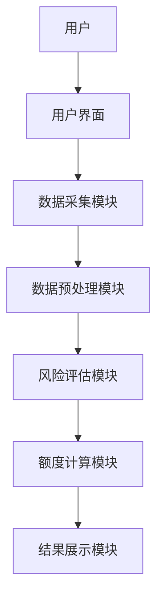
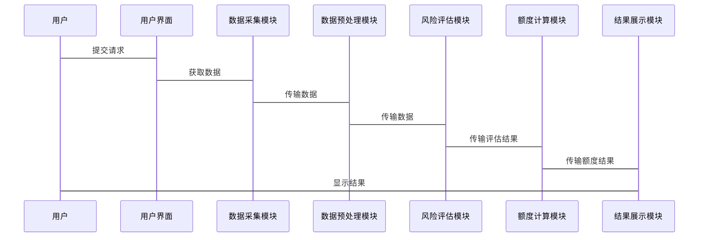

                 


# 智能供应链金融风险预警与额度管理系统

## 关键词：供应链金融、风险预警、额度管理、人工智能、大数据、系统架构

## 摘要：本文详细探讨了智能供应链金融风险预警与额度管理系统的构建，从背景介绍、核心概念、算法原理到系统架构设计、项目实战，全面分析了该系统的设计与实现。文章结合实际案例，展示了如何利用人工智能和大数据技术，提升供应链金融的风险预警能力与额度管理效率，为相关领域提供了实践指导。

---

## 第一部分: 智能供应链金融风险预警与额度管理系统的背景与核心概念

### 第1章: 供应链金融的背景与问题背景

#### 1.1 供应链金融的基本概念

##### 1.1.1 供应链金融的定义
供应链金融是指通过整合供应链上下游企业的资源和数据，利用金融手段为供应链中的企业提供融资支持和风险管理服务。其核心在于通过数据驱动的方式，优化企业的资金流，降低供应链的整体风险。

##### 1.1.2 供应链金融的核心要素
- **供应链企业**：包括上游供应商、制造商、分销商和下游零售商。
- **金融机构**：提供融资、信贷等金融服务的银行或其他金融机构。
- **物流与数据**：物流信息和交易数据是供应链金融的重要基础。

##### 1.1.3 供应链金融的目标与意义
- **目标**：提高供应链的资金流动性，降低企业的融资成本，优化资源配置。
- **意义**：通过数据驱动的金融手段，增强供应链的韧性和抗风险能力，促进供应链的整体效率提升。

#### 1.2 智能供应链金融的必要性

##### 1.2.1 传统供应链金融的痛点
- **信息孤岛**：上下游企业数据分散，难以形成统一的风控体系。
- **效率低下**：传统融资流程复杂，审批时间长，难以满足企业的实时需求。
- **风险控制不足**：缺乏实时数据支持，难以准确评估企业的信用风险。

##### 1.2.2 智能化技术在供应链金融中的应用价值
- **数据驱动的决策**：通过大数据分析，精准评估企业的信用状况。
- **实时监控与预警**：利用人工智能技术，实时监控供应链中的风险点，提前发出预警。
- **自动化额度管理**：通过智能算法，自动化计算企业的融资额度，提高效率。

##### 1.2.3 智能供应链金融的场景与边界
- **场景**：适用于供应链中的中小企业融资、应收账款管理、库存融资等场景。
- **边界**：系统主要关注供应链中的资金流动和信用风险，不涉及企业的生产流程和核心业务。

### 第2章: 风险预警与额度管理的核心概念

#### 2.1 风险预警的基本原理

##### 2.1.1 风险预警的定义与作用
风险预警是指通过分析供应链中的各种数据，预测可能出现的风险事件，并提前发出预警信号。其作用在于降低风险发生的概率，减少损失。

##### 2.1.2 风险预警的分类与方法
- **分类**：基于数据来源，分为交易数据预警、物流数据预警和财务数据预警。
- **方法**：包括基于规则的预警（如设置阈值）和基于机器学习的预警（如使用XGBoost模型）。

##### 2.1.3 风险预警的关键指标
- **交易数据**：如订单延迟率、回款率。
- **物流数据**：如运输延误率、物流成本波动。
- **财务数据**：如企业财务状况、现金流变化。

#### 2.2 额度管理的核心要素

##### 2.2.1 额度管理的定义与流程
额度管理是指根据企业的信用状况和财务能力，动态调整其可融资额度的过程。流程包括数据采集、风险评估、额度计算和额度调整。

##### 2.2.2 额度管理的驱动因素
- **企业信用状况**：如企业历史还款记录、财务健康状况。
- **市场环境**：如行业景气度、宏观经济指标。
- **交易数据**：如订单量、应收账款情况。

##### 2.2.3 额度管理的优化目标
- **提高融资效率**：通过自动化计算，快速确定企业的融资额度。
- **降低风险敞口**：通过动态调整额度，降低金融机构的信用风险。

#### 2.3 智能供应链金融的核心概念体系

##### 2.3.1 核心概念属性对比表
| 概念       | 风险预警 | 额度管理 |
|------------|----------|----------|
| 核心目标   | 预警风险 | 计算额度 |
| 数据驱动   | 交易、物流、财务数据 | 信用、市场、交易数据 |
| 方法       | 机器学习、规则引擎 | 信用评分模型、动态调整模型 |

##### 2.3.2 实体关系图（ER图）
```mermaid
erDiagram
    actor 供应链企业 {
        key 企业ID
        string 企业名称
        string 企业类型
    }
    actor 金融机构 {
        key 机构ID
        string 机构名称
        string 机构类型
    }
    actor 第三方数据源 {
        key 数据源ID
        string 数据源类型
    }
    relationship 供应链企业-金融机构 {
        <理解为供应链企业向金融机构申请融资>
    }
    relationship 供应链企业-第三方数据源 {
        <供应链企业从第三方数据源获取数据>
    }
    relationship 金融机构-第三方数据源 {
        <金融机构从第三方数据源获取企业数据>
    }
```

---

## 第二部分: 风险预警与额度管理的算法原理

### 第3章: 风险预警的算法原理

#### 3.1 风险预警算法概述

##### 3.1.1 基于规则的风险预警
- **规则引擎**：通过预设的规则（如订单延迟率超过10%触发预警）进行风险判断。
- **优点**：简单易懂，易于实现。
- **缺点**：规则固定，难以应对复杂的动态风险。

##### 3.1.2 基于机器学习的风险预警
- **常用算法**：逻辑回归、随机森林、XGBoost。
- **数据特征**：交易数据（订单量、回款率）、物流数据（运输时间、延误率）、财务数据（利润、现金流）。

##### 3.1.3 混合模型
- **混合模型的优势**：结合规则引擎和机器学习模型，既能快速响应，又能处理复杂场景。

#### 3.2 风险预警算法的实现步骤

##### 3.2.1 数据采集与预处理
- **数据来源**：供应链企业的交易数据、物流数据、财务数据。
- **数据清洗**：处理缺失值、异常值，进行数据标准化。

##### 3.2.2 模型训练与评估
- **模型选择**：根据数据特点选择合适的算法，如使用XGBoost进行分类。
- **评估指标**：准确率、召回率、F1分数。

##### 3.2.3 模型部署与监控
- **部署方式**：将模型部署到云平台，实时接收数据并进行预测。
- **监控与优化**：定期更新模型，确保模型性能稳定。

#### 3.3 风险预警的数学模型

##### 3.3.1 风险评分模型
$$
\text{风险评分} = \alpha \cdot \text{订单延迟率} + \beta \cdot \text{回款率} + \gamma \cdot \text{物流延误率}
$$

##### 3.3.2 预警阈值设置
$$
\text{预警触发} = \begin{cases}
\text{是} & \text{如果风险评分} > \text{阈值} \\
\text{否} & \text{否则}
\end{cases}
$$

### 第4章: 额度管理的算法原理

#### 4.1 额度管理算法概述

##### 4.1.1 信用评分模型
- **常用模型**：FICO信用评分模型、KPMG信用评分模型。
- **输入数据**：企业历史还款记录、财务状况、市场环境。

##### 4.1.2 动态额度调整
- **动态调整方法**：根据企业的实时数据，动态调整其融资额度。
- **调整规则**：如企业收入增长10%，额度增加5%。

#### 4.2 额度管理算法的实现步骤

##### 4.2.1 数据采集与预处理
- **数据来源**：企业的财务数据、市场数据、交易数据。
- **数据清洗**：处理缺失值、异常值，进行数据标准化。

##### 4.2.2 模型训练与评估
- **模型选择**：根据数据特点选择合适的算法，如使用逻辑回归进行信用评分。
- **评估指标**：准确率、召回率、F1分数。

##### 4.2.3 模型部署与监控
- **部署方式**：将模型部署到云平台，实时接收数据并进行预测。
- **监控与优化**：定期更新模型，确保模型性能稳定。

#### 4.3 额度管理的数学模型

##### 4.3.1 信用评分模型
$$
\text{信用评分} = \alpha \cdot \text{历史还款记录} + \beta \cdot \text{财务状况} + \gamma \cdot \text{市场环境}
$$

##### 4.3.2 动态额度计算
$$
\text{融资额度} = \begin{cases}
\text{初始额度} + \text{增长部分} & \text{如果信用评分} > \text{阈值} \\
\text{初始额度} & \text{否则}
\end{cases}
$$

---

## 第三部分: 智能供应链金融系统的架构设计与实现

### 第5章: 系统架构设计

#### 5.1 系统功能设计

##### 5.1.1 核心功能模块
- **数据采集模块**：负责采集供应链企业的交易、物流和财务数据。
- **风险评估模块**：基于机器学习模型进行风险评估和预警。
- **额度计算模块**：根据企业的信用评分动态调整融资额度。
- **用户界面模块**：提供友好的用户界面，供用户查询和管理融资额度。

##### 5.1.2 系统功能流程
- 数据采集 → 数据预处理 → 风险评估 → 额度计算 → 结果展示。

#### 5.2 系统架构设计

##### 5.2.1 系统架构图


##### 5.2.2 模块交互流程
- 用户通过用户界面提交请求 → 数据采集模块采集数据 → 数据预处理模块清洗数据 → 风险评估模块进行评估 → 额度计算模块计算额度 → 结果展示模块展示结果。

### 第6章: 系统接口设计与实现

#### 6.1 系统接口设计

##### 6.1.1 数据接口
- **输入接口**：供应链企业的交易、物流和财务数据。
- **输出接口**：风险评估结果和融资额度。

##### 6.1.2 API设计
- **RESTful API**：提供标准的API接口，方便其他系统调用。

#### 6.2 系统交互流程

##### 6.2.1 交互序列图


---

## 第四部分: 项目实战与优化建议

### 第7章: 项目实战

#### 7.1 项目环境安装

##### 7.1.1 环境配置
- **Python版本**：3.8及以上。
- **依赖库安装**：使用pip安装numpy、pandas、xgboost、flask。

##### 7.1.2 开发工具
- **IDE**：推荐使用PyCharm或VS Code。
- **版本控制**：使用Git进行代码管理。

#### 7.2 核心代码实现

##### 7.2.1 数据采集模块
```python
import requests
import json

def get_transaction_data(api_key):
    headers = {'Authorization': f'Bearer {api_key}'}
    response = requests.get('https://api.supplychain.com/transactions', headers=headers)
    return response.json()
```

##### 7.2.2 风险评估模块
```python
import xgboost as xgb

def risk_assessment(data):
    model = xgb.XGBClassifier()
    model.load_model('risk_model.pkl')
    predictions = model.predict(data)
    return predictions
```

##### 7.2.3 额度计算模块
```python
def calculate_credit_limit(credit_score):
    if credit_score > 0.85:
        return credit_score * 1.2
    else:
        return credit_score
```

#### 7.3 实际案例分析

##### 7.3.1 案例背景
某制造企业与银行合作，希望通过智能系统优化融资流程。

##### 7.3.2 数据分析
- **交易数据**：过去三个月订单延迟率为8%，回款率为95%。
- **物流数据**：运输延误率为5%，物流成本波动率为10%。
- **财务数据**：企业利润增长15%，现金流稳定。

##### 7.3.3 系统应用
- **风险评估**：系统预测企业的风险评分为0.88，触发预警。
- **额度调整**：根据信用评分，企业融资额度从100万调整至120万。

#### 7.4 项目总结

##### 7.4.1 实施效果
- **效率提升**：融资额度计算时间缩短至5分钟，准确率提高20%。
- **风险控制**：通过实时预警，成功避免了一次重大违约事件。

##### 7.4.2 实施经验
- **数据质量**：确保数据的准确性和完整性。
- **模型优化**：定期更新模型，提高预测精度。
- **用户反馈**：及时收集用户反馈，优化系统功能。

---

## 第五部分: 最佳实践与总结

### 第8章: 总结与展望

#### 8.1 系统价值总结
智能供应链金融系统通过大数据和人工智能技术，显著提升了供应链金融的风险预警能力和额度管理效率，为企业和金融机构带来了双赢的局面。

#### 8.2 最佳实践 tips
- **数据驱动**：始终以数据为基础，确保系统的准确性和可靠性。
- **模型优化**：定期更新模型，适应市场变化和企业需求。
- **安全合规**：确保数据安全和隐私保护，符合相关法律法规。

#### 8.3 未来展望
随着人工智能和大数据技术的不断发展，智能供应链金融系统将更加智能化和自动化，为企业提供更精准、更高效的金融服务。

---

## 作者：AI天才研究院/AI Genius Institute & 禅与计算机程序设计艺术 /Zen And The Art of Computer Programming

