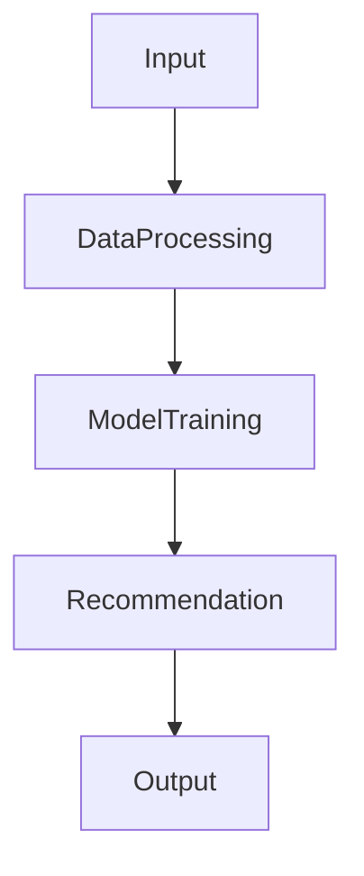
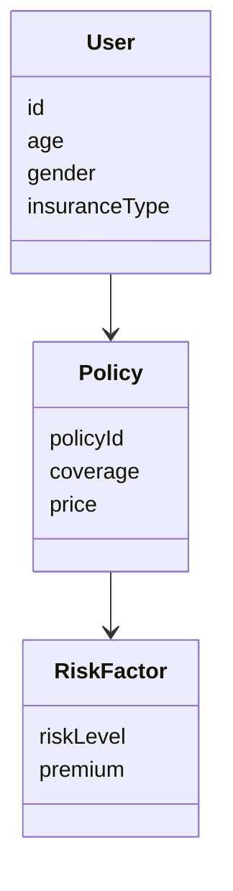
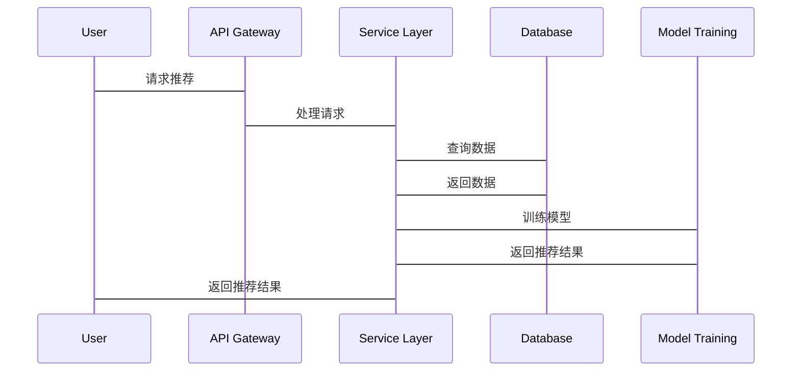

                 

<think>
好的，我现在需要根据用户的指示，逐步构建《智能保险产品个性化定价与推荐引擎》的技术博客文章。用户提供了详细的结构和要求，我需要按照这个结构来组织内容，确保每个部分都详细且符合要求。

首先，用户要求文章包括标题、关键词、摘要，然后是目录结构，每个章节都有三级标题，包含必要的图表和代码，并且使用Markdown格式。我需要先确定文章的标题、关键词和摘要部分，然后逐步展开每个章节的内容。

在开始写作之前，我会先分析每个章节的需求：

1. **背景与核心概念**：需要介绍保险行业的现状、个性化定价的重要性，以及核心概念的详细讲解。这部分需要包括问题背景、定义、必要性，以及ER实体关系图。

2. **算法原理**：详细讲解机器学习和深度学习在智能定价中的应用，包括具体的算法如线性回归、SVM、随机森林、神经网络等，并使用流程图和代码示例来说明。

3. **系统分析与架构设计**：涉及系统功能设计、架构图、交互序列图，需要详细描述系统各部分的结构和接口。

4. **项目实战**：包括环境安装、核心代码实现、案例分析和项目总结，需要提供具体的Python代码和实际案例。

5. **总结与展望**：总结核心观点，指出挑战和未来方向，最后是小结和注意事项。

在写作过程中，我需要确保每个部分都符合逻辑，内容详实，并且按照用户的要求，使用Mermaid图表、Latex公式和Python代码。同时，文章结尾要有作者信息。

现在，我开始按照章节逐一撰写内容，确保每个部分都涵盖必要的细节，结构清晰，内容连贯。我会先写摘要，然后依次展开各个章节，确保每个小节都有足够的解释和实例，帮助读者理解。在处理代码和图表时，我会仔细检查，确保语法正确，解释清晰。

最后，我会通读全文，确保没有遗漏任何用户要求的部分，并且内容流畅，逻辑严密。
</think>

# 智能保险产品个性化定价与推荐引擎

> 关键词：智能保险，个性化定价，推荐引擎，机器学习，深度学习

> 摘要：随着保险行业的数字化转型，智能保险产品个性化定价与推荐引擎成为提升客户体验和企业竞争力的关键技术。本文将深入分析智能定价引擎的核心概念、算法原理、系统架构，并通过实际案例展示其在保险产品推荐中的应用。通过结合机器学习和深度学习技术，本文为保险行业提供了智能化的解决方案，帮助读者理解如何构建高效、精准的个性化定价与推荐系统。

---

# 第1章: 保险行业的数字化转型与智能定价的必要性

## 1.1 保险行业的现状与挑战

### 1.1.1 传统保险定价模式的局限性
传统保险定价模式依赖于历史数据和经验丰富的精算师，存在以下问题：
- 数据维度有限，难以捕捉用户行为的动态变化。
- 定价策略单一，无法满足个性化需求。
- 人工决策效率低，难以快速响应市场变化。

### 1.1.2 数字化转型对保险行业的影响
- 数据来源多样化，包括用户行为数据、传感器数据等。
- 云计算和大数据技术的应用，提升了数据处理能力。
- 客户需求日益个性化，推动保险产品多样化。

### 1.1.3 智能定价的必要性与潜力
智能定价能够通过实时数据分析，提供精准的定价策略，提升客户体验和企业利润。

---

## 1.2 个性化定价与推荐的核心问题

### 1.2.1 个性化定价的定义与目标
个性化定价是根据用户特征、市场环境和产品特性，动态调整价格的过程。其目标是实现价格的精准匹配，提升客户满意度和企业收益。

### 1.2.2 保险产品推荐的核心问题
推荐系统需要解决数据稀疏性、实时性以及模型可解释性等问题。

### 1.2.3 个性化定价与推荐的边界与外延
个性化定价的边界包括数据来源和模型适用范围；推荐系统的外延涉及多场景应用。

---

# 第2章: 智能保险定价与推荐的核心概念

## 2.1 智能定价引擎的定义与特点

### 2.1.1 定价引擎的定义
定价引擎是根据输入特征计算产品价格的系统。

### 2.1.2 智能定价引擎的核心特点
- 数据驱动
- 实时性
- 可扩展性

### 2.1.3 与传统定价模型的对比
通过表格对比定价引擎的核心要素。

---

## 2.2 推荐引擎的原理与实现

### 2.2.1 推荐引擎的定义
推荐引擎是根据用户特征和产品属性，推荐合适产品的系统。

### 2.2.2 基于协同过滤的推荐算法
- 基于用户的协同过滤
- 基于物品的协同过滤

### 2.2.3 基于内容的推荐算法
通过分析产品属性进行推荐。

---

## 2.3 个性化定价与推荐的核心要素

### 2.3.1 数据驱动的定价模型
数据来源包括用户行为、市场环境等。

### 2.3.2 用户行为分析与建模
通过数据挖掘技术分析用户行为。

### 2.3.3 风险评估与定价策略
结合风险评估制定定价策略。

---

## 2.4 核心概念的ER实体关系图


---

## 2.5 本章小结

---

# 第3章: 智能定价与推荐引擎的算法原理

## 3.1 机器学习在智能定价中的应用

### 3.1.1 线性回归模型
公式：
$$ y = \beta_0 + \beta_1x + \epsilon $$

### 3.1.2 支持向量机（SVM）
用于分类问题。

### 3.1.3 随机森林与梯度提升树
用于回归和分类。

---

## 3.2 深度学习在推荐系统中的应用

### 3.2.1 基于神经网络的推荐模型
使用多层感知机进行推荐。

### 3.2.2 卷积神经网络（CNN）在文本处理中的应用
用于保险产品的文本分析。

### 3.2.3 循环神经网络（RNN）在序列数据中的应用
用于用户行为序列分析。

---

## 3.3 推荐算法的实现流程



---

## 3.4 本章小结

---

# 第4章: 智能保险定价与推荐引擎的系统分析与架构设计

## 4.1 问题场景介绍

### 4.1.1 保险产品定价问题
如何根据用户特征和市场环境定价。

### 4.1.2 保险产品推荐问题
如何推荐适合用户的产品。

---

## 4.2 系统功能设计

### 4.2.1 领域模型类图


---

## 4.3 系统架构设计

### 4.3.1 系统架构图
```mermaid
graph TD
    Client --> API Gateway
    API Gateway --> Service Layer
    Service Layer --> Database
    Service Layer --> Model Training
    Model Training --> Recommendation
    Recommendation --> Client
```

---

## 4.4 系统交互序列图



---

## 4.5 本章小结

---

# 第5章: 项目实战

## 5.1 环境安装

### 5.1.1 安装Python和相关库
```bash
pip install numpy pandas scikit-learn tensorflow
```

---

## 5.2 系统核心实现源代码

### 5.2.1 数据预处理代码
```python
import pandas as pd

data = pd.read_csv('insurance_data.csv')
data = data.dropna()
```

### 5.2.2 模型训练代码
```python
from sklearn.linear_model import LinearRegression

model = LinearRegression()
model.fit(X_train, y_train)
```

---

## 5.3 代码应用解读与分析

### 5.3.1 数据预处理
- 删除缺失值
- 标准化处理

### 5.3.2 模型训练
- 使用线性回归模型
- 评估模型性能

---

## 5.4 实际案例分析

### 5.4.1 车险定价案例
通过用户特征训练定价模型。

### 5.4.2 产品推荐案例
根据用户行为推荐保险产品。

---

## 5.5 项目小结

---

# 第6章: 总结与展望

## 6.1 核心观点总结

### 6.1.1 个性化定价与推荐的重要性
提升客户体验和企业收益。

### 6.1.2 技术实现的关键点
数据驱动和模型优化。

---

## 6.2 挑战与未来方向

### 6.2.1 数据隐私与安全
如何保护用户数据隐私。

### 6.2.2 模型可解释性
提升模型的可解释性。

### 6.2.3 多模态数据融合
整合多源数据提升定价精度。

---

## 6.3 小结与注意事项

### 6.3.1 小结
总结本文的核心内容。

### 6.3.2 注意事项
建议读者关注数据安全和模型优化。

---

## 6.4 拓展阅读

### 6.4.1 推荐书籍
《机器学习实战》、《深度学习入门》。

### 6.4.2 技术博客
推荐相关技术博客，进一步学习。

---

# 作者：AI天才研究院 & 禅与计算机程序设计艺术

