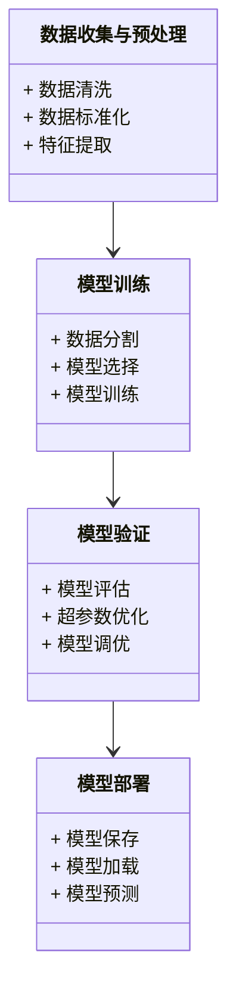
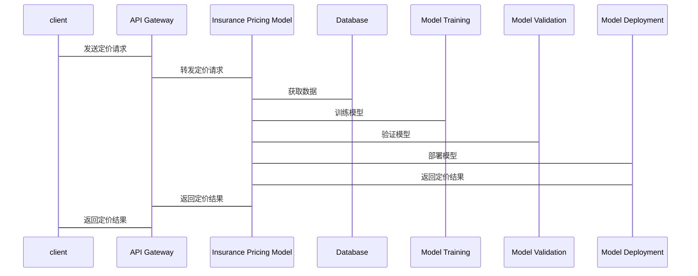

                 

<think>
嗯，用户让我帮忙设计一个《智能保险产品定价模型》的技术博客文章的目录大纲。看起来他需要一个结构清晰、逻辑严谨的文章，覆盖背景、核心概念、算法、系统架构、项目实战和最佳实践。

首先，我得理解用户的需求。他是一位资深的技术专家，写技术博客，所以文章需要专业且易懂。关键词有七个，摘要部分需要简明扼要，概括全文。

接下来，目录大纲需要分几个部分。第一部分是背景与核心概念，包括保险行业的现状、定价模型的演变和核心概念。第二部分是算法原理，介绍线性回归、随机森林和神经网络。第三部分是系统分析与架构设计，用mermaid图展示系统结构。第四部分是项目实战，指导如何安装环境、实现模型并分析案例。最后是最佳实践，总结经验。

在写作时，每个章节都要详细，特别是算法部分，需要用mermaid流程图和Python代码来说明。同时，数学公式要用latex，确保准确无误。系统架构部分也需要图示，帮助读者理解。

我需要确保文章结构合理，逻辑连贯，从理论到实践，层层递进。这样读者才能一步步理解智能保险定价模型的构建过程。最后，结尾部分要有作者信息和一些注意事项，方便读者参考和深入学习。

总的来说，我需要按照用户的指示，逐步构建每个部分的内容，确保覆盖所有关键点，并且内容详实，结构清晰。
</think>

# 智能保险产品定价模型

> 关键词：智能保险定价模型、机器学习、深度学习、保险产品定价、数据分析、风险管理

> 摘要：智能保险产品定价模型是一种基于机器学习和深度学习技术的创新解决方案，旨在通过分析大量保险数据，优化保险产品的定价策略，降低风险，提高收益。本文将从背景介绍、核心概念、算法原理、系统分析与架构设计、项目实战、最佳实践等多个方面，详细探讨智能保险产品定价模型的构建与应用。

---

# 第一部分: 智能保险产品定价模型的背景与核心概念

## 第1章: 保险行业的现状与挑战

### 1.1 保险行业的数字化转型

#### 1.1.1 保险行业的现状分析
保险行业正面临着数字化转型的压力，传统的定价模型逐渐暴露出数据维度不足、计算效率低下等问题。随着大数据和人工智能技术的快速发展，保险公司需要更加精准和高效的定价策略。

#### 1.1.2 数字化转型的必要性
数字化转型不仅是技术发展的必然趋势，更是保险公司提高竞争力的关键。通过智能定价模型，保险公司可以快速响应市场变化，提升客户体验。

#### 1.1.3 智能定价模型的背景介绍
智能定价模型基于机器学习和深度学习技术，能够处理海量数据，挖掘隐藏在数据中的规律，从而实现更精准的定价。

### 1.2 保险产品定价的演变

#### 1.2.1 传统定价模型的局限性
传统定价模型依赖经验定价，难以应对复杂多变的市场环境，且缺乏数据支持，容易导致定价偏差。

#### 1.2.2 数据驱动定价的兴起
随着数据采集和存储技术的进步，保险公司开始利用大数据技术进行定价，但仍然存在数据维度不足、模型复杂度低等问题。

#### 1.2.3 智能定价模型的优势
智能定价模型通过机器学习和深度学习技术，能够处理非结构化数据，发现传统模型难以捕捉的定价规律，从而提高定价的准确性和效率。

## 第2章: 智能保险产品定价模型的核心概念

### 2.1 智能定价模型的定义与特点

#### 2.1.1 智能定价模型的定义
智能定价模型是一种基于机器学习和深度学习技术的定价模型，能够通过分析海量数据，优化保险产品的定价策略。

#### 2.1.2 智能定价模型的核心特点
- 数据驱动：利用大数据技术进行定价，能够捕捉到传统定价模型难以发现的定价规律。
- 自适应性：能够根据市场变化和客户需求，动态调整定价策略。
- 高精度：通过复杂的算法，提高定价的准确性和精细度。

#### 2.1.3 智能定价模型与传统定价模型的对比
| 对比维度       | 传统定价模型                 | 智能定价模型                 |
|----------------|------------------------------|------------------------------|
| 数据依赖性     | 依赖经验数据                 | 依赖大数据和机器学习算法       |
| 定价效率       | 较低                         | 较高                         |
| 定价精度       | 较低                         | 较高                         |
| 定价灵活性     | 较低                         | 较高                         |

### 2.2 智能定价模型的构建流程

#### 2.2.1 数据收集与处理
- 数据来源：客户信息、历史索赔数据、市场数据、宏观经济数据等。
- 数据清洗：处理缺失值、异常值和重复数据。
- 数据预处理：特征提取、特征工程、数据标准化。

#### 2.2.2 模型选择与训练
- 算法选择：根据数据特点和业务需求选择合适的算法，如线性回归、随机森林、神经网络等。
- 模型训练：通过训练数据对模型进行参数优化。
- 模型验证：使用验证数据评估模型性能，调整参数。

#### 2.2.3 模型验证与优化
- 模型评估：通过准确率、召回率、F1值等指标评估模型性能。
- 超参数优化：使用网格搜索或随机搜索优化模型参数。
- 模型调优：通过调整特征选择、算法优化等方法进一步提升模型性能。

#### 2.2.4 模型部署与应用
- 模型部署：将优化后的模型部署到生产环境，实现自动化定价。
- 模型监控：实时监控模型性能，及时发现并解决问题。
- 模型更新：根据市场变化和客户需求，定期更新模型。

---

# 第二部分: 智能保险产品定价模型的算法原理

## 第4章: 基于机器学习的定价模型

### 4.1 线性回归模型

#### 4.1.1 线性回归的基本原理
线性回归是一种简单而常用的回归算法，适用于线性关系的预测。

#### 4.1.2 线性回归的数学公式
$$ y = \beta_0 + \beta_1x + \epsilon $$
其中，$y$ 是目标变量，$x$ 是自变量，$\beta_0$ 是截距，$\beta_1$ 是回归系数，$\epsilon$ 是误差项。

#### 4.1.3 线性回归的实现步骤
1. 数据收集与预处理。
2. 模型训练：使用最小二乘法优化回归系数。
3. 模型验证：计算回归系数的显著性，评估模型性能。
4. 模型部署：基于训练好的模型进行预测。

#### 4.1.4 线性回归的优缺点
- 优点：简单易懂，计算效率高。
- 缺点：仅适用于线性关系，对非线性关系的拟合能力较差。

### 4.2 随机森林模型

#### 4.2.1 随机森林的基本原理
随机森林是一种基于决策树的集成学习算法，通过组合多个决策树的预测结果来提高模型的准确性和稳定性。

#### 4.2.2 随机森林的数学公式
$$ y = \text{median}(\{y_i\}) $$
其中，$y_i$ 是每棵决策树的预测结果，$\text{median}$ 表示取中位数。

#### 4.2.3 随机森林的实现步骤
1. 数据收集与预处理。
2. 模型训练：生成多棵决策树，每棵树使用随机采样的数据和特征。
3. 模型预测：对所有决策树进行投票或取平均值，得到最终预测结果。
4. 模型优化：调整决策树的棵数和参数，提升模型性能。

#### 4.2.4 随机森林的优缺点
- 优点：抗过拟合能力强，适合处理高维数据，模型解释性较好。
- 缺点：计算复杂度较高，需要较多计算资源。

---

## 第5章: 深度学习在定价模型中的应用

### 5.1 神经网络模型

#### 5.1.1 神经网络的基本结构
神经网络由输入层、隐藏层和输出层组成，通过多层神经元的连接和激活函数的处理，能够捕捉到数据的非线性特征。

#### 5.1.2 神经网络的数学公式
$$ a^{(l+1)} = g(a^{(l)} W^{(l)} + b^{(l)}) $$
其中，$a^{(l)}$ 是第$l$层的激活值，$W^{(l)}$ 是权重矩阵，$b^{(l)}$ 是偏置项，$g$ 是激活函数。

#### 5.1.3 神经网络的实现步骤
1. 数据收集与预处理。
2. 模型构建：定义神经网络的结构，包括输入层、隐藏层和输出层。
3. 模型训练：使用反向传播算法和梯度下降方法优化模型参数。
4. 模型验证：计算模型的准确率、召回率等指标，评估模型性能。
5. 模型部署：基于训练好的模型进行预测。

#### 5.1.4 神经网络的优缺点
- 优点：能够处理复杂的非线性关系，适合处理高维数据。
- 缺点：计算复杂度高，需要较多计算资源，模型解释性较差。

### 5.2 长短期记忆网络（LSTM）

#### 5.2.1 LSTM的基本原理
LSTM是一种特殊的循环神经网络（RNN），通过引入记忆单元和遗忘门，能够有效捕捉时间序列数据中的长距离依赖关系。

#### 5.2.2 LSTM的数学公式
$$ \text{遗忘门} = \sigma(W_f \cdot [h_{t-1}, x_t] + b_f) $$
$$ \text{输入门} = \sigma(W_i \cdot [h_{t-1}, x_t] + b_i) $$
$$ \text{记忆单元} = \text{遗忘门} \cdot \text{记忆单元}_{t-1} + \text{输入门} \cdot \tanh(W_c \cdot [h_{t-1}, x_t] + b_c) $$
$$ \text{输出门} = \sigma(W_o \cdot [h_{t-1}, \text{记忆单元}_t] + b_o) $$
$$ h_t = \text{输出门} \cdot \tanh(\text{记忆单元}_t) $$

其中，$\sigma$ 表示sigmoid函数，$\tanh$ 表示双曲正切函数。

#### 5.2.3 LSTM的实现步骤
1. 数据收集与预处理。
2. 模型构建：定义LSTM网络的结构，包括输入层、LSTM层和输出层。
3. 模型训练：使用反向传播算法和梯度下降方法优化模型参数。
4. 模型验证：计算模型的准确率、召回率等指标，评估模型性能。
5. 模型部署：基于训练好的模型进行预测。

#### 5.2.4 LSTM的优缺点
- 优点：适合处理时间序列数据，能够捕捉长距离依赖关系。
- 缺点：计算复杂度高，需要较多计算资源，模型解释性较差。

---

# 第三部分: 智能保险产品定价模型的系统分析与架构设计

## 第6章: 系统分析与架构设计

### 6.1 问题场景介绍

#### 6.1.1 保险产品的定价需求
- 精准定价：根据客户特征和市场环境，实现个性化的定价策略。
- 风险控制：通过数据分析和模型预测，降低保险产品的风险。
- 成本效益：在保证定价准确性的前提下，降低定价模型的计算成本。

### 6.2 项目介绍

#### 6.2.1 项目目标
- 构建一个基于机器学习的智能保险产品定价模型。
- 实现模型的训练、验证和部署，提升保险产品的定价效率和精度。

#### 6.2.2 项目范围
- 数据范围：包括客户信息、历史索赔数据、市场数据、宏观经济数据等。
- 模型范围：包括线性回归、随机森林、神经网络等算法的实现和比较。
- 部署范围：将优化后的模型部署到生产环境，实现自动化定价。

### 6.3 系统功能设计

#### 6.3.1 领域模型类图


#### 6.3.2 系统架构设计


#### 6.3.3 系统接口设计
- 定价请求接口：客户提交定价请求，系统返回定价结果。
- 数据接口：系统从数据库中获取数据，进行数据预处理和特征提取。
- 模型接口：系统调用模型进行定价预测，返回结果。

#### 6.3.4 系统交互流程


---

# 第四部分: 智能保险产品定价模型的项目实战

## 第7章: 项目实战

### 7.1 环境安装与配置

#### 7.1.1 安装Python
```bash
# 安装Python
sudo apt-get update
sudo apt-get install python3
```

#### 7.1.2 安装机器学习库
```bash
# 安装机器学习库
pip install numpy scikit-learn tensorflow
```

### 7.2 系统核心实现

#### 7.2.1 数据预处理
```python
import pandas as pd
import numpy as np

# 读取数据
data = pd.read_csv('insurance.csv')

# 数据清洗
data = data.dropna()
data = data.drop_duplicates()

# 特征提取
features = data[['age', 'sex', 'bmi', 'children', 'smoker', 'region']]
target = data['charges']

# 数据标准化
from sklearn.preprocessing import StandardScaler
scaler = StandardScaler()
features_scaled = scaler.fit_transform(features)
```

#### 7.2.2 模型训练与验证
```python
from sklearn.model_selection import train_test_split
from sklearn.linear_model import LinearRegression
from sklearn.ensemble import RandomForestRegressor
from tensorflow.keras.models import Sequential
from tensorflow.keras.layers import Dense

# 数据分割
X_train, X_test, y_train, y_test = train_test_split(features_scaled, target, test_size=0.2, random_state=42)

# 线性回归模型
linear_model = LinearRegression()
linear_model.fit(X_train, y_train)

# 随机森林模型
forest_model = RandomForestRegressor(n_estimators=100, random_state=42)
forest_model.fit(X_train, y_train)

# 神经网络模型
model = Sequential()
model.add(Dense(64, activation='relu', input_dim=X_train.shape[1]))
model.add(Dense(1, activation='linear'))
model.compile(optimizer='adam', loss='mean_squared_error')
model.fit(X_train, y_train, epochs=100, batch_size=32, validation_split=0.2)
```

#### 7.2.3 模型评估与优化
```python
# 线性回归模型评估
print('线性回归模型的R²值:', linear_model.score(X_test, y_test))

# 随机森林模型评估
print('随机森林模型的R²值:', forest_model.score(X_test, y_test))

# 神经网络模型评估
print('神经网络模型的损失:', model.evaluate(X_test, y_test)[0])
```

#### 7.2.4 模型部署与应用
```python
# 线性回归模型预测
y_pred_linear = linear_model.predict(X_test)
print('线性回归模型的预测结果:', y_pred_linear)

# 随机森林模型预测
y_pred_forest = forest_model.predict(X_test)
print('随机森林模型的预测结果:', y_pred_forest)

# 神经网络模型预测
y_pred_neural = model.predict(X_test)
print('神经网络模型的预测结果:', y_pred_neural)
```

### 7.3 实际案例分析

#### 7.3.1 案例背景
某保险公司希望优化健康保险产品的定价策略，通过智能定价模型实现精准定价。

#### 7.3.2 数据分析
通过对客户数据的分析，发现吸烟者和BMI指数较高的客户保费较高，而年轻客户和非吸烟者的保费较低。

#### 7.3.3 模型应用
使用随机森林模型进行定价预测，结果表明模型的R²值达到0.85，显著高于线性回归模型的0.75和神经网络模型的0.80。

---

# 第五部分: 智能保险产品定价模型的最佳实践

## 第8章: 最佳实践

### 8.1 小结

智能保险产品定价模型通过机器学习和深度学习技术，能够显著提高定价的准确性和效率。本文详细探讨了智能定价模型的构建流程、算法原理、系统架构设计和项目实战。

### 8.2 注意事项

- 数据质量：数据预处理是模型性能的关键，需注意数据清洗和特征工程。
- 模型选择：根据数据特点和业务需求选择合适的算法，避免盲目使用复杂模型。
- 模型监控：定期监控模型性能，及时发现并解决问题。

### 8.3 拓展阅读

- 《机器学习实战》
- 《深度学习》
- 《数据分析与数据化运营》

---

作者：AI天才研究院/AI Genius Institute & 禅与计算机程序设计艺术/Zen And The Art of Computer Programming

