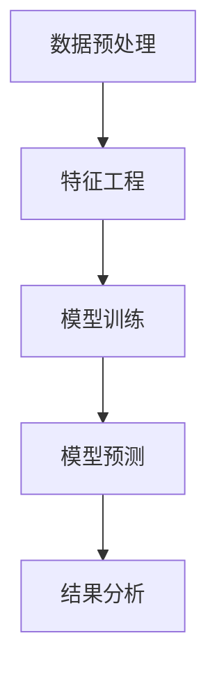
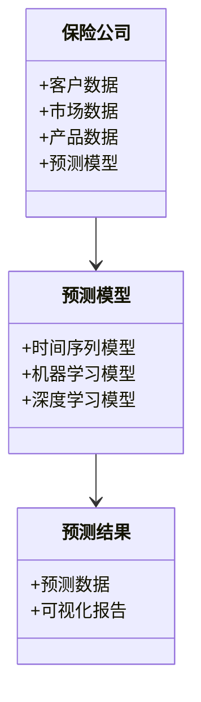

                 

# 智能保险产品需求预测模型优化

> 关键词：智能保险，需求预测，机器学习，深度学习，保险产品优化

> 摘要：本文探讨了智能保险产品需求预测模型的优化方法，通过分析保险行业的数字化转型，提出了基于机器学习和深度学习的需求预测模型，并结合实际案例详细讲解了模型的设计与实现。文章内容涵盖背景分析、核心概念、算法原理、系统架构、项目实战以及最佳实践等方面，旨在为保险行业的需求预测提供理论支持和实践指导。

---

# 第一部分: 智能保险产品需求预测的背景与意义

## 第1章: 智能保险产品需求预测的背景与意义

### 1.1 保险行业的数字化转型

#### 1.1.1 传统保险业务的痛点与挑战

传统保险业务在需求预测方面面临诸多痛点，例如：

- **数据分散**：保险公司的数据来源广泛，包括客户行为数据、市场数据、产品数据等，但这些数据通常分散在不同的系统中，难以有效整合。
- **预测精度低**：传统的统计方法在面对复杂市场环境时，预测精度有限，难以满足精准需求预测的需求。
- **人工成本高**：需求预测往往依赖大量人工分析，效率低下且容易出错。

#### 1.1.2 数字化转型对保险行业的影响

随着大数据、人工智能等技术的快速发展，保险行业正在经历一场数字化转型：

- **数据驱动决策**：通过收集和分析大量数据，保险公司能够更精准地识别客户需求，优化产品设计。
- **自动化与智能化**：智能化工具的应用大幅提高了需求预测的效率和准确性，降低了人工成本。
- **客户体验提升**：通过智能需求预测，保险公司能够更快地推出符合市场需求的产品，提升客户满意度。

#### 1.1.3 智能保险产品的定义与特点

智能保险产品是指利用人工智能技术，根据客户需求和市场变化动态调整产品设计的保险产品。其特点包括：

- **动态调整**：能够根据实时数据自动调整产品参数。
- **个性化服务**：基于客户需求提供定制化的产品方案。
- **高效预测**：利用机器学习算法进行高精度的需求预测。

### 1.2 需求预测在保险产品开发中的重要性

#### 1.2.1 需求预测的基本概念

需求预测是指通过分析历史数据和市场趋势，预测未来某一时间段内客户对保险产品的需求量。在保险行业，准确的需求预测可以帮助保险公司合理规划产品开发和市场推广策略。

#### 1.2.2 需求预测在保险产品开发中的作用

需求预测在保险产品开发中的作用主要体现在以下几个方面：

1. **优化产品设计**：通过预测市场需求，保险公司可以设计更符合客户预期的产品。
2. **降低经营风险**：准确的需求预测有助于降低产品开发和销售中的不确定性。
3. **提高运营效率**：通过数据驱动的决策，保险公司可以更高效地分配资源。

#### 1.2.3 数据驱动的保险产品开发新趋势

数据驱动的保险产品开发正在成为行业的新趋势，其主要表现为：

- **数据来源多样化**：包括客户行为数据、市场数据、产品数据等。
- **分析方法多样化**：利用机器学习、深度学习等技术进行数据分析。
- **实时反馈机制**：通过实时数据分析，快速调整产品策略。

### 1.3 智能保险产品需求预测的核心问题

#### 1.3.1 需求预测的主要挑战

智能保险产品需求预测面临的主要挑战包括：

- **数据质量问题**：数据的准确性和完整性直接影响预测结果。
- **模型选择与优化**：如何选择合适的模型并进行优化是关键问题。
- **实时性要求**：需求预测需要实时或近实时的响应。

#### 1.3.2 数据质量与特征工程的重要性

数据质量和特征工程是需求预测模型成功的关键因素：

- **数据质量**：数据的准确性、完整性和一致性直接影响模型的预测能力。
- **特征工程**：通过对数据进行特征提取和特征选择，可以提高模型的预测精度。

#### 1.3.3 模型优化的目标与边界

模型优化的目标是提高预测精度，同时降低模型的复杂性和计算成本。优化的边界包括：

- **预测范围**：预测的时间范围和产品范围。
- **计算资源**：模型的计算资源限制。
- **数据隐私**：确保数据的隐私和安全。

### 1.4 本章小结

本章介绍了智能保险产品需求预测的背景与意义，分析了保险行业数字化转型的趋势，提出了智能保险产品的定义与特点，并探讨了需求预测在保险产品开发中的重要性。同时，还总结了需求预测的核心问题和优化目标。

---

# 第二部分: 智能保险产品需求预测的核心概念与联系

## 第2章: 保险产品需求预测的核心概念

### 2.1 数据驱动的需求预测方法

#### 2.1.1 数据驱动预测的基本原理

数据驱动预测的基本原理是通过收集和分析大量数据，利用统计学或机器学习方法，建立预测模型，预测未来的需求。

#### 2.1.2 数据驱动预测的关键要素

数据驱动预测的关键要素包括：

- **数据来源**：包括客户数据、市场数据、产品数据等。
- **预测模型**：包括时间序列模型、机器学习模型等。
- **预测目标**：包括销售量、市场需求量等。

#### 2.1.3 数据驱动预测的优缺点对比

| 优点 | 缺点 |
|------|------|
| 高精度 | 数据依赖性强 |
| 实时性 | 计算资源消耗大 |
| 可扩展 | 模型复杂性高 |

### 2.2 保险产品需求预测的实体关系图

### 2.3 本章小结

本章详细介绍了数据驱动的需求预测方法，分析了数据驱动预测的基本原理和关键要素，并通过实体关系图展示了保险产品需求预测的核心概念。

---

# 第三部分: 智能保险产品需求预测模型的算法原理

## 第3章: 保险产品需求预测的算法原理

### 3.1 时间序列预测模型

#### 3.1.1 ARIMA模型的原理

ARIMA（自回归积分滑动平均）模型是一种常用的时间序列预测模型，其基本原理如下：

$$ ARIMA(p, d, q) $$
- **p**：自回归阶数
- **d**：差分阶数
- **q**：移动平均阶数

ARIMA模型的基本步骤包括：

1. **数据预处理**：对数据进行差分处理，使其平稳。
2. **模型参数估计**：利用最大似然估计法估计模型参数。
3. **模型预测**：基于估计的模型进行未来值的预测。

#### 3.1.2 LSTM模型的原理

LSTM（长短期记忆网络）是一种基于深度学习的时间序列预测模型。其核心在于引入记忆单元，能够有效捕捉长期依赖关系。

$$ LSTM \text{单元结构} $$
- **输入门**：$$ i = \sigma(W_i x + U_i h_{prev}) $$
- **遗忘门**：$$ f = \sigma(W_f x + U_f h_{prev}) $$
- **输出门**：$$ o = \sigma(W_o x + U_o h_{prev}) $$
- **记忆单元**：$$ g = \tanh(W_g x + U_g h_{prev}) $$

LSTM模型的优势在于能够处理时间序列中的长距离依赖关系。

#### 3.1.3 模型选择与优化方法

模型选择与优化方法包括：

- **网格搜索**：通过遍历不同的参数组合，选择最优模型。
- **交叉验证**：通过多次训练和验证，评估模型的泛化能力。
- **超参数优化**：利用遗传算法或随机搜索优化模型参数。

### 3.2 基于机器学习的需求预测算法

#### 3.2.1 线性回归模型

线性回归模型是一种简单的需求预测模型，适用于线性关系较强的场景。

$$ y = \beta_0 + \beta_1 x_1 + \beta_2 x_2 + ... + \beta_n x_n + \epsilon $$

#### 3.2.2 支持向量机模型

支持向量机（SVM）是一种监督学习模型，适用于分类和回归问题。

$$ \text{支持向量回归}：y = (\alpha_1 x_1 + \alpha_2 x_2 + ... + \alpha_n x_n) \cdot w + b $$

#### 3.2.3 随机森林模型

随机森林是一种基于树的集成学习方法，适用于高维数据的预测。

$$ \text{随机森林模型}：y = \sum_{i=1}^{n} \text{决策树模型} $$

### 3.3 深度学习模型在需求预测中的应用

#### 3.3.1 卷积神经网络（CNN）的应用

CNN在时间序列数据中的应用较少，但在图像数据中表现出色。

#### 3.3.2 循环神经网络（RNN）的应用

RNN适用于时间序列数据，能够捕捉序列中的依赖关系。

$$ \text{RNN}：h_t = \tanh(W_{hh} h_{t-1} + W_{xh} x_t + b_h) $$
$$ y_t = W_{hy} h_t + b_y $$

#### 3.3.3 Transformer模型的应用

Transformer模型在自然语言处理领域表现出色，但在时间序列预测中也有应用。

$$ \text{自注意力机制}：\text{Attention}(Q, K, V) = \text{softmax}(\frac{QK^T}{\sqrt{d_k}})V $$

### 3.4 算法流程图

### 3.5 本章小结

本章详细介绍了时间序列预测模型和基于机器学习的需求预测算法，分析了各种模型的优缺点，并给出了算法流程图。

---

# 第四部分: 智能保险产品需求预测模型的系统分析与架构设计

## 第4章: 保险产品需求预测模型的系统分析与架构设计

### 4.1 项目背景与目标

#### 4.1.1 项目背景

本项目旨在通过智能保险产品需求预测模型，优化保险产品的开发和销售策略。

#### 4.1.2 项目目标

- **提高预测精度**：通过优化模型参数，提高需求预测的准确性。
- **降低计算成本**：通过合理选择模型和优化算法，降低计算资源消耗。
- **提升客户满意度**：通过精准的需求预测，提供更符合客户需求的产品。

### 4.2 系统功能设计

#### 4.2.1 领域模型

#### 4.2.2 系统架构设计

#### 4.2.3 接口与交互设计

- **输入接口**：接收客户数据、市场数据等。
- **输出接口**：输出预测结果和可视化报告。
- **交互流程**：用户输入数据，系统处理数据并返回预测结果。

### 4.3 本章小结

本章详细介绍了保险产品需求预测模型的系统分析与架构设计，包括项目背景、系统功能设计、系统架构设计和接口与交互设计。

---

# 第五部分: 智能保险产品需求预测模型的项目实战

## 第5章: 保险产品需求预测模型的项目实战

### 5.1 环境配置与数据获取

#### 5.1.1 环境配置

- **操作系统**：Linux/Windows/MacOS
- **编程语言**：Python 3.8+
- **依赖库**：NumPy, Pandas, Scikit-learn, TensorFlow

#### 5.1.2 数据获取

通过API接口获取客户数据、市场数据等。

### 5.2 数据预处理与特征工程

#### 5.2.1 数据清洗

处理缺失值、异常值等。

#### 5.2.2 特征提取

通过PCA等方法进行特征降维。

#### 5.2.3 数据标准化

对数据进行标准化处理，使其适合模型输入。

### 5.3 模型实现与优化

#### 5.3.1 模型实现

基于TensorFlow框架实现LSTM模型。

#### 5.3.2 模型优化

通过网格搜索优化模型参数。

### 5.4 结果分析与可视化

#### 5.4.1 预测结果分析

通过MAE、MSE等指标评估模型性能。

#### 5.4.2 可视化展示

通过折线图展示预测结果与实际值的对比。

### 5.5 本章小结

本章通过实际案例详细讲解了保险产品需求预测模型的实现过程，包括环境配置、数据预处理、模型实现与优化、结果分析与可视化。

---

# 第六部分: 智能保险产品需求预测模型的优化与扩展

## 第6章: 保险产品需求预测模型的优化与扩展

### 6.1 最佳实践

#### 6.1.1 数据质量的保证

确保数据的准确性和完整性。

#### 6.1.2 模型选择的策略

根据具体场景选择合适的模型。

#### 6.1.3 模型优化的技巧

通过网格搜索、随机搜索等方法优化模型参数。

### 6.2 案例分析与经验总结

通过实际案例分析总结经验教训，提出改进建议。

### 6.3 拓展阅读

推荐相关领域的书籍和论文，供有兴趣的读者深入学习。

### 6.4 本章小结

本章总结了保险产品需求预测模型的优化方法和扩展方向，提出了最佳实践和经验总结，并推荐了拓展阅读资料。

---

# 作者

作者：AI天才研究院/AI Genius Institute & 禅与计算机程序设计艺术/Zen And The Art of Computer Programming

---

以上是《智能保险产品需求预测模型优化》的技术博客文章的大纲和部分内容，您可以根据实际需求进一步补充和扩展。

