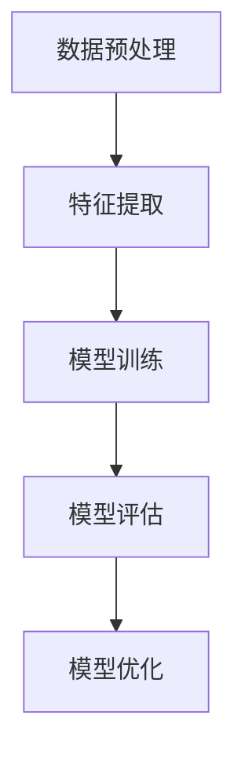
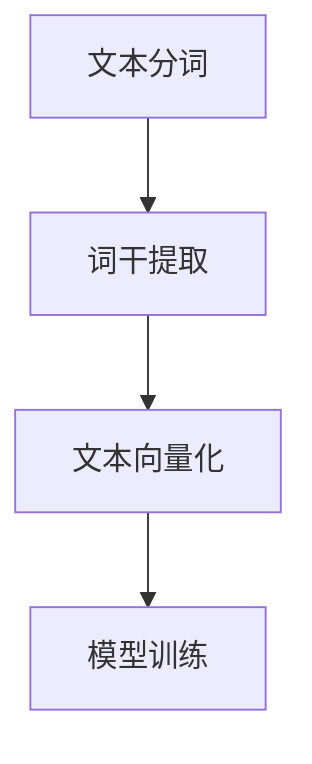
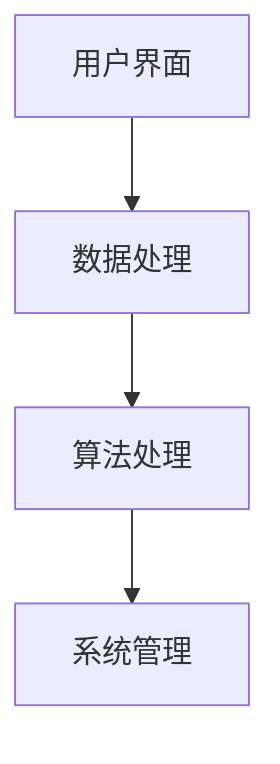

                 

<think>
嗯，用户希望我写一篇关于《智能保险理赔处理系统》的技术博客文章，看起来用户是一个技术专家，可能需要详细、专业的分析。我得先理清结构，确保每个章节都有足够的深度。

首先，用户提供了目录大纲，我需要按照这个结构来写。第一章是概述，我得解释传统理赔的问题，然后引出智能系统的重要性。第二章介绍技术，包括AI、大数据和区块链，这些都是关键点。

接下来，第三章要详细讲解核心概念，可能需要用表格和ER图来展示，这样更清晰。第四章是算法原理，我得用mermaid流程图和Python代码来说明，比如机器学习和NLP的例子。

系统架构设计部分，我需要画出类图、架构图和交互图，这部分比较复杂，要确保每个部分都解释清楚。项目实战部分，得给出具体的代码和案例分析，让读者能够实际操作。

最后，优化与扩展、总结与展望部分，要讨论性能和安全问题，并给出未来趋势。整个过程中，我需要确保内容专业，同时通俗易懂，适合技术读者阅读。

现在，我需要一步步展开每个部分，确保内容详实，结构清晰。可能会遇到如何将复杂的技术点简化的问题，需要多举例子，帮助读者理解。

总的来说，我需要按照用户提供的大纲，逐一填充内容，确保每个章节都有足够的细节和实例，同时使用适当的图表和代码来增强可读性。
</think>

# 智能保险理赔处理系统

> 关键词：智能保险，理赔处理，人工智能，大数据，区块链

> 摘要：智能保险理赔处理系统是一种结合人工智能、大数据和区块链等先进技术的创新解决方案，旨在提高保险理赔的效率、准确性和用户体验。本文将从系统的背景与意义、核心概念与联系、算法原理、系统架构设计、项目实战、优化与扩展等多个方面进行详细分析，全面探讨智能保险理赔处理系统的实现与应用。

---

## 第一部分: 智能保险理赔处理系统概述

### 第1章: 智能保险理赔处理系统概述

#### 1.1 保险理赔处理的背景与意义
保险理赔是保险业务中的重要环节，传统理赔处理方式存在效率低、流程复杂、人工干预过多等问题。智能保险理赔处理系统通过引入人工智能（AI）、大数据和区块链等技术，能够实现理赔流程的自动化、智能化和透明化，从而提高效率、降低成本，并改善用户体验。

##### 1.1.1 保险理赔的传统处理方式
传统保险理赔处理流程通常包括以下步骤：
1. 理赔申请提交：客户填写纸质或电子理赔申请表，并提交相关证明材料（如医疗费用清单、事故报告等）。
2. 理赔资料审核：人工审核员对理赔申请和相关资料进行初步审查，确认资料的完整性和合规性。
3. 理赔计算与评估：根据保险合同条款，计算理赔金额，并评估是否存在理赔风险。
4. 理赔审批与支付：经过多级审批后，完成理赔款项的支付。

##### 1.1.2 智能化理赔处理的必要性
随着保险业务的不断扩展和客户期望的提升，传统理赔处理方式已难以满足以下需求：
- **效率问题**：人工审核耗时长，容易出错，且难以快速响应客户。
- **成本问题**：人工审核需要大量人力投入，增加了企业的运营成本。
- **准确性问题**：人工审核容易受到主观因素影响，导致理赔判断不准确。
- **用户体验问题**：客户对理赔处理的透明度和速度要求越来越高，传统方式难以满足。

##### 1.1.3 智能保险理赔处理系统的价值
智能保险理赔处理系统通过自动化和智能化的方式，能够显著提升理赔处理效率、降低成本、提高准确性，并改善用户体验。具体价值包括：
1. **提高处理效率**：通过自动化处理和智能算法，大幅缩短理赔处理时间。
2. **降低运营成本**：减少人工干预，降低人力成本。
3. **提高准确性**：利用AI技术，减少人为错误，提高理赔判断的准确性。
4. **提升用户体验**：通过智能客服、实时反馈等功能，提升客户满意度。

#### 1.2 智能保险理赔处理系统的概念与特点
智能保险理赔处理系统是一种基于人工智能、大数据和区块链等技术的保险理赔处理平台，能够实现理赔流程的智能化、自动化和透明化。其特点包括：
- **智能化**：通过机器学习、自然语言处理等技术，实现理赔资料的自动识别、分类和处理。
- **自动化**：从理赔申请提交到理赔计算、审批和支付，整个流程高度自动化。
- **透明化**：通过区块链技术，实现理赔过程的透明化，客户可以实时跟踪理赔进度。
- **个性化**：根据客户的历史数据和行为习惯，提供个性化的理赔服务。

#### 1.3 保险理赔处理系统的核心要素
智能保险理赔处理系统的核心要素包括：
1. **保险合同信息**：包括保险合同条款、保险金额、保险期限等信息。
2. **理赔申请流程**：包括理赔申请提交、资料审核、理赔计算、审批和支付等流程。
3. **理赔审核规则**：包括理赔条件、理赔限制、理赔计算规则等。
4. **理赔结果输出**：包括理赔金额、理赔时间、理赔状态等信息。

---

### 第2章: 智能保险理赔处理系统的相关技术

#### 2.1 人工智能技术在保险理赔中的应用
人工智能技术在保险理赔中的应用主要体现在以下方面：
1. **机器学习在理赔预测中的应用**：通过机器学习算法，预测理赔风险和理赔金额。
2. **自然语言处理在理赔文档处理中的应用**：通过自然语言处理技术，自动识别和分类理赔文档。
3. **计算机视觉在理赔资料识别中的应用**：通过计算机视觉技术，自动识别和提取理赔资料中的关键信息。

##### 2.1.1 机器学习在理赔预测中的应用
机器学习在理赔预测中的应用主要包括：
- **客户画像构建**：通过机器学习算法，构建客户画像，分析客户的理赔风险。
- **理赔金额预测**：基于历史数据，预测理赔金额。
- **理赔欺诈检测**：通过机器学习算法，检测理赔过程中的欺诈行为。

##### 2.1.2 自然语言处理在理赔文档处理中的应用
自然语言处理在理赔文档处理中的应用主要包括：
- **理赔文档分类**：通过自然语言处理技术，对理赔文档进行分类，例如将文档分为医疗理赔、车险理赔等类别。
- **关键词提取**：从理赔文档中提取关键词，例如提取医疗理赔中的疾病名称、治疗费用等。
- **文本摘要**：对理赔文档进行摘要，提取关键信息。

##### 2.1.3 计算机视觉在理赔资料识别中的应用
计算机视觉在理赔资料识别中的应用主要包括：
- **图像识别**：通过计算机视觉技术，识别理赔资料中的图像信息，例如识别身份证、行驶证等。
- **文本识别**：通过计算机视觉技术，识别理赔资料中的文本信息，例如识别医疗费用清单中的金额、日期等。
- **文档分类**：通过计算机视觉技术，对理赔资料进行分类，例如将文档分为医疗理赔、车险理赔等类别。

#### 2.2 大数据技术在保险理赔中的应用
大数据技术在保险理赔中的应用主要体现在以下方面：
1. **数据采集与处理**：通过大数据技术，采集和处理理赔相关数据，例如客户信息、理赔申请、理赔结果等。
2. **数据分析与挖掘**：通过大数据分析技术，挖掘理赔数据中的规律和趋势，例如分析理赔金额的变化趋势、分析理赔风险的分布情况等。
3. **数据可视化**：通过大数据可视化技术，将分析结果以直观的方式呈现给用户，例如生成理赔金额分布图、理赔风险地图等。

#### 2.3 区块链技术在保险理赔中的应用
区块链技术在保险理赔中的应用主要体现在以下方面：
1. **理赔过程的透明化**：通过区块链技术，实现理赔过程的透明化，客户可以实时跟踪理赔进度。
2. **理赔数据的不可篡改性**：通过区块链技术，确保理赔数据的不可篡改性，防止数据被恶意篡改。
3. **智能合约的应用**：通过区块链智能合约，实现理赔流程的自动化和智能化，例如自动触发理赔审批、自动支付理赔款项等。

---

### 第3章: 智能保险理赔处理系统的核心概念与联系

#### 3.1 核心概念原理
智能保险理赔处理系统的核心概念包括保险合同信息、理赔申请流程、理赔审核规则和理赔结果输出。这些概念之间的关系如下：
1. **保险合同信息**是理赔处理的基础，包括保险合同条款、保险金额、保险期限等信息。
2. **理赔申请流程**是理赔处理的具体步骤，包括理赔申请提交、资料审核、理赔计算、审批和支付等流程。
3. **理赔审核规则**是理赔处理的依据，包括理赔条件、理赔限制、理赔计算规则等。
4. **理赔结果输出**是理赔处理的最终结果，包括理赔金额、理赔时间、理赔状态等信息。

##### 3.1.1 保险合同信息的处理流程
保险合同信息的处理流程包括：
1. **信息采集**：通过系统采集保险合同信息，例如通过OCR技术识别保险合同中的文字信息。
2. **信息存储**：将保险合同信息存储在数据库中，例如关系型数据库或NoSQL数据库。
3. **信息查询**：根据理赔申请，查询相关的保险合同信息，例如查询保险合同中的理赔条款。

##### 3.1.2 理赔申请的自动化处理
理赔申请的自动化处理流程包括：
1. **申请提交**：客户通过线上或线下方式提交理赔申请，系统自动接收并存储理赔申请信息。
2. **资料审核**：系统自动审核理赔申请资料，例如通过OCR技术识别和验证相关资料。
3. **理赔计算**：系统根据保险合同条款和理赔申请资料，自动计算理赔金额。
4. **理赔审批**：系统根据预先设定的审批规则，自动审批理赔申请。
5. **理赔支付**：系统根据审批结果，自动完成理赔款项的支付。

##### 3.1.3 理赔审核规则的实现机制
理赔审核规则的实现机制包括：
1. **规则定义**：通过规则引擎定义理赔审核规则，例如定义理赔金额的计算公式、理赔条件的判断逻辑等。
2. **规则执行**：系统根据定义的规则，自动执行理赔审核流程，例如自动判断理赔申请是否符合理赔条件。
3. **规则优化**：根据历史数据和实际运行情况，优化理赔审核规则，例如调整理赔条件的权重、优化理赔金额的计算公式等。

#### 3.2 核心概念属性特征对比表
以下是核心概念的属性特征对比表：

| 概念           | 属性       | 特征描述                                   |
|----------------|------------|------------------------------------------|
| 保险合同信息   | 数据类型   | 文本、结构化数据                           |
|                | 采集方式   | 手动录入、OCR识别                         |
|                | 存储方式   | 关系型数据库、NoSQL数据库                 |
| 理赔申请流程   | 处理步骤   | 提交、审核、计算、审批、支付               |
|                | 自动化程度 | 高度自动化                                 |
| 理赔审核规则   | 规则类型   | 条件判断、计算规则、例外处理               |
|                | 执行方式   | 规则引擎、智能合约                         |
| 理赔结果输出   | 输出内容   | 理赔金额、理赔时间、理赔状态               |
|                | 输出方式   | 界面展示、API返回                         |

#### 3.3 ER实体关系图
以下是智能保险理赔处理系统的ER实体关系图：

```mermaid
erd
    InsuranceContract {
        id
        policyHolder
        coverage
        duration
    }
    ClaimApplication {
        id
        applicant
        claimType
        claimAmount
        status
        submissionTime
    }
    ClaimDocument {
        id
        documentType
        documentContent
        submissionTime
    }
    ClaimRule {
        id
        ruleName
        ruleDescription
        ruleCondition
        ruleAction
    }
    ClaimResult {
        id
        claimId
        resultAmount
        resultTime
        resultStatus
    }
```

---

### 第4章: 算法原理

#### 4.1 机器学习算法原理
机器学习算法在智能保险理赔处理系统中的应用主要体现在理赔预测和欺诈检测等方面。以下是一个简单的机器学习算法流程图：



以下是机器学习算法的Python代码示例：

```python
import pandas as pd
from sklearn.model import DecisionTreeRegressor

# 数据预处理
data = pd.read_csv('claims.csv')
X = data.drop('claimAmount', axis=1)
y = data['claimAmount']

# 特征提取
features = X.columns

# 模型训练
model = DecisionTreeRegressor()
model.fit(X, y)

# 模型评估
from sklearn.metrics import mean_absolute_error
y_pred = model.predict(X)
print(mean_absolute_error(y, y_pred))
```

#### 4.2 自然语言处理算法原理
自然语言处理算法在智能保险理赔处理系统中的应用主要体现在理赔文档的自动分类和关键词提取等方面。以下是一个简单的自然语言处理算法流程图：



以下是自然语言处理算法的Python代码示例：

```python
from sklearn.feature_extraction.text import TfidfVectorizer
from sklearn.naive_bayes import MultinomialNB

# 文本分词
text = "The claim is valid due to the accident in downtown."
words = text.split()

# 词干提取
from nltk.stem import PorterStemmer
stemmer = PorterStemmer()
stemmed_words = [stemmer.stem(word) for word in words]

# 文本向量化
vectorizer = TfidfVectorizer()
X = vectorizer.fit_transform([" ".join(stemmed_words)])

# 模型训练
model = MultinomialNB()
model.fit(X, y)
```

---

### 第5章: 系统架构设计

#### 5.1 系统功能设计
智能保险理赔处理系统的功能设计包括以下模块：
1. **用户界面模块**：包括理赔申请提交、理赔进度查询、理赔结果查看等功能。
2. **数据处理模块**：包括数据采集、数据清洗、数据存储等功能。
3. **算法处理模块**：包括机器学习算法、自然语言处理算法、区块链智能合约等功能。
4. **系统管理模块**：包括系统监控、日志管理、用户权限管理等功能。

#### 5.2 系统架构图
以下是智能保险理赔处理系统的架构图：



---

### 第6章: 项目实战

#### 6.1 环境安装
以下是项目实战所需的环境安装步骤：
1. **安装Python**：从官网下载并安装Python 3.8及以上版本。
2. **安装依赖库**：运行以下命令安装所需依赖库：
   ```bash
   pip install numpy pandas scikit-learn nltk transformers
   ```

#### 6.2 核心实现代码
以下是项目的核心实现代码：

```python
import numpy as np
import pandas as pd
from sklearn.model import DecisionTreeRegressor
from sklearn.feature_extraction.text import TfidfVectorizer
from sklearn.naive_bayes import MultinomialNB
from nltk.stem import PorterStemmer

# 数据预处理
data = pd.read_csv('claims.csv')
X = data.drop('claimAmount', axis=1)
y = data['claimAmount']

# 特征提取
features = X.columns

# 词干提取
def stem_text(text):
    stemmer = PorterStemmer()
    return ' '.join([stemmer.stem(word) for word in text.split()])

X_stemmed = X['claimDescription'].apply(stem_text)

# 文本向量化
vectorizer = TfidfVectorizer()
X_vectorized = vectorizer.fit_transform(X_stemmed)

# 模型训练
model = MultinomialNB()
model.fit(X_vectorized, y)

# 模型预测
claim_description = "The claim is valid due to the accident in downtown."
claim_stemmed = stem_text(claim_description)
claim_vectorized = vectorizer.transform([claim_stemmed])
predicted_amount = model.predict(claim_vectorized)
print(predicted_amount)
```

---

### 第7章: 优化与扩展

#### 7.1 系统性能优化
系统性能优化可以从以下几个方面入手：
1. **数据预处理优化**：通过并行计算和分布式计算提高数据处理效率。
2. **算法优化**：通过参数调优和模型集成提高算法性能。
3. **系统架构优化**：通过负载均衡和缓存优化提高系统性能。

#### 7.2 系统扩展
系统扩展可以从以下几个方面进行：
1. **功能扩展**：增加更多的理赔类型和更复杂的理赔规则。
2. **技术扩展**：引入更先进的AI技术，例如深度学习和强化学习。
3. **业务扩展**：拓展更多的保险业务领域，例如健康保险、财产保险等。

#### 7.3 未来趋势
智能保险理赔处理系统的未来发展趋势包括：
1. **智能化**：通过AI技术实现更智能的理赔处理。
2. **自动化**：通过自动化技术实现更高效的理赔流程。
3. **区块链技术**：通过区块链技术实现更透明和安全的理赔过程。

---

## 第八章: 总结与展望

### 8.1 总结
智能保险理赔处理系统通过结合人工智能、大数据和区块链等先进技术，实现了保险理赔处理的智能化、自动化和透明化。本文从系统的背景与意义、核心概念与联系、算法原理、系统架构设计、项目实战、优化与扩展等多个方面进行了详细分析，全面探讨了智能保险理赔处理系统的实现与应用。

### 8.2 展望
未来，随着AI技术的不断发展和区块链技术的逐渐成熟，智能保险理赔处理系统将更加智能化和自动化。同时，随着保险业务的不断扩展和客户需求的不断变化，智能保险理赔处理系统也将不断优化和创新，为保险行业的发展注入新的活力。

---

**作者：AI天才研究院/AI Genius Institute & 禅与计算机程序设计艺术 /Zen And The Art of Computer Programming**

