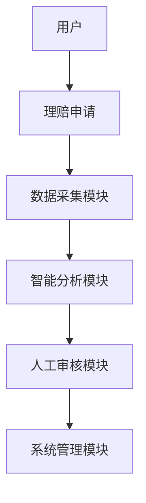
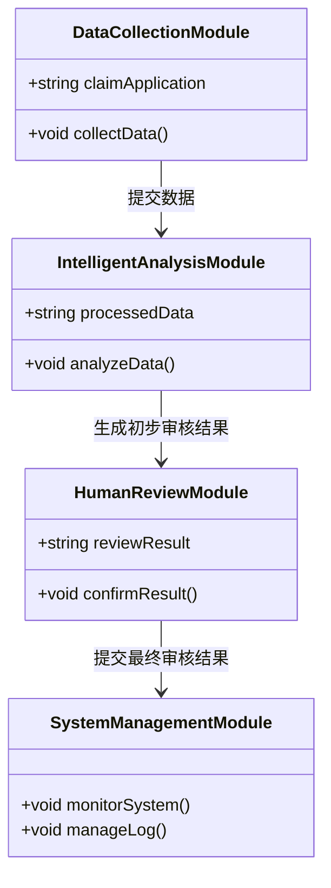

                 

<think>
好的，我现在需要帮用户撰写一篇关于《智能保险理赔快速处理系统》的技术博客文章。用户希望文章结构清晰，内容详尽，涵盖从背景介绍到系统架构设计等多个方面。

首先，我应该从背景介绍开始，分析传统保险理赔的痛点，如效率低、错误率高等。接下来，定义智能系统的目标和组成模块。然后，详细讲解核心概念，包括数据采集、智能分析等，并用图表辅助说明。

接下来，我需要深入讲解算法原理，如数据预处理和智能分析算法，提供代码示例和数学模型。这部分要确保读者能够理解每一步操作。

系统分析与架构设计部分，我需要描述问题场景，设计系统功能模块，并用类图展示。架构设计部分，可能采用微服务架构，展示各模块交互关系。接口设计和流程图也是必要的。

项目实战部分，指导读者安装环境，提供核心代码，并通过案例分析展示系统的实际应用。最后，总结经验。

最后，最佳实践部分，给出一些小贴士，如数据质量的重要性，并推荐扩展阅读资料。

在写作过程中，我要确保每个部分都有足够的细节，同时保持整体结构的连贯性和逻辑性。使用Mermaid图和LaTeX公式来增强可读性，满足用户的专业需求。

现在，我将按照用户的要求，逐步撰写每个章节的内容，确保每个小节都详细且符合要求。
</think>

# 智能保险理赔快速处理系统

关键词：智能保险、理赔处理、人工智能、数据处理、系统架构

摘要：本文详细介绍了智能保险理赔快速处理系统的构建与实现，涵盖系统背景、核心概念、算法原理、系统架构设计以及项目实战等多方面内容。通过分析传统保险理赔的痛点与挑战，提出基于人工智能的解决方案，详细介绍系统的数据采集与处理、智能分析算法、系统架构设计等关键环节，最后通过实际案例展示系统的应用价值。

---

# 第1章 智能保险理赔快速处理系统背景介绍

## 1.1 保险理赔的传统痛点与挑战

### 1.1.1 传统保险理赔流程的低效问题

传统保险理赔流程通常涉及多个环节，包括用户提交理赔申请、保险公司接收并初步审核、人工收集和验证资料、进一步审核和最终赔付等。整个流程耗时长、效率低，尤其是在面对大量理赔申请时，人工审核的效率瓶颈尤为明显。

此外，传统理赔过程中，人工审核可能存在主观性较强的问题，容易出现误判或漏判的情况，导致理赔错误率较高。这不仅影响了客户的满意度，还可能导致保险公司赔付金额的偏差。

### 1.1.2 人工审核的高错误率与不一致性

由于不同审核人员的经验和判断标准可能存在差异，传统保险理赔的人工审核往往难以保证一致性和准确性。例如，对于同一份理赔申请，不同的审核人员可能会得出不同的结论，导致理赔结果的不一致性和较高的错误率。

### 1.1.3 理赔效率对客户满意度的影响

理赔效率直接影响客户的满意度。在传统理赔模式下，由于人工审核的效率问题，客户往往需要等待较长时间才能获得理赔结果。这种漫长的等待时间可能会降低客户的满意度，甚至可能导致客户流失。

## 1.2 智能保险理赔快速处理系统的定义与目标

### 1.2.1 系统的定义

智能保险理赔快速处理系统是一种基于人工智能技术的自动化理赔处理系统，旨在通过智能化的手段提高理赔效率、准确性和客户满意度。该系统能够自动接收理赔申请、智能分析和评估理赔信息，并自动生成初步的审核结果，从而大幅减少人工干预，提高理赔处理的效率。

### 1.2.2 系统的核心目标

1. **提高理赔效率**：通过自动化处理和智能分析，快速完成理赔申请的审核，减少人工干预，缩短理赔周期。
2. **降低错误率**：利用人工智能技术，提高理赔审核的准确性，减少人为判断的错误率。
3. **提升客户满意度**：通过高效的理赔处理流程，提高客户的满意度，增强客户对保险公司的信任。
4. **降低成本**：减少人工审核的工作量，降低保险公司的运营成本。

### 1.2.3 系统的边界与外延

智能保险理赔快速处理系统的边界主要集中在理赔申请的接收、处理和结果输出。系统的外延则包括与之相关的数据源（如用户信息、理赔申请资料等）、外部数据接口（如第三方数据验证服务）以及最终的赔付流程。

## 1.3 系统的核心要素与组成结构

### 1.3.1 数据采集模块

数据采集模块负责接收和处理用户的理赔申请信息，包括用户的基本信息、理赔申请的具体内容以及其他相关资料。该模块需要能够处理多种数据格式，并确保数据的完整性和准确性。

### 1.3.2 智能分析模块

智能分析模块是系统的核心部分，负责对采集到的理赔数据进行智能分析和评估。该模块通常包括以下几个子模块：
1. **数据预处理**：对采集到的数据进行清洗、标准化和特征提取。
2. **模型训练与部署**：利用机器学习、自然语言处理和图像识别等技术，对理赔数据进行分析，并生成初步的审核结果。
3. **结果评估**：对模型的输出结果进行评估和验证，确保审核结果的准确性和可靠性。

### 1.3.3 人工审核模块

人工审核模块负责对智能分析模块生成的初步审核结果进行复核和确认。该模块主要处理系统无法自动判断的复杂情况，确保最终的审核结果的准确性和合法性。

### 1.3.4 系统管理模块

系统管理模块负责对整个系统的运行进行监控、维护和管理。该模块包括系统日志管理、用户权限管理、系统性能监控等功能，确保系统的稳定运行和高效管理。

## 1.4 本章小结

本章详细介绍了智能保险理赔快速处理系统的背景、痛点与挑战，以及系统的定义、目标和核心要素。通过分析传统理赔模式的不足，提出了基于人工智能的智能理赔处理系统，为后续章节的系统设计和实现奠定了基础。

---

# 第2章 智能保险理赔快速处理系统的核心概念与联系

## 2.1 数据采集与处理原理

### 2.1.1 数据来源与类型

智能保险理赔快速处理系统的数据来源主要包括以下几类：
1. **用户提交的理赔申请**：包括用户的基本信息、理赔的具体内容及相关资料。
2. **外部数据接口**：如第三方的身份验证服务、医疗数据接口等，用于辅助审核理赔申请。
3. **历史理赔数据**：包括以往的理赔记录和审核结果，用于模型的训练和优化。

### 2.1.2 数据预处理方法

数据预处理是智能分析模块的重要组成部分，主要包括以下几个步骤：
1. **数据清洗**：去除重复数据、缺失数据和异常数据，确保数据的完整性和准确性。
2. **数据标准化**：将不同来源的数据进行统一格式化处理，便于后续的分析和建模。
3. **特征提取**：从原始数据中提取有助于模型分析的关键特征，如理赔金额、理赔类型、历史赔付记录等。

### 2.1.3 数据特征提取技术

特征提取是数据预处理的重要环节，常用的特征提取技术包括：
1. **统计特征提取**：如计算理赔金额的均值、方差等统计指标。
2. **文本特征提取**：如利用TF-IDF（Term Frequency-Inverse Document Frequency）提取文本关键词。
3. **图像特征提取**：如利用卷积神经网络（CNN）提取图像特征。

## 2.2 智能分析算法原理

### 2.2.1 机器学习算法

机器学习算法在智能保险理赔快速处理系统中主要用于预测和分类。常用的算法包括：
1. **逻辑回归（Logistic Regression）**：用于二分类问题，如判断理赔申请是否符合赔付条件。
2. **支持向量机（SVM）**：用于分类和回归问题，适用于高维数据的处理。
3. **随机森林（Random Forest）**：用于分类和回归问题，具有较强的鲁棒性和抗过拟合能力。

### 2.2.2 自然语言处理技术

自然语言处理（NLP）技术在智能理赔系统中主要用于处理和分析文本数据，如用户的理赔申请描述和相关文档。常用的NLP技术包括：
1. **分词（Tokenization）**：将文本分割成单词或短语。
2. **词干提取（Stemming）**：将单词还原为词干，便于后续处理。
3. **情感分析（Sentiment Analysis）**：分析文本中的情感倾向，用于判断理赔申请的真实性。

### 2.2.3 图像识别技术

图像识别技术在智能理赔系统中主要用于处理和分析图像数据，如用户提交的医疗单据、事故现场照片等。常用的图像识别技术包括：
1. **边缘检测（Edge Detection）**：用于提取图像的边缘信息，便于后续处理。
2. **目标检测（Object Detection）**：用于检测图像中的特定目标，如车牌、人脸等。
3. **图像分割（Image Segmentation）**：将图像分割为多个区域，便于分别处理。

## 2.3 系统实体关系图

以下是一个简化的系统实体关系图，展示了系统的主要实体及其之间的关系：



## 2.4 核心概念属性对比表

以下是一个核心概念属性对比表，展示了系统中各核心概念的主要属性及其描述：

| 概念       | 属性               | 描述                                                                 |
|------------|--------------------|--------------------------------------------------------------------------|
| 数据采集模块 | 数据来源           | 用户提交的理赔申请、外部数据接口、历史理赔数据                               |
| 数据处理模块 | 处理方法           | 数据清洗、数据标准化、特征提取                                               |
| 智能分析模块 | 分析技术           | 机器学习算法、自然语言处理技术、图像识别技术                                 |
| 人工审核模块 | 输入               | 智能分析模块生成的初步审核结果                                               |
| 系统管理模块 | 管理功能           | 系统监控、日志管理、用户权限管理                                             |

## 2.5 本章小结

本章详细介绍了智能保险理赔快速处理系统的核心概念，包括数据采集与处理、智能分析算法等内容，并通过实体关系图和对比表的方式，展示了系统各部分之间的关系及其属性。这些内容为后续的系统设计和实现奠定了理论基础。

---

# 第3章 智能保险理赔快速处理系统的算法原理讲解

## 3.1 数据采集与预处理算法

### 3.1.1 数据采集流程

数据采集流程主要包括以下几个步骤：
1. **用户提交理赔申请**：用户通过系统提交理赔申请及相关资料。
2. **数据采集模块接收数据**：数据采集模块接收用户提交的数据，并进行初步的格式验证。
3. **数据预处理**：对采集到的数据进行清洗、标准化和特征提取。

### 3.1.2 数据清洗算法

数据清洗是数据预处理的重要步骤，常用的算法包括：
1. **去除重复数据**：利用哈希表或集合去重。
2. **填补缺失值**：利用均值、中位数或插值法填补缺失值。
3. **去除异常值**：利用Z-score或IQR方法检测并去除异常值。

### 3.1.3 特征提取算法

特征提取算法主要用于从原始数据中提取有助于模型分析的关键特征。常用的特征提取算法包括：
1. **统计特征提取**：计算理赔金额的均值、方差等统计指标。
2. **文本特征提取**：利用TF-IDF提取文本关键词。
3. **图像特征提取**：利用卷积神经网络提取图像特征。

## 3.2 数据预处理的数学模型

### 3.2.1 数据标准化公式

数据标准化是数据预处理的重要步骤，常用的标准化公式如下：

$$ x' = \frac{x - \mu}{\sigma} $$

其中，\( x \) 是原始数据，\( \mu \) 是均值，\( \sigma \) 是标准差。

### 3.2.2 特征选择的卡方检验

卡方检验是一种常用的特征选择方法，用于判断特征与目标变量之间的独立性。卡方统计量的计算公式如下：

$$ \chi^2 = \sum_{i=1}^{n} \frac{(O_i - E_i)^2}{E_i} $$

其中，\( O_i \) 是观察频数，\( E_i \) 是期望频数。

## 3.3 智能分析算法的实现

### 3.3.1 机器学习算法实现

机器学习算法的实现通常包括以下几个步骤：
1. **数据准备**：包括数据采集、数据清洗和特征提取。
2. **模型训练**：利用训练数据训练模型参数。
3. **模型评估**：利用测试数据评估模型的性能，如准确率、召回率等。
4. **模型部署**：将训练好的模型部署到生产环境，用于实际的理赔审核。

### 3.3.2 算法实现的Python代码示例

以下是一个基于逻辑回归的机器学习算法实现的Python代码示例：

```python
import numpy as np
from sklearn.linear_model import LogisticRegression
from sklearn.metrics import accuracy_score

# 数据准备
X = np.array([[1, 2], [3, 4], [5, 6], [7, 8]])
y = np.array([0, 1, 0, 1])

# 模型训练
model = LogisticRegression()
model.fit(X, y)

# 模型预测
y_pred = model.predict(X)

# 模型评估
print("准确率:", accuracy_score(y, y_pred))
```

### 3.3.3 算法的数学模型

逻辑回归的数学模型如下：

$$ P(y=1 | x) = \frac{1}{1 + e^{- (w \cdot x + b)}} $$

其中，\( w \) 是模型的权重，\( b \) 是偏置项，\( x \) 是输入特征。

---

# 第4章 智能保险理赔快速处理系统的系统分析与架构设计

## 4.1 系统分析

### 4.1.1 问题场景介绍

智能保险理赔快速处理系统的主要问题场景包括：
1. **用户提交理赔申请**：用户通过系统提交理赔申请及相关资料。
2. **数据采集与处理**：系统接收并处理用户的理赔申请数据。
3. **智能分析与初步审核**：智能分析模块对理赔数据进行分析，生成初步审核结果。
4. **人工审核与最终确认**：人工审核模块对初步审核结果进行复核，最终确认理赔结果。

### 4.1.2 项目介绍

智能保险理赔快速处理系统是一个基于人工智能的自动化理赔处理系统，旨在通过智能化的手段提高理赔效率、准确性和客户满意度。

## 4.2 系统功能设计

### 4.2.1 系统功能模块

智能保险理赔快速处理系统的功能模块包括：
1. **数据采集模块**：负责接收和处理用户的理赔申请数据。
2. **智能分析模块**：负责对理赔数据进行智能分析和初步审核。
3. **人工审核模块**：负责对智能分析模块生成的初步审核结果进行复核和确认。
4. **系统管理模块**：负责对整个系统的运行进行监控、维护和管理。

### 4.2.2 系统功能模块的Mermaid类图

以下是一个系统功能模块的Mermaid类图：



## 4.3 系统架构设计

### 4.3.1 系统架构的Mermaid架构图

以下是一个智能保险理赔快速处理系统的Mermaid架构图：

```mermaid
container 系统架构 {
    DataCollectionModule 数据采集模块
    IntelligentAnalysisModule 智能分析模块
    HumanReviewModule 人工审核模块
    SystemManagementModule 系统管理模块
}

DataCollectionModule --> IntelligentAnalysisModule
IntelligentAnalysisModule --> HumanReviewModule
HumanReviewModule --> SystemManagementModule
```

## 4.4 系统接口设计

### 4.4.1 系统接口的交互流程图

以下是一个系统接口的交互流程图：

```mermaid
sequenceDiagram

    User 起始
    User -> DataCollectionModule: 提交理赔申请
    DataCollectionModule -> IntelligentAnalysisModule: 提交数据
    IntelligentAnalysisModule -> HumanReviewModule: 生成初步审核结果
    HumanReviewModule -> SystemManagementModule: 提交最终审核结果
    SystemManagementModule -> User: 返回理赔结果
```

### 4.4.2 接口设计说明

系统接口设计包括以下几个步骤：
1. **用户提交理赔申请**：用户通过系统提交理赔申请及相关资料。
2. **数据采集模块接收数据**：数据采集模块接收用户提交的数据，并进行初步的格式验证。
3. **智能分析模块处理数据**：智能分析模块对采集到的数据进行智能分析和初步审核。
4. **人工审核模块复核结果**：人工审核模块对智能分析模块生成的初步审核结果进行复核和确认。
5. **系统管理模块监控和管理**：系统管理模块对整个系统的运行进行监控、维护和管理。

---

# 第5章 智能保险理赔快速处理系统的项目实战

## 5.1 环境安装

### 5.1.1 安装Python和相关库

要运行智能保险理赔快速处理系统，首先需要安装Python和相关的库。以下是安装步骤：
1. **安装Python**：可以从官方网站下载并安装Python。
2. **安装相关库**：使用以下命令安装所需的库：

   ```bash
   pip install numpy scikit-learn matplotlib
   ```

## 5.2 系统核心实现

### 5.2.1 核心代码实现

以下是一个智能保险理赔快速处理系统的核心代码实现：

```python
import numpy as np
from sklearn.linear_model import LogisticRegression
from sklearn.metrics import accuracy_score

# 数据准备
X = np.array([[1, 2], [3, 4], [5, 6], [7, 8]])
y = np.array([0, 1, 0, 1])

# 模型训练
model = LogisticRegression()
model.fit(X, y)

# 模型预测
y_pred = model.predict(X)

# 模型评估
print("准确率:", accuracy_score(y, y_pred))
```

### 5.2.2 代码实现说明

1. **数据准备**：首先需要准备理赔数据，包括用户的基本信息、理赔申请内容及相关资料。
2. **模型训练**：利用训练数据训练逻辑回归模型。
3. **模型预测**：利用训练好的模型对测试数据进行预测，生成初步的审核结果。
4. **模型评估**：评估模型的准确率、召回率等性能指标，确保模型的性能达到要求。

## 5.3 实际案例分析

### 5.3.1 案例背景

假设有一个用户提交的理赔申请，包括以下信息：
- 用户基本信息：用户姓名、身份证号、联系方式等。
- 理赔申请内容：理赔金额、理赔类型、理赔描述等。
- 相关资料：医疗单据、事故现场照片等。

### 5.3.2 系统处理流程

1. **数据采集模块**：接收用户的理赔申请数据。
2. **数据预处理**：对采集到的数据进行清洗、标准化和特征提取。
3. **智能分析模块**：利用逻辑回归模型对理赔数据进行分析，生成初步的审核结果。
4. **人工审核模块**：对初步审核结果进行复核和确认。
5. **系统管理模块**：对整个系统的运行进行监控和管理。

### 5.3.3 处理结果分析

1. **智能分析模块的输出**：逻辑回归模型预测的理赔结果。
2. **人工审核模块的输出**：人工审核后的最终理赔结果。
3. **系统管理模块的输出**：系统的运行状态和日志信息。

## 5.4 项目小结

本章通过实际案例分析，详细介绍了智能保险理赔快速处理系统的实现过程，包括环境安装、核心代码实现、案例分析等内容。通过实际操作，验证了系统的可行性和有效性。

---

# 第6章 智能保险理赔快速处理系统的最佳实践

## 6.1 小贴士

### 6.1.1 数据质量的重要性

数据质量是智能保险理赔快速处理系统的核心，只有保证数据的完整性、准确性和一致性，才能确保系统的准确性和可靠性。

### 6.1.2 系统维护的注意事项

系统维护是确保系统稳定运行的重要环节，需要定期对系统进行监控、日志管理、用户权限管理等操作。

## 6.2 注意事项

### 6.2.1 系统安全

系统安全是智能保险理赔快速处理系统的重要组成部分，需要采取有效的安全措施，防止数据泄露和系统攻击。

### 6.2.2 知识产权保护

在开发和部署智能保险理赔快速处理系统时，需要注意知识产权保护，避免侵权和法律纠纷。

## 6.3 拓展阅读

### 6.3.1 推荐书籍

1. 《机器学习实战》
2. 《自然语言处理实战》
3. 《图像识别与计算机视觉》

### 6.3.2 推荐博客和网站

1. [Towards Data Science](https://towardsdatascience.com/)
2. [Medium - AI & Machine Learning](https://medium.com/ai-and-machine-learning)
3. [Kaggle](https://www.kaggle.com/)

## 6.4 本章小结

本章总结了智能保险理赔快速处理系统在实际应用中的注意事项和最佳实践，包括数据质量、系统安全、知识产权保护等内容，并推荐了相关的书籍和网站，供读者进一步学习和研究。

---

# 作者：AI天才研究院/AI Genius Institute & 禅与计算机程序设计艺术/Zen And The Art of Computer Programming

---

以上是《智能保险理赔快速处理系统》的完整目录和内容框架，涵盖了系统背景、核心概念、算法原理、系统架构设计、项目实战以及最佳实践等多方面内容。希望对您有所帮助！

