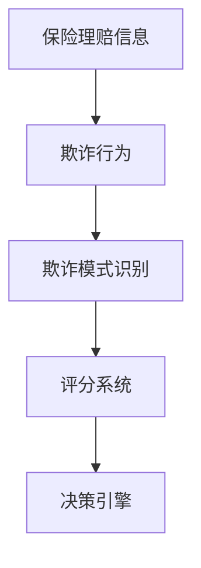
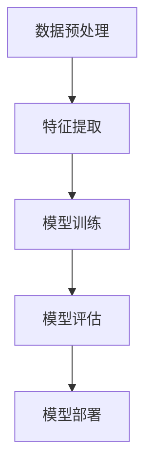
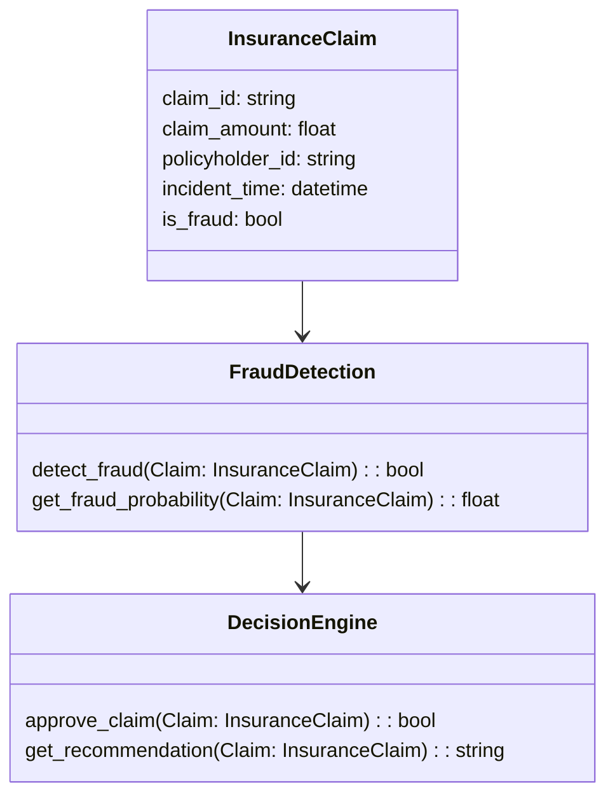
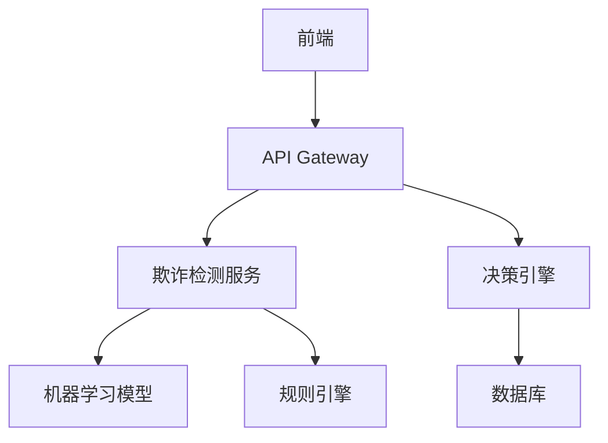
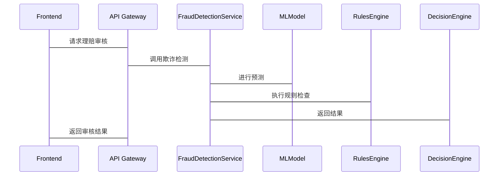

                 


# 智能保险理赔欺诈预防系统

## 关键词：保险欺诈预防, 人工智能, 机器学习, 系统架构, 风险控制

## 摘要：智能保险理赔欺诈预防系统利用人工智能和机器学习技术，通过分析保险理赔数据，识别潜在的欺诈行为，从而降低保险公司的财务风险和信誉损失。本文将从背景、原理、算法、架构、项目实现等多个方面详细阐述该系统的设计与应用，帮助读者全面理解如何构建一个高效、智能的保险欺诈预防系统。

---

# 第1章 智能保险理赔欺诈预防系统背景介绍

## 1.1 保险理赔欺诈问题背景

### 1.1.1 保险欺诈的定义与类型

保险欺诈是指通过故意制造或虚构保险事故，骗取保险金的行为。常见的保险欺诈类型包括：

- **夸大损失**：夸大事故损失，以获得更多的保险赔偿。
- **制造事故**：故意制造事故，如人为碰撞、纵火等，以骗取保险金。
- **重复索赔**：在同一事故中多次索赔，或针对同一损失多次提出索赔。
- **虚构事故**：编造不存在的事故，以获取保险赔偿。
- **投保人道德风险**：投保人故意制造风险，以获取保险赔偿。

### 1.1.2 保险欺诈对行业的影响

保险欺诈行为不仅增加了保险公司的赔付成本，还可能导致以下问题：

- **赔付成本增加**：欺诈行为导致保险公司支付更多的赔付款项。
- **保险费上升**：为了覆盖欺诈风险，保险公司需要提高保费，增加了投保人的经济负担。
- **信任危机**：欺诈行为会影响保险公司的声誉，降低客户信任度。
- **合规风险**：保险公司在处理欺诈案件时，可能会面临监管处罚。

### 1.1.3 传统保险理赔中的欺诈挑战

传统保险理赔流程依赖人工审核，存在以下问题：

- **效率低下**：人工审核耗时长，难以快速处理大量理赔案件。
- **主观性高**：审核人员的经验和判断影响欺诈检测的准确性。
- **漏判率高**：人工审核难以识别复杂的欺诈模式，导致漏判。

---

## 1.2 智能保险理赔欺诈预防系统的目标

### 1.2.1 系统的核心目标

智能保险理赔欺诈预防系统的核心目标是通过自动化技术，识别潜在的欺诈行为，降低保险公司的财务风险和信誉损失。

- **实时检测**：快速识别欺诈行为，避免资金损失。
- **精准识别**：通过机器学习模型，提高欺诈检测的准确性。
- **降低理赔成本**：自动化审核减少人工成本，提高效率。

### 1.2.2 系统的边界与外延

系统的边界包括：

- **输入**：保险理赔数据，包括事故信息、投保人信息、历史赔付记录等。
- **输出**：欺诈风险评分、欺诈行为预警、赔付建议。

系统的外延包括：

- **数据源**：整合多方数据，如交警事故记录、医疗记录、车辆维修记录等。
- **外部接口**：与保险公司系统、第三方数据源对接。

### 1.2.3 系统的预期效果与价值

- **提高欺诈检测准确率**：通过机器学习算法，显著提高欺诈识别的准确率。
- **降低理赔成本**：自动化审核减少人工成本，提高效率。
- **增强客户信任**：通过精准识别欺诈行为，减少虚假赔付，增强客户信任。

---

## 1.3 本章小结

本章介绍了保险欺诈的背景、类型及其对行业的影响，阐述了传统理赔流程中的欺诈挑战，并提出了智能保险理赔欺诈预防系统的目标、边界和价值。通过本章的分析，我们明确了构建智能欺诈预防系统的重要性。

---

# 第2章 智能保险理赔欺诈预防系统的核心概念与联系

## 2.1 欺诈预防的核心原理

### 2.1.1 基于机器学习的欺诈检测

机器学习通过分析历史数据，学习欺诈行为的特征，建立分类模型，识别潜在的欺诈行为。

- **监督学习**：使用已标注的欺诈和非欺诈数据，训练分类器。
- **无监督学习**：通过聚类分析，识别异常数据点。

### 2.1.2 基于规则的欺诈识别

基于规则的欺诈识别通过设定一系列业务规则，过滤出可疑的理赔案件。

- **规则来源**：包括行业经验、法律法规、业务逻辑。
- **规则执行**：通过编程实现，自动化检查理赔案件是否符合规则。

### 2.1.3 综合分析模型的构建

综合分析模型结合机器学习和规则，实现更准确的欺诈检测。

- **特征工程**：提取关键特征，如理赔金额、事故时间、投保人历史记录等。
- **模型融合**：结合多种模型的结果，提高准确率。

---

## 2.2 核心概念的属性特征对比

### 2.2.1 欺诈特征与非欺诈特征的对比

| 特征               | 欺诈特征          | 非欺诈特征        |
|--------------------|-------------------|-------------------|
| 理赔金额           | 远高于实际损失    | 接近实际损失       |
| 事故时间           | 集中在特定时间段  | 分布均匀          |
| 投保人历史记录     | 缺乏历史赔付记录  | 有正常赔付记录     |
| 维修记录           | 单一维修地点      | 多个维修地点       |

### 2.2.2 模型特征的可解释性分析

- **可解释性高**：规则模型易于解释，如“单次理赔金额超过保额的80%即为高风险”。
- **可解释性低**：机器学习模型（如随机森林）虽然准确率高，但难以解释具体决策逻辑。

### 2.2.3 数据特征的维度与权重

- **维度**：包括时间、地点、金额、投保人信息等多维度特征。
- **权重**：通过特征重要性分析，确定各特征对欺诈识别的贡献度。

---

## 2.3 ER实体关系图架构



该图展示了系统的核心实体及其关系，从保险理赔信息到欺诈行为识别，再到评分系统和决策引擎，体现了系统的整体架构。

---

## 2.4 本章小结

本章通过对比分析，明确了欺诈预防的核心原理，构建了系统的ER实体关系图，并对关键特征进行了详细对比和分析。

---

# 第3章 智能保险理赔欺诈预防系统的算法原理讲解

## 3.1 算法原理概述

### 3.1.1 基于监督学习的分类模型

- **逻辑回归**：适用于二分类问题，预测欺诈概率。
- **支持向量机（SVM）**：适用于高维数据，分类效果好。
- **随机森林**：通过集成学习，提高准确率和模型鲁棒性。

### 3.1.2 基于无监督学习的异常检测

- **K-Means聚类**：识别异常聚类。
- **Isolation Forest**：通过树状结构隔离异常点。

### 3.1.3 基于深度学习的特征提取

- **神经网络**：自动提取复杂特征，提升分类效果。

---

## 3.2 算法实现流程



流程图展示了从数据预处理到模型部署的完整流程。

---

## 3.3 算法实现代码示例

```python
# 示例代码：使用随机森林进行欺诈检测
import pandas as pd
from sklearn.ensemble import RandomForestClassifier
from sklearn.metrics import accuracy_score

# 加载数据
data = pd.read_csv('insurance_fraud.csv')

# 特征工程
features = data[['claim_amount', 'policyholder_age', 'incident_time']]
labels = data['is_fraud']

# 模型训练
model = RandomForestClassifier()
model.fit(features, labels)

# 预测与评估
 predictions = model.predict(features)
 print('Accuracy:', accuracy_score(labels, predictions))
```

---

## 3.4 数学模型与公式

### 3.4.1 逻辑回归模型

欺诈概率公式：
$$ P(y=1) = \frac{e^{\beta_0 + \beta_1x_1 + \beta_2x_2}}{1 + e^{\beta_0 + \beta_1x_1 + \beta_2x_2}} $$

### 3.4.2 随机森林模型

随机森林通过集成学习，公式化为：
$$ y = \text{sign}(\sum_{i=1}^{n} \text{Tree}(x)) $$

---

## 3.5 本章小结

本章详细讲解了系统中使用的算法原理，包括监督学习、无监督学习和深度学习方法，并通过代码示例和公式推导，帮助读者理解算法实现。

---

# 第4章 系统分析与架构设计方案

## 4.1 问题场景介绍

保险公司在理赔时面临欺诈风险，需要构建一个智能系统，实时检测欺诈行为，降低赔付风险。

## 4.2 项目介绍

### 4.2.1 项目目标

- 实现智能保险理赔欺诈预防系统。
- 提供高准确率的欺诈检测功能。

### 4.2.2 项目范围

- 数据来源：整合多渠道数据，包括理赔记录、投保人信息、第三方数据。
- 服务对象：保险公司、理赔人员、投保人。

## 4.3 系统功能设计

### 4.3.1 领域模型（Mermaid类图）



### 4.3.2 系统架构设计（Mermaid架构图）



### 4.3.3 接口设计

- **API Gateway**：接收前端请求，路由到后端服务。
- **欺诈检测服务**：提供欺诈检测接口，返回欺诈概率。
- **决策引擎**：根据欺诈概率，决定理赔结果。

### 4.3.4 交互设计（Mermaid序列图）



---

## 4.4 本章小结

本章从系统架构的角度，详细设计了智能保险理赔欺诈预防系统的功能、架构和接口，为后续的实现奠定了基础。

---

# 第5章 项目实战

## 5.1 环境安装

### 5.1.1 安装Python环境

```bash
# 安装Python
python --version
```

### 5.1.2 安装依赖库

```bash
pip install pandas scikit-learn mermaid4jupyter
```

## 5.2 系统核心实现源代码

### 5.2.1 数据预处理

```python
import pandas as pd

# 加载数据
data = pd.read_csv('insurance_fraud.csv')

# 处理缺失值
data = data.dropna()

# 标准化处理
from sklearn.preprocessing import StandardScaler
scaler = StandardScaler()
scaled_features = scaler.fit_transform(data[['claim_amount', 'policyholder_age']])
```

### 5.2.2 特征提取与模型训练

```python
from sklearn.ensemble import RandomForestClassifier

# 特征选择
features = data[['claim_amount', 'policyholder_age', 'incident_time']]
labels = data['is_fraud']

# 模型训练
model = RandomForestClassifier()
model.fit(features, labels)
```

### 5.2.3 模型评估

```python
from sklearn.metrics import classification_report

# 预测
predictions = model.predict(features)

# 评估
print(classification_report(labels, predictions))
```

## 5.3 实际案例分析

### 5.3.1 案例背景

某保险公司发现理赔金额异常增加，怀疑存在欺诈行为。

### 5.3.2 数据分析

通过系统检测，发现一批理赔记录集中在特定时间段，且理赔金额远高于实际损失。

### 5.3.3 模型预测

模型预测结果为高风险欺诈案件，建议进一步调查。

## 5.4 项目小结

通过本章的项目实战，我们展示了系统的实际应用，从数据预处理到模型训练，再到案例分析，详细讲解了系统的实现过程。

---

# 第6章 总结与展望

## 6.1 本章总结

智能保险理赔欺诈预防系统通过机器学习和人工智能技术，显著提高了欺诈检测的准确率和效率，降低了保险公司的财务风险。

## 6.2 未来展望

### 6.2.1 技术改进

- **模型优化**：引入深度学习模型，如LSTM，提高时间序列数据的分析能力。
- **实时监控**：实现实时数据流处理，快速识别潜在欺诈行为。

### 6.2.2 应用扩展

- **多险种支持**：扩展系统功能，支持车险、人寿险等多种险种的欺诈检测。
- **数据源扩展**：整合更多外部数据源，如医疗记录、地理位置数据，提高检测精度。

### 6.2.3 行业合作

- **数据共享**：建立行业数据共享机制，提升欺诈检测的准确性。
- **联合风控**：与第三方风控机构合作，构建更完善的风控体系。

---

## 作者

作者：AI天才研究院/AI Genius Institute & 禅与计算机程序设计艺术 /Zen And The Art of Computer Programming

---

以上内容是《智能保险理赔欺诈预防系统》的详细目录和部分内容概述，每个章节都按照逻辑顺序展开，确保读者能够系统地理解系统的构建和应用。

