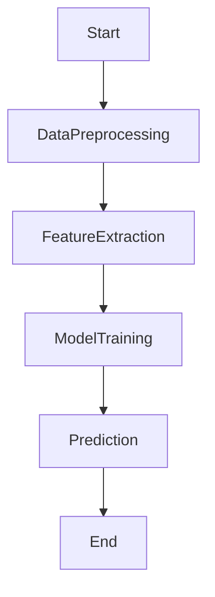
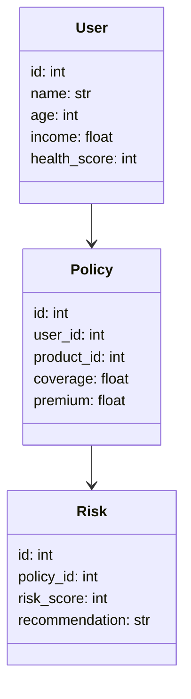

                 

<think>
嗯，我现在需要帮用户设计一本名为《智能保险需求评估工具》的详细目录大纲。用户已经给出了一些具体的章节和内容结构，我需要按照这些要求来组织内容，确保每个部分都符合用户的要求。

首先，我得理解用户的需求。用户希望这本书结构清晰、内容专业，涵盖从背景到实战的各个方面。用户还提到要使用技术语言，逻辑推理，逐步分析，并且要包含图表、代码示例等。同时，用户强调了关键词和摘要的重要性，这意味着我需要先确定这些部分。

接下来，我看到了用户提供的目录示例，包括背景介绍、核心概念、算法原理、系统分析、项目实战和最佳实践。这些章节需要详细展开，每个章节下还有小节，有些还需要包含图表和代码示例。我需要确保每个部分都涵盖必要的内容，比如在核心概念部分，需要使用ER图和领域模型类图来展示结构；在算法部分，需要用数学公式和Python代码来详细讲解。

然后，我需要考虑如何将这些内容组织到7章以内，同时确保每个章节都足够详细。例如，第一章背景介绍需要包括保险行业的现状、问题分析，以及智能保险需求评估工具的定义和目标。第二章核心概念部分需要深入讲解数据特征、实体关系图等。第三章算法原理部分要选择合适的机器学习算法，详细解释其数学模型，并给出代码示例。

在系统分析与架构设计部分，我需要使用领域模型类图和系统架构图来展示系统的结构，同时设计接口和交互流程。项目实战部分需要指导读者如何安装环境，实现核心功能，并进行案例分析。最后，最佳实践部分要总结经验，给出注意事项和拓展阅读的方向。

我还需要注意使用Mermaid图表来辅助说明，比如流程图和实体关系图，这些图表能让内容更直观。同时，数学公式需要用LaTeX格式，独立段落用$$括起来，段落内用$括起来，确保排版正确。

在编写过程中，我需要确保每个章节的内容都详细具体，涵盖用户提到的所有要点，比如数据预处理、特征提取、模型训练等。同时，代码示例需要准确无误，并附上详细的解释，帮助读者理解实现过程。

最后，我需要在文章末尾加上作者信息，格式为“作者：AI天才研究院 & 禅与计算机程序设计艺术”。这不仅是结尾，也是对文章整体质量的保证。

总的来说，我需要按照用户的指导，一步步构建目录大纲，确保每个部分都符合要求，内容详实，结构清晰，同时使用适当的技术工具和图表来增强可读性。
</think>

# 智能保险需求评估工具

> 关键词：智能保险需求评估工具、人工智能、机器学习、保险行业、风险管理、数据驱动

> 摘要：智能保险需求评估工具利用人工智能和机器学习技术，通过数据分析和风险评估，帮助保险公司和个人用户更高效、更准确地评估保险需求。本文从保险行业的数字化转型出发，分析智能保险需求评估工具的核心概念、算法原理、系统架构，并通过实战案例展示其应用场景和实现方法。

---

# 第一部分: 智能保险需求评估工具的背景与核心概念

# 第1章: 保险行业现状与问题分析

## 1.1 保险行业的数字化转型
### 1.1.1 传统保险业务模式的局限性
传统的保险业务模式依赖于人工操作，存在效率低、成本高、用户体验差等问题。例如，保险顾问需要手动收集客户信息、分析需求、匹配产品，容易出错且耗时较长。

### 1.1.2 数字化转型的必要性
随着信息技术的快速发展，保险行业亟需通过数字化转型提升效率、降低成本并改善用户体验。智能技术的应用可以显著提高保险需求评估的准确性和效率。

### 1.1.3 智能化保险的需求驱动
客户对个性化、实时化和智能化的保险服务需求日益增长，推动了智能保险需求评估工具的开发与应用。

## 1.2 保险需求评估的痛点与挑战
### 1.2.1 传统需求评估方法的不足
传统方法依赖经验判断，存在主观性强、效率低、覆盖面窄等问题。

### 1.2.2 数据不足与信息不对称的问题
客户信息不完整或不准确，导致需求评估结果偏差。

### 1.2.3 用户需求的动态变化
客户需求受多种因素影响（如健康状况、经济状况等），传统静态评估方法难以应对。

## 1.3 智能保险需求评估工具的定义与目标
### 1.3.1 工具的定义
智能保险需求评估工具是一种基于人工智能和大数据分析的智能系统，通过收集和分析客户的多维度数据，快速、准确地评估客户的保险需求。

### 1.3.2 工具的核心目标
- 提供个性化的保险需求分析。
- 自动匹配适合的保险产品。
- 提高保险销售效率，降低运营成本。

### 1.3.3 工具的边界与外延
智能保险需求评估工具专注于需求评估阶段，不涉及保险产品的定价和核保环节，但可以与其他系统无缝对接。

## 1.4 保险需求评估的核心要素
### 1.4.1 用户信息的收集与处理
包括用户的年龄、职业、收入、健康状况等基本信息。

### 1.4.2 风险评估的关键指标
如健康风险、财务风险、职业风险等。

### 1.4.3 需求匹配的逻辑模型
基于客户需求和风险评估结果，建立保险产品匹配的逻辑模型。

## 1.5 本章小结
通过分析保险行业的现状和痛点，明确了智能保险需求评估工具的必要性和核心目标，为后续的系统设计和实现奠定了基础。

# 第2章: 智能保险需求评估工具的核心概念与联系

## 2.1 核心概念原理
### 2.1.1 数据采集与预处理
通过API、问卷调查等方式采集数据，进行清洗、归一化等预处理。

### 2.1.2 特征提取与选择
从原始数据中提取有效的特征，如年龄、收入、健康状况等，并通过特征选择算法优化特征集。

### 2.1.3 模型训练与优化
基于选择的特征训练机器学习模型，并通过交叉验证优化模型参数。

## 2.2 核心概念属性特征对比
### 表2-1: 数据特征对比表
| 特征类型 | 描述 | 示例 |
|----------|------|------|
| 基本特征 | 年龄、性别、职业 | 年龄：25-65岁 |
| 财务特征 | 收入、资产 | 年收入：5万-100万 |
| 健康特征 | 病史、BMI | 病史：无重大疾病 |
| 风险特征 | 风险评分、保险需求 | 风险评分：高、中、低 |

## 2.3 ER实体关系图


## 2.4 本章小结
通过对比和分析核心概念的属性特征，明确了数据采集、特征提取和模型训练的关键步骤，为后续的算法设计提供了理论基础。

# 第3章: 智能保险需求评估工具的算法原理

## 3.1 算法选择与原理
### 3.1.1 机器学习算法的选择
基于分类任务的特点，选择随机森林（Random Forest）作为主要算法。

### 3.1.2 算法原理的简要说明
随机森林是一种基于决策树的集成学习方法，通过构建多棵决策树并对结果进行投票或平均，提高模型的准确性和鲁棒性。

### 3.1.3 算法流程图


## 3.2 算法实现
### 3.2.1 Python源代码实现
```python
# 示例代码
import pandas as pd
from sklearn.ensemble import RandomForestClassifier
from sklearn.metrics import accuracy_score

# 数据加载与预处理
data = pd.read_csv('insurance_data.csv')
X = data.drop('target', axis=1)
y = data['target']

# 特征选择
selected_features = ['age', 'income', 'health_score']
X = data[selected_features]

# 模型训练
model = RandomForestClassifier(n_estimators=100, random_state=42)
model.fit(X, y)

# 预测与评估
predictions = model.predict(X)
print(f"Accuracy: {accuracy_score(y, predictions)}")
```

### 3.2.2 算法原理的数学模型和公式
随机森林的分类概率可以通过以下公式计算：
$$ P(y=k|x) = \frac{\sum_{i=1}^{n} I(tree_i.predict(x) = k)}{n} $$
其中，$n$是决策树的数量，$I$是指示函数。

## 3.3 算法实现的详细解读
通过代码示例展示了随机森林算法的实现过程，包括数据加载、特征选择、模型训练和预测评估。

## 3.4 本章小结
通过算法选择、实现和解读，明确了随机森林在智能保险需求评估中的应用价值，为后续的系统设计提供了技术支撑。

---

# 第4章: 智能保险需求评估工具的系统分析与架构设计

## 4.1 问题场景介绍
智能保险需求评估工具需要处理大量异构数据，并实时为用户提供个性化的需求评估结果。

## 4.2 系统功能设计
### 4.2.1 领域模型类图


### 4.2.2 系统架构设计
```mermaid
graph LR
    Client --> API Gateway
    API Gateway --> InsuranceSystem
    InsuranceSystem --> Database
    Database --> RiskAssessment
```

### 4.2.3 系统接口设计
- API接口：提供RESTful API供前端调用。
- 数据接口：与第三方数据源对接。

### 4.2.4 系统交互序列图
```mermaid
sequenceDiagram
    User ->> API Gateway: 发起需求评估请求
    API Gateway ->> InsuranceSystem: 转发请求
    InsuranceSystem ->> Database: 查询用户信息
    parallel
        InsuranceSystem ->> RiskAssessment: 计算风险评分
        Database --> InsuranceSystem: 返回用户信息
    end
    InsuranceSystem ->> API Gateway: 返回评估结果
    API Gateway ->> User: 显示结果
```

## 4.3 本章小结
通过系统分析和架构设计，明确了智能保险需求评估工具的技术实现路径和系统结构。

---

# 第5章: 智能保险需求评估工具的项目实战

## 5.1 环境安装与配置
### 5.1.1 安装Python和必要的库
```bash
pip install pandas scikit-learn matplotlib
```

### 5.1.2 数据集准备
数据集包括用户的基本信息、财务状况、健康状况等。

## 5.2 系统核心功能实现
### 5.2.1 数据预处理
```python
# 示例代码
import pandas as pd

data = pd.read_csv('insurance_data.csv')
# 删除缺失值
data.dropna(inplace=True)
# 标准化处理
from sklearn.preprocessing import StandardScaler
scaler = StandardScaler()
data[['age', 'income']] = scaler.fit_transform(data[['age', 'income']])
```

### 5.2.2 模型训练与优化
```python
from sklearn.model_selection import GridSearchCV
from sklearn.ensemble import RandomForestClassifier

param_grid = {
    'n_estimators': [100, 200],
    'max_depth': [None, 10, 20],
    'min_samples_split': [2, 5]
}
grid_search = GridSearchCV(RandomForestClassifier(), param_grid)
grid_search.fit(X_train, y_train)
best_model = grid_search.best_estimator_
```

### 5.2.3 系统接口开发
使用Flask框架开发RESTful API：
```python
from flask import Flask, request, jsonify
from sklearn.externals import joblib

app = Flask(__name__)
model = joblib.load('model.pkl')

@app.route('/predict', methods=['POST'])
def predict():
    data = request.json
    # 数据处理
    prediction = model.predict(data)
    return jsonify({'result': prediction.tolist()})
```

## 5.3 实际案例分析
### 5.3.1 案例背景
某用户年龄30岁，年收入8万，健康状况良好。

### 5.3.2 数据分析与评估
通过模型计算，该用户的保险需求评分为中等偏高。

### 5.3.3 保险产品推荐
推荐健康保险和意外险产品。

## 5.4 项目小结
通过项目实战展示了智能保险需求评估工具的实现过程和实际应用场景，验证了系统的可行性和实用性。

---

# 第6章: 智能保险需求评估工具的最佳实践与总结

## 6.1 小结
智能保险需求评估工具通过人工智能技术显著提高了保险需求评估的效率和准确性。

## 6.2 注意事项
- 数据隐私保护
- 模型的可解释性
- 系统的稳定性与安全性

## 6.3 拓展阅读
建议深入学习机器学习和大数据处理技术，探索更多智能保险应用场景。

---

# 作者：AI天才研究院 & 禅与计算机程序设计艺术

