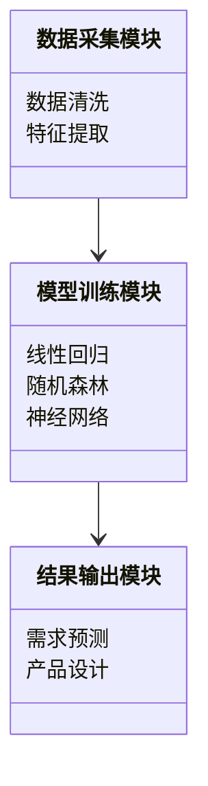

                 


# 智能保险需求预测与产品设计系统

> **关键词**：人工智能、保险需求预测、保险产品设计、机器学习、深度学习  
> **摘要**：智能保险需求预测与产品设计系统是一种基于人工智能技术的创新解决方案，旨在通过数据驱动的方法，利用机器学习和深度学习算法，准确预测保险需求，并自动化设计个性化保险产品。本文将详细探讨该系统的背景、核心概念、算法原理、系统架构、项目实战及最佳实践，为保险行业的数字化转型提供理论支持与实践指导。

---

## 第一章：智能保险需求预测与产品设计系统背景

### 1.1 保险行业数字化转型的背景
#### 1.1.1 保险行业的传统模式与痛点
保险行业作为传统金融行业的重要组成部分，长期依赖人工操作和经验判断。传统模式下，保险公司通过代理人或柜台服务收集客户需求，设计保险产品，并进行销售。这种方式效率低下，难以满足日益多样化的市场需求，同时存在以下痛点：
- **客户需求多样性**：传统产品难以覆盖个性化需求。
- **人工成本高**：依赖大量人工操作，效率低。
- **数据利用不足**：缺乏对海量数据的深度挖掘和利用。

#### 1.1.2 数字化转型的必要性
随着科技的发展，尤其是人工智能、大数据和云计算等技术的成熟，保险行业迎来了数字化转型的契机。通过智能化技术，保险公司可以更高效地收集、分析数据，并利用这些数据优化业务流程，提升客户体验。数字化转型不仅是行业发展的趋势，更是企业竞争力提升的必然选择。

#### 1.1.3 智能保险的核心概念与目标
智能保险是指利用人工智能技术，实现保险业务的智能化、自动化和个性化。其核心目标是通过数据驱动的方式，优化保险需求预测和产品设计流程，提升客户满意度和业务效率。

---

### 1.2 智能保险需求预测的背景与意义
#### 1.2.1 需求预测在保险业务中的重要性
需求预测是保险业务的核心环节之一。准确的需求预测可以帮助保险公司更好地规划产品策略，优化资源配置，降低经营风险。传统的需求预测方法依赖历史数据分析，但其准确性受限于数据质量和模型复杂度。

#### 1.2.2 传统需求预测方法的局限性
传统需求预测方法通常基于统计分析，如时间序列分析和回归分析。这些方法在处理非结构化数据（如文本、图像）和复杂场景时表现有限，难以应对市场的快速变化。

#### 1.2.3 智能化需求预测的优势与应用场景
智能化需求预测通过机器学习和深度学习算法，可以处理多维度数据，发现隐藏的模式和趋势。其应用场景包括：
- **市场趋势预测**：预测保险产品的市场需求变化。
- **客户行为分析**：基于客户行为数据，预测客户需求。
- **风险评估**：结合历史数据和实时数据，评估潜在风险。

---

### 1.3 智能保险产品设计的背景与挑战
#### 1.3.1 保险产品设计的传统流程
传统保险产品设计流程通常包括市场调研、需求分析、产品开发和测试等阶段。这一过程耗时长，且依赖人工经验，难以快速响应市场需求。

#### 1.3.2 智能化产品设计的创新点
智能化产品设计通过大数据和人工智能技术，可以实现个性化的产品推荐和定制化的产品设计。其创新点在于：
- **数据驱动**：利用客户数据进行个性化设计。
- **自动化**：通过算法自动生成产品方案。
- **动态调整**：根据市场变化实时优化产品。

#### 1.3.3 智能设计中的主要挑战
尽管智能化设计有诸多优势，但其应用也面临以下挑战：
- **数据质量**：数据的准确性和完整性直接影响设计结果。
- **模型复杂性**：复杂算法的可解释性和计算成本较高。
- **法律法规**：保险产品需符合相关法律法规，智能化设计需确保合规性。

---

### 1.4 本章小结
智能保险需求预测与产品设计系统是保险行业数字化转型的重要成果。通过人工智能技术，该系统能够实现高效的需求预测和自动化的产品设计，显著提升保险业务的效率和客户满意度。接下来，我们将深入探讨该系统的概念与原理。

---

## 第二章：智能保险需求预测与产品设计系统的概念与原理

### 2.1 智能保险需求预测的核心概念
#### 2.1.1 数据驱动的需求预测方法
数据驱动的需求预测方法依赖于海量数据的采集与分析。通过机器学习算法，可以预测未来的市场需求，帮助企业制定精准的产品策略。

#### 2.1.2 机器学习在需求预测中的应用
机器学习算法（如线性回归、随机森林）通过分析历史数据，识别影响需求的关键因素，从而实现需求预测。

#### 2.1.3 智能需求预测的系统架构
智能需求预测系统通常包括数据采集、特征提取、模型训练和结果输出四个模块。数据采集模块负责获取市场数据和客户信息，特征提取模块对数据进行处理，模型训练模块利用算法生成预测结果。

---

### 2.2 智能保险产品设计的核心概念
#### 2.2.1 数据驱动的产品设计理念
数据驱动的产品设计强调通过分析客户数据，了解客户需求，从而设计出更符合市场的产品。

#### 2.2.2 个性化产品设计的实现方法
个性化产品设计通过机器学习算法，根据客户需求生成定制化的产品方案。例如，利用自然语言处理技术分析客户需求文本，生成个性化保险产品。

#### 2.2.3 智能设计的系统架构
智能设计系统通常包括数据处理、模型训练和产品生成三个模块。数据处理模块对客户数据进行清洗和特征提取，模型训练模块利用深度学习算法生成产品设计方案。

---

### 2.3 系统的核心原理与技术
#### 2.3.1 数据采集与处理技术
数据采集技术包括API接口、网络爬虫等。数据处理技术包括数据清洗、特征提取和数据增强。

#### 2.3.2 机器学习算法的应用
常用的机器学习算法包括线性回归、支持向量机（SVM）、随机森林和梯度提升树（如XGBoost）。这些算法在需求预测和产品设计中广泛应用。

#### 2.3.3 系统的可扩展性与灵活性
智能保险系统的设计需要考虑可扩展性和灵活性。通过模块化设计和容器化部署，可以方便地扩展系统功能，适应市场需求的变化。

---

### 2.4 本章小结
智能保险需求预测与产品设计系统的核心在于数据驱动和机器学习技术。通过系统的架构设计，可以实现高效的需求预测和个性化的产品设计。下一章将详细探讨系统的算法原理。

---

## 第三章：智能保险需求预测与产品设计系统的算法原理

### 3.1 数据预处理与特征工程
#### 3.1.1 数据清洗与标准化
数据清洗包括去除缺失值、处理异常值和重复值。标准化技术（如归一化和标准化）用于处理不同特征的量纲差异。

#### 3.1.2 特征选择与提取
特征选择通过统计检验和模型评估方法，筛选出对目标变量影响较大的特征。特征提取技术（如主成分分析）用于降低数据维度。

#### 3.1.3 数据增强与降维
数据增强技术通过生成新的数据样本，增加数据集的多样性。降维技术（如t-SNE）用于降低数据维度，提升计算效率。

---

### 3.2 机器学习算法的选择与实现
#### 3.2.1 线性回归模型
线性回归是一种简单的回归算法，适用于线性关系较强的场景。其数学模型如下：
$$ y = \beta_0 + \beta_1x_1 + \beta_2x_2 + \ldots + \beta_nx_n + \epsilon $$
其中，$y$ 是目标变量，$x_i$ 是特征变量，$\beta_i$ 是回归系数，$\epsilon$ 是误差项。

#### 3.2.2 支持向量机（SVM）
支持向量机是一种强大的分类和回归算法。其核心思想是通过寻找最优超平面，实现数据的线性或非线性分类。

#### 3.2.3 随机森林与梯度提升树
随机森林是一种基于决策树的集成算法，通过随机采样和袋外验证提升模型的泛化能力。梯度提升树（如XGBoost和LightGBM）通过迭代优化，构建强分类器。

---

### 3.3 深度学习算法的应用
#### 3.3.1 神经网络基础
神经网络是一种模仿人脑结构的计算模型，包括输入层、隐藏层和输出层。其基本结构如下：
$$ y = f(xW + b) $$
其中，$x$ 是输入向量，$W$ 是权重矩阵，$b$ 是偏置向量，$f$ 是激活函数。

#### 3.3.2 卷积神经网络（CNN）
卷积神经网络适用于图像处理和序列数据的分析。其核心组件包括卷积层、池化层和全连接层。

#### 3.3.3 循序贯神经网络（RNN）
循环神经网络适用于时间序列数据的分析，如自然语言处理。其结构如下：
$$ s_t = f(s_{t-1}, x_t) $$
$$ y_t = g(s_t) $$
其中，$s_t$ 是隐藏状态，$x_t$ 是输入，$y_t$ 是输出。

---

### 3.4 本章小结
机器学习和深度学习算法为智能保险需求预测与产品设计系统提供了强大的技术支持。通过选择合适的算法和优化模型参数，可以显著提升系统的预测精度和设计效率。下一章将深入探讨系统的数学模型。

---

## 第四章：智能保险需求预测与产品设计系统的数学模型

### 4.1 线性回归模型
线性回归模型的损失函数为均方误差（MSE）：
$$ L = \frac{1}{n}\sum_{i=1}^n (y_i - \hat{y}_i)^2 $$
其中，$y_i$ 是真实值，$\hat{y}_i$ 是预测值。

### 4.2 随机森林模型
随机森林模型的预测结果是多个决策树的投票结果。其优势在于模型的鲁棒性和抗过拟合能力。

### 4.3 神经网络模型
神经网络模型的损失函数通常采用交叉熵损失：
$$ L = -\frac{1}{n}\sum_{i=1}^n [y_i \log p_i + (1 - y_i)\log (1 - p_i)] $$
其中，$p_i$ 是预测概率，$y_i$ 是真实标签。

---

### 4.4 本章小结
数学模型是智能保险系统的核心。通过选择合适的模型和优化算法，可以实现高精度的需求预测和产品设计。下一章将探讨系统的系统架构设计。

---

## 第五章：智能保险需求预测与产品设计系统的系统分析与架构设计

### 5.1 问题场景介绍
智能保险需求预测与产品设计系统需要解决以下问题：
- **数据采集**：如何高效地采集和处理客户数据？
- **模型训练**：如何选择和优化机器学习模型？
- **系统部署**：如何实现系统的高效运行和维护？

### 5.2 系统功能设计
系统功能设计包括数据采集、特征提取、模型训练和结果输出四个模块。其领域模型如下：


### 5.3 系统架构设计
系统架构设计采用分层架构，包括数据层、业务逻辑层和应用层。其架构图如下：


### 5.4 本章小结
系统架构设计是智能保险需求预测与产品设计系统实现的基础。通过合理的架构设计，可以确保系统的高效运行和可扩展性。下一章将通过实际案例展示系统的具体实现。

---

## 第六章：智能保险需求预测与产品设计系统的项目实战

### 6.1 环境安装与配置
项目实战需要以下环境：
- **Python**：3.6+
- **机器学习库**：scikit-learn、XGBoost、Keras
- **数据处理工具**：Pandas、NumPy

### 6.2 核心代码实现
以下是需求预测系统的实现代码：
```python
import pandas as pd
from sklearn.model_selection import train_test_split
from sklearn.ensemble import RandomForestRegressor
from sklearn.metrics import mean_absolute_error

# 数据加载
data = pd.read_csv('insurance.csv')

# 特征选择
features = data[['age', 'sex', 'bmi', 'children', 'smoker', 'region']]
target = data['charges']

# 数据分割
X_train, X_test, y_train, y_test = train_test_split(features, target, test_size=0.2, random_state=42)

# 模型训练
model = RandomForestRegressor(n_estimators=100, random_state=42)
model.fit(X_train, y_train)

# 模型预测
y_pred = model.predict(X_test)

# 模型评估
mae = mean_absolute_error(y_test, y_pred)
print(f"平均绝对误差: {mae}")
```

### 6.3 实际案例分析
以车险需求预测为例，利用随机森林模型进行需求预测。数据包括客户年龄、驾驶经验、车辆类型等特征。通过模型训练，可以预测未来一段时间内车险的需求量。

---

## 第七章：智能保险需求预测与产品设计系统的最佳实践与小结

### 7.1 系统特点总结
智能保险需求预测与产品设计系统的优点包括：
- **高精度**：通过机器学习算法实现高精度的需求预测。
- **个性化**：基于客户数据实现个性化的产品设计。
- **高效性**：自动化流程显著提升业务效率。

### 7.2 系统优缺点分析
- **优点**：提升效率，降低成本，提高客户满意度。
- **缺点**：模型复杂性高，数据依赖性强，法律法规风险。

### 7.3 注意事项与建议
- **数据质量管理**：确保数据的准确性和完整性。
- **模型选择与优化**：根据实际需求选择合适的算法，并进行调参优化。
- **合规性检查**：确保系统设计符合相关法律法规。

### 7.4 拓展阅读
- 《机器学习实战》
- 《深度学习》
- 《Python机器学习》

---

## 作者：AI天才研究院/AI Genius Institute & 禅与计算机程序设计艺术 /Zen And The Art of Computer Programming

---

以上是《智能保险需求预测与产品设计系统》的技术博客文章的详细内容，涵盖了系统背景、核心概念、算法原理、系统架构、项目实战及最佳实践。通过系统化的分析和具体的代码实现，为读者提供了全面的技术指导。

