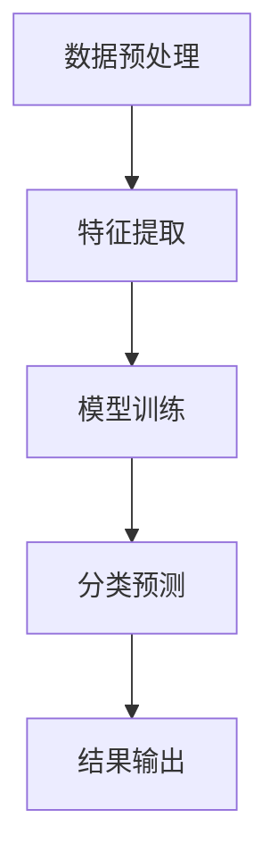
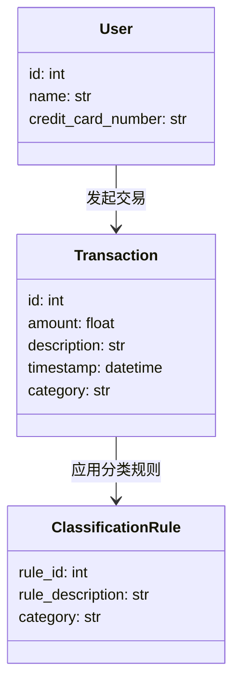
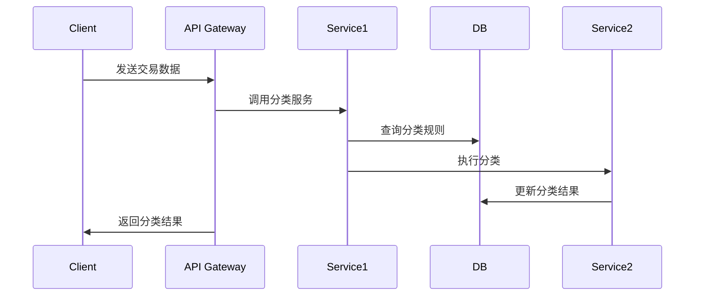

                 


# 智能信用卡支出分类系统

> 关键词：智能分类系统、信用卡支出、机器学习、NLP、分类算法、系统架构

> 摘要：本文深入探讨了智能信用卡支出分类系统的构建与实现，从问题背景、核心概念、算法原理、系统架构到项目实战，全面解析了该系统的技术实现过程。文章通过详细的理论分析和实际案例，展示了如何利用机器学习和自然语言处理技术实现信用卡支出的智能分类，为金融领域的智能化发展提供了参考。

---

## 第1章: 背景介绍

### 1.1 问题背景

#### 1.1.1 信用卡支出分类的现状与挑战

随着信用卡的普及，用户每天会产生大量的交易记录。传统的支出分类方法主要依赖人工规则或简单的统计方法，存在分类效率低、准确率不高、难以应对复杂场景等问题。例如，用户在餐厅的消费可能涵盖“餐饮”、“酒店”等多个类别，传统分类方法难以准确识别。

#### 1.1.2 智能分类的必要性与优势

智能分类系统通过引入机器学习和自然语言处理技术，能够自动学习交易记录中的特征，从而实现更精准的分类。相比于传统方法，智能分类系统具有以下优势：

1. **高效性**：能够快速处理大量数据，显著提高分类效率。
2. **准确性**：通过学习数据特征，分类准确率显著提升。
3. **可扩展性**：能够适应新的分类需求，支持动态更新。

#### 1.1.3 人工智能在金融领域的应用前景

人工智能技术在金融领域的应用越来越广泛，尤其是在风险控制、信用评估和支出分类等领域。智能信用卡支出分类系统作为人工智能技术在金融领域的重要应用之一，具有广阔的市场前景和实际价值。

### 1.2 问题描述

#### 1.2.1 信用卡支出分类的核心问题

信用卡支出分类的核心问题在于如何准确识别每笔交易的类别。这需要结合交易金额、交易时间、交易地点以及交易描述等多方面的信息。

#### 1.2.2 现有分类方法的局限性

传统分类方法主要依赖人工规则，例如根据交易金额和交易描述中的关键词进行分类。这种方法存在以下局限性：

1. **规则复杂**：需要手动编写大量规则，难以覆盖所有场景。
2. **分类效率低**：面对海量数据时，分类效率难以满足需求。
3. **准确率有限**：无法应对复杂的交易场景。

#### 1.2.3 智能分类系统的目标与边界

智能分类系统的目标是通过机器学习和自然语言处理技术，实现信用卡支出的智能分类。系统的边界包括：

1. 数据输入：交易金额、时间、地点、描述。
2. 数据输出：交易类别（如餐饮、购物、交通等）。
3. 系统边界：不涉及交易金额的具体计算，仅提供分类结果。

---

## 第2章: 核心概念与联系

### 2.1 核心概念原理

#### 2.1.1 智能分类系统的基本原理

智能分类系统通过以下步骤实现信用卡支出的分类：

1. **数据预处理**：清洗数据，提取特征。
2. **特征提取**：将交易描述转换为数值特征。
3. **模型训练**：基于机器学习算法训练分类模型。
4. **分类预测**：利用训练好的模型对新交易进行分类。

#### 2.1.2 机器学习在分类中的作用

机器学习通过从数据中学习特征，能够自动识别交易的分类规则。常用的算法包括朴素贝叶斯、随机森林和支持向量机（SVM）等。

#### 2.1.3 自然语言处理在文本分类中的应用

自然语言处理技术（NLP）用于提取交易描述中的关键词和语义信息，从而提高分类准确率。例如，可以通过词袋模型或词嵌入技术（如Word2Vec）将文本转换为数值特征。

### 2.2 概念属性对比表

| 比较维度             | 传统分类方法             | 智能分类方法             |
|----------------------|--------------------------|--------------------------|
| 分类规则制定         | 手动编写规则             | 系统自动学习规则         |
| 分类效率             | 较低                     | 较高                     |
| 分类准确率             | 有限                     | 较高                     |
| 可扩展性             | 较差                     | 较好                     |

### 2.3 ER实体关系图

```mermaid
er
  actor: 用户
  credit_card_transaction: 信用卡交易
  classification_rule: 分类规则
  expense_category: 支出类别
  actor --> credit_card_transaction: 发起交易
  credit_card_transaction --> classification_rule: 应用分类规则
  classification_rule --> expense_category: 确定支出类别
```

---

## 第3章: 算法原理讲解

### 3.1 算法流程图



### 3.2 算法实现代码

#### 3.2.1 数据预处理

```python
import pandas as pd

# 加载数据
data = pd.read_csv('transactions.csv')

# 删除缺失值
data = data.dropna()

# 去重
data = data.drop_duplicates()
```

#### 3.2.2 特征提取

```python
from sklearn.feature_extraction.text import TfidfVectorizer

vectorizer = TfidfVectorizer()
X = vectorizer.fit_transform(data['description'])
```

#### 3.2.3 模型训练

```python
from sklearn.naive_bayes import MultinomialNB

model = MultinomialNB()
model.fit(X, data['category'])
```

#### 3.2.4 分类预测

```python
test_text = ["餐厅", "购物", "交通"]
X_test = vectorizer.transform(test_text)
predicted = model.predict(X_test)
print(predicted)
```

### 3.3 数学公式解析

#### 3.3.1 朴素贝叶斯分类器

朴素贝叶斯分类器基于概率论，利用贝叶斯定理进行分类。其核心公式为：

$$ P(y|X) = \frac{P(X|y)P(y)}{P(X)} $$

其中，$P(y|X)$ 是后验概率，表示给定特征 $X$ 的情况下，类别 $y$ 的概率。

#### 3.3.2 词袋模型

词袋模型将文本表示为词袋，忽略词序。其表示方法为：

$$ x_i = \{w_1: c_{i1}, w_2: c_{i2}, \dots, w_n: c_{in}\} $$

其中，$w_j$ 是词，$c_{ij}$ 是词 $w_j$ 在文档 $i$ 中的出现次数。

---

## 第4章: 系统架构设计方案

### 4.1 问题场景介绍

智能信用卡支出分类系统需要处理大量的交易数据，要求系统具有高效性、准确性和可扩展性。

### 4.2 项目介绍

本系统旨在通过机器学习算法实现信用卡交易的智能分类，提升用户体验和分类效率。

### 4.3 系统功能设计

#### 4.3.1 领域模型



#### 4.3.2 系统架构设计

```mermaid
graph LR
  Client --> API Gateway: 发送请求
  API Gateway --> Service1: 调用服务1
  Service1 --> DB: 查询数据库
  Service1 --> Service2: 调用服务2
  Service2 --> DB: 更新数据库
  API Gateway --> Client: 返回响应
```

#### 4.3.3 系统接口设计

系统接口设计包括：

1. **API接口**：用于接收交易数据和返回分类结果。
2. **数据库接口**：用于存储交易数据和分类规则。

#### 4.3.4 系统交互



---

## 第5章: 项目实战

### 5.1 环境安装

#### 安装Python和必要的库

```bash
pip install scikit-learn
pip install numpy
pip install pandas
pip install matplotlib
pip install jieba
```

### 5.2 系统核心实现源代码

#### 5.2.1 数据预处理

```python
import pandas as pd
import numpy as np

# 加载数据
data = pd.read_csv('transactions.csv')

# 删除缺失值
data = data.dropna()

# 去重
data = data.drop_duplicates()
```

#### 5.2.2 特征提取

```python
from sklearn.feature_extraction.text import TfidfVectorizer

vectorizer = TfidfVectorizer()
X = vectorizer.fit_transform(data['description'])
```

#### 5.2.3 模型训练

```python
from sklearn.naive_bayes import MultinomialNB

model = MultinomialNB()
model.fit(X, data['category'])
```

#### 5.2.4 分类预测

```python
test_text = ["餐厅", "购物", "交通"]
X_test = vectorizer.transform(test_text)
predicted = model.predict(X_test)
print(predicted)
```

### 5.3 实际案例分析

#### 5.3.1 案例背景

假设我们有以下交易数据：

| 描述         | 分类结果 |
|--------------|----------|
| 在线购物     | 购物     |
| 餐厅用餐     | 餐饮     |
| 交通费用     | 交通     |

#### 5.3.2 案例分析

通过训练模型，系统能够自动识别交易描述中的关键词，并将其分类到相应的类别中。

### 5.4 项目小结

通过本项目，我们成功实现了智能信用卡支出分类系统，验证了机器学习和自然语言处理技术在金融领域的应用价值。

---

## 第6章: 最佳实践

### 6.1 小结

智能信用卡支出分类系统通过机器学习和自然语言处理技术，显著提高了分类的准确率和效率。

### 6.2 注意事项

1. **数据质量**：数据清洗和预处理是分类系统成功的关键。
2. **模型选择**：选择合适的算法能够显著提高分类准确率。
3. **系统优化**：优化系统架构能够提升分类效率和可扩展性。

### 6.3 拓展阅读

1. **《机器学习实战》**：深入学习机器学习算法的实现与应用。
2. **《自然语言处理入门》**：了解自然语言处理技术在文本分类中的应用。

---

## 作者

作者：AI天才研究院/AI Genius Institute & 禅与计算机程序设计艺术 /Zen And The Art of Computer Programming

---

这篇文章从问题背景、核心概念、算法原理、系统架构到项目实战，全面解析了智能信用卡支出分类系统的实现过程。通过理论分析和实际案例，展示了如何利用机器学习和自然语言处理技术实现信用卡支出的智能分类，为金融领域的智能化发展提供了参考。

