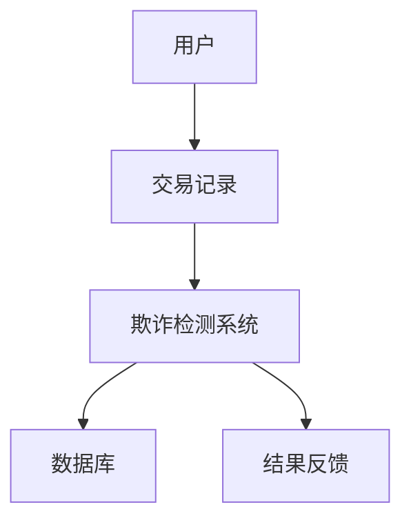

                 


# 智能信用卡欺诈检测系统

## 关键词
智能信用卡，欺诈检测，机器学习，深度学习，实时检测

## 摘要
智能信用卡欺诈检测系统通过机器学习和深度学习技术，实时分析交易数据，识别潜在的欺诈行为，保护用户和金融机构的财产安全。本文从背景、技术原理到系统架构，详细探讨了欺诈检测的各个方面，并通过实际案例展示系统的实现与应用。

---

## 第1章: 信用卡欺诈检测的背景与挑战

### 1.1 信用卡欺诈问题的背景
#### 1.1.1 信用卡欺诈的定义与现状
信用卡欺诈是指通过非法手段获取他人信用卡信息，进行未经授权的交易。随着电子商务的普及，欺诈手段日益复杂，从简单的身份盗窃到复杂的社交工程攻击，给用户和金融机构带来巨大损失。

#### 1.1.2 欺诈行为的类型与特征
常见的欺诈类型包括：
- 伪卡交易：使用盗取的卡号进行实体交易。
- 网上欺诈：通过网络钓鱼、恶意软件窃取卡号进行交易。
- 账户盗用：未经授权使用他人账户进行交易。
- 虚假申请：使用虚假身份申请信用卡并进行欺诈交易。

特征包括高交易频率、异常交易地点、非正常消费时间等。

#### 1.1.3 传统欺诈检测方法的局限性
传统方法依赖规则和专家经验，难以应对新型欺诈手段。例如，基于阈值的检测方法容易被绕过，且误报率较高。

### 1.2 智能检测技术的发展与应用
人工智能技术的发展使欺诈检测更加智能化。机器学习和深度学习算法能够从海量数据中提取复杂特征，识别潜在的欺诈行为。

### 1.3 系统目标与功能概述
系统目标是实时检测欺诈交易，减少损失。主要功能包括数据采集、特征提取、模型训练、实时检测和结果反馈。

### 1.4 行业影响与社会价值
智能检测系统能有效降低欺诈发生率，保护用户隐私，提升金融机构的信誉和客户满意度。

---

## 第2章: 智能欺诈检测的核心概念

### 2.1 智能检测的核心概念
智能检测基于机器学习模型，通过分析交易数据中的异常行为，识别欺诈交易。

### 2.2 关键技术
- 数据预处理：清洗、特征提取。
- 特征工程：构建有效的特征集，如时间间隔、交易金额、地理位置等。
- 模型选择：使用随机森林、XGBoost等算法。

### 2.3 ER实体关系图
```mermaid
er
entity: 用户
entity: 交易
entity: 欺诈行为
```

---

## 第3章: 算法原理与实现

### 3.1 传统机器学习算法
#### 3.1.1 决策树
决策树通过特征分裂构建树状结构，预测交易是否欺诈。代码示例：
```python
from sklearn.tree import DecisionTreeClassifier
model = DecisionTreeClassifier()
model.fit(X_train, y_train)
```

#### 3.1.2 随机森林
随机森林通过集成多个决策树提高准确性：
```python
from sklearn.ensemble import RandomForestClassifier
model = RandomForestClassifier(n_estimators=100)
model.fit(X_train, y_train)
```

### 3.2 深度学习算法
#### 3.2.1 神经网络模型
神经网络通过多层感知机捕捉复杂特征：
```python
import tensorflow as tf
model = tf.keras.Sequential([
    tf.keras.layers.Dense(64, activation='relu'),
    tf.keras.layers.Dense(1, activation='sigmoid')
])
model.compile(optimizer='adam', loss='binary_crossentropy')
model.fit(X_train, y_train, epochs=10)
```

---

## 第4章: 系统分析与架构设计

### 4.1 系统架构


### 4.2 接口设计
系统提供API接口，接收交易数据并返回欺诈结果：
```python
from flask import Flask, request, jsonify

app = Flask(__name__)

@app.route('/detect', methods=['POST'])
def detect_fraud():
    data = request.json
    # 处理数据
    return jsonify({'result': 'fraud' if is_fraud(data) else 'normal'})
```

---

## 第5章: 项目实战

### 5.1 环境搭建
安装必要的库：
```bash
pip install pandas scikit-learn tensorflow keras flask
```

### 5.2 核心实现
特征工程和模型训练：
```python
import pandas as pd
from sklearn.model_selection import train_test_split

data = pd.read_csv('transactions.csv')
X = data.drop('is_fraud', axis=1)
y = data['is_fraud']

X_train, X_test, y_train, y_test = train_test_split(X, y, test_size=0.2)
model.fit(X_train, y_train)
```

### 5.3 实际案例分析
通过真实案例分析模型的表现，调整参数优化效果。

---

## 第6章: 总结与展望

### 6.1 系统总结
总结系统设计、实现和效果，突出其优势。

### 6.2 优缺点分析
优点：高准确率、实时性；缺点：计算资源消耗大。

### 6.3 未来展望
探讨更先进的算法，如图神经网络，提升检测效率。

---

## 作者
作者：AI天才研究院 & 禅与计算机程序设计艺术

---

本文通过系统化的分析和实践，深入探讨了智能信用卡欺诈检测系统的设计与实现，为金融机构提供了有效的解决方案。

