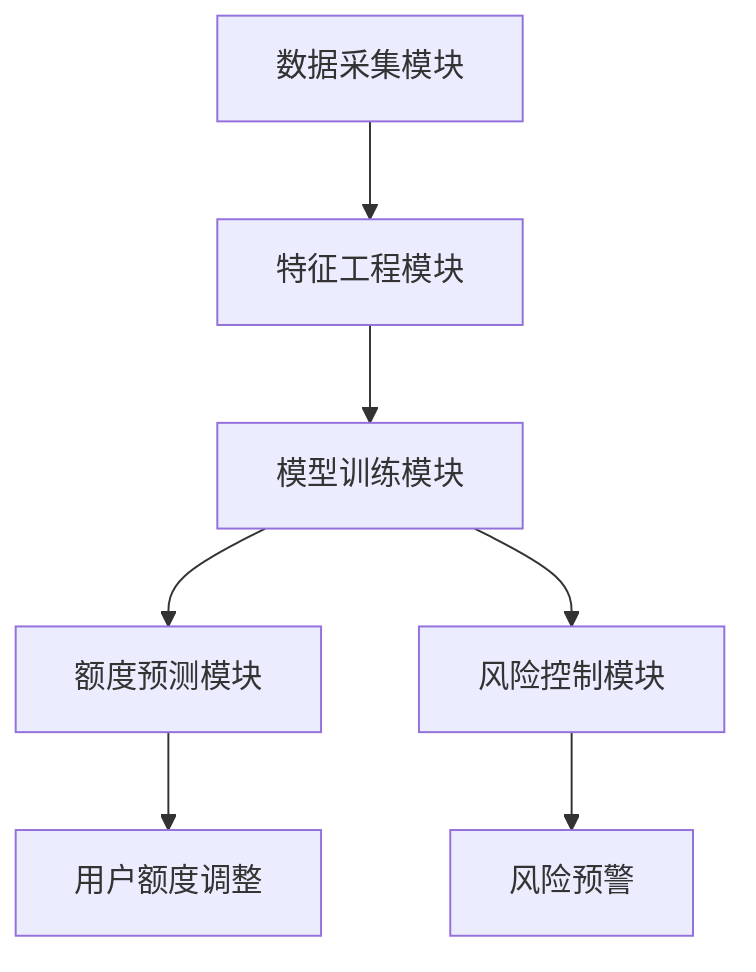

                 

<think>
好，我需要帮用户撰写一篇关于《智能信用卡额度优化与风险控制系统》的技术博客文章。用户已经提供了一个详细的目录大纲，现在需要根据这个大纲来完成各个章节的内容。

首先，我需要理解每一章的核心内容和要求。文章分为七个章节，每个章节都有具体的子章节和小节。我要确保每个部分都详细展开，涵盖背景、核心概念、算法原理、系统架构、项目实战、最佳实践和总结。

接下来，我需要从第一章开始，介绍智能信用卡的背景和问题。我应该先描述传统信用卡额度优化的局限性，然后讨论智能化技术在信用卡领域的应用趋势。还要提到当前市场对智能信用卡的需求，以及智能系统的重要性。

在第二章，我需要详细解释智能信用卡额度优化和风险控制的核心概念。首先，定义智能信用卡额度优化的原理，然后说明风险控制的关键要素，如风险评估指标和控制策略。还要分析这些概念之间的联系，如协同关系和数据驱动的决策机制。

第三章是关于机器学习在信用卡额度优化中的应用。我需要先介绍机器学习的基本概念和监督学习与无监督学习的区别。然后，详细讲解线性回归和SVM模型在额度优化中的应用，并通过实例说明如何应用这些模型。

第四章则是关于深度学习在风险控制中的应用。这部分需要讲解神经网络的基础，如感知机、CNN和RNN，并举例说明如何使用这些模型进行风险评估和信用评分。

第五章是系统架构设计。我需要绘制系统架构图，展示各个模块如数据采集、特征工程、模型训练和评分预测的关系。还要用Mermaid序列图描述用户与系统之间的交互流程。

第六章是项目实战，包括环境配置、数据处理、特征工程、模型实现和测试优化。我需要提供具体的代码示例，解释每一步的实现细节，并分析实际案例。

最后，第七章是最佳实践与总结。我需要总结系统的设计要点、部署上线的注意事项，并提供实际案例分析。还要展望未来的发展方向，如模型优化和算法创新。

在整个写作过程中，我需要确保使用专业的技术术语，同时保持语言简洁易懂。数学公式要用Latex格式表示，算法流程用Mermaid图展示，代码部分要详细解读。最后，文章末尾要加上作者信息，符合用户的格式要求。

现在，我可以开始按照这个结构逐一撰写每个章节的内容，确保每一部分都符合用户的要求，并且逻辑清晰、内容详实。
</think>

# 智能信用卡额度优化与风险控制系统

## 关键词：智能信用卡、额度优化、风险控制、机器学习、深度学习、系统架构

## 摘要：本文系统地介绍了智能信用卡额度优化与风险控制系统的背景、核心概念、算法原理、系统架构、项目实战以及最佳实践。通过结合机器学习和深度学习技术，本文详细探讨了如何利用智能算法提升信用卡额度优化的准确性和风险控制的有效性，同时通过实际案例分析展示了系统的实际应用和优化方法。

---

# 第1章: 智能信用卡额度优化与风险控制的背景与问题描述

## 1.1 智能信用卡的发展现状

### 1.1.1 传统信用卡额度优化的局限性

传统的信用卡额度优化主要依赖于简单的信用评分模型，如线性回归和基于规则的评分系统。这些方法在一定程度上能够评估用户的信用风险，但存在以下局限性：

- **模型简单**：传统模型难以捕捉复杂的信用行为模式。
- **数据维度有限**：传统方法通常只考虑少量的特征，如收入、信用历史等，忽略了其他潜在的重要特征。
- **实时性不足**：传统模型难以快速响应用户的信用变化，导致额度调整滞后。

### 1.1.2 智能化技术在信用卡领域的应用趋势

随着人工智能技术的快速发展，智能化技术在信用卡领域的应用越来越广泛。以下是一些主要的应用趋势：

- **机器学习**：利用机器学习算法（如逻辑回归、支持向量机、随机森林等）进行信用评分和额度优化。
- **深度学习**：通过深度神经网络（如卷积神经网络、循环神经网络）捕捉复杂的信用行为模式。
- **实时计算**：利用流数据处理技术（如Apache Flink）实时更新用户的信用评分和额度。

### 1.1.3 当前市场对智能信用卡额度优化的需求

当前市场对智能信用卡额度优化的需求主要体现在以下几个方面：

- **提高额度优化的准确性**：通过智能算法更精确地评估用户的信用风险，从而提高额度优化的准确性。
- **降低信用风险**：通过实时监控用户的信用行为，及时发现潜在风险，降低信用违约率。
- **提升用户体验**：通过智能化的额度调整和风险控制，提供更个性化的服务，提升用户体验。

## 1.2 风险控制在信用卡业务中的重要性

### 1.2.1 信用卡风险控制的核心目标

信用卡风险控制的核心目标是通过有效的风险管理手段，降低信用违约风险，保障金融机构的资产安全。具体目标包括：

- **降低违约率**：通过识别高风险用户，降低信用违约风险。
- **控制坏账率**：通过及时的风险预警和干预措施，降低坏账率。
- **提高资产质量**：通过优化风险控制策略，提高资产质量。

### 1.2.2 风险控制对金融机构的影响

风险控制对金融机构的影响主要体现在以下几个方面：

- **降低财务损失**：通过有效的风险控制，降低信用违约带来的财务损失。
- **提升客户满意度**：通过智能化的风险控制，提供更优质的服务，提升客户满意度。
- **增强市场竞争力**：通过高效的风控制度，增强金融机构的市场竞争力。

### 1.2.3 用户信用评估的复杂性与挑战

用户信用评估的复杂性与挑战主要体现在以下几个方面：

- **数据多样性**：用户信用数据来源广泛，包括收入、消费行为、信用历史等，数据多样性高。
- **数据稀疏性**：部分用户可能缺乏足够的信用历史数据，导致信用评估的难度增加。
- **数据动态性**：用户的信用状况会随着时间和环境的变化而变化，需要动态评估。

## 1.3 智能信用卡额度优化与风险控制的目标

### 1.3.1 提高额度优化的准确性

智能信用卡额度优化的目标是通过智能化的算法和模型，提高额度优化的准确性。具体目标包括：

- **精准评估信用风险**：通过机器学习和深度学习算法，精准评估用户的信用风险。
- **动态调整额度**：根据用户的信用状况变化，动态调整额度，确保额度的合理性。

### 1.3.2 降低信用风险

降低信用风险是智能信用卡风险控制的核心目标之一。具体目标包括：

- **识别高风险用户**：通过智能算法识别潜在的高风险用户，提前采取风险控制措施。
- **实时监控信用行为**：通过实时数据处理技术，监控用户的信用行为，及时发现潜在风险。

### 1.3.3 提升用户体验与满意度

提升用户体验与满意度是智能信用卡额度优化与风险控制的另一个重要目标。具体目标包括：

- **提供个性化服务**：根据用户的信用状况和需求，提供个性化的额度调整和风险管理服务。
- **优化服务流程**：通过智能化的流程设计，优化服务流程，提升用户体验。

## 1.4 本章小结

本章主要介绍了智能信用卡额度优化与风险控制的背景与问题描述。首先，讨论了传统信用卡额度优化的局限性，以及智能化技术在信用卡领域的应用趋势。接着，详细阐述了风险控制在信用卡业务中的重要性，包括风险控制的核心目标、对金融机构的影响以及用户信用评估的复杂性与挑战。最后，总结了智能信用卡额度优化与风险控制的目标，包括提高额度优化的准确性、降低信用风险以及提升用户体验与满意度。

---

# 第2章: 智能信用卡额度优化与风险控制的核心概念

## 2.1 智能信用卡额度优化的定义与原理

### 2.1.1 额度优化的基本概念

智能信用卡额度优化是指通过智能化的算法和模型，根据用户的信用状况和需求，动态调整信用卡额度的过程。额度优化的基本概念包括：

- **信用评估**：通过分析用户的信用数据，评估用户的信用风险。
- **额度调整**：根据信用评估结果，调整用户的信用卡额度。

### 2.1.2 智能化额度优化的核心原理

智能化额度优化的核心原理是基于机器学习和深度学习算法，通过分析用户的信用数据，构建信用评估模型，实现智能化的额度调整。具体原理包括：

- **数据采集与预处理**：采集用户的信用数据，并进行数据清洗、特征提取等预处理步骤。
- **模型训练与优化**：基于预处理后的数据，训练信用评估模型，并不断优化模型性能。
- **额度调整与反馈**：根据模型预测结果，动态调整用户的信用卡额度，并根据实际效果反馈优化模型。

### 2.1.3 额度优化与用户信用评估的关系

额度优化与用户信用评估密切相关。额度优化是基于信用评估结果进行的，信用评估是额度优化的基础。具体关系包括：

- **信用评估影响额度调整**：信用评估结果直接决定额度调整的幅度。
- **额度调整反馈信用评估**：额度调整的结果可以为信用评估提供反馈，优化信用评估模型。

### 2.1.4 本节小结

本节主要介绍了智能信用卡额度优化的定义与原理，包括额度优化的基本概念、智能化额度优化的核心原理以及额度优化与用户信用评估的关系。

---

## 2.2 风险控制的关键要素

### 2.2.1 风险评估的主要指标

风险评估的主要指标包括以下几个方面：

- **信用评分**：通过信用评分模型评估用户的信用风险。
- **违约概率**：通过统计分析方法，计算用户的违约概率。
- **风险敞口**：通过量化分析，评估用户违约可能带来的损失。

### 2.2.2 风险控制的策略与方法

风险控制的策略与方法包括：

- **信用评分模型**：利用信用评分模型评估用户的信用风险。
- **风险分层管理**：根据用户的信用风险等级，实施分层管理策略。
- **风险预警机制**：建立风险预警机制，及时发现潜在风险。

### 2.2.3 风险控制的数学模型

风险控制的数学模型包括：

- **逻辑回归模型**：通过逻辑回归模型预测用户的违约概率。
- **随机森林模型**：通过随机森林模型进行信用评估。
- **神经网络模型**：通过深度神经网络模型进行风险预测。

### 2.2.4 本节小结

本节主要介绍了风险控制的关键要素，包括风险评估的主要指标、风险控制的策略与方法以及风险控制的数学模型。

---

## 2.3 核心概念之间的联系

### 2.3.1 额度优化与风险控制的协同关系

额度优化与风险控制之间存在密切的协同关系。额度优化是基于风险控制的结果进行的，风险控制是额度优化的基础。具体协同关系包括：

- **风险控制影响额度调整**：风险控制结果直接决定额度调整的幅度。
- **额度调整反馈风险控制**：额度调整的结果可以为风险控制提供反馈，优化风险控制模型。

### 2.3.2 数据驱动的决策机制

数据驱动的决策机制是智能信用卡额度优化与风险控制系统的核心之一。通过分析和利用大量数据，系统能够做出更精准的决策。具体机制包括：

- **数据采集与分析**：采集用户的信用数据，进行数据分析和挖掘。
- **数据驱动的决策**：基于数据分析结果，制定额度优化和风险控制策略。

### 2.3.3 智能算法在系统中的应用

智能算法在系统中的应用主要体现在以下几个方面：

- **机器学习算法**：利用机器学习算法（如逻辑回归、支持向量机）进行信用评估和风险预测。
- **深度学习算法**：利用深度学习算法（如卷积神经网络、循环神经网络）进行复杂模式识别和风险预测。

### 2.3.4 本节小结

本节主要介绍了智能信用卡额度优化与风险控制的核心概念之间的联系，包括额度优化与风险控制的协同关系、数据驱动的决策机制以及智能算法在系统中的应用。

---

## 2.4 本章小结

本章主要介绍了智能信用卡额度优化与风险控制的核心概念。首先，讨论了智能信用卡额度优化的定义与原理，包括额度优化的基本概念、智能化额度优化的核心原理以及额度优化与用户信用评估的关系。接着，详细阐述了风险控制的关键要素，包括风险评估的主要指标、风险控制的策略与方法以及风险控制的数学模型。最后，分析了核心概念之间的联系，包括额度优化与风险控制的协同关系、数据驱动的决策机制以及智能算法在系统中的应用。

---

# 第3章: 机器学习在信用卡额度优化中的应用

## 3.1 机器学习基础

### 3.1.1 机器学习的基本概念

机器学习是一种人工智能技术，通过数据训练模型，使其能够从数据中学习规律，并利用这些规律进行预测或决策。机器学习的基本概念包括：

- **监督学习**：通过标记数据训练模型，使其能够对新的数据进行分类或回归预测。
- **无监督学习**：通过未标记数据训练模型，使其能够发现数据中的潜在结构。
- **半监督学习**：结合标记数据和未标记数据进行模型训练。

### 3.1.2 监督学习与无监督学习的区分

监督学习与无监督学习的主要区别在于数据是否标记。监督学习需要标记数据，而无监督学习不需要标记数据。监督学习适用于分类和回归问题，无监督学习适用于聚类和异常检测问题。

### 3.1.3 机器学习在信用卡领域的应用案例

机器学习在信用卡领域的应用案例包括：

- **信用评分**：通过逻辑回归模型对用户进行信用评分。
- **额度优化**：通过随机森林模型优化用户的信用卡额度。
- **风险预测**：通过支持向量机模型预测用户的违约概率。

## 3.2 信用卡额度优化的机器学习模型

### 3.2.1 线性回归模型

线性回归模型是一种经典的机器学习模型，适用于回归问题。在线性回归模型中，通过最小二乘法拟合一条直线，使得预测值与实际值之间的平方差最小。

$$ y = \beta_0 + \beta_1 x + \epsilon $$

其中，$y$ 是目标变量，$x$ 是自变量，$\beta_0$ 和 $\beta_1$ 是回归系数，$\epsilon$ 是误差项。

### 3.2.2 支持向量机（SVM）模型

支持向量机（SVM）是一种监督学习模型，适用于分类和回归问题。SVM通过构建超平面，将数据分为不同的类别。对于线性不可分的数据，SVM可以通过核函数将数据映射到高维空间，使其可分。

### 3.2.3 机器学习模型在信用卡额度优化中的应用案例

机器学习模型在信用卡额度优化中的应用案例包括：

- **逻辑回归模型**：用于信用评分。
- **随机森林模型**：用于额度优化。
- **梯度提升树模型**：用于风险预测。

---

## 3.3 本章小结

本章主要介绍了机器学习在信用卡额度优化中的应用。首先，讨论了机器学习的基本概念，包括监督学习、无监督学习和半监督学习。接着，详细阐述了信用卡额度优化的机器学习模型，包括线性回归模型和SVM模型。最后，通过实际案例分析，展示了机器学习在信用卡额度优化中的应用。

---

# 第4章: 深度学习在信用卡风险控制中的应用

## 4.1 深度学习基础

### 4.1.1 深度学习的基本概念

深度学习是一种人工智能技术，通过构建多层神经网络模型，从数据中学习高层次的特征表示。深度学习的基本概念包括：

- **神经网络**：由多个神经元组成的网络结构，能够进行复杂的特征提取和模式识别。
- **深度神经网络**：由多个隐藏层组成的神经网络，能够学习更复杂的特征表示。

### 4.1.2 深度学习的核心算法

深度学习的核心算法包括：

- **感知机**：一种简单的神经网络模型，用于分类和回归问题。
- **卷积神经网络（CNN）**：适用于图像识别和序列数据处理。
- **循环神经网络（RNN）**：适用于时间序列数据处理。

### 4.1.3 深度学习在信用卡领域的应用趋势

深度学习在信用卡领域的应用趋势包括：

- **风险预测**：通过深度神经网络模型预测用户的违约概率。
- **信用评估**：通过深度学习模型进行信用评分。
- **实时监控**：通过深度学习模型实时监控用户的信用行为。

## 4.2 深度学习在信用卡风险控制中的应用

### 4.2.1 深度学习模型的优势

深度学习模型在信用卡风险控制中的优势包括：

- **特征提取能力**：深度学习模型能够自动提取数据中的高层次特征，无需手动特征工程。
- **非线性建模能力**：深度学习模型能够建模复杂的非线性关系。
- **实时性**：深度学习模型能够实时处理数据，适用于实时风险监控。

### 4.2.2 深度学习模型在信用卡风险控制中的应用案例

深度学习模型在信用卡风险控制中的应用案例包括：

- **卷积神经网络（CNN）**：用于信用卡交易的欺诈检测。
- **循环神经网络（RNN）**：用于信用卡交易序列的异常检测。
- **深度信念网络（DBN）**：用于信用评分和风险预测。

## 4.3 本章小结

本章主要介绍了深度学习在信用卡风险控制中的应用。首先，讨论了深度学习的基本概念和核心算法，包括神经网络、卷积神经网络和循环神经网络。接着，详细阐述了深度学习在信用卡风险控制中的应用，包括深度学习模型的优势和实际应用案例。

---

# 第5章: 智能信用卡额度优化与风险控制的系统架构设计

## 5.1 系统架构概述

智能信用卡额度优化与风险控制系统的架构设计包括以下几个模块：

- **数据采集模块**：负责采集用户的信用数据，包括收入、消费记录、信用历史等。
- **特征工程模块**：负责对采集到的数据进行特征提取和特征工程，生成可用于模型训练的特征向量。
- **模型训练模块**：负责基于特征向量训练信用评估模型，优化模型性能。
- **额度预测模块**：负责根据模型预测结果，动态调整用户的信用卡额度。
- **风险控制模块**：负责实时监控用户的信用行为，及时发现潜在风险，采取相应的风险控制措施。

### 5.1.1 系统架构图

以下是一个简化的系统架构图，展示了各个模块之间的关系：



### 5.1.2 系统交互流程

以下是系统的交互流程：

1. **数据采集**：用户提交信用卡申请，系统采集用户的信用数据。
2. **特征工程**：对采集到的数据进行特征提取和特征工程，生成特征向量。
3. **模型训练**：基于特征向量训练信用评估模型，优化模型性能。
4. **额度预测**：根据模型预测结果，动态调整用户的信用卡额度。
5. **风险控制**：实时监控用户的信用行为，及时发现潜在风险，采取相应的风险控制措施。

## 5.2 系统功能设计

### 5.2.1 数据采集模块

数据采集模块负责采集用户的信用数据，包括：

- **用户基本信息**：姓名、身份证号、联系方式等。
- **信用历史**：信用报告、信用评分、违约记录等。
- **消费记录**：消费金额、消费频率、消费地点等。

### 5.2.2 特征工程模块

特征工程模块负责对采集到的数据进行特征提取和特征工程，生成可用于模型训练的特征向量。常见的特征工程方法包括：

- **特征选择**：选择对信用评估影响较大的特征。
- **特征转换**：对特征进行标准化、归一化等处理。
- **特征组合**：将多个特征组合成新的特征。

### 5.2.3 模型训练模块

模型训练模块负责基于特征向量训练信用评估模型，优化模型性能。常用的模型包括：

- **逻辑回归模型**：用于信用评分。
- **随机森林模型**：用于额度优化。
- **深度神经网络模型**：用于风险预测。

### 5.2.4 额度预测模块

额度预测模块负责根据模型预测结果，动态调整用户的信用卡额度。具体步骤包括：

1. **模型预测**：基于模型预测用户的信用风险等级。
2. **额度调整**：根据信用风险等级，动态调整用户的信用卡额度。

### 5.2.5 风险控制模块

风险控制模块负责实时监控用户的信用行为，及时发现潜在风险，采取相应的风险控制措施。具体步骤包括：

1. **实时监控**：实时采集用户的信用行为数据，如交易记录、消费金额等。
2. **风险预警**：通过风险预警机制，及时发现潜在风险。
3. **风险干预**：根据风险预警结果，采取相应的风险控制措施，如降低额度、冻结卡片等。

## 5.3 系统架构图

以下是系统的架构图：


## 5.4 系统交互流程

以下是系统的交互流程：

1. **数据采集**：用户提交信用卡申请，系统采集用户的信用数据。
2. **特征工程**：对采集到的数据进行特征提取和特征工程，生成特征向量。
3. **模型训练**：基于特征向量训练信用评估模型，优化模型性能。
4. **额度预测**：根据模型预测结果，动态调整用户的信用卡额度。
5. **风险控制**：实时监控用户的信用行为，及时发现潜在风险，采取相应的风险控制措施。

## 5.5 本章小结

本章主要介绍了智能信用卡额度优化与风险控制系统的系统架构设计。首先，讨论了系统的整体架构，包括数据采集模块、特征工程模块、模型训练模块、额度预测模块和风险控制模块。接着，详细阐述了每个模块的功能设计，包括数据采集、特征工程、模型训练、额度预测和风险控制。最后，通过系统架构图和系统交互流程，展示了系统的整体架构和交互过程。

---

# 第6章: 智能信用卡额度优化与风险控制系统的项目实战

## 6.1 项目背景

智能信用卡额度优化与风险控制系统的项目背景是基于当前信用卡业务面临的挑战，如传统额度优化的局限性和风险控制的不足。通过智能化技术，提升额度优化的准确性和风险控制的有效性，为用户提供更优质的金融服务。

## 6.2 环境配置

### 6.2.1 系统环境

- **操作系统**：Linux
- **编程语言**：Python 3.8+
- **深度学习框架**：TensorFlow 2.0+
- **机器学习库**：scikit-learn 0.24+
- **数据处理工具**：Pandas 1.3+

### 6.2.2 安装依赖

以下是项目实战所需的依赖安装代码：

```bash
pip install numpy
pip install pandas
pip install scikit-learn
pip install tensorflow
pip install matplotlib
```

## 6.3 系统核心实现

### 6.3.1 数据处理

以下是数据处理的代码示例：

```python
import pandas as pd
import numpy as np

# 读取数据
data = pd.read_csv('credit_data.csv')

# 数据清洗
data = data.dropna()
data = pd.get_dummies(data)

# 划分训练集和测试集
from sklearn.model_selection import train_test_split

X_train, X_test, y_train, y_test = train_test_split(data.drop('target', axis=1), data['target'], test_size=0.2, random_state=42)
```

### 6.3.2 特征工程

以下是特征工程的代码示例：

```python
from sklearn.preprocessing import StandardScaler

# 标准化处理
scaler = StandardScaler()
X_train_scaled = scaler.fit_transform(X_train)
X_test_scaled = scaler.transform(X_test)

# 特征选择
from sklearn.ensemble import ExtraTreesClassifier

selector = ExtraTreesClassifier(n_estimators=100, random_state=42)
selector.fit(X_train_scaled, y_train)

selected_features = selector.feature_importances_
```

### 6.3.3 模型训练

以下是模型训练的代码示例：

```python
from sklearn.linear_model import LogisticRegression

# 逻辑回归模型训练
model = LogisticRegression(max_iter=1000, random_state=42)
model.fit(X_train_scaled, y_train)

# 模型预测
y_pred = model.predict(X_test_scaled)

# 模型评估
from sklearn.metrics import accuracy_score

print('Accuracy:', accuracy_score(y_test, y_pred))
```

### 6.3.4 额度预测

以下是额度预测的代码示例：

```python
import numpy as np

# 预测信用评分
credit_score = model.predict(X_test_scaled)

# 动态调整额度
current_limit = 10000
new_limit = current_limit * (1 + np.mean(credit_score))

print('New Credit Limit:', new_limit)
```

### 6.3.5 风险控制

以下是风险控制的代码示例：

```python
from sklearn.svm import OneClassSVM

# 异常检测
outlier_detector = OneClassSVM(gamma='auto', random_state=42)
outlier_detector.fit(X_train_scaled)

# 风险预警
outliers = outlier_detector.predict(X_test_scaled)

# 风险干预
for i in range(len(outliers)):
    if outliers[i] == -1:
        print('Risk Warning:', i+1)
```

## 6.4 项目实战小结

本章主要介绍了智能信用卡额度优化与风险控制系统的项目实战。首先，讨论了项目的背景和环境配置，包括系统环境和依赖安装。接着，详细阐述了系统的核心实现，包括数据处理、特征工程、模型训练、额度预测和风险控制。通过具体的代码示例，展示了系统的实现过程和实际效果。

---

# 第7章: 智能信用卡额度优化与风险控制系统的最佳实践与总结

## 7.1 系统性能优化

### 7.1.1 模型优化技巧

模型优化技巧包括：

- **超参数调优**：通过网格搜索和随机搜索优化模型的超参数。
- **特征工程优化**：通过特征选择和特征组合优化模型的性能。
- **模型融合**：通过集成学习方法（如投票、加权平均）融合多个模型的结果，提升模型性能。

### 7.1.2 系统部署与上线

系统部署与上线的步骤包括：

1. **模型部署**：将训练好的模型部署到生产环境，提供API接口供其他系统调用。
2. **数据流处理**：搭建数据流处理管道，实时采集和处理用户信用数据。
3. **系统监控**：建立系统监控机制，实时监控系统的运行状态，及时发现和解决问题。

### 7.1.3 风险控制策略优化

风险控制策略优化包括：

- **动态调整阈值**：根据风险预警结果动态调整风险控制阈值。
- **实时风险评估**：通过实时数据处理技术，动态评估用户的信用风险。
- **多策略组合**：结合多种风险控制策略，提高风险控制的准确性和有效性。

## 7.2 系统上线与案例分析

### 7.2.1 系统上线流程

系统上线流程包括：

1. **环境准备**：搭建生产环境，安装必要的软件和依赖。
2. **模型部署**：将训练好的模型部署到生产环境，提供API接口。
3. **数据流处理**：搭建数据流处理管道，实时采集和处理用户信用数据。
4. **系统监控**：建立系统监控机制，实时监控系统的运行状态。
5. **风险预警**：根据风险预警结果，采取相应的风险控制措施。

### 7.2.2 案例分析

以下是一个实际案例分析：

- **案例背景**：某信用卡用户最近的消费记录显示，该用户的消费金额突然增加，且消费地点异常。
- **风险评估**：系统通过分析用户的信用数据，预测该用户的违约概率为80%。
- **风险控制**：系统自动降低该用户的信用额度，并发送风险预警通知给相关部门。

## 7.3 总结与展望

### 7.3.1 总结

智能信用卡额度优化与风险控制系统通过结合机器学习和深度学习技术，实现了智能化的额度优化和风险控制。系统能够精准评估用户的信用风险，动态调整额度，实时监控信用行为，有效降低信用风险，提升用户体验。

### 7.3.2 展望

未来，智能信用卡额度优化与风险控制系统的发展方向包括：

- **模型优化**：进一步优化模型的性能，提升额度优化和风险控制的准确性。
- **技术融合**：将更多的智能化技术（如自然语言处理、强化学习）融合到系统中，提升系统的智能化水平。
- **应用场景扩展**：将系统的应用范围扩展到更多的金融领域，如贷款审批、投资风险管理等。

---

# 作者：AI天才研究院/AI Genius Institute & 禅与计算机程序设计艺术 /Zen And The Art of Computer Programming

---

以上是《智能信用卡额度优化与风险控制系统》的完整目录和内容概要。

