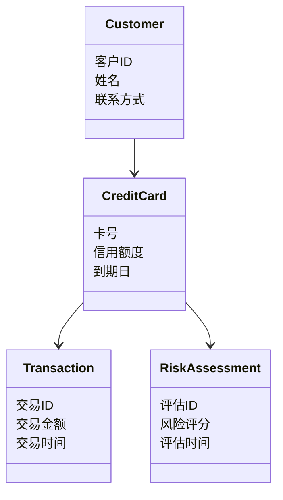
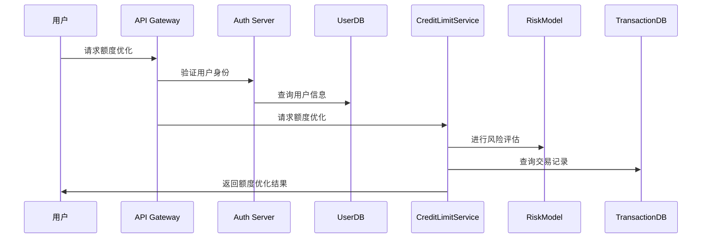

                 


# 智能信用卡额度优化管理系统

**关键词**：智能信用卡、额度优化、机器学习、系统架构、风险控制

**摘要**：本文深入探讨了智能信用卡额度优化管理系统的构建与实现。从背景分析到核心概念，从算法原理到系统架构设计，再到项目实战，全面解析了如何利用人工智能技术提升信用卡额度管理的效率与准确性。文章结合实际案例，详细阐述了系统的实现过程，为技术人员和相关领域从业者提供了宝贵的参考。

---

# 第一部分: 智能信用卡额度优化管理系统的背景与核心概念

## 第1章: 智能信用卡额度优化管理系统的背景与问题分析

### 1.1 信用卡额度管理的现状与挑战
#### 1.1.1 传统信用卡额度管理的痛点
传统信用卡额度管理主要依赖人工审核和简单的规则-based模型，存在以下问题：
- **效率低**：人工审核耗时长，难以应对海量用户。
- **准确性差**：规则-based模型难以捕捉复杂用户行为和风险因素。
- **客户体验差**：用户等待时间长，额度调整不及时，影响用户体验。

#### 1.1.2 智能化额度管理的必要性
随着大数据和人工智能技术的快速发展，智能信用卡额度管理成为必然趋势：
- **提升效率**：通过自动化模型快速计算和调整额度。
- **提高准确性**：利用机器学习算法精准预测用户行为和风险。
- **优化客户体验**：实时调整额度，提升用户满意度。

#### 1.1.3 信用卡额度优化管理的边界与外延
- **边界**：仅针对信用卡额度优化，不涉及其他业务如还款提醒。
- **外延**：涵盖用户行为分析、风险评估、额度调整策略等多个方面。

### 1.2 智能信用卡额度优化管理的核心问题
#### 1.2.1 信用卡额度优化的定义
智能信用卡额度优化是指通过数据分析和机器学习算法，动态调整用户的信用额度，以平衡风险和收益。

#### 1.2.2 优化目标与关键指标
- **目标**：最大化客户满意度，同时控制风险。
- **关键指标**：
  - 用户信用评分（Credit Score）
  - 额度调整频率（Adjustment Frequency）
  - 风险事件发生率（Risk Incident Rate）

#### 1.2.3 优化过程中的主要挑战
- 数据隐私问题：用户数据的收集和处理需符合GDPR等法规。
- 模型解释性：复杂的机器学习模型需具备可解释性，便于业务人员理解和调整。
- 实时性要求：额度优化需实时生效，对系统性能要求高。

### 1.3 智能信用卡额度优化管理的核心要素
#### 1.3.1 用户行为分析
- 分析用户的交易频率、金额、时间等特征，识别潜在风险。
- 示例：用户突然增加大额交易，可能暗示信用风险。

#### 1.3.2 风险评估模型
- 使用逻辑回归（Logistic Regression）或随机森林（Random Forest）模型评估用户信用风险。
- 输入特征：收入、信用历史、交易记录等。
- 输出：信用评分和额度建议。

#### 1.3.3 数据驱动的优化策略
- 基于历史数据，动态调整额度，确保客户既能获得足够的信用额度，又不会超出其还款能力。

### 1.4 本章小结
本章从传统信用卡额度管理的痛点出发，阐述了智能信用卡额度优化管理的必要性，并分析了其核心问题和挑战。通过明确优化目标和核心要素，为后续的系统设计奠定了基础。

---

## 第2章: 智能信用卡额度优化管理的核心概念与联系

### 2.1 核心概念原理
#### 2.1.1 数据驱动的优化模型
- 基于用户数据构建预测模型，动态调整额度。
- 示例：使用线性回归模型预测用户的信用额度需求。

#### 2.1.2 机器学习在额度优化中的应用
- **监督学习**：使用历史数据训练模型，预测未来额度需求。
- **无监督学习**：发现用户行为中的异常模式，识别潜在风险。

#### 2.1.3 风险控制与收益平衡
- 在优化额度时，需平衡风险和收益：
  - 高额度可能提升客户满意度，但也可能增加违约风险。
  - 低额度可能降低风险，但可能影响客户使用体验。

### 2.2 核心概念属性特征对比
以下表格对比了传统额度管理和智能额度管理的核心属性：

| **属性**       | **传统额度管理**                     | **智能额度管理**                     |
|----------------|------------------------------------|------------------------------------|
| 数据来源       | 单一数据源（如信用报告）             | 多数据源（交易记录、行为数据等）       |
| 模型复杂度     | 简单规则-based模型                   | 复杂机器学习模型                     |
| 调整频率       | 低频（每月或每季度调整）              | 高频（实时或每周调整）                |
| 准确性         | 较低                                | 较高                                |

### 2.3 ER实体关系图架构
以下是一个简化的ER实体关系图：

```mermaid
erd
    Customer (客户) {
        客户ID, 姓名, 联系方式
    }
    CreditCard (信用卡) {
        卡号, 信用额度, 到期日
    }
    Transaction (交易记录) {
        交易ID, 交易金额, 交易时间
    }
    RiskAssessment (风险评估) {
        评估ID, 风险评分, 评估时间
    }
    
    Customer --> CreditCard
    CreditCard --> Transaction
    CreditCard --> RiskAssessment
```

### 2.4 本章小结
本章通过对比传统和智能信用卡额度管理的核心概念，明确了智能系统的数据驱动特性和机器学习的应用方式。ER实体关系图展示了系统的数据架构，为后续的系统设计奠定了基础。

---

## 第3章: 智能信用卡额度优化管理的算法原理

### 3.1 算法原理概述
#### 3.1.1 机器学习在额度优化中的应用
- **监督学习**：使用历史数据训练模型，预测用户未来的行为。
- **无监督学习**：发现用户群体中的异常行为模式。

#### 3.1.2 常见优化算法介绍
- **线性回归（Linear Regression）**：适用于简单线性关系的预测。
- **支持向量机（SVM）**：适用于高维数据的分类和回归。
- **随机森林（Random Forest）**：适用于非线性关系的预测。

#### 3.1.3 算法选择的依据
- 数据特征的复杂性：简单数据适合线性回归，复杂数据适合随机森林。
- 模型的可解释性：业务人员需要理解模型的决策逻辑。
- 计算资源：高性能算法需要较强的计算能力。

### 3.2 算法实现流程
#### 3.2.1 数据预处理
- 数据清洗：处理缺失值、异常值。
- 特征工程：提取关键特征，如交易金额、频率等。
- 数据归一化：将不同量纲的特征标准化。

#### 3.2.2 模型训练
- 使用训练数据训练模型，调整超参数以优化性能。
- 示例：使用随机森林模型训练信用评分模型。

#### 3.2.3 模型评估与优化
- 使用测试数据评估模型性能，调整参数以提高准确率。
- 示例：计算模型的准确率、召回率等指标。

### 3.3 算法实现代码示例
以下是一个简单的随机森林模型实现示例：

```python
import pandas as pd
from sklearn.ensemble import RandomForestClassifier
from sklearn.metrics import accuracy_score

# 示例数据加载
data = pd.read_csv('credit_data.csv')

# 特征工程
X = data[['income', 'credit_history', 'transaction_frequency']]
y = data['credit_risk']

# 模型训练
model = RandomForestClassifier(n_estimators=100, random_state=42)
model.fit(X, y)

# 模型预测
predicted_risk = model.predict(X)

# 模型评估
accuracy = accuracy_score(y, predicted_risk)
print(f"模型准确率：{accuracy}")
```

### 3.4 算法数学模型与公式
随机森林模型的核心思想是通过构建多个决策树，并对结果进行投票或平均，提高模型的准确性和稳定性。其数学模型如下：

$$
\text{预测结果} = \sum_{i=1}^{n} \text{树}_{i}(\text{输入})
$$

其中，$n$ 是决策树的数量，$\text{树}_{i}$ 是第$i$棵决策树的预测函数。

### 3.5 本章小结
本章详细介绍了智能信用卡额度优化管理中常用的算法原理，通过代码示例和数学公式，展示了如何利用机器学习技术实现智能优化。

---

## 第4章: 智能信用卡额度优化管理系统的系统分析与架构设计

### 4.1 系统分析
#### 4.1.1 项目场景介绍
- 系统目标：构建一个智能信用卡额度优化管理系统，实现用户信用额度的动态调整。
- 项目范围：覆盖用户行为分析、风险评估、额度优化、系统监控等功能。

#### 4.1.2 项目介绍
- 系统架构：采用微服务架构，支持高并发和实时处理。
- 数据来源：整合用户交易数据、信用报告、行为数据等多源数据。

### 4.2 系统功能设计
#### 4.2.1 领域模型类图
以下是一个简化的领域模型类图：



#### 4.2.2 系统架构设计
以下是一个简化的系统架构图：

```mermaid
graph TD
    User[用户] --> API Gateway[网关]
    API Gateway --> Auth Server[认证服务器]
    Auth Server --> UserDB[用户数据库]
    API Gateway --> CreditLimitService[额度优化服务]
    CreditLimitService --> RiskModel[风险评估模型]
    CreditLimitService --> TransactionDB[交易数据库]
```

#### 4.2.3 系统接口设计
- **API接口**：提供RESTful API，供前端或第三方调用。
- **数据接口**：与第三方数据源（如征信机构）对接，获取用户信用报告。

#### 4.2.4 系统交互序列图
以下是一个用户请求额度优化的交互序列图：



### 4.3 本章小结
本章通过系统分析和架构设计，展示了智能信用卡额度优化管理系统的整体结构和功能模块。系统架构图和交互序列图帮助读者更好地理解系统的运行流程。

---

## 第5章: 智能信用卡额度优化管理系统的项目实战

### 5.1 环境安装与配置
#### 5.1.1 开发环境
- 操作系统：Linux/Windows/Mac
- 开发工具：Python、Jupyter Notebook
- 依赖管理：pip install numpy pandas scikit-learn

#### 5.1.2 数据库配置
- 数据库选择：MySQL/PostgreSQL
- 连接配置：数据库IP、端口、用户名、密码

### 5.2 系统核心实现
#### 5.2.1 数据预处理代码
```python
import pandas as pd
import numpy as np

# 加载数据
data = pd.read_csv('credit_data.csv')

# 处理缺失值
data = data.dropna()

# 标准化处理
from sklearn.preprocessing import StandardScaler
scaler = StandardScaler()
data_scaled = scaler.fit_transform(data[['income', 'transaction_frequency']])
```

#### 5.2.2 模型训练与优化
```python
from sklearn.ensemble import RandomForestRegressor
from sklearn.metrics import mean_squared_error

# 模型训练
model = RandomForestRegressor(n_estimators=200, random_state=42)
model.fit(data_scaled, data['credit_limit'])

# 模型预测
predicted_limits = model.predict(data_scaled)

# 模型评估
mse = mean_squared_error(data['credit_limit'], predicted_limits)
print(f"均方误差：{mse}")
```

#### 5.2.3 系统接口实现
```python
from flask import Flask, jsonify
from flask_restful import Resource, Api

app = Flask(__name__)
api = Api(app)

class CreditLimit(Resource):
    def post(self):
        data = request.get_json()
        # 数据处理
        # 模型预测
        return jsonify({'status': 'success', 'credit_limit': predicted_limit})

api.add_resource(CreditLimit, '/api/credit_limit')

if __name__ == '__main__':
    app.run(debug=True)
```

### 5.3 案例分析与实际应用
#### 5.3.1 案例分析
假设一个用户的交易记录显示其月均消费从$2000增加到$3000，且信用历史良好。系统会根据模型预测，将其信用额度从$10000调整到$15000。

#### 5.3.2 实际应用
- **实时调整**：用户每次交易后，系统实时更新额度。
- **风险监控**：系统实时监控用户的交易行为，发现异常立即触发预警。

### 5.4 本章小结
本章通过项目实战，详细讲解了智能信用卡额度优化管理系统的实现过程。从环境配置到核心代码实现，再到案例分析，帮助读者掌握系统的实际应用。

---

## 第6章: 总结与展望

### 6.1 本章总结
本文深入探讨了智能信用卡额度优化管理系统的构建与实现，从背景分析到系统设计，再到项目实战，全面解析了其技术细节和实现过程。通过机器学习算法和系统架构设计，实现了用户信用额度的动态调整，提升了系统的效率和准确性。

### 6.2 未来展望
随着人工智能技术的不断发展，智能信用卡额度优化管理系统将更加智能化和个性化：
- **实时性提升**：进一步优化系统性能，实现毫秒级响应。
- **模型优化**：引入更复杂的深度学习模型，提高预测精度。
- **个性化服务**：根据用户的个性化需求，提供定制化额度优化方案。

### 6.3 最佳实践 Tips
- 数据隐私保护是系统设计的重要部分，需严格遵守相关法规。
- 模型的可解释性是业务落地的关键，需确保业务人员能够理解模型决策逻辑。
- 系统的实时性和稳定性是用户体验的核心，需进行充分的性能测试和优化。

### 6.4 本章小结
本文总结了智能信用卡额度优化管理系统的实现过程，并展望了未来的发展方向。最佳实践 Tips为读者提供了宝贵的建议，帮助其更好地理解和应用相关技术。

---

**作者：AI天才研究院/AI Genius Institute & 禅与计算机程序设计艺术 /Zen And The Art of Computer Programming**

