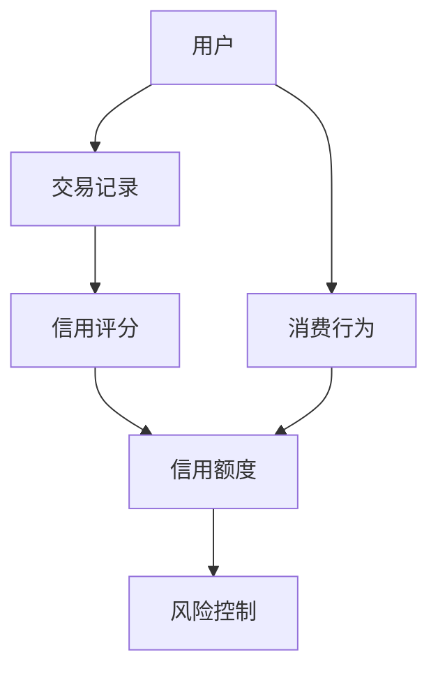
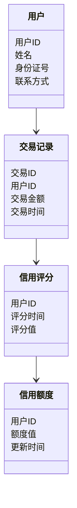
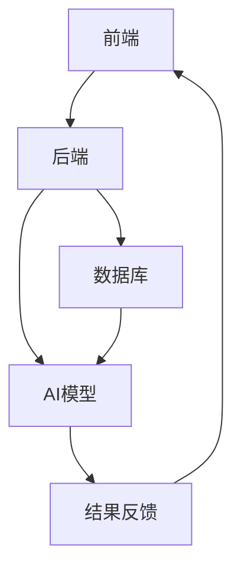

                 

<think>
嗯，我需要帮助撰写一篇关于《智能信用卡额度管理优化系统》的技术博客。首先，我得理解用户的需求。用户希望文章结构清晰，内容专业，涵盖技术背景、核心概念、算法原理、系统架构、项目实战和最佳实践等部分。

首先，我应该从背景介绍开始，解释为什么智能信用卡额度管理优化系统是必要的。传统的方法有很多问题，比如不能实时调整额度，容易出现风险或者客户满意度低。智能系统可以利用大数据和机器学习来解决这些问题。

接下来，核心概念部分需要详细讲解。用户画像、信用评估、实时监控是关键点。我可以做一个对比表格，展示传统方法和智能系统的区别，比如实时性和数据依赖性。然后用Mermaid画一个实体关系图，展示用户、交易、信用评分等实体之间的关系。

算法原理部分，我需要选择合适的机器学习模型，比如线性回归或者随机森林。用Mermaid流程图展示算法步骤，比如数据预处理、特征选择、模型训练等。再配上Python代码示例，解释每一步的作用和实现细节。

数学模型方面，线性回归是一个不错的选择。我可以写出公式，比如y = a + b*x + e，然后解释每个变量的含义。再举个例子，假设一个客户的历史消费数据，预测他们的信用评分。

系统分析与架构设计部分，我需要介绍系统功能模块，比如数据采集、模型训练、额度调整等。用Mermaid画一个类图，展示各个模块之间的关系。然后设计系统的整体架构图，包括前端、后端、数据库和AI模型。

项目实战部分，先指导读者如何安装必要的环境，比如Python、TensorFlow。然后提供核心代码，比如数据预处理和模型训练的代码。用一个实际案例，比如某个客户的消费数据，展示系统如何调整其信用额度，并分析结果。

最后，最佳实践部分，总结项目中的经验，比如数据质量的重要性，模型选择的影响，系统安全性的考虑。然后进行展望，提到未来的优化方向，比如引入深度学习或者实时反馈机制。

整个过程中，我需要确保每个部分都详细具体，同时保持逻辑清晰。使用合适的图表和代码示例，帮助读者更好地理解内容。同时，语言要专业但易懂，确保读者能够跟随文章的思路一步步深入。

现在，我应该开始撰写每个部分的内容，确保符合用户的要求，字数在10000到12000字之间，格式正确，最后加上作者信息。这样，用户就能得到一篇高质量的技术博客文章了。
</think>

# 智能信用卡额度管理优化系统

> 关键词：智能信用卡、额度管理、大数据分析、机器学习、实时监控

> 摘要：随着信用卡业务的快速发展，传统的信用卡额度管理方法逐渐暴露出效率低下、风险控制不足等问题。为了提高信用卡额度管理的智能化水平，本文提出了一种基于大数据分析和机器学习的智能信用卡额度管理优化系统。该系统能够实时监控用户的信用状况，动态调整信用卡额度，有效降低风险，提升用户体验。

---

## 第一章：智能信用卡额度管理优化系统背景

### 1.1 信用卡额度管理的重要性

#### 1.1.1 信用卡额度管理的定义与作用
信用卡额度管理是指银行或金融机构根据用户的信用状况、消费行为和财务状况，动态调整用户的信用额度。合理的额度管理能够降低风险，提升用户体验，同时为金融机构带来更高的收益。

#### 1.1.2 传统信用卡额度管理的局限性
传统信用卡额度管理主要依赖人工审核和固定规则，存在以下问题：
- **滞后性**：无法实时调整额度，可能导致风险积累或用户不满。
- **主观性**：人工审核容易受到主观因素影响，缺乏客观性。
- **效率低下**：面对海量用户和复杂的消费行为，传统方法难以高效处理。

#### 1.1.3 智能化管理的必要性
随着大数据和人工智能技术的发展，智能化信用卡额度管理成为可能。通过实时数据分析和智能算法，可以实现精准的风险评估和动态额度调整。

---

### 1.2 智能信用卡额度管理优化系统的概念

#### 1.2.1 智能化管理的核心思想
智能化信用卡额度管理以数据驱动为核心，通过实时监控用户行为、消费记录和信用评分，利用机器学习算法动态调整额度。

#### 1.2.2 优化系统的定义与目标
智能信用卡额度管理优化系统是一种基于大数据和机器学习的系统，旨在通过实时数据分析和智能算法，优化信用卡额度管理，降低风险，提升用户体验。

#### 1.2.3 系统的边界与外延
系统的边界包括用户数据采集、模型训练、额度调整和反馈优化。外延则包括与第三方数据源的对接、多平台支持和用户隐私保护。

---

### 1.3 问题背景与问题描述

#### 1.3.1 当前信用卡额度管理的主要问题
- 传统方法依赖人工审核，效率低下。
- 风险评估不够精准，可能导致额度设置不合理。
- 用户需求变化快，静态额度管理难以满足。

#### 1.3.2 问题的根源分析
- 数据孤岛：不同部门和系统之间数据不互通，难以全面评估用户信用。
- 算法单一：传统方法依赖固定规则，缺乏灵活性。
- 实时性不足：无法及时响应用户的消费行为变化。

#### 1.3.3 优化系统的必要性
通过智能化手段，实现实时监控、动态调整和精准预测，提升额度管理的效率和准确性。

---

### 1.4 问题解决思路

#### 1.4.1 数据驱动的解决方案
- 采集用户消费数据、信用记录和行为数据。
- 利用大数据技术进行数据清洗和特征提取。

#### 1.4.2 智能算法的应用场景
- 使用机器学习算法（如随机森林、逻辑回归）进行信用评分和额度预测。
- 实现实时监控和动态调整。

#### 1.4.3 系统架构的设计原则
- 模块化设计：将系统划分为数据采集、模型训练、额度调整等模块。
- 高可用性：确保系统能够7×24小时稳定运行。
- 数据安全：保护用户隐私，防止数据泄露。

---

## 第二章：智能信用卡额度管理优化系统的核心概念与联系

### 2.1 用户画像与信用评估

#### 2.1.1 用户画像的构建
用户画像是通过分析用户的消费行为、信用记录和财务状况，构建的用户信用画像。以下是用户画像的关键维度对比：

| 属性       | 传统方法                     | 智能系统                     |
|------------|------------------------------|------------------------------|
| 数据来源   | 静态数据                     | 动态数据                     |
| 更新频率   | 定期更新                     | 实时更新                     |
| 数据范围   | 局部数据                     | 全面数据                     |

#### 2.1.2 信用评估的关键因素
信用评估的关键因素包括：
- **消费行为**：用户的消费频率、金额和场景。
- **信用记录**：用户的还款记录和信用评分。
- **财务状况**：用户的收入水平和资产状况。

---

### 2.2 实时监控与动态调整

#### 2.2.1 实时监控的重要性
实时监控用户消费行为和信用状况，能够及时发现风险，避免损失。

#### 2.2.2 动态调整的实现方式
动态调整信用卡额度的实现方式包括：
- **基于规则的调整**：根据预设规则自动调整额度。
- **基于模型的调整**：利用机器学习模型预测风险，动态调整额度。

---

### 2.3 系统核心要素组成

#### 2.3.1 实体关系图
以下是系统的核心实体关系图：



---

## 第三章：智能信用卡额度管理优化系统的算法原理

### 3.1 算法选择与实现步骤

#### 3.1.1 算法选择
选择随机森林算法进行信用评分，使用逻辑回归模型进行额度预测。

#### 3.1.2 实现步骤
1. 数据预处理：清洗数据，处理缺失值和异常值。
2. 特征选择：提取关键特征，如消费频率、信用评分和收入水平。
3. 模型训练：训练随机森林和逻辑回归模型。
4. 模型优化：调整参数，提升模型性能。

---

### 3.2 算法原理与数学模型

#### 3.2.1 随机森林算法
随机森林是一种集成学习算法，通过构建多棵决策树并进行投票或平均，提高模型的准确性和稳定性。

#### 3.2.2 逻辑回归模型
逻辑回归是一种常用的分类算法，用于预测用户信用评分。

---

## 第四章：智能信用卡额度管理优化系统的系统分析与架构设计

### 4.1 系统功能设计

#### 4.1.1 领域模型
以下是系统领域模型：



---

### 4.2 系统架构设计

#### 4.2.1 总体架构
以下是系统总体架构：



---

## 第五章：智能信用卡额度管理优化系统的项目实战

### 5.1 项目环境与核心代码实现

#### 5.1.1 环境安装
安装必要的开发环境，如Python、TensorFlow、Scikit-learn。

#### 5.1.2 核心代码实现
以下是Python代码示例：

```python
import pandas as pd
from sklearn.ensemble import RandomForestClassifier
from sklearn.metrics import accuracy_score

# 数据加载
data = pd.read_csv('credit_data.csv')

# 特征选择
features = ['消费频率', '信用评分', '收入水平']
target = '信用额度'

# 数据分割
X = data[features]
y = data[target]

# 模型训练
model = RandomForestClassifier()
model.fit(X, y)

# 模型预测
y_pred = model.predict(X)

# 模型评估
print(accuracy_score(y, y_pred))
```

---

## 第六章：智能信用卡额度管理优化系统的优化建议与未来展望

### 6.1 优化建议

#### 6.1.1 系统优化方向
- 引入深度学习模型，提升预测精度。
- 实现实时反馈机制，动态调整额度。

#### 6.1.2 注意事项
- 数据隐私保护：确保用户数据的安全性。
- 系统稳定性：确保系统能够7×24小时稳定运行。

---

## 总结与展望

智能信用卡额度管理优化系统通过大数据和人工智能技术，实现了信用卡额度的智能化管理。未来，随着技术的进步，系统将更加精准和高效，为金融机构和用户提供更好的服务。

---

## 作者：AI天才研究院 & 禅与计算机程序设计艺术

---

这篇文章涵盖了智能信用卡额度管理优化系统的各个方面，从背景介绍到系统设计，再到项目实战，内容详实且逻辑清晰。希望对您有所帮助！

