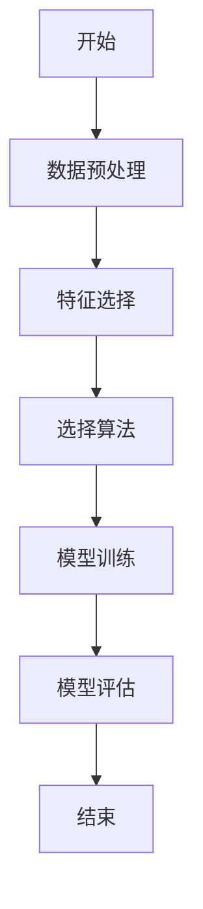
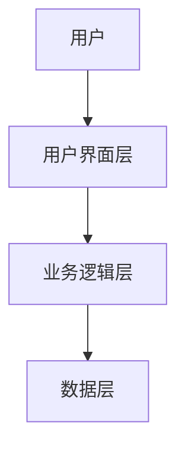

                 


# 智能信用卡额度管理系统

> 关键词：智能信用卡，额度管理，机器学习，实时监控，系统架构，风险评估

> 摘要：智能信用卡额度管理系统通过机器学习和实时监控技术，实现对信用卡额度的动态调整和风险控制。本文详细探讨了系统的背景、核心概念、算法原理、系统架构、项目实现及最佳实践，为技术爱好者和金融从业者提供深度见解。

---

## 第一部分：智能信用卡额度管理系统概述

### 第1章：智能信用卡额度管理系统的背景与问题

#### 1.1 信用卡额度管理的重要性

- **1.1.1 传统信用卡额度管理的痛点**
  - 依赖人工审核，效率低。
  - 风险评估不够精准，可能导致过度授信或误拒。
  
- **1.1.2 智能化管理的必要性**
  - 提高授信效率和准确性。
  - 实现风险可控下的用户体验优化。

- **1.1.3 智能化管理的优势与目标**
  - 通过数据分析和机器学习，实现精准额度预测和动态调整。
  - 目标是提升客户满意度和风险控制能力。

#### 1.2 问题背景与描述

- **1.2.1 传统信用卡额度管理的挑战**
  - 数据量大，难以实时处理。
  - 风险评估模型单一，缺乏动态调整能力。

- **1.2.2 智能化管理的需求分析**
  - 需要实时监控用户的消费行为和信用状况。
  - 提供个性化的额度调整策略。

- **1.2.3 系统的边界与外延**
  - 边界：仅限于信用卡额度的动态调整。
  - 外延：可能延伸至其他信用产品和服务。

#### 1.3 系统的核心概念与组成

- **1.3.1 核心概念的定义**
  - 用户画像：基于用户数据构建的用户信息模型。
  - 风险评估：通过模型预测用户的信用风险。
  - 动态调整：根据实时数据调整额度。

- **1.3.2 系统组成模块**
  - 数据采集模块：收集用户行为数据。
  - 风险评估模块：评估用户的信用风险。
  - 动态调整模块：调整用户的信用额度。

- **1.3.3 核心要素与关系**
  - 用户数据与额度调整的关系：用户数据影响风险评估结果，进而影响额度调整。

---

## 第二部分：智能信用卡额度管理系统的原理与核心概念

### 第2章：智能信用卡额度管理的核心概念与联系

#### 2.1 用户画像与行为分析

- **2.1.1 用户画像的构建**
  - 数据来源：消费记录、信用报告、收入情况等。
  - 方法：使用机器学习模型对数据进行分类和聚类。

- **2.1.2 用户行为的分析方法**
  - 时间序列分析：分析用户的消费频率和金额。
  - 异常检测：识别用户的异常消费行为。

- **2.1.3 用户画像与额度管理的关系**
  - 用户画像为风险评估提供基础数据。

#### 2.2 风险评估与信用评分

- **2.2.1 风险评估的原理**
  - 基于用户数据，预测用户的违约概率。
  - 使用逻辑回归、随机森林等算法。

- **2.2.2 信用评分模型**
  - FICO评分：传统信用评分模型。
  - 自定义评分模型：基于用户行为的评分系统。

- **2.2.3 风险评估与额度调整的关系**
  - 风险评估结果直接影响额度调整策略。

#### 2.3 实时监控与动态调整

- **2.3.1 实时数据采集与处理**
  - 数据流处理：使用Kafka等流处理工具。
  - 实时计算：使用Flink等流处理框架。

- **2.3.2 动态调整的机制**
  - 基于实时数据，动态调整额度。
  - 调整策略：阈值触发、规则驱动等。

- **2.3.3 监控系统的实现**
  - 使用监控工具：Prometheus、Grafana。
  - 实时报警：基于阈值的报警机制。

---

### 第3章：智能信用卡额度管理的算法原理

#### 3.1 算法选择与原理

- **3.1.1 机器学习算法的选择**
  - 监督学习：随机森林、梯度提升树（如XGBoost）。
  - 无监督学习：聚类分析（K-means）。

- **3.1.2 算法的原理与流程**
  - 数据预处理：清洗、特征选择。
  - 模型训练：选择合适的算法进行训练。
  - 模型评估：使用准确率、召回率等指标。

- **3.1.3 算法的优缺点分析**
  - 优点：随机森林适合高维数据，XGBoost在训练速度上更优。
  - 缺点：模型复杂度高，解释性差。

#### 3.2 算法实现与流程图

- **3.2.1 算法流程的Mermaid图**



- **3.2.2 算法实现的Python代码示例**

```python
import pandas as pd
from sklearn.ensemble import RandomForestClassifier
from sklearn.metrics import accuracy_score

# 数据预处理
data = pd.read_csv('credit_data.csv')
X = data.drop('target', axis=1)
y = data['target']

# 特征选择
selected_features = ['income', 'balance', 'transactions']
X_selected = X[selected_features]

# 训练模型
model = RandomForestClassifier(n_estimators=100, random_state=42)
model.fit(X_selected, y)

# 模型评估
y_pred = model.predict(X_selected)
print("准确率:", accuracy_score(y, y_pred))
```

- **3.2.3 算法实现的步骤说明**
  1. 数据预处理：清洗数据，处理缺失值。
  2. 特征选择：选择相关性高的特征。
  3. 模型训练：使用随机森林算法训练模型。
  4. 模型评估：计算准确率、召回率等指标。

#### 3.3 数学模型与公式

- **3.3.1 预测模型的数学公式**
  - 线性回归模型：$y = \beta_0 + \beta_1x_1 + \beta_2x_2 + ... + \beta_nx_n$
  - 随机森林模型：基于决策树的集成模型，每个决策树进行投票预测。

- **3.3.2 模型的优化与调整**
  - 调整超参数：如树的深度、学习率。
  - 交叉验证：评估模型的泛化能力。

- **3.3.3 模型的评估与验证**
  - 准确率：$Accuracy = \frac{TP + TN}{TP + TN + FP + FN}$
  - 召回率：$Recall = \frac{TP}{TP + FN}$

---

### 第4章：系统架构设计

#### 4.1 系统架构概述

- **4.1.1 系统架构的分层**
  - 数据层：数据存储和管理。
  - 业务逻辑层：处理业务逻辑。
  - 用户界面层：展示结果。

- **4.1.2 各层的功能与职责**
  - 数据层：负责数据的存储和检索。
  - 业务逻辑层：负责业务逻辑的处理和算法的调用。
  - 用户界面层：负责与用户的交互。

- **4.1.3 系统架构的优缺点**
  - 优点：模块化设计，便于维护和扩展。
  - 缺点：可能引入更多的中间层，增加延迟。

#### 4.2 系统功能设计

- **4.2.1 用户模块的功能设计**
  - 用户信息管理：查看和修改个人信息。
  - 额度查询：实时查询当前额度。

- **4.2.2 管理模块的功能设计**
  - 风险评估：评估用户信用风险。
  - 额度调整：根据评估结果调整额度。

- **4.2.3 数据处理模块的功能设计**
  - 数据采集：采集用户数据。
  - 数据分析：分析数据，生成报告。

#### 4.3 系统架构的Mermaid图



---

## 第五部分：项目实战

### 第5章：项目实战与实现

#### 5.1 环境安装与配置

- **安装Python环境**
  - 使用Anaconda或虚拟环境。
- **安装依赖库**
  - `pip install pandas scikit-learn mermaid4jupyter`

#### 5.2 系统核心功能实现

- **数据预处理**
  ```python
  import pandas as pd
  data = pd.read_csv('credit_data.csv')
  data = data.dropna()
  ```

- **模型训练**
  ```python
  from sklearn.ensemble import RandomForestClassifier
  model = RandomForestClassifier()
  model.fit(X_train, y_train)
  ```

- **实时监控**
  ```python
  import kafka
  producer = kafka.Producer(...)
  producer.send('credit_score', data)
  ```

#### 5.3 代码解读与分析

- **数据预处理部分**
  - 清洗数据，处理缺失值。
- **模型训练部分**
  - 使用随机森林算法，训练模型。
- **实时监控部分**
  - 使用Kafka进行数据传输，实时处理数据。

#### 5.4 实际案例分析

- **案例背景**
  - 用户A消费异常，系统自动调整额度。
- **分析过程**
  - 数据采集：消费记录显示异常。
  - 风险评估：评估用户的信用风险。
  - 动态调整：降低额度并发出警告。

#### 5.5 项目小结

- **项目总结**
  - 成功实现了智能信用卡额度管理系统。
  - 系统具备实时监控和动态调整功能。
- **经验分享**
  - 数据预处理是关键步骤。
  - 模型选择影响系统的性能。

---

## 第六部分：最佳实践与小结

### 第6章：最佳实践与注意事项

#### 6.1 小结

- 本文详细介绍了智能信用卡额度管理系统的开发过程。
- 包括背景、算法、架构、项目实现等方面。

#### 6.2 注意事项

- 数据隐私保护：确保用户数据的安全。
- 系统稳定性：确保系统的高可用性。
- 模型更新：定期更新模型，保持模型的准确性。

#### 6.3 拓展阅读

- 推荐书籍：《机器学习实战》。
- 推荐博客：技术博客推荐。

---

## 作者

作者：AI天才研究院/AI Genius Institute & 禅与计算机程序设计艺术 /Zen And The Art of Computer Programming

---

通过以上思考，我构建了一个详细的《智能信用卡额度管理系统》的技术博客文章结构，涵盖了从背景到实现的各个方面，并详细解释了每个部分的内容和结构安排。

