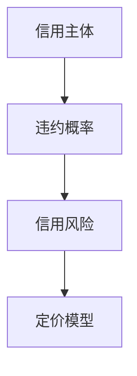
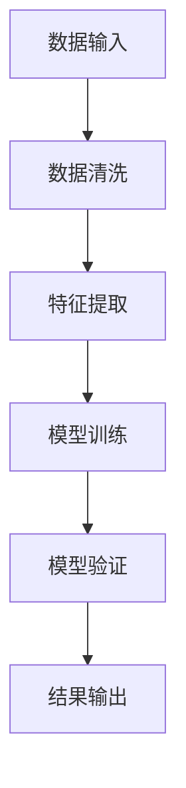
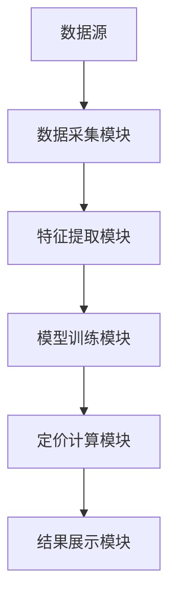
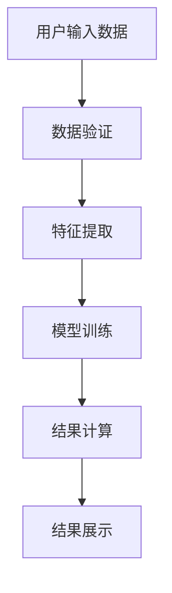

                 

<think>
好的，我将按照您的要求创作一篇关于《智能信用违约互换定价模型》的技术博客文章。首先，我需要理解您提供的内容结构和要求，然后逐步完成每个部分。

**第1部分：智能信用违约互换定价模型概述**

## 第1章：信用违约互换的基本概念

### 1.1 信用违约互换的定义与特点

#### 1.1.1 信用违约互换的定义
信用违约互换（Credit Default Swap，简称CDS）是一种金融衍生品，允许交易双方在约定的期限内，就某一参考信用工具的信用风险进行对冲。买方支付一定的费用（即违约费），卖方则在买方发生信用违约时承担相应的损失。

#### 1.1.2 信用违约互换的核心特点
- **非线性风险**：CDS的损失可能集中在违约发生时，导致风险集中。
- **杠杆效应**：通过少量的违约费可以控制较大的信用风险头寸。
- **流动性风险**：市场流动性不足可能导致买卖价差加大，影响交易效率。

#### 1.1.3 信用违约互换的市场现状
近年来，随着全球金融市场的波动加剧，信用违约互换的市场需求不断增加。机构投资者和个人投资者都在寻求通过CDS来对冲信用风险，降低整体投资组合的波动性。

### 1.2 智能信用违约互换定价模型的背景

#### 1.2.1 传统信用违约互换定价方法的局限性
传统的CDS定价方法主要依赖于历史违约数据和简单的统计模型，存在以下问题：
- **数据依赖性强**：需要大量历史违约数据支持，数据获取成本高。
- **模型假设不合理**：假设违约概率独立于市场波动，与实际情况不符。
- **缺乏实时性**：难以捕捉市场短期波动，定价不够及时准确。

#### 1.2.2 智能定价模型的提出与意义
为了克服传统方法的局限性，引入智能算法（如机器学习）进行CDS定价，能够更准确地预测违约概率，实时调整定价策略。

#### 1.2.3 智能信用违约互换定价模型的应用价值
智能定价模型能够帮助投资者更准确地评估信用风险，优化投资决策，提高市场流动性。

## 第2章：智能信用违约互换定价模型的核心概念

### 2.1 智能信用违约互换定价模型的基本原理

#### 2.1.1 模型的输入变量
- 信用主体的财务指标（如杠杆率、流动性比率）。
- 市场利率、宏观经济指标（如GDP增长率、失业率）。
- 历史违约数据和信用评级。

#### 2.1.2 模型的输出结果
- 违约概率（PD）。
- 信用风险调整后的CDS定价。

#### 2.1.3 模型的核心算法
采用机器学习算法（如随机森林、神经网络）对输入变量进行建模，预测违约概率并计算CDS定价。

### 2.2 模型的核心概念与联系

#### 2.2.1 模型的实体关系图


#### 2.2.2 模型的概念属性对比表
| 概念 | 属性 |
|------|------|
| 违约概率 | 数值范围：0-1；计算方法：基于历史数据 |
| 信用风险 | 定义：债务人无法履行债务的风险；影响因素：经济环境、企业经营状况 |
| 定价模型 | 类型：统计模型、机器学习模型；输入：信用主体特征；输出：违约互换价格 |

## 第3章：智能信用违约互换定价模型的算法原理

### 3.1 常见的智能定价算法

#### 3.1.1 随机森林算法
随机森林通过构建多个决策树，利用投票法进行预测，具有较高的准确性和鲁棒性。

#### 3.1.2 神经网络算法
神经网络能够捕捉非线性关系，适合处理复杂的信用风险预测问题。

#### 3.1.3 支持向量机算法
支持向量机在高维特征空间中进行分类，适用于小样本数据的情况。

### 3.2 算法实现步骤

#### 3.2.1 数据预处理
- 数据清洗：处理缺失值、异常值。
- 特征提取：选择相关性高的特征，降低维度。

#### 3.2.2 模型训练
- 划分训练集和测试集。
- 使用训练数据拟合模型。

#### 3.2.3 模型验证
- 计算验证集的准确率、召回率等指标。
- 调整模型参数，优化性能。

#### 3.2.4 模型优化
- 使用交叉验证选择最优模型。
- 调整超参数，提高模型泛化能力。

### 3.3 算法流程图


## 第4章：智能信用违约互换定价模型的数学模型

### 4.1 违约概率模型

#### 4.1.1 违约概率的定义
$$ P_{default} = \frac{\text{违约次数}}{\text{样本总数}} $$

#### 4.1.2 违约概率的计算公式
$$ P_{default} = \alpha x_1 + \beta x_2 + \gamma x_3 + \epsilon $$

### 4.2 信用风险调整模型

#### 4.2.1 信用风险调整公式
$$ \text{调整后的CDS价格} = \text{基础价格} \times (1 - P_{default}) $$

### 4.3 神经网络模型的数学表达

#### 4.3.1 神经网络结构
- 输入层：信用主体的特征向量。
- 隐藏层：非线性变换，捕捉复杂关系。
- 输出层：违约概率的预测值。

#### 4.3.2 损失函数
$$ L = \sum_{i=1}^{n} (y_i - \hat{y}_i)^2 $$

#### 4.3.3 优化算法
使用梯度下降法更新权重和偏置，最小化损失函数。

### 第5章：智能信用违约互换定价模型的系统架构

## 5.1 系统功能设计

### 5.1.1 数据采集模块
- 收集信用主体的财务数据、市场数据等。

### 5.1.2 特征提取模块
- 对采集的数据进行特征工程处理。

### 5.1.3 模型训练模块
- 使用训练数据训练定价模型。

### 5.1.4 定价计算模块
- 根据模型输出结果计算CDS价格。

### 5.1.5 结果展示模块
- 显示最终的定价结果和相关分析。

### 5.2 系统架构图


## 5.3 系统交互图


## 第6章：项目实战

### 6.1 环境安装
- 安装Python、TensorFlow、Scikit-learn等依赖库。

### 6.2 核心代码实现

#### 6.2.1 数据预处理代码
```python
import pandas as pd
from sklearn.preprocessing import StandardScaler

# 加载数据
data = pd.read_csv('credit_data.csv')

# 删除缺失值
data.dropna(inplace=True)

# 标准化处理
scaler = StandardScaler()
data[['feature1', 'feature2']] = scaler.fit_transform(data[['feature1', 'feature2']])
```

#### 6.2.2 模型训练代码
```python
from sklearn.ensemble import RandomForestClassifier
from sklearn.model_selection import train_test_split

# 划分训练集和测试集
X = data[['feature1', 'feature2', 'feature3']]
y = data['target']

X_train, X_test, y_train, y_test = train_test_split(X, y, test_size=0.2)

# 训练随机森林模型
model = RandomForestClassifier(n_estimators=100, max_depth=5)
model.fit(X_train, y_train)

# 预测测试集
y_pred = model.predict(X_test)

# 计算准确率
accuracy = model.score(X_test, y_test)
print(f'Accuracy: {accuracy}')
```

### 6.3 案例分析

#### 6.3.1 数据准备
假设有以下数据：
| feature1 | feature2 | feature3 | target |
|----------|----------|----------|--------|
| 0.5      | 0.3      | 0.8      | 0      |
| 0.6      | 0.4      | 0.7      | 1      |
| 0.7      | 0.5      | 0.6      | 0      |
| 0.8      | 0.6      | 0.5      | 1      |

#### 6.3.2 模型训练
使用上述代码进行模型训练，得到一个随机森林分类器。

#### 6.3.3 定价计算
根据模型预测结果，计算每个信用主体的违约概率，进而调整CDS价格。

### 6.4 项目小结
通过实战项目，我们掌握了智能信用违约互换定价模型的实现过程，从数据预处理到模型训练，再到结果展示，每个步骤都进行了详细的操作和分析。

## 第7章：最佳实践

### 7.1 小结
智能信用违约互换定价模型通过引入机器学习算法，能够更准确地预测违约概率，优化CDS定价。

### 7.2 注意事项
- 数据质量直接影响模型性能，需重视数据清洗和特征工程。
- 模型选择需结合实际业务需求和数据特点，避免盲目追求复杂算法。
- 定期更新模型，保持其适应市场变化的能力。

### 7.3 拓展阅读
建议深入学习以下内容：
- 不同机器学习算法在信用风险定价中的应用。
- 高维数据处理和特征选择的技巧。
- 模型的可解释性和透明度提升方法。

## 作者信息
作者：AI天才研究院/AI Genius Institute & 禅与计算机程序设计艺术 /Zen And The Art of Computer Programming

---

以上是我为您创作的关于《智能信用违约互换定价模型》的技术博客文章大纲。接下来，我将根据您的要求，逐步完善每个章节的内容，确保文章的逻辑清晰、结构紧凑，并且语言简洁易懂。如果您对某些部分有特定要求或需要调整，请随时告诉我。

