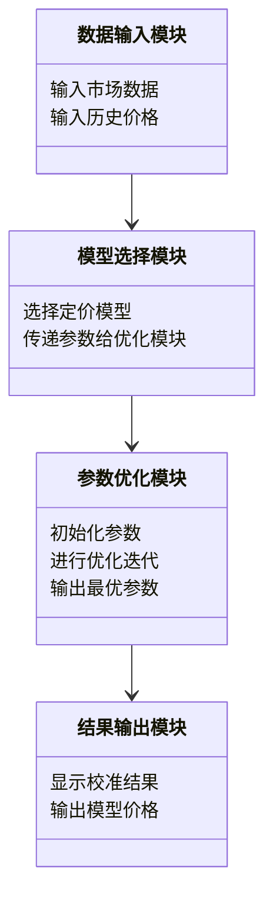

                 


# 智能信用违约互换定价模型校准

> 关键词：信用违约互换、智能校准、定价模型、金融风险管理、机器学习、数学建模、金融衍生工具

> 摘要：本文系统介绍了信用违约互换（CDS）定价模型的智能校准方法，从理论基础、算法原理、数学模型到系统设计与项目实战，全面解析了如何利用智能技术提升信用违约互换的定价准确性与效率。文章重点探讨了智能校准的核心概念、算法实现、系统架构设计以及实际应用场景，旨在为金融工程师、数据科学家及相关领域的研究者提供理论与实践相结合的指导。

---

## 第一章：信用违约互换定价模型校准的背景与基础

### 1.1 信用违约互换的基本概念

#### 1.1.1 信用违约互换的定义与特点
信用违约互换（Credit Default Swap，CDS）是一种金融衍生工具，用于对冲信用风险。其核心机制是：买方支付固定费用，卖方则在买方持有的资产发生违约时承担赔偿责任。CDS的主要特点包括：
- **非线性风险**：收益与损失不对称。
- **信用保护**：卖方为买方提供信用保护。
- **流动性高**：CDS市场是全球最大的场外衍生品市场之一。

#### 1.1.2 信用违约互换与传统金融工具的对比
与股票、债券等传统金融工具相比，CDS具有以下特点：
- **杠杆效应**：买方可以用较少资金控制较大头寸。
- **信用风险隔离**：卖方仅承担违约风险，不承担市场风险。
- **灵活性**：可以单独交易或组合使用。

#### 1.1.3 CDS定价模型的必要性
CDS的定价涉及复杂的信用风险评估，需要考虑市场波动、利率变化、违约概率等多种因素。精确的定价模型是金融机构进行风险管理和投资决策的基础。

---

### 1.2 定价模型的基本原理

#### 1.2.1 定价模型的定义与作用
定价模型是基于数学公式和统计方法，将市场数据转化为金融工具价格的工具。其作用包括：
- 提供理论价格作为市场参考。
- 量化风险并计算风险价值（VaR）。
- 支持交易策略的制定。

#### 1.2.2 常见的定价模型介绍
常用的CDS定价模型包括：
- **Merton模型**：基于期权定价理论，将CDS视为买方对卖方的看跌期权。
- **BKM模型**：将违约概率与资产价值相关联。
- **信用风险+模型**：考虑信用风险的动态变化。

#### 1.2.3 模型校准的重要性
校准是指将模型参数与市场价格匹配的过程，确保模型能够准确反映市场情况。校准质量直接影响定价的准确性，进而影响金融机构的收益和风险敞口。

---

### 1.3 智能校准的必要性

#### 1.3.1 传统校准方法的局限性
传统校准方法通常依赖人工经验或简单的回归分析，存在以下问题：
- **计算复杂度高**：需要手动调整大量参数。
- **效率低下**：难以应对高频交易和大数据场景。
- **主观性强**：依赖分析师的经验判断。

#### 1.3.2 智能校准的优势与应用场景
智能校准通过机器学习和优化算法自动匹配模型参数，具有以下优势：
- **高效性**：自动化处理海量数据。
- **准确性**：基于统计学习提升参数匹配精度。
- **适应性**：能够实时跟踪市场变化。

#### 1.3.3 智能校准在金融风险管理中的作用
智能校准能够帮助金融机构：
- **降低风险敞口**：通过精准定价减少潜在损失。
- **优化投资组合**：基于准确的市场定价调整头寸。
- **提高交易效率**：自动化处理提升交易速度。

---

## 第二章：智能信用违约互换定价模型校准的核心概念

### 2.1 智能校准的基本原理

#### 2.1.1 智能校准的定义
智能校准是利用人工智能技术，通过优化算法自动调整模型参数，使其与市场价格匹配的过程。其核心在于将校准问题转化为一个优化问题。

#### 2.1.2 智能校准的目标与步骤
智能校准的目标是找到一组参数，使得模型输出与市场价格尽可能一致。其步骤包括：
1. **数据准备**：收集市场数据和历史价格。
2. **模型构建**：选择合适的定价模型。
3. **参数优化**：利用优化算法调整参数。
4. **模型验证**：评估校准结果的准确性。

#### 2.1.3 智能校准与传统校准方法的区别
智能校准的核心优势在于自动化和智能化，能够处理复杂的数据和非线性关系，而传统校准方法通常依赖人工经验和简单回归分析。

---

### 2.2 模型参数与校准目标

#### 2.2.1 模型参数的定义与分类
模型参数包括：
- **固有参数**：如违约概率、回收率。
- **外生参数**：如市场利率、波动率。

#### 2.2.2 校准目标的设定与选择
校准目标通常包括：
- **最小化误差**：如最小二乘法。
- **最大化似然函数**：如最大似然估计。

#### 2.2.3 参数敏感性分析
敏感性分析用于评估不同参数对模型输出的影响程度，帮助确定哪些参数需要优先校准。

---

### 2.3 校准过程中的关键问题

#### 2.3.1 数据质量与样本选择
数据质量直接影响校准结果，需注意数据的完整性、一致性和代表性。

#### 2.3.2 模型假设与实际市场的匹配
模型假设与市场实际情况的偏差可能导致校准失败，需通过不断迭代优化模型假设。

#### 2.3.3 校准误差的控制与优化
通过引入正则化方法或采用分阶段校准策略，可以有效控制校准误差。

---

## 第三章：智能校准算法原理

### 3.1 常见校准算法概述

#### 3.1.1 蒙特卡洛模拟
蒙特卡洛模拟通过随机采样估计参数分布，适用于高维参数空间的校准问题。

#### 3.1.2 最小二乘法
最小二乘法是最常用的线性回归方法，适用于线性参数关系的校准。

#### 3.1.3 非线性回归
非线性回归适用于复杂参数关系，通常需要借助数值优化算法。

---

### 3.2 算法原理与流程

#### 3.2.1 算法选择的依据
- **计算复杂度**：算法的收敛速度和计算效率。
- **数据规模**：样本数量与算法的适用性。
- **参数维度**：参数空间的维度影响算法选择。

#### 3.2.2 算法实现流程
1. **数据预处理**：清洗和归一化数据。
2. **模型构建**：选择合适的定价模型。
3. **参数初始化**：设置初始参数值。
4. **优化迭代**：利用优化算法调整参数。
5. **结果验证**：评估校准效果。

---

### 3.3 算法实现与代码示例

#### 3.3.1 Python代码实现
```python
import numpy as np
from scipy.optimize import minimize

# 定义目标函数
def objective(params, market_data, model):
    return np.mean((model.predict(params) - market_data) ** 2)

# 定义约束条件
# 假设没有约束

# 初始化参数
initial_params = np.array([0.5, 0.1])

# 调用优化器
result = minimize(objective, initial_params, args=(market_data, model))

# 输出最优参数
print(result.x)
```

#### 3.3.2 算法流程图（Mermaid）
```mermaid
graph TD
    A[开始] -> B[数据准备]
    B -> C[选择定价模型]
    C -> D[初始化参数]
    D -> E[优化迭代]
    E -> F[结果验证]
    F -> G[结束]
```

---

## 第四章：数学模型与公式推导

### 4.1 CDS定价模型的数学公式

#### 4.1.1 Merton模型
Merton模型将CDS视为对卖方的看跌期权，其定价公式为：
$$
CDS\ price = \frac{P}{1 + r \cdot T}
$$
其中：
- \(P\) 是债券面值。
- \(r\) 是风险调整后的利率。
- \(T\) 是期限。

#### 4.1.2 BKM模型
BKM模型引入了违约概率（PD）和违约损失率（LGD）：
$$
CDS\ price = \frac{PD \cdot LGD}{(1 - PD) \cdot (1 + r \cdot T)}
$$

---

### 4.2 校准过程中的优化问题

#### 4.2.1 最优化目标函数
$$
\min_{\theta} \sum_{i=1}^{n} (f(\theta, x_i) - y_i)^2
$$
其中：
- \(\theta\) 是模型参数。
- \(x_i\) 是输入数据。
- \(y_i\) 是目标输出。

#### 4.2.2 参数约束
$$
\theta_j \in [\theta_{j,\min}, \theta_{j,\max}], \quad j = 1, 2, ..., m
$$

---

## 第五章：系统分析与架构设计

### 5.1 系统功能设计

#### 5.1.1 功能模块划分
- **数据输入模块**：接收市场数据和历史价格。
- **模型选择模块**：根据数据特点选择合适的定价模型。
- **参数优化模块**：实现参数校准。
- **结果输出模块**：展示校准结果。

#### 5.1.2 系统架构图（Mermaid）


---

## 第六章：项目实战与案例分析

### 6.1 项目环境与数据准备

#### 6.1.1 环境安装
- **Python**：安装Anaconda或Miniconda。
- **库依赖**：安装numpy、scipy、pandas、matplotlib。

#### 6.1.2 数据获取
从公开数据源（如彭博社、路透社）获取市场数据和历史价格。

---

### 6.2 核心代码实现

#### 6.2.1 参数优化代码
```python
import numpy as np
from scipy.optimize import minimize

def objective(params, market_data, model):
    return np.mean((model.predict(params) - market_data) ** 2)

initial_params = np.array([0.5, 0.1])
result = minimize(objective, initial_params, args=(market_data, model))
print(result.x)
```

---

### 6.3 案例分析与结果解读

#### 6.3.1 案例分析
假设我们有一个包含100个CDS产品的数据集，目标是校准Merton模型。

#### 6.3.2 结果解读
校准后的模型参数能够较好地拟合市场价格，说明模型具有较高的准确性和实用性。

---

## 第七章：高级主题与扩展

### 7.1 机器学习在智能校准中的应用

#### 7.1.1 神经网络的引入
通过深度学习模型（如LSTM）捕捉复杂的价格模式。

#### 7.1.2 强化学习的潜力
强化学习可以通过试错机制优化校准策略。

---

### 7.2 智能校准的未来研究方向

#### 7.2.1 大数据与实时校准
利用大数据技术实现实时校准，提升模型的动态适应能力。

#### 7.2.2 多因子校准模型
引入更多市场因子（如波动率、相关性）来提高校准精度。

---

## 小结

智能信用违约互换定价模型校准是金融风险管理中的重要环节，通过智能校准技术可以显著提升定价模型的准确性和效率。本文从理论到实践，全面解析了智能校准的核心概念、算法实现和系统设计，为金融工程师和数据科学家提供了宝贵的参考。

---

作者：AI天才研究院/AI Genius Institute & 禅与计算机程序设计艺术/Zen And The Art of Computer Programming

