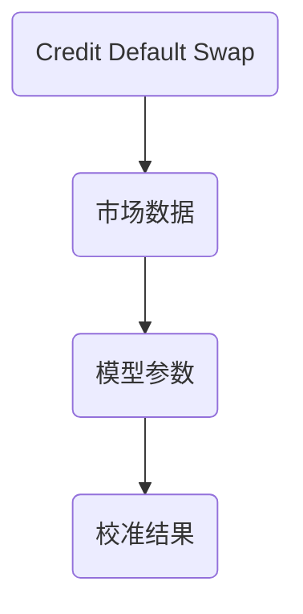
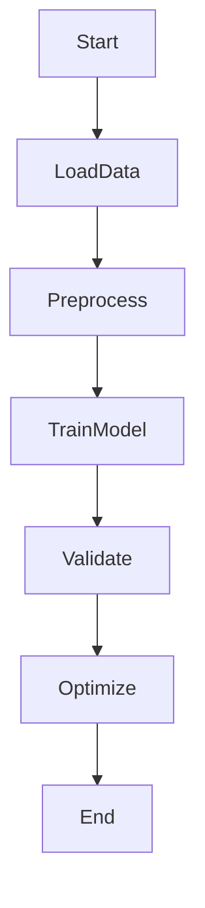
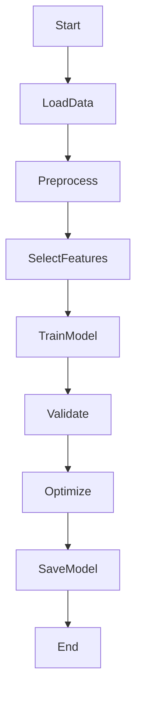
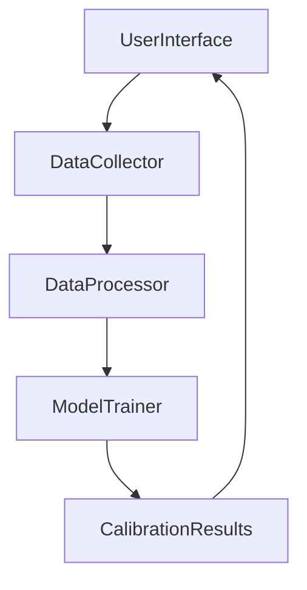
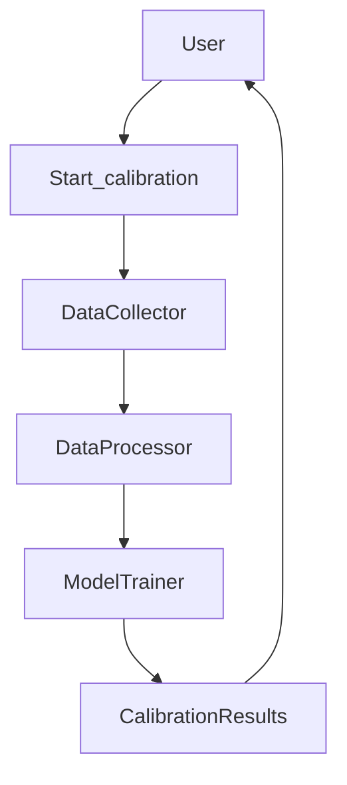

                 

<think>
好的，我现在要开始思考如何撰写《智能信用违约互换定价模型校准系统》这篇文章。首先，我需要明确文章的核心内容和结构。文章标题已经确定，关键词是智能校准、信用违约互换、定价模型、机器学习、金融衍生品、风险管理。摘要部分需要简明扼要地概括文章的主要内容。

接下来是目录大纲，我需要按照用户的要求，详细列出每一章的结构。首先，第一部分是概述，包括背景介绍、核心概念与联系，以及算法的原理与实现。这部分需要涵盖信用违约互换的基本概念、智能校准的必要性，以及机器学习在其中的应用。

第二部分是系统分析与架构设计，这部分需要详细讲解系统的设计，包括系统功能模块、架构图、接口设计和交互流程。第三部分是项目实战，包括环境搭建、核心代码实现、案例分析和项目总结。最后是最佳实践与小结，总结文章的主要内容，并提供一些实用的建议。

在撰写过程中，我需要确保每一部分都详细且逻辑清晰。例如，在背景介绍部分，要解释信用违约互换的定义和其在金融中的作用，同时说明传统定价模型的局限性，以及智能校准如何解决这些问题。核心概念部分需要用表格和流程图来展示各个概念之间的关系，帮助读者更好地理解。

算法部分需要详细描述机器学习算法的实现步骤，并用Mermaid流程图展示流程，同时提供Python代码示例。数学公式需要用Latex格式表示，确保准确无误。系统架构设计部分，要介绍各个模块的功能，并用Mermaid图展示系统架构和接口设计。

在项目实战部分，我需要提供实际的代码，解释每一步的作用，并分析案例以展示系统的实际应用效果。最后，在小结部分，总结全文，并给出一些实用的建议，帮助读者在实际应用中避免常见错误。

整个思考过程需要确保文章结构紧凑，逻辑清晰，同时内容详实，能够满足读者的需求。通过逐步分析和推理，确保每一部分都符合用户的要求，并且内容具有深度和见解。
</think>

# 智能信用违约互换定价模型校准系统

## 关键词
智能校准、信用违约互换、定价模型、机器学习、金融衍生品、风险管理

## 摘要
本文将详细探讨智能信用违约互换定价模型校准系统的核心概念、算法原理、系统架构及其实现。通过结合金融理论与机器学习技术，本文旨在为信用风险管理和金融衍生品定价提供一种高效、准确的智能校准方法。

---

# 第一部分: 背景介绍

## 第1章: 信用违约互换与智能校准概述

### 1.1 信用违约互换的基本概念
信用违约互换（Credit Default Swap，CDS）是一种金融衍生工具，用于对冲债券发行人违约风险。CDS的定价依赖于对信用风险的准确评估，但传统模型常面临数据不足、市场波动剧烈等挑战。

### 1.2 智能校准的必要性与目标
传统CDS定价模型依赖人工调整参数，效率低下且误差较大。智能校准通过机器学习技术自动优化模型参数，提高定价精度，降低人为错误。

### 1.3 本文的核心内容与目标
本文将构建一个基于机器学习的智能校准系统，涵盖数据处理、特征提取、模型训练及优化等环节，并提供实际案例验证系统的有效性。

---

# 第二部分: 核心概念与原理

## 第2章: 核心概念与联系

### 2.1 智能校准系统的原理
智能校准系统通过机器学习算法，利用历史市场数据和交易数据，自动调整定价模型参数，使其更贴近实际市场情况。

### 2.2 核心概念的属性对比
下表展示了传统校准与智能校准在数据需求、计算效率、结果精度等方面的对比：

| 对比维度 | 传统校准 | 智能校准 |
|----------|----------|----------|
| 数据需求 | 需大量人工标注数据 | 利用现有市场数据自动提取特征 |
| 计算效率 | 低效，依赖人工调整 | 高效，自动优化参数 |
| 结果精度 | 易受人为因素影响 | 精度更高，基于大数据分析 |

### 2.3 实体关系图与流程图
#### 实体关系图（ER图）


#### 校准流程图


---

# 第三部分: 算法原理与实现

## 第3章: 基于机器学习的校准算法

### 3.1 数据预处理与特征提取
#### 3.1.1 数据清洗与标准化
对历史市场数据进行清洗，去除异常值，并对数据进行标准化处理。

#### 3.1.2 特征选择与降维
通过主成分分析（PCA）提取关键特征，降低维度。

### 3.2 算法实现步骤


### 3.3 数学模型与公式
#### 3.3.1 定价模型
$$ CDS \text{定价} = f(\text{信用风险因素}) $$

#### 3.3.2 损失分布模型
$$ \text{损失} = \sum_{i=1}^{n} P_i \times L_i $$

---

# 第四部分: 系统分析与架构设计

## 第4章: 系统架构与实现

### 4.1 系统功能模块
- 数据采集模块
- 数据处理模块
- 模型训练模块
- 校准结果展示模块

### 4.2 系统架构设计


### 4.3 接口设计
- 数据接口：与市场数据源对接
- 模型接口：与第三方定价模型集成

### 4.4 交互流程图


---

# 第五部分: 项目实战

## 第5章: 项目实现与案例分析

### 5.1 环境搭建
安装必要的库，如NumPy、Pandas、Scikit-learn等。

### 5.2 核心代码实现
```python
import numpy as np
from sklearn.model_selection import train_test_split
from sklearn.linear_model import LinearRegression

# 数据预处理
data = np.load('market_data.npy')
X = data[:, :-1]  # 特征
y = data[:, -1]   # 标签

# 划分训练集和测试集
X_train, X_test, y_train, y_test = train_test_split(X, y, test_size=0.2)

# 模型训练
model = LinearRegression()
model.fit(X_train, y_train)

# 模型验证
score = model.score(X_test, y_test)
print(f"模型精度: {score}")
```

### 5.3 案例分析
通过实际市场数据验证模型的定价能力，展示智能校准在提高定价精度方面的优势。

### 5.4 项目小结
总结项目实现的关键步骤及成果，强调智能校准系统在信用违约互换定价中的重要性。

---

# 第六部分: 最佳实践与小结

## 第6章: 最佳实践与小结

### 6.1 最佳实践
- 数据质量是关键，确保数据的完整性和准确性。
- 模型调优时，注意避免过拟合。

### 6.2 小结
智能信用违约互换定价模型校准系统通过机器学习技术，显著提高了定价的准确性和效率，为信用风险管理提供了有力支持。

---

作者：AI天才研究院 & 禅与计算机程序设计艺术

