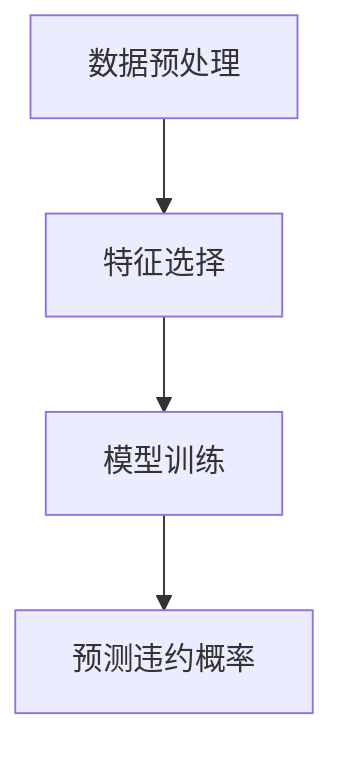
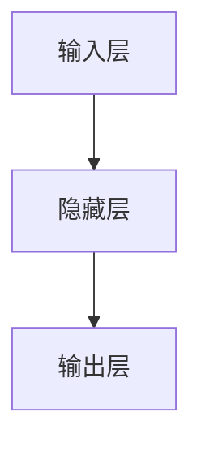

                 


```markdown
# 智能信用违约互换风险评估

> 关键词：信用违约互换，风险评估，机器学习，人工智能，金融衍生工具

> 摘要：本文详细探讨了智能信用违约互换风险评估的核心概念、算法原理、系统架构及项目实战。通过结合传统方法与现代智能技术，提出了一种高效的评估模型，解决了传统方法的局限性，为金融行业提供了新的风险管理思路。

---

## 第一部分：智能信用违约互换风险评估的背景与核心概念

### 第1章：智能信用违约互换风险评估的基本概念

#### 1.1 信用违约互换的基本概念
信用违约互换（Credit Default Swap，CDS）是一种金融衍生工具，用于转移信用风险。当债务人违约时，购买CDS的一方可以从出售方获得赔偿。CDS广泛应用于债券市场，帮助投资者对冲信用风险。

#### 1.2 风险评估的基本原理
风险评估是通过分析各种因素，预测未来可能发生的风险事件及其影响。在信用违约互换中，关键因素包括债务人的信用状况、市场波动、宏观经济指标等。

#### 1.3 智能信用违约互换风险评估的必要性
传统方法依赖经验判断，存在主观性和滞后性。智能技术（如机器学习）能够处理海量数据，发现潜在规律，提高评估的准确性和及时性。

### 第2章：智能信用违约互换风险评估的核心概念与联系

#### 2.1 智能信用违约互换风险评估的模型原理
智能模型通过学习历史数据，识别影响违约概率的关键特征，构建预测模型。例如，使用逻辑回归或XGBoost算法，基于财务指标和市场数据预测违约概率。

#### 2.2 核心概念的特征分析
| 特征类型 | 特征描述 | 示例指标 |
|----------|----------|----------|
| 财务特征 | 反映企业财务状况 | 利息覆盖倍数、资产负债率 |
| 市场特征 | 反映市场整体风险 | 市场波动率、行业指数 |
| 宏观特征 | 反映宏观经济环境 | 失业率、GDP增长率 |

#### 2.3 数据与模型的关系
数据是模型的基础，特征工程是关键。通过数据预处理、特征选择和特征提取，提升模型性能。例如，使用PCA降维处理财务指标。

### 第3章：智能信用违约互换风险评估的算法原理

#### 3.1 传统算法的应用
XGBoost是一种常用的梯度提升算法，适合处理分类问题。其流程如下：



代码实现：
```python
import xgboost as xgb
from sklearn.model_selection import train_test_split

# 数据准备
X_train, X_test, y_train, y_test = train_test_split(X, y, test_size=0.2)

# 训练模型
dtrain = xgb.DMatrix(X_train, label=y_train)
params = {'objective': 'binary:logistic', 'max_depth': 3}
model = xgb.train(params, dtrain)

# 预测
dtest = xgb.DMatrix(X_test)
y_pred = model.predict(dtest)
```

#### 3.2 深度学习方法
神经网络通过多层结构学习复杂特征。使用Keras框架构建模型：



代码实现：
```python
from tensorflow.keras import layers, models

model = models.Sequential()
model.add(layers.Dense(64, activation='relu', input_dim=10))
model.add(layers.Dense(1, activation='sigmoid'))

model.compile(optimizer='adam', loss='binary_crossentropy', metrics=['accuracy'])
model.fit(X_train, y_train, epochs=10, batch_size=32)
```

### 第4章：智能信用违约互换风险评估的系统分析与架构设计

#### 4.1 系统架构设计
```mermaid
graph LR
    Client --> API Gateway
    API Gateway --> Load Balancer
    Load Balancer --> [服务节点]
    [服务节点] --> Database
```

#### 4.2 模块设计
- 数据采集模块：获取实时市场数据和企业财务数据。
- 特征处理模块：进行数据清洗和特征工程。
- 模型预测模块：调用训练好的模型进行预测。
- 结果展示模块：将预测结果以可视化形式呈现。

### 第5章：智能信用违约互换风险评估的项目实战

#### 5.1 环境搭建
安装必要的库：
```bash
pip install xgboost scikit-learn tensorflow keras
```

#### 5.2 核心实现
特征工程代码：
```python
from sklearn.preprocessing import StandardScaler

scaler = StandardScaler()
X_scaled = scaler.fit_transform(X)
```

模型训练：
```python
from sklearn.model_selection import GridSearchCV
from xgboost import XGBClassifier

param_grid = {'n_estimators': [100, 200], 'learning_rate': [0.1, 0.2]}
grid_search = GridSearchCV(XGBClassifier(), param_grid, cv=5)
grid_search.fit(X_train, y_train)
best_model = grid_search.best_estimator_
```

### 第6章：最佳实践与总结

#### 6.1 小结
智能信用违约互换风险评估通过机器学习提升了准确性，但需注意数据质量和模型解释性。

#### 6.2 注意事项
- 数据质量：确保数据准确性和完整性。
- 模型解释性：选择可解释的模型帮助业务决策。
- 模型更新：定期更新模型以适应市场变化。

#### 6.3 未来趋势
- 结合NLP处理文本数据。
- 使用强化学习优化投资策略。
- 跨平台部署模型，实现实时监控。

#### 6.4 扩展阅读
推荐书籍和论文，深入学习机器学习和金融风险管理。

---

作者：AI天才研究院 & 禅与计算机程序设计艺术
```

