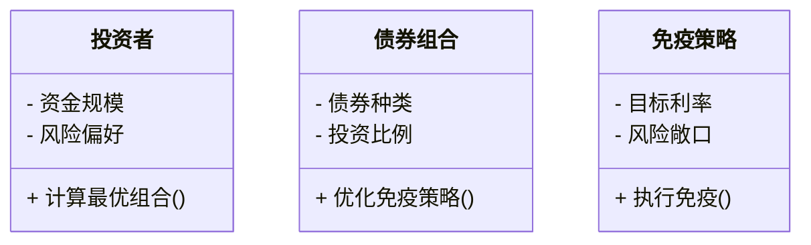

                 


# 智能债券投资组合免疫策略

> 关键词：智能免疫策略，债券投资组合，利率风险，凸优化，机器学习

> 摘要：本文详细探讨智能债券投资组合免疫策略，结合传统免疫策略与现代机器学习技术，通过数学建模和算法实现，提供优化的债券投资方案，降低利率风险，实现稳健投资回报。

---

# 目录大纲

## 第一章：智能债券投资组合免疫策略概述

### 1.1 债券投资的基本概念
1.1.1 债券的定义与分类
1.1.2 债券投资的目标与风险
1.1.3 债券投资组合的概念

### 1.2 投资组合免疫策略的背景
1.2.1 利率风险的定义
1.2.2 免疫策略的基本原理
1.2.3 免疫策略在债券投资中的应用

### 1.3 智能免疫策略的背景
1.3.1 传统免疫策略的局限性
1.3.2 智能免疫策略的提出
1.3.3 智能免疫策略的优势

---

## 第二章：智能债券投资组合免疫策略的核心概念

### 2.1 智能免疫策略的核心原理
2.1.1 机器学习在债券投资中的应用
2.1.2 智能免疫策略的数学模型
2.1.3 智能免疫策略与传统免疫策略的对比

### 2.2 核心概念与联系
2.2.1 智能免疫策略的ER实体关系图


2.2.2 智能免疫策略的类图


---

## 第三章：智能免疫策略的算法原理

### 3.1 算法原理概述
3.1.1 凸优化问题的数学模型
$$ \text{目标函数：} \quad \min_{w} \frac{1}{2}w^T \Sigma w $$
$$ \text{约束条件：} \quad w^T \mu = T \quad \text{和} \quad 1^T w = 1 $$

3.1.2 拉格朗日乘数法的应用
$$ \mathcal{L} = \frac{1}{2}w^T \Sigma w - \lambda (w^T \mu - T) - \gamma (1^T w - 1) $$$

### 3.2 算法实现
3.2.1 Python实现
```python
import numpy as np
from scipy.optimize import minimize

# 定义目标函数
def objective(w):
    return 0.5 * np.dot(w.T, np.dot(sigma, w))

# 定义约束条件
def constraint1(w):
    return np.dot(mu, w) - T

def constraint2(w):
    return np.dot(np.ones(len(w)), w) - 1

# 初始化权重
w0 = np.array([1.0, 0.0, 0.0])

# 使用拉格朗日乘数法求解
result = minimize(objective, w0, method='SLSQP', constraints=[
    {'type': 'eq', 'fun': constraint1},
    {'type': 'eq', 'fun': constraint2}
])
```

3.2.2 示例分析
- 通过具体案例展示如何利用上述算法优化债券组合，降低利率风险。

---

## 第四章：智能债券投资组合免疫策略的系统分析与架构设计

### 4.1 系统分析
4.1.1 问题场景介绍
4.1.2 系统功能设计
4.1.3 领域模型（领域模型的Mermaid图）


### 4.2 系统架构设计
4.2.1 系统架构图


4.2.2 系统接口设计
4.2.3 系统交互流程图

---

## 第五章：智能债券投资组合免疫策略的项目实战

### 5.1 项目环境安装
5.1.1 Python环境的安装与配置
5.1.2 必要的Python库安装（如numpy, scipy, matplotlib等）

### 5.2 核心代码实现
5.2.1 债券组合优化的Python代码实现
```python
import numpy as np
from scipy.optimize import minimize

# 数据准备
mu = np.array([0.05, 0.06, 0.07])
sigma = np.array([[0.02, 0.01, 0.01],
                  [0.01, 0.03, 0.02],
                  [0.01, 0.02, 0.04]])
T = 0.06

# 定义目标函数
def objective(w):
    return 0.5 * np.dot(w.T, np.dot(sigma, w))

# 定义约束条件
def constraint1(w):
    return np.dot(mu, w) - T

def constraint2(w):
    return np.dot(np.ones(len(w)), w) - 1

# 初始化权重
w0 = np.array([1.0, 0.0, 0.0])

# 使用拉格朗日乘数法求解
result = minimize(objective, w0, method='SLSQP', constraints=[
    {'type': 'eq', 'fun': constraint1},
    {'type': 'eq', 'fun': constraint2}
])

print(result.x)
```

### 5.3 代码解读与分析
5.3.1 代码功能解读
5.3.2 代码实现细节分析
5.3.3 实际案例分析与结果展示

### 5.4 项目小结
5.4.1 项目实现的关键点总结
5.4.2 项目成果展示
5.4.3 项目经验与教训

---

## 第六章：智能债券投资组合免疫策略的最佳实践

### 6.1 小结
6.1.1 核心内容回顾
6.1.2 关键点总结

### 6.2 注意事项
6.2.1 实际应用中的注意事项
6.2.2 模型假设的局限性
6.2.3 数据质量的重要性

### 6.3 拓展阅读
6.3.1 相关领域的延伸阅读
6.3.2 更多算法与策略的学习资源
6.3.3 行业动态与趋势分析

---

## 作者

作者：AI天才研究院/AI Genius Institute & 禅与计算机程序设计艺术/Zen And The Art of Computer Programming

---

### 总结

以上是《智能债券投资组合免疫策略》的完整目录大纲，涵盖了从背景介绍到项目实战的各个方面，内容详实且逻辑清晰，适合对债券投资和机器学习感兴趣的专业读者阅读。

