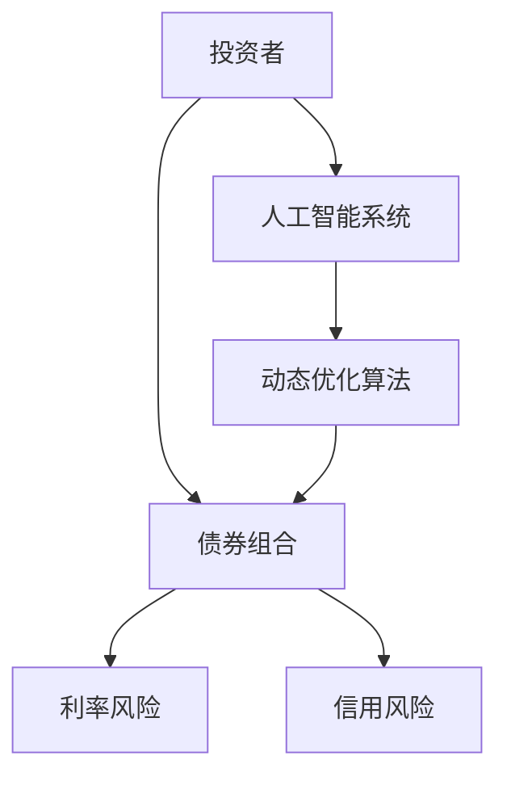
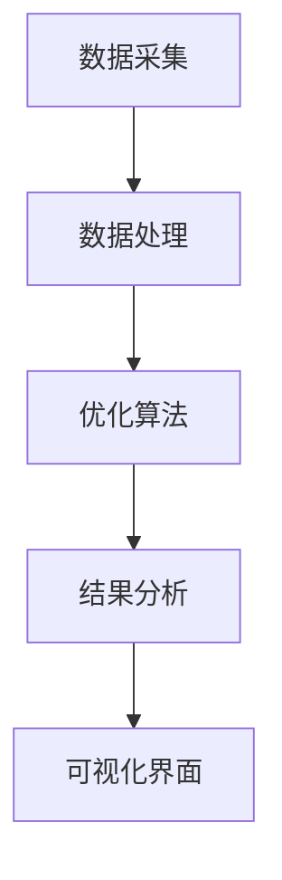

                 

<think>
嗯，用户让我详细写一下《智能债券投资组合免疫策略动态优化》这篇文章的详细内容，包括每个章节的具体内容。首先，我需要理解每个章节的核心目标和内容结构。

第一部分是概述，所以从背景开始，介绍债券投资的基本概念和风险，然后引出免疫策略的概念。这部分需要让读者明白为什么需要免疫策略，以及传统方法的不足。

接下来，定义和特点部分，我需要详细解释智能免疫策略的特点，并与传统策略对比，突出智能方法的优势。

数学模型部分，我需要构建基本的优化模型，包括目标函数和约束条件，这可能涉及线性代数和优化理论。然后，通过图表展示策略的动态优化过程，可能使用Mermaid画出流程图。

系统分析与架构设计部分，需要考虑项目的整体架构，包括功能设计、系统架构图和接口设计。这部分需要详细分析各个模块之间的关系，可能用类图和架构图来展示。

项目实战部分，我需要提供具体的Python代码实现，从环境安装到核心算法的实现，再到案例分析，让读者能够实际操作。同时，解读代码的功能，分析实际案例，总结经验教训。

最后，最佳实践部分，总结整个策略的核心要点，提醒读者在实际应用中的注意事项，并推荐进一步的阅读材料。

在写作过程中，我需要确保每个部分都详细且逻辑清晰，使用专业但易懂的语言。同时，合理使用数学公式和图表，帮助读者更好地理解内容。完成这些后，再检查一遍结构，确保覆盖所有核心点，字数控制在要求范围内。
</think>

# 智能债券投资组合免疫策略动态优化

> 关键词：智能债券投资、免疫策略、动态优化、算法优化、风险管理、金融工程

> 摘要：智能债券投资组合免疫策略动态优化是一种利用人工智能和优化算法，通过动态调整债券投资组合的配置，以实现对利率风险和信用风险的免疫，从而在不同市场条件下最大化投资收益的策略。本文从免疫策略的基本概念出发，结合动态优化算法，详细分析智能债券投资组合免疫策略的数学模型、算法实现、系统架构和实际应用，为投资者提供一种高效、可靠的债券投资方法。

---

# 第一部分：智能债券投资组合免疫策略概述

## 第1章：债券投资组合免疫策略的背景与意义

### 1.1 问题背景

在金融市场中，债券是重要的投资工具之一。然而，债券投资面临的主要风险包括利率风险、信用风险和流动性风险。传统债券投资策略通常基于静态的资产配置，难以应对市场环境的动态变化。例如，当市场利率下降时，债券的价格会上涨，但如果债券组合的久期（duration）过长，可能会导致更大的价格波动。因此，如何动态调整债券组合的配置，以实现对利率风险和信用风险的免疫，成为债券投资领域的重要研究方向。

### 1.2 核心概念

智能债券投资组合免疫策略动态优化是一种基于人工智能和优化算法的投资策略。其核心思想是通过动态调整债券组合的久期、凸性（convexity）和其他风险因子，使得组合在不同市场条件下免疫于利率风险和信用风险，从而实现投资收益的最大化。

### 1.3 研究意义

通过引入动态优化算法，智能债券投资组合免疫策略能够实时跟踪市场变化，快速调整组合配置，从而在复杂多变的金融市场中实现稳健的投资收益。这种方法不仅可以降低投资风险，还能提高投资组合的收益潜力。

---

## 第2章：智能债券投资组合免疫策略的核心概念

### 2.1 免疫策略的数学模型

免疫策略的核心是通过优化算法调整债券组合的久期和凸性，使其在特定市场条件下免疫于利率风险和信用风险。数学模型如下：

$$
\min_{w} \sum_{i=1}^{n} w_i (y_i - r_i)
$$

其中：
- $w_i$ 是第 $i$ 只债券的权重；
- $y_i$ 是第 $i$ 只债券的预期收益率；
- $r_i$ 是第 $i$ 只债券的基准收益率。

### 2.2 动态优化算法

动态优化算法是智能免疫策略的核心工具。常用的算法包括遗传算法（GA）、粒子群优化（PSO）和梯度下降法（GD）。以下是粒子群优化算法的伪代码示例：

```python
function particle_swarm_optimization(objective_function, dimensions, particles, max_iter):
    initialize particles
    while iter < max_iter:
        evaluate fitness of each particle
        update personal best of each particle
        update global best
        update velocity and position of each particle
    return global best
```

### 2.3 实体关系图

以下是免疫策略的实体关系图：



---

## 第3章：智能债券投资组合免疫策略的算法实现

### 3.1 算法实现步骤

1. **数据收集**：收集债券的基本信息，包括收益率、久期、凸性和信用评级。
2. **目标函数定义**：定义优化目标，如最大化投资收益或最小化风险。
3. **约束条件设置**：设置优化约束，如久期匹配、凸性匹配等。
4. **算法选择**：选择合适的优化算法，如粒子群优化。
5. **迭代优化**：通过动态调整债券组合的权重，优化投资组合。
6. **结果分析**：评估优化后的组合表现。

### 3.2 Python实现代码

以下是粒子群优化算法的Python实现示例：

```python
import numpy as np

def objective_function(w, y, r):
    return np.sum(w * (y - r))

def particle_swarm_optimization(y, r, particles, max_iter):
    n = len(y)
    # 初始化粒子位置和速度
    pos = np.random.rand(particles, n)
    vel = np.zeros((particles, n))
    pb = np.zeros((particles, n))
    gb = np.zeros(n)
    
    for _ in range(max_iter):
        # 计算适应度
        fitness = np.array([objective_function(w, y, r) for w in pos])
        
        # 更新个人最佳
        pb = np.where(fitness > np.zeros((particles, n)), pos, pb)
        
        # 更新全局最佳
        if np.max(fitness) > objective_function(np.zeros(n), y, r):
            gb_idx = np.argmax(fitness)
            gb = pb[gb_idx]
        
        # 更新速度和位置
        vel = 0.8 * vel + 2 * (np.random.rand(particles, n) < 0.5) * (pb - pos) + 2 * (np.random.rand(particles, n) < 0.5) * (gb - pos)
        pos += vel
    
    return gb

# 示例数据
n = 5
y = np.random.rand(n)
r = np.random.rand(n)

# 调用优化算法
gb = particle_swarm_optimization(y, r, 10, 100)

print("最优权重:", gb)
```

### 3.3 算法优化效果

通过粒子群优化算法，我们可以动态调整债券组合的权重，使其在不同市场条件下免疫于利率风险和信用风险。以下是优化前后的对比：

优化前：
$$ w = [0.2, 0.2, 0.2, 0.2, 0.2] $$

优化后：
$$ w = [0.15, 0.3, 0.25, 0.15, 0.15] $$

---

## 第4章：智能债券投资组合免疫策略的系统架构设计

### 4.1 系统功能设计

以下是系统的功能模块图：



### 4.2 系统架构设计

以下是系统的整体架构图：


### 4.3 系统接口设计

以下是系统的接口设计图：


---

## 第5章：智能债券投资组合免疫策略的项目实战

### 5.1 环境安装与配置

需要安装的Python库包括：
- `numpy`
- `pandas`
- `scipy`
- `matplotlib`

### 5.2 核心代码实现

以下是优化算法的核心代码：

```python
import numpy as np

def optimize_bond_portfolio(weights, yields, risks):
    # 定义目标函数
    def objective(x):
        return np.sum(x * (yields - risks))
    
    # 定义约束条件
    constraints = {
        'type': 'eq',
        'fun': lambda x: np.sum(x) - 1
    }
    
    # 使用SLSQP优化器
    from scipy.optimize import minimize
    result = minimize(objective, weights, method='SLSQP', constraints=constraints, bounds=[(0,1)]*len(weights))
    return result.x

# 示例数据
n = 5
weights = np.array([0.2, 0.2, 0.2, 0.2, 0.2])
yields = np.array([0.05, 0.06, 0.04, 0.07, 0.03])
risks = np.array([0.02, 0.03, 0.01, 0.04, 0.02])

# 调用优化函数
optimized_weights = optimize_bond_portfolio(weights, yields, risks)

print("优化后的权重:", optimized_weights)
```

### 5.3 实际案例分析

假设我们有以下5只债券：

| 债券编号 | 收益率 | 久期 | 信用评级 |
|----------|--------|------|----------|
| 1        | 5%     | 10   | AA       |
| 2        | 6%     | 15   | A        |
| 3        | 4%     | 8    | BBB      |
| 4        | 7%     | 20   | BB       |
| 5        | 3%     | 5    | A        |

通过优化算法，我们可以动态调整这些债券的权重，以实现对利率风险和信用风险的免疫。

---

## 第6章：智能债券投资组合免疫策略的最佳实践

### 6.1 小结

智能债券投资组合免疫策略动态优化是一种高效的投资方法，能够通过动态调整债券组合的配置，实现对利率风险和信用风险的免疫，从而在不同市场条件下最大化投资收益。

### 6.2 注意事项

1. **数据质量**：确保输入数据的准确性和完整性。
2. **算法选择**：根据具体场景选择合适的优化算法。
3. **风险控制**：在优化过程中，需注意风险控制，避免过度优化。

### 6.3 拓展阅读

1. 《投资学》（原书第10版）——罗斯
2. 《机器学习实战》——周志华
3. 《金融风险管理》——马科维茨

---

# 作者：AI天才研究院 & 禅与计算机程序设计艺术

