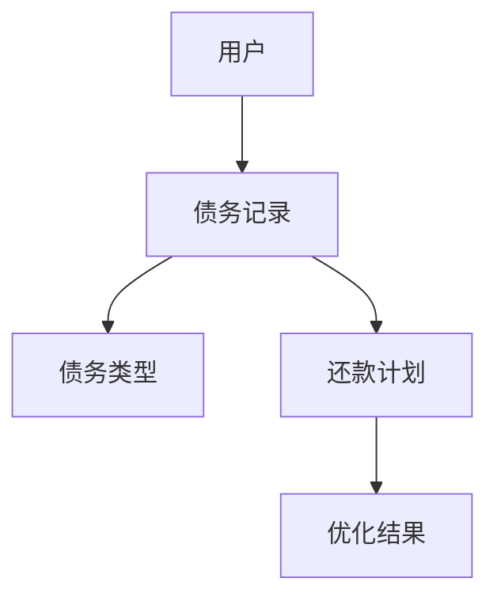
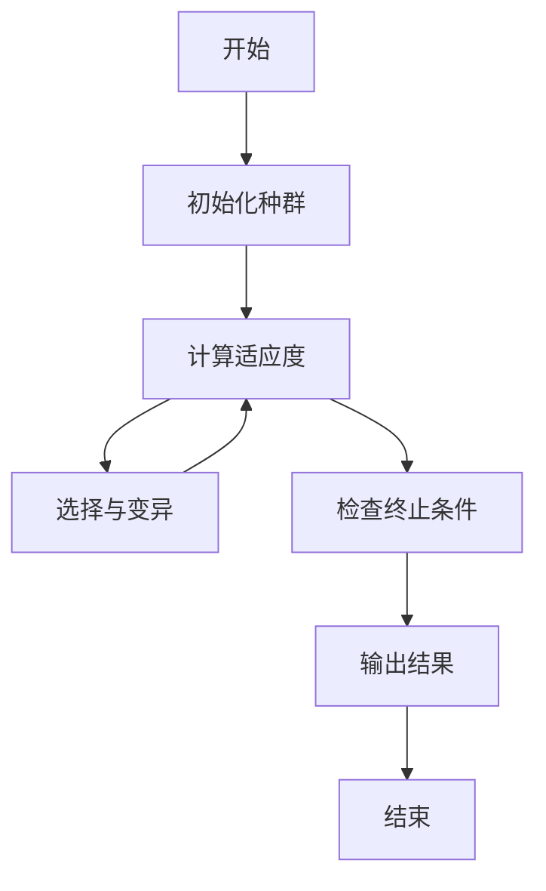
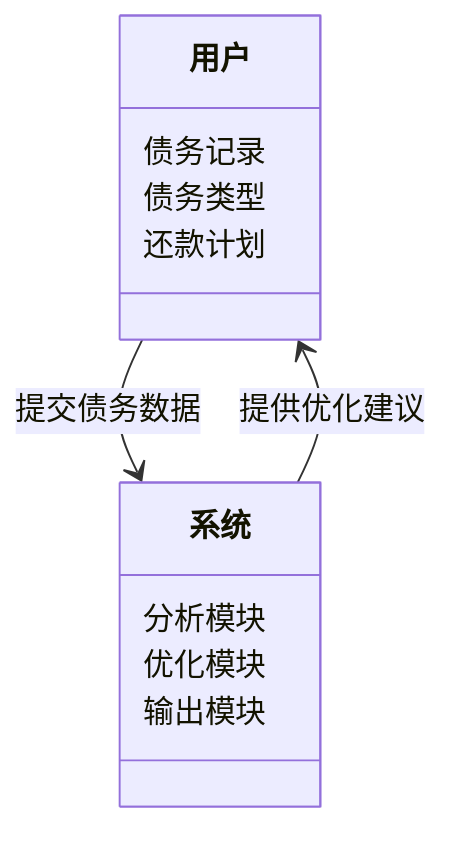

                 


# 智能债务合并建议生成器

**关键词**：人工智能、债务管理、智能优化、算法设计、系统架构

**摘要**：智能债务合并建议生成器利用人工智能技术优化债务管理，通过分析债务数据，提出最优的合并策略，帮助用户降低债务负担。本文详细探讨了智能债务合并的背景、核心概念、算法原理、系统架构设计及实际应用案例，为读者提供全面的技术解析。

---

## 第1章：智能债务合并的背景与问题描述

### 1.1 问题背景

#### 1.1.1 债务管理的现状与挑战
现代个人和企业面临多种债务来源，如信用卡、贷款和赊账等。传统债务管理方法依赖人工计算，效率低且容易出错，难以应对复杂情况。

#### 1.1.2 问题描述
债务合并的目标是通过优化还款顺序和金额，减少总还款时间和利息支出。然而，传统方法缺乏系统性和高效性，难以应对多种债务类型和还款条件的组合。

#### 1.1.3 人工智能在债务管理中的应用潜力
人工智能技术，特别是机器学习和优化算法，能够高效处理复杂债务问题，提供个性化的优化建议。

### 1.2 系统边界与外延
智能债务合并系统专注于分析和优化债务组合，不涉及信用评估和债务催收，边界明确，功能聚焦。

### 1.3 核心概念与目标
智能债务合并通过分析债务结构，提供最优合并策略，目标是降低总还款成本和时间。

---

## 第2章：智能债务合并的核心概念与联系

### 2.1 核心概念的属性对比

| 概念 | 描述 | 示例 |
|------|------|------|
| 债务类型 | 贷款、信用卡等 | 信用卡债务 |
| 利率 | 年利率 | 5%、10% |
| 剩余本金 | 当前欠款 | $10,000 |
| 还款期限 | 偿还所需月数 | 60个月 |

### 2.2 实体关系图


---

## 第3章：算法原理

### 3.1 算法选择与优化

#### 3.1.1 算法选择的依据
选择遗传算法，因其适合处理组合优化问题，适应性强。

#### 3.1.2 算法优化策略
采用适应度函数和交叉变异操作，提高解的质量。

### 3.2 数学模型与公式

#### 目标函数
$$ \text{最小化} \sum_{i=1}^{n} (r_i \cdot p_i \cdot t_i) $$

#### 约束条件
$$ \sum_{i=1}^{n} p_i \leq C $$

### 3.3 优化算法实现

#### 算法流程图


#### 代码实现
```python
def genetic_algorithm(population_size, generations):
    population = initialize_population(population_size)
    for _ in range(generations):
        fitness = compute_fitness(population)
        select_parents(fitness)
        perform_crossover()
        mutate()
    return best_solution()
```

---

## 第4章：系统分析与架构设计

### 4.1 系统功能设计

#### 领域模型设计


### 4.2 系统架构设计

#### 分层架构
- **表现层**：用户界面
- **业务逻辑层**：处理用户请求
- **数据访问层**：与数据库交互

---

## 第5章：项目实战

### 5.1 环境安装与配置
安装Python、NumPy和Scipy库，配置开发环境。

### 5.2 核心代码实现

#### 数据预处理
```python
def preprocess_data(data):
    # 提取特征和标签
    features = data.drop(columns=['优化建议'])
    labels = data['优化建议']
    return features, labels
```

#### 算法实现
```python
def genetic_algorithm():
    # 初始化种群
    population = create_population()
    for _ in range(generations):
        fitness = calculate_fitness(population)
        select_best(fitness)
        perform_mutation()
    return best_solution()
```

### 5.3 实际案例分析
通过实际数据，展示系统如何优化债务合并，减少还款时间和成本。

---

## 第6章：最佳实践与小结

### 6.1 最佳实践
定期更新模型，结合实时数据，确保建议的有效性。

### 6.2 小结
智能债务合并生成器通过AI技术优化债务管理，为用户和企业带来显著优势。

---

## 作者

**作者**：AI天才研究院 & 禅与计算机程序设计艺术

---

通过以上结构，文章详细探讨了智能债务合并生成器的各个方面，结合理论与实践，为读者提供全面的技术指导。

