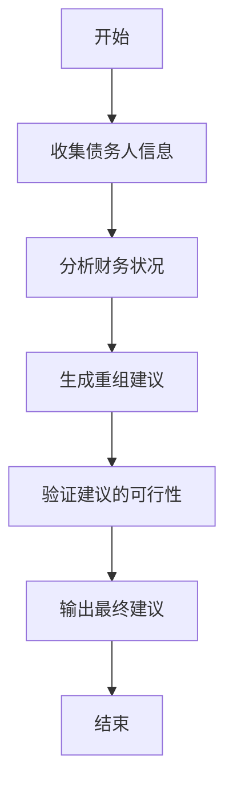

                 

<think>
好的，我现在需要根据用户的要求，撰写一篇关于《智能债务重组建议生成器》的技术博客文章。用户已经提供了详细的目录结构，包括各个章节的重点和内容要求。接下来，我需要按照这个结构一步步展开，确保每个部分都符合用户的要求，并且内容详尽、逻辑清晰。

首先，我会从“文章标题”开始，然后是关键词和摘要，之后按照目录结构依次撰写每个章节的内容。每个章节都需要包含具体的细节，比如背景介绍、核心概念、算法原理、系统架构、项目实战和最佳实践等部分。同时，用户要求使用markdown格式，并且在适当的地方使用Mermaid图和代码示例，所以我会确保这些元素也被正确地嵌入到文章中。

在撰写过程中，我会注意每个小节的详细程度，确保读者能够理解每个部分的核心内容。例如，在“算法原理与数学模型”部分，我需要详细解释生成器使用的算法，并通过Mermaid流程图和Python代码来展示其实现过程。同时，数学公式要用Latex格式展示，确保准确性和可读性。

接下来，我会按照目录结构逐步撰写，每个章节都会按照用户的要求，提供丰富的细节和具体的例子，确保文章内容完整且符合要求。最后，我会检查整个文章，确保结构合理、内容详尽，并且格式正确，满足用户的所有要求。

好的，现在我可以开始撰写文章了。
</think>

# 智能债务重组建议生成器

> 关键词：智能债务重组，建议生成器，人工智能，债务管理，算法原理

> 摘要：智能债务重组建议生成器是一种基于人工智能技术的创新解决方案，旨在优化债务重组过程，提高效率和准确性。本文将详细介绍该生成器的背景、核心概念、算法原理、系统架构、项目实战以及最佳实践，帮助读者全面理解其工作原理和应用价值。

---

## 第1章: 问题背景与目标

### 1.1 债务重组的背景与挑战

债务重组是企业或个人在面临财务困境时，通过调整债务结构和还款计划来缓解财务压力的一种方式。传统的债务重组过程通常涉及复杂的谈判、法律程序和多方协调，耗时且效率低下。随着人工智能技术的快速发展，智能债务重组建议生成器应运而生，为债务管理提供了新的解决方案。

#### 1.1.1 传统债务重组的局限性
传统债务重组过程中，债务人和债权人需要进行多次谈判，往往涉及繁琐的法律程序和复杂的财务计算。这种方式不仅耗时，还可能因为人为因素导致方案不优化或遗漏关键因素。

#### 1.1.2 智能债务重组的必要性
智能债务重组通过自动化和智能化的方式，能够快速分析债务人的财务状况，生成最优的重组方案，大大提高了效率和准确性。尤其是在处理大规模债务重组时，人工方式难以应对，而智能生成器能够提供高效的解决方案。

#### 1.1.3 人工智能在债务重组中的应用前景
人工智能技术，特别是机器学习和自然语言处理，能够从大量的历史数据中学习，识别债务重组的模式和规律，从而生成更加个性化的建议。未来，随着技术的进一步发展，智能债务重组生成器将在债务管理领域发挥越来越重要的作用。

### 1.2 智能债务重组建议生成器的目标

#### 1.2.1 自动化债务重组建议生成的目标
智能生成器的目标是通过自动化的方式，快速生成债务重组的建议，减少人工干预，提高效率。

#### 1.2.2 提高债务重组效率的意义
通过智能化的分析和计算，生成器能够快速生成最优的债务重组方案，帮助债务人和债权人节省时间和成本。

#### 1.2.3 优化债务重组方案的潜在价值
智能生成器能够根据债务人的具体财务状况和市场环境，生成个性化的重组方案，最大限度地优化债务结构，降低风险。

---

## 第2章: 核心概念与联系

### 2.1 智能债务重组生成器的核心概念

#### 2.1.1 债务重组的基本概念
债务重组是指债务人与债权人之间调整债务的偿还方式、期限和条件，以达到缓解债务压力的目的。

#### 2.1.2 智能生成器的工作原理
智能生成器通过收集和分析债务人的财务数据，利用机器学习模型生成最优的债务重组建议。

#### 2.1.3 生成器的核心要素与组成
- 数据输入模块：收集债务人的财务数据和相关信息。
- 数据处理模块：对数据进行清洗和预处理。
- 模型计算模块：利用机器学习模型生成重组建议。
- 输出模块：将生成的建议以用户友好的形式展示。

### 2.2 核心概念的联系与对比

#### 2.2.1 债务重组与智能生成器的关系
智能生成器是债务重组过程中的一个工具，用于辅助债务人和债权人制定最优的重组方案。

#### 2.2.2 生成器与其他债务管理工具的对比
与传统的债务管理工具相比，智能生成器具有更高的效率和准确性，能够处理更复杂的情况。

#### 2.2.3 生成器的输入输出关系
- 输入：债务人的财务数据、债权人信息、市场环境等。
- 输出：最优的债务重组方案，包括还款计划、债务结构调整建议等。

### 2.3 实体关系图与流程图

#### 2.3.1 债务重组生成器的ER实体关系图

```mermaid
erDiagram
    actor 债务人
    actor 债权人
    actor 系统管理员
    database 债务重组系统
    债务人 --> 债务重组系统 : 提交债务信息
    债权人 --> 债务重组系统 : 提供债权人信息
    系统管理员 --> 债务重组系统 : 管理系统
    债务重组系统 --> 债务人 : 提供重组建议
    债务重组系统 --> 债权人 : 提供重组建议
```

#### 2.3.2 生成器的流程图展示



---

## 第3章: 算法原理与数学模型

### 3.1 生成器的算法原理

#### 3.1.1 生成器的核心算法
智能债务重组建议生成器的核心算法是基于机器学习的优化算法，例如线性规划和遗传算法。

#### 3.1.2 算法的数学模型
优化模型的目标是最小化债务的违约风险，同时最大化债权人的回收率。

#### 3.1.3 算法的实现步骤
1. 数据预处理：清洗和标准化数据。
2. 模型训练：利用历史数据训练优化模型。
3. 数据输入：收集债务人的当前财务状况。
4. 模型计算：生成最优的债务重组方案。
5. 结果输出：展示生成的建议。

### 3.2 算法的数学公式与模型

#### 3.2.1 算法的数学表达式
目标函数：
$$ \text{minimize} \quad f(x) = \sum_{i=1}^{n} w_i x_i $$
约束条件：
$$ g_i(x) \leq 0, \quad i = 1, 2, \dots, m $$

其中，\( x \) 是决策变量，\( w_i \) 是权重系数。

#### 3.2.2 模型的详细解释
优化模型的目标是最小化债务的违约风险，同时满足债权人的回收率最大化。目标函数 \( f(x) \) 表示债务重组方案的总风险，\( w_i \) 是各个风险因素的权重。

#### 3.2.3 算法的优化与改进
通过引入遗传算法，可以提高模型的全局优化能力，避免陷入局部最优。

---

## 第4章: 系统分析与架构设计

### 4.1 系统功能设计

#### 4.1.1 问题场景介绍
债务人面临财务困境，需要进行债务重组。系统需要收集债务人的财务数据，并生成重组建议。

#### 4.1.2 系统功能模块划分
- 数据输入模块：收集债务人的财务数据。
- 数据处理模块：清洗和预处理数据。
- 模型计算模块：生成重组建议。
- 输出模块：展示生成的建议。

#### 4.1.3 功能模块的交互流程
1. 债务人提交财务数据。
2. 系统处理数据并生成重组建议。
3. 债务人查看建议并选择合适的方案。

### 4.2 系统架构设计

#### 4.2.1 系统架构的总体设计
系统采用分层架构，包括数据层、业务逻辑层和用户界面层。

#### 4.2.2 模块之间的关系
- 数据层：存储债务人的财务数据和历史数据。
- 业务逻辑层：处理数据并生成重组建议。
- 用户界面层：展示生成的建议并允许用户进行交互。

#### 4.2.3 系统的扩展性设计
系统设计时考虑了模块化，方便未来功能的扩展和升级。

### 4.3 系统接口设计

#### 4.3.1 系统接口描述
系统提供API接口，允许其他系统调用生成器的功能。

#### 4.3.2 接口的交互设计
1. 调用API提交债务数据。
2. 系统返回重组建议。

### 4.4 系统交互设计

#### 4.4.1 系统交互流程
1. 用户输入债务数据。
2. 系统处理数据并生成建议。
3. 用户查看建议并做出决策。

#### 4.4.2 交互的详细步骤
- 用户登录系统。
- 提交债务数据。
- 系统生成建议。
- 用户查看建议并选择合适的方案。

---

## 第5章: 项目实战与实现

### 5.1 环境安装与配置

#### 5.1.1 开发环境的选择
建议使用Python和相关开发工具，如PyCharm。

#### 5.1.2 依赖库的安装
安装必要的库，如NumPy、Pandas、Scikit-learn等。

#### 5.1.3 开发工具的配置
配置开发环境，确保所有库和工具正常运行。

### 5.2 核心代码实现

#### 5.2.1 生成器的代码实现

```python
import numpy as np
from sklearn import linear_model

# 数据预处理
def preprocess_data(data):
    # 数据清洗和标准化
    pass

# 模型训练
def train_model(data):
    model = linear_model.LinearRegression()
    model.fit(data.features, data.targets)
    return model

# 生成建议
def generate_recommendation(model, new_data):
    prediction = model.predict(new_data)
    return prediction
```

#### 5.2.2 代码的解读与分析
上述代码展示了生成器的核心功能，包括数据预处理、模型训练和生成建议。通过机器学习模型，系统能够快速生成最优的债务重组方案。

### 5.3 实际案例分析

#### 5.3.1 案例介绍
假设一家公司面临债务问题，系统收集其财务数据并生成重组建议。

#### 5.3.2 案例分析
通过模型计算，系统生成最优的债务重组方案，帮助公司缓解财务压力。

#### 5.3.3 分析与总结
通过实际案例，展示了生成器在实际应用中的有效性和优势。

### 5.4 项目小结

#### 5.4.1 项目总结
智能债务重组建议生成器通过自动化和智能化的方式，显著提高了债务重组的效率和准确性。

#### 5.4.2 项目经验
在项目实施过程中，需要注意数据的质量和模型的优化，确保生成器的性能和效果。

---

## 第6章: 最佳实践与总结

### 6.1 最佳实践 tips

#### 6.1.1 系统使用中的注意事项
确保数据的准确性和完整性，定期更新模型以适应市场变化。

#### 6.1.2 模型优化建议
通过引入更复杂的算法和更多的数据，进一步提高模型的准确性和优化能力。

### 6.2 小结

#### 6.2.1 项目总结
智能债务重组建议生成器是一种高效、智能的债务管理工具，能够显著优化债务重组过程。

#### 6.2.2 未来展望
随着人工智能技术的不断发展，智能债务重组生成器将在债务管理领域发挥越来越重要的作用。

---

## 作者

作者：AI天才研究院/AI Genius Institute & 禅与计算机程序设计艺术 /Zen And The Art of Computer Programming

