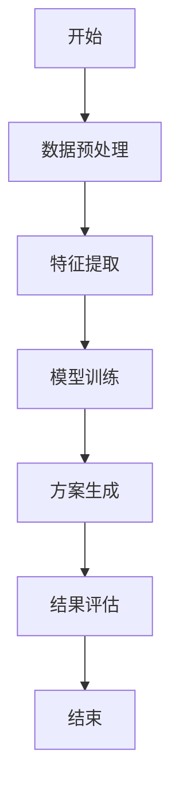
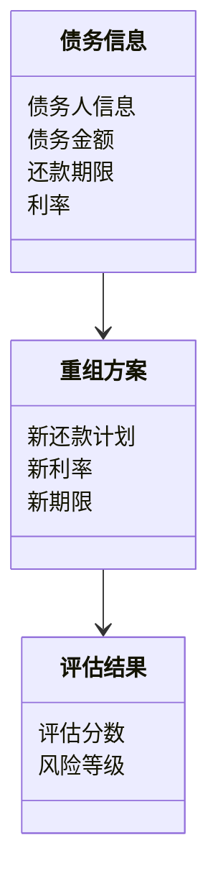
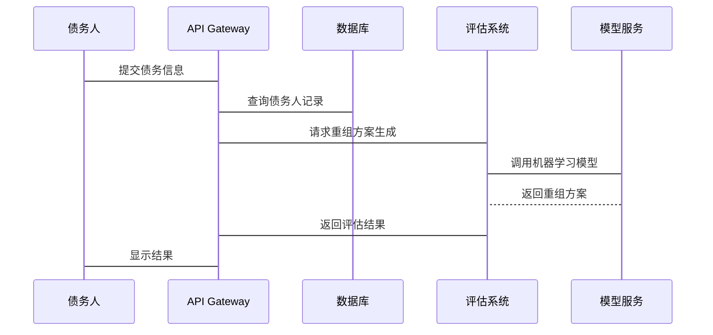

                 

<think>
嗯，我需要为《智能债务重组方案生成与评估》这本书设计一个目录大纲。首先，我得理解这本书的主题是什么。债务重组听起来像是财务领域的内容，但加上“智能”两个字，应该涉及到人工智能或者机器学习的应用。

让我先列出一些关键点。债务重组是指调整债务条件，比如延长还款期限、减少利息等，以帮助债务人更好地偿还债务。传统的方法可能依赖于人工评估，效率低且可能有主观因素影响。智能债务重组应该利用技术手段，比如数据分析和机器学习模型，来自动评估和生成最优的重组方案。

接下来，我需要确定这本书的结构。通常，技术书籍会包括引言、理论基础、算法原理、系统设计、项目实战、案例分析和结论等部分。这里需要详细一些，确保覆盖所有重要内容。

首先是引言部分，应该包括债务重组的基本概念、问题背景，以及智能债务重组的必要性和优势。这部分要吸引读者，让他们明白为什么需要智能债务重组。

接下来是核心概念与联系。我需要解释智能债务重组的核心原理，比如如何利用数据驱动的方法，机器学习模型如何构建，以及重组方案的生成和评估过程。可能需要一个章节来详细说明这些内容，并通过ER图来展示实体之间的关系。

然后是算法原理与数学模型。这部分要具体，包括使用的机器学习算法，比如线性回归、决策树或者神经网络。需要详细讲解这些算法如何应用到债务重组中，提供数学公式和流程图来说明整个过程。

接下来是系统分析与架构设计。这可能涉及系统的整体架构，比如前端和后端的设计，数据流如何处理，接口如何交互。用Mermaid图来展示系统架构和交互流程会更直观。

项目实战部分需要具体实施步骤，包括环境配置、代码实现、案例分析等。这部分要让读者能够实际操作，了解如何将理论应用到实践中。

最后是结论与展望，总结全书内容，并展望未来的发展方向，比如更高级的算法或者结合其他技术如区块链的应用。

在写作过程中，我需要确保每个部分都详细且必要，涵盖理论和实践，同时用清晰易懂的语言解释复杂的技术概念。另外，使用图表和代码示例可以增强理解，帮助读者更好地掌握智能债务重组的实现方法。

可能还需要考虑读者的背景，他们可能是金融从业者、数据科学家或者技术爱好者，因此内容需要兼顾技术深度和实用性，避免过于晦涩或过于简单。

总的来说，这本书的结构应该是从基础概念到高级算法，再到实际应用，层层深入，帮助读者全面理解智能债务重组的原理和应用。
</think>

```markdown
# 智能债务重组方案生成与评估

> 关键词：智能债务重组、机器学习、金融算法、债务优化、风险评估

> 摘要：本文深入探讨了智能债务重组的理论基础、算法实现及其在金融领域的实际应用。通过结合数据驱动的方法和机器学习技术，提出了一种创新的债务重组方案生成与评估方法，旨在提高债务重组的效率和准确性，降低风险。

---

# 第一部分：智能债务重组的背景与核心概念

## 第1章：债务重组的基本概念与问题背景

### 1.1 债务重组的定义与基本原理
- 债务重组的定义
- 债务重组的传统方法与局限性
- 智能债务重组的提出与意义

### 1.2 智能债务重组的核心问题
- 债务重组中的关键问题
- 智能债务重组的目标与边界
- 核心要素与组成部分

### 1.3 智能债务重组的背景与应用前景
- 当前债务重组的痛点与挑战
- 智能债务重组的技术基础
- 在金融领域的应用前景

---

## 第2章：智能债务重组的核心概念与联系

### 2.1 智能债务重组的核心原理
- 数据驱动的债务重组模型
- 机器学习在债务重组中的应用
- 算法框架与实现步骤

### 2.2 核心概念的属性特征对比
- 数据特征对比表
- 算法特征对比表
- 评估指标对比表

### 2.3 ER实体关系图架构
```mermaid
er
    actor: 债务人
    actor: 债权人
    actor: 评估系统
    entity: 债务信息
    entity: 重组方案
    entity: 评估结果
    relation: 债务人 -> 提交债务信息
    relation: 债权人 -> 提交评估需求
    relation: 评估系统 -> 生成重组方案
    relation: 评估系统 -> 输出评估结果
```

---

# 第二部分：智能债务重组的算法原理与数学模型

## 第3章：算法原理与数学模型

### 3.1 算法原理
- 基于机器学习的债务重组算法
- 算法流程图


### 3.2 数学模型与公式
- 线性回归模型：$$ y = \beta_0 + \beta_1x + \epsilon $$
- 支持向量机模型：$$ \text{minimize} \quad \frac{1}{2}||\mathbf{w}||^2 + C \sum_{i=1}^n \xi_i $$
  $$ \text{subject to} \quad y_i - \mathbf{w}^T \mathbf{x}_i \geq 1 - \xi_i, \quad \xi_i \geq 0 $$

### 3.3 代码实现
```python
import pandas as pd
from sklearn.model_selection import train_test_split
from sklearn.linear_model import LinearRegression

# 数据加载与预处理
data = pd.read_csv('debt_data.csv')
X = data[['income', 'debt', 'credit_score']]
y = data['default_probability']

# 数据分割
X_train, X_test, y_train, y_test = train_test_split(X, y, test_size=0.2, random_state=42)

# 模型训练
model = LinearRegression()
model.fit(X_train, y_train)

# 预测与评估
y_pred = model.predict(X_test)
print('预测结果:', y_pred)
```

---

## 第4章：系统分析与架构设计

### 4.1 系统功能设计
- 领域模型设计


### 4.2 系统架构设计
- 分层架构设计


### 4.3 接口设计与交互流程


---

## 第5章：项目实战与案例分析

### 5.1 环境安装与配置
- 安装Python环境：`pip install python3`
- 安装依赖库：`pip install pandas scikit-learn`

### 5.2 核心代码实现
```python
import pandas as pd
from sklearn.ensemble import RandomForestClassifier
from sklearn.metrics import accuracy_score

# 数据加载与预处理
data = pd.read_csv('debt_data.csv')
X = data[['income', 'debt', 'credit_score']]
y = data['default_probability']

# 数据分割
X_train, X_test, y_train, y_test = train_test_split(X, y, test_size=0.2, random_state=42)

# 模型训练
model = RandomForestClassifier()
model.fit(X_train, y_train)

# 预测与评估
y_pred = model.predict(X_test)
print('准确率:', accuracy_score(y_test, y_pred))
```

### 5.3 案例分析与结果解读
- 案例背景
- 数据分析
- 方案生成与评估
- 结果解读与优化建议

---

## 第6章：最佳实践与注意事项

### 6.1 最佳实践
- 数据质量的重要性
- 模型选择与调优
- 结果解释与可视化

### 6.2 注意事项
- 数据隐私与合规性
- 模型的可解释性
- 业务规则的融合

### 6.3 小结与展望
- 全文总结
- 未来研究方向
- 技术发展趋势

---

# 结论

智能债务重组方案生成与评估是一项结合了金融知识与人工智能技术的复杂任务。通过本文的系统介绍，读者可以全面理解智能债务重组的核心概念、算法原理、系统架构及实际应用。未来，随着技术的进步，智能债务重组将更加高效和精准，为金融行业带来更大的价值。

---

# 作者：AI天才研究院 & 禅与计算机程序设计艺术
```

