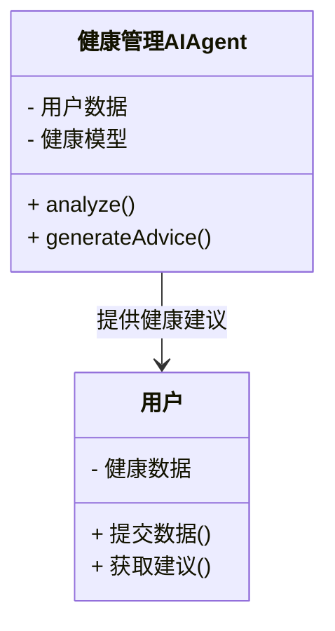

                 


# 智能健康管理 AI Agent：LLM 驱动的个人健康助手

---

## 关键词：
智能健康管理、AI Agent、LLM、个人健康助手、健康数据分析、大语言模型、人工智能

---

## 摘要：
随着人工智能和大语言模型（LLM）技术的快速发展，智能健康管理 AI Agent 正在成为个人健康助手的核心技术。本文从智能健康管理的背景出发，详细探讨了 LLM 在健康数据分析中的应用，结合系统架构设计和项目实战，全面解析了如何利用 AI Agent 实现个性化的健康管理。文章最后总结了最佳实践和未来发展方向。

---

## 目录大纲：

1. [智能健康管理概述](#智能健康管理概述)
2. [LLM 的核心原理与技术实现](#llm的核心原理与技术实现)
3. [智能健康管理系统的架构与设计](#智能健康管理系统的架构与设计)
4. [项目实战：基于 LLM 的个人健康助手实现](#项目实战基于llm的个人健康助手实现)
5. [最佳实践、总结与展望](#最佳实践总结与展望)

---

## 正文：

---

### 第1章：智能健康管理概述

#### 1.1 健康管理的概念与重要性

智能健康管理是指通过技术手段，对个人的健康数据进行采集、分析和管理，以提供个性化的健康建议和干预措施。传统的健康管理依赖于医生和手动记录，存在效率低、覆盖面窄的问题。

现代智能健康管理通过AI Agent 实现自动化和智能化，能够实时监测健康数据，提供个性化的健康建议，帮助用户更好地管理健康状况。

#### 1.2 问题背景与需求分析

传统健康管理存在以下问题：
- 数据采集不全面，难以覆盖多维度健康指标。
- 分析依赖人工，效率低且易出错。
- 健康建议缺乏个性化，难以满足不同用户需求。

智能健康管理 AI Agent 的需求：
- 实时采集和处理健康数据。
- 提供个性化健康建议。
- 支持多平台、多设备的健康数据同步。

#### 1.3 LLM 在智能健康管理中的应用

LLM（大语言模型）通过自然语言处理技术，能够理解和生成人类语言，适用于健康数据的处理和分析。例如，通过LLM可以将用户的健康记录转化为结构化数据，进行疾病预测和健康建议生成。

---

### 第2章：LLM 的核心原理与技术实现

#### 2.1 LLM 的基本原理

LLM 通过深度学习训练，模拟人类大脑的神经网络，能够理解和生成语言。其核心算法包括 Transformer 和 BERT 等模型。

数学公式：
$$
\text{输出} = \text{模型}(\text{输入})
$$

#### 2.2 LLM 在健康数据处理中的应用

健康数据包括结构化数据（如血压、心率）和非结构化数据（如病历记录）。LLM 可以通过自然语言处理技术，将非结构化数据转化为结构化数据，提高数据的可用性。

代码示例：
```python
import transformers

model = transformers.AutoModelForSeq2Seq.from_pretrained("facebook/bart-large")
tokenizer = transformers.AutoTokenizer.from_pretrained("facebook/bart-large")

input_text = "病历记录：患者咳嗽持续一周，伴有低烧。"
inputs = tokenizer(input_text, return_tensors="pt", max_length=100, truncation=True)
outputs = model.generate(**inputs)
result = tokenizer.decode(outputs[0], skip_special_tokens=True)
print(result)
```

---

### 第3章：智能健康管理系统的架构与设计

#### 3.1 系统功能模块设计

系统功能模块包括：
- 数据采集模块：收集用户的健康数据。
- 数据处理模块：将数据转化为结构化形式。
- 健康分析模块：基于 LLM 提供健康建议。
- 用户交互模块：以自然语言形式反馈给用户。

Mermaid 类图：


#### 3.2 系统架构设计

系统架构采用微服务架构，各模块之间通过 API 接口进行通信。Mermaid 架构图：


---

### 第4章：项目实战：基于 LLM 的个人健康助手实现

#### 4.1 环境配置

安装必要的库：
```bash
pip install transformers
pip install torch
```

#### 4.2 核心代码实现

实现健康数据处理的代码：
```python
import transformers
import torch

# 加载预训练模型
tokenizer = transformers.AutoTokenizer.from_pretrained("facebook/bart-large")
model = transformers.AutoModelForSeq2Seq.from_pretrained("facebook/bart-large")

# 数据处理函数
def process_health_data(input_text):
    inputs = tokenizer(input_text, return_tensors="pt", max_length=100, truncation=True)
    outputs = model.generate(**inputs)
    return tokenizer.decode(outputs[0], skip_special_tokens=True)

# 示例输入
input_text = "用户最近一周的健康数据：体重65kg，血压正常，偶感头痛。"
result = process_health_data(input_text)
print("处理结果:", result)
```

---

### 第5章：最佳实践、总结与展望

#### 5.1 最佳实践

- 数据隐私保护：确保用户数据的安全性。
- 模型优化：提高模型的准确性和响应速度。
- 人机交互设计：提升用户体验。

#### 5.2 总结

智能健康管理 AI Agent 通过 LLM 技术，实现了健康数据的智能化处理和个性化建议生成。本文详细介绍了系统的架构设计和实现方法，为实际应用提供了参考。

#### 5.3 展望

未来，随着 AI 技术的进步，智能健康管理 AI Agent 将更加智能化，能够处理更多类型的健康数据，提供更精准的健康建议。

---

## 作者信息：

作者：AI天才研究院/AI Genius Institute & 禅与计算机程序设计艺术 /Zen And The Art of Computer Programming

