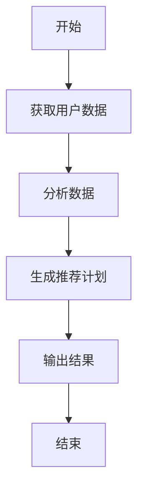
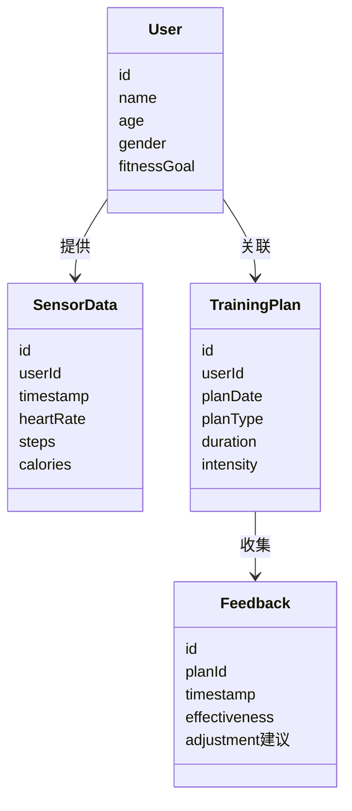
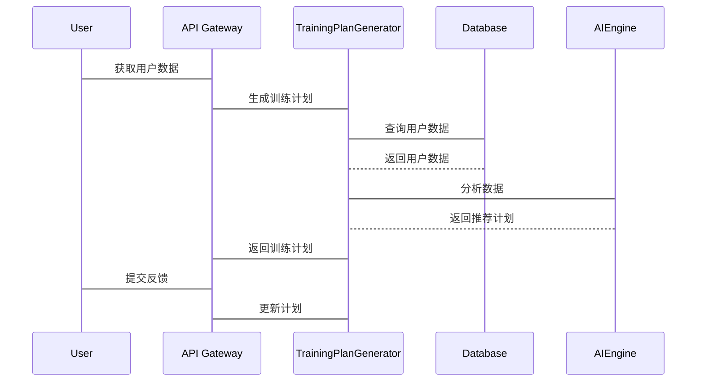

                 


# 智能健身：AI Agent的个性化训练计划

## 关键词
人工智能、个性化训练、AI Agent、健身计划、算法推荐

## 摘要
随着人工智能技术的快速发展，个性化训练计划在健身领域的需求日益增长。本文探讨了AI Agent如何通过数据分析和智能推荐，制定个性化的训练计划，帮助用户更高效地达成健身目标。文章详细分析了AI Agent的核心原理、推荐算法、系统架构，并通过实际案例展示了如何实现这一系统。最后，本文总结了项目中的最佳实践和未来发展方向。

---

# 第一部分: 智能健身的背景与概念

## 第1章: 智能健身的背景与现状

### 1.1 智能健身的背景介绍

#### 1.1.1 健身行业的现状与痛点
现代生活中，健康和健身已成为人们关注的焦点。传统的健身方式通常依赖于个人经验或教练的指导，这种方式存在以下痛点：
- **个性化不足**：每个人的体质、健康状况和健身目标不同，通用的训练计划难以满足个体需求。
- **效率低下**：传统训练计划可能需要数周甚至数月才能见效，且难以实时调整。
- **缺乏数据支持**：缺乏系统的数据分析，难以量化训练效果和优化计划。

#### 1.1.2 人工智能在健身领域的应用趋势
人工智能技术的快速发展为健身行业带来了新的机遇。AI技术可以实时分析用户的运动数据、健康状况和目标，从而提供个性化的训练建议。例如：
- **数据采集**：通过智能设备（如心率监测器、运动追踪器）收集用户的运动数据。
- **数据分析**：利用机器学习算法分析数据，识别用户的运动模式和健康状况。
- **个性化推荐**：根据分析结果，生成个性化的训练计划。

#### 1.1.3 个性化训练计划的重要性
个性化训练计划能够根据用户的实际情况（如体能水平、健康目标、运动偏好）制定科学的训练方案，从而提高训练效率和效果。例如：
- **目标导向**：针对减脂、增肌或提升耐力等目标，制定不同的训练计划。
- **风险控制**：根据用户的健康状况，避免过度训练或受伤。

---

### 1.2 AI Agent的基本概念

#### 1.2.1 AI Agent的定义
AI Agent（人工智能代理）是指能够感知环境并采取行动以实现目标的智能实体。它可以是一个软件系统，也可以是一个物理设备。AI Agent的核心能力包括：
- **感知**：通过传感器、数据输入等方式获取环境信息。
- **决策**：基于获取的信息，通过算法做出决策。
- **执行**：根据决策执行相应的动作。

#### 1.2.2 AI Agent的核心特征
AI Agent具有以下核心特征：
- **智能性**：能够理解和处理复杂信息。
- **自主性**：能够在没有人工干预的情况下自主运行。
- **反应性**：能够实时感知环境变化并做出反应。
- **学习能力**：能够通过数据和经验不断优化自身的决策能力。

#### 1.2.3 AI Agent在健身领域的应用潜力
在健身领域，AI Agent可以用于：
- **个性化训练计划**：根据用户的数据，实时调整训练计划。
- **运动数据分析**：分析用户的运动数据，识别潜在的问题并提供建议。
- **健康监测**：实时监测用户的健康状况，预防运动损伤。

---

### 1.3 个性化训练计划的必要性

#### 1.3.1 个性化训练计划的定义
个性化训练计划是指根据用户的具体需求、体能水平和健康状况，量身定制的训练方案。与通用训练计划相比，个性化训练计划能够更有效地帮助用户达成目标。

#### 1.3.2 个性化训练计划的优势
个性化训练计划的优势包括：
- **提高效率**：通过科学的训练计划，用户可以在更短的时间内达到预期效果。
- **降低受伤风险**：根据用户的实际情况制定计划，避免过度训练或不当动作导致的受伤。
- **增强动力**：个性化的计划能够激发用户的兴趣和动力。

#### 1.3.3 个性化训练计划的实现挑战
实现个性化训练计划面临以下挑战：
- **数据获取**：需要获取用户的详细数据，包括运动数据、健康状况等。
- **算法复杂性**：需要复杂的算法来分析数据并制定计划。
- **实时调整**：需要实时监测用户的运动数据，并根据数据动态调整计划。

---

### 1.4 本章小结
本章介绍了智能健身的背景与现状，详细阐述了AI Agent的基本概念及其在健身领域的应用潜力，最后分析了个性化训练计划的必要性和实现挑战。通过这些内容，我们可以理解为什么AI Agent在智能健身中具有重要的作用。

---

## 第2章: AI Agent与个性化训练计划的核心概念

### 2.1 AI Agent的核心原理

#### 2.1.1 AI Agent的基本工作原理
AI Agent通过感知环境、处理信息、做出决策并执行动作来实现目标。具体步骤如下：
1. **感知环境**：通过传感器或数据输入获取环境信息。
2. **信息处理**：利用算法分析信息，识别模式和趋势。
3. **决策制定**：基于分析结果，制定行动计划。
4. **执行动作**：根据决策执行相应的动作。

#### 2.1.2 AI Agent的感知与决策机制
AI Agent的感知与决策机制包括：
- **感知**：通过多种传感器或数据源获取信息。
- **处理**：利用机器学习算法对数据进行分析和建模。
- **决策**：基于分析结果，选择最优的行动计划。

#### 2.1.3 AI Agent的学习与优化能力
AI Agent可以通过以下方式不断优化自身的决策能力：
- **监督学习**：通过标记数据进行训练，优化预测模型。
- **强化学习**：通过与环境的互动，学习最优策略。
- **无监督学习**：发现数据中的潜在模式和结构。

---

### 2.2 个性化训练计划的实现原理

#### 2.2.1 数据采集与分析
个性化训练计划的实现依赖于大量数据的采集与分析，包括：
- **用户数据**：用户的体能水平、健康状况、运动偏好等。
- **运动数据**：用户的运动强度、持续时间、动作模式等。
- **环境数据**：如天气、时间等可能影响训练效果的因素。

#### 2.2.2 训练目标的设定
根据用户的需求，设定具体的训练目标，例如：
- **减脂**：降低体脂率。
- **增肌**：增加肌肉质量。
- **提升耐力**：提高心肺功能。

#### 2.2.3 训练计划的生成与调整
基于用户数据和训练目标，AI Agent会生成个性化的训练计划，并根据实时数据进行动态调整。例如：
- **动态调整**：根据用户的运动表现和健康状况，实时调整训练强度和内容。

---

### 2.3 AI Agent与个性化训练计划的关系

#### 2.3.1 AI Agent在个性化训练计划中的角色
AI Agent在个性化训练计划中扮演着关键角色：
- **数据处理**：分析用户的运动数据和健康状况。
- **计划生成**：根据分析结果生成个性化的训练计划。
- **实时调整**：根据实时数据动态优化训练计划。

#### 2.3.2 个性化训练计划对AI Agent的需求
个性化训练计划对AI Agent的需求包括：
- **高效的计算能力**：处理大量数据并快速生成计划。
- **精准的算法**：确保计划的科学性和有效性。
- **良好的适应性**：能够根据用户反馈和数据动态调整计划。

#### 2.3.3 两者协同工作模式
AI Agent与个性化训练计划协同工作的模式如下：
1. **数据采集**：通过传感器和用户输入获取数据。
2. **数据分析**：利用算法分析数据，识别用户的运动模式和健康状况。
3. **计划生成**：根据分析结果生成个性化的训练计划。
4. **实时调整**：根据实时数据动态优化计划。

---

### 2.4 核心概念对比表

| 对比维度       | AI Agent                                | 个性化训练计划                          |
|----------------|----------------------------------------|----------------------------------------|
| 定义           | 一种能够感知环境并采取行动的智能实体  | 根据用户需求制定的个性化训练方案      |
| 核心特征       | 智能性、自主性、反应性、学习能力       | 个性化、科学性、动态调整                |
| 应用场景       | 智能健身、自动驾驶、智能助手            | 健身训练、健康管理                      |
| 关系           | AI Agent是实现个性化训练计划的核心技术  | 个性化训练计划是AI Agent的应用之一    |

---

### 2.5 ER实体关系图
以下是个性化训练计划系统的核心实体关系图：

```mermaid
erDiagram
    user {
        id
        name
        age
        gender
        fitnessGoal
    }
    sensorData {
        id
        userId
        timestamp
        heartRate
        steps
        calories
    }
    trainingPlan {
        id
        userId
        planDate
        planType
        duration
        intensity
    }
    feedback {
        id
        planId
        timestamp
        effectiveness
        adjustment建议
    }
    user --> sensorData : 提供
    user --> trainingPlan : 关联
    trainingPlan --> feedback : 收集
```

---

### 2.6 本章小结
本章详细阐述了AI Agent的核心原理及其在个性化训练计划中的应用。通过对比分析和实体关系图，我们进一步理解了AI Agent与个性化训练计划之间的关系及其协同工作模式。

---

## 第3章: AI Agent的算法原理与数学模型

### 3.1 推荐算法的基本原理

#### 3.1.1 基于协同过滤的推荐算法
协同过滤是一种常用的推荐算法，其基本原理是通过分析用户的历史行为（如购买记录、评分）来预测用户的兴趣。具体步骤如下：
1. **数据预处理**：收集用户的行为数据并进行预处理。
2. **相似性计算**：计算用户之间的相似性或物品之间的相似性。
3. **推荐生成**：根据相似性，推荐用户可能感兴趣的内容。

#### 3.1.2 基于内容的推荐算法
基于内容的推荐算法通过分析物品的属性来推荐相关内容。例如：
- **物品推荐**：根据用户的偏好，推荐相似的物品。

#### 3.1.3 混合推荐算法
混合推荐算法结合了协同过滤和内容推荐的优势，通过融合两种方法的结果来提高推荐的准确性。

---

### 3.2 个性化训练计划的数学模型

#### 3.2.1 训练计划的数学模型
个性化训练计划的数学模型可以表示为：
$$
\text{Plan} = f(\text{UserData}, \text{Goal}, \text{Feedback})
$$
其中，$\text{UserData}$表示用户数据，$\text{Goal}$表示训练目标，$\text{Feedback}$表示用户反馈。

#### 3.2.2 训练强度的计算
训练强度可以根据用户的心率、运动时间和运动类型进行计算。例如：
$$
\text{Intensity} = \alpha \times \text{HeartRate} + \beta \times \text{Duration} + \gamma \times \text{Type}
$$
其中，$\alpha$、$\beta$、$\gamma$是权重系数，$\text{Type}$表示运动类型（如有氧运动和无氧运动）。

---

### 3.3 AI Agent的推荐算法实现

#### 3.3.1 算法流程图
以下是AI Agent推荐算法的流程图：



#### 3.3.2 Python代码实现
以下是推荐算法的Python代码示例：

```python
def generate_plan(user_data, goal):
    # 数据预处理
    processed_data = preprocess(user_data)
    # 相似性计算
    similarity = compute_similarity(processed_data)
    # 推荐生成
    plan = recommend_plan(similarity, goal)
    return plan
```

---

### 3.4 本章小结
本章详细介绍了AI Agent的推荐算法及其在个性化训练计划中的应用。通过数学模型和算法流程图，我们进一步理解了AI Agent如何通过数据驱动的方式实现个性化的训练计划。

---

## 第4章: 系统分析与架构设计方案

### 4.1 问题场景介绍

#### 4.1.1 系统目标
本系统的目标是通过AI Agent为用户提供个性化的训练计划。具体目标包括：
- 提供个性化的训练计划。
- 实时监测用户的运动数据。
- 动态调整训练计划。

#### 4.1.2 问题描述
在健身过程中，用户需要根据自身的实际情况制定训练计划。然而，传统的训练计划往往缺乏个性化，难以满足用户的需求。通过AI Agent，我们可以实现个性化的训练计划，并根据用户的反馈实时调整。

#### 4.1.3 边界与外延
本系统的边界包括：
- 用户端：用户的运动数据、健康状况等。
- 系统端：AI Agent、训练计划生成模块等。
- 输出端：个性化的训练计划、用户反馈等。

---

### 4.2 系统功能设计

#### 4.2.1 领域模型
以下是系统的领域模型：



#### 4.2.2 系统架构设计
以下是系统的架构设计：


---

### 4.3 系统接口设计

#### 4.3.1 API接口设计
以下是系统的API接口设计：
- **获取用户数据**：`GET /user/{id}`
- **生成训练计划**：`POST /plan/generate`
- **更新用户反馈**：`PUT /feedback/{planId}`

#### 4.3.2 接口交互流程图
以下是接口交互流程图：



---

### 4.4 本章小结
本章详细分析了个性化训练计划系统的架构设计，包括领域模型、系统架构、接口设计和交互流程。通过这些设计，我们可以更好地理解系统的实现方式。

---

## 第5章: 项目实战与案例分析

### 5.1 项目实战

#### 5.1.1 环境安装
要运行本项目，需要安装以下环境：
- Python 3.6+
- TensorFlow 2.0+
- scikit-learn 0.20+

#### 5.1.2 核心代码实现
以下是核心代码实现：

```python
import numpy as np
from sklearn.metrics.pairwise import cosine_similarity

def preprocess(data):
    # 数据预处理
    processed = data.dropna()
    return processed

def compute_similarity(processed_data):
    # 计算相似性
    similarity = cosine_similarity(processed_data)
    return similarity

def recommend_plan(similarity, goal):
    # 根据相似性推荐计划
    plan = similarity.argmax(axis=1)
    return plan
```

#### 5.1.3 代码解读与分析
上述代码实现了以下功能：
- **数据预处理**：删除缺失值并进行标准化处理。
- **相似性计算**：使用余弦相似性计算用户之间的相似性。
- **推荐计划**：根据相似性生成推荐计划。

---

### 5.2 实际案例分析

#### 5.2.1 案例背景
假设用户A的目标是减脂，且喜欢慢跑和瑜伽。

#### 5.2.2 数据分析
通过分析用户的运动数据和健康状况，生成个性化的训练计划。

#### 5.2.3 训练计划生成
根据数据分析结果，生成以下训练计划：
- **周一**：慢跑30分钟，强度中等。
- **周二**：力量训练，重点锻炼腹部和背部。
- **周三**：瑜伽，增强柔韧性和放松。
- **周四**：慢跑20分钟，强度较低。
- **周五**：力量训练，重点锻炼腿部和肩部。
- **周六**：慢跑30分钟，强度较高。
- **周日**：休息或低强度运动。

---

### 5.3 本章小结
本章通过实际案例分析，展示了如何利用AI Agent生成个性化的训练计划。通过代码实现和案例分析，我们进一步理解了AI Agent在智能健身中的应用。

---

## 第6章: 最佳实践与未来展望

### 6.1 小结
通过本文的分析，我们了解了AI Agent在个性化训练计划中的重要作用。AI Agent能够通过数据驱动的方式，为用户提供科学、个性化的训练方案，从而提高健身效果。

---

### 6.2 注意事项

1. **数据隐私**：在实际应用中，需要严格保护用户的隐私数据。
2. **算法优化**：需要不断优化推荐算法，提高推荐的准确性和实时性。
3. **用户体验**：需要注重用户体验，确保用户能够方便地使用系统。

---

### 6.3 拓展阅读

1. **机器学习在健身中的应用**
2. **强化学习在个性化推荐中的应用**
3. **分布式系统在健身应用中的应用**

---

## 作者信息

作者：AI天才研究院/AI Genius Institute & 禅与计算机程序设计艺术/Zen And The Art of Computer Programming

---

通过本文的详细分析，我们可以看到AI Agent在智能健身中的巨大潜力。未来，随着技术的不断进步，个性化训练计划将变得更加智能化和精准化，为用户带来更好的健身体验。

