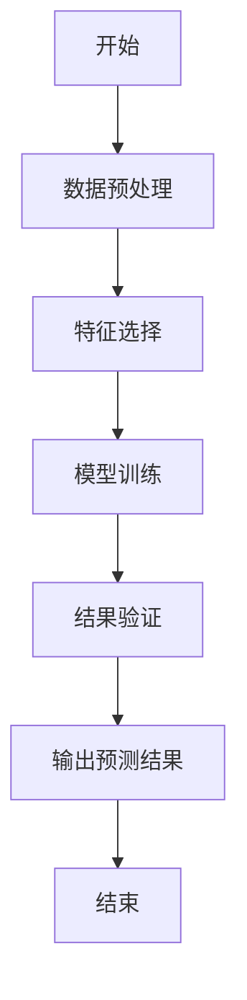
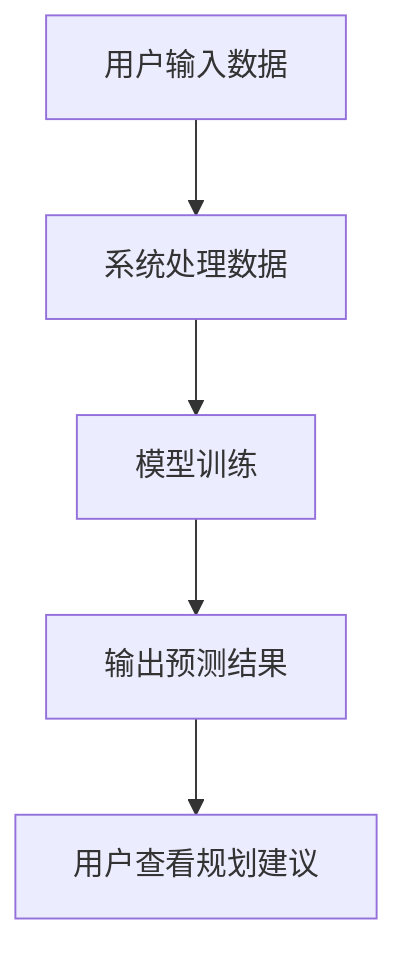
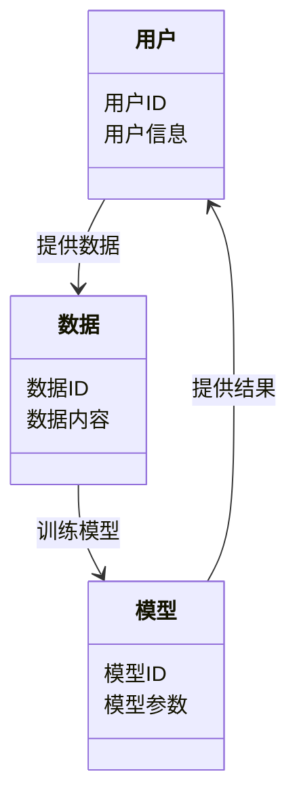
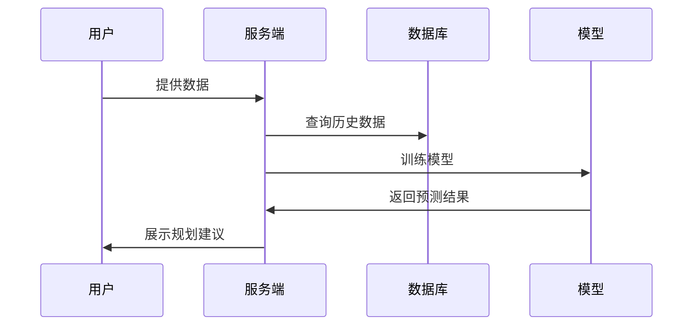

                 


# 智能养老金缺口分析与规划工具

## 关键词：养老金缺口分析，人工智能，规划工具，智能算法，养老金管理

## 摘要：  
随着人口老龄化加剧，养老金缺口问题日益突出。本文提出了一种基于人工智能的养老金缺口分析与规划工具，通过智能算法和大数据分析，帮助个人和机构准确预测养老金缺口，并制定科学的弥补计划。文章详细介绍了工具的背景、核心概念、算法原理、系统架构，以及实际案例的应用，为解决养老金缺口问题提供了创新的思路和方法。

---

# 目录大纲：《智能养老金缺口分析与规划工具》

---

## 第一部分：智能养老金缺口分析与规划工具概述

### 第1章：智能养老金缺口分析与规划工具的背景与意义

#### 1.1 问题背景
- 1.1.1 养老金缺口问题的现状：随着人口老龄化加剧，许多国家面临养老金不足的问题，缺口越来越大。
- 1.1.2 养老金缺口问题的严重性：养老金缺口可能导致老年人贫困，影响社会稳定。
- 1.1.3 智能技术在养老金缺口分析中的作用：通过大数据和人工智能技术，可以更准确地预测和规划养老金缺口。

#### 1.2 问题描述
- 1.2.1 养老金缺口的定义与计算方法：养老金缺口是指退休后实际需求与现有养老金供给之间的差额。
- 1.2.2 养老金缺口分析的关键因素：包括收入水平、寿命 expectancy、通胀率、投资回报率等。
- 1.2.3 养老金缺口规划的目标与挑战：目标是通过科学的规划，减少或消除养老金缺口；挑战在于如何准确预测未来经济环境和个体需求。

#### 1.3 问题解决方法
- 1.3.1 智能养老金缺口分析的基本思路：利用机器学习模型预测养老金需求和供给，计算缺口。
- 1.3.2 智能规划工具的核心功能：包括缺口预测、多种规划方案推荐、风险评估和优化建议。
- 1.3.3 技术实现的关键点：数据采集与清洗、模型训练与优化、用户交互设计。

#### 1.4 边界与外延
- 1.4.1 智能养老金缺口分析的适用范围：适用于个人、家庭、企业员工等不同用户群体。
- 1.4.2 工具的边界条件与限制：假设用户提供的数据准确，模型基于历史数据预测未来，不考虑突发性事件（如经济危机）的影响。
- 1.4.3 相关领域的扩展与延伸：可以结合健康管理、资产配置等领域，提供更全面的退休规划服务。

#### 1.5 概念结构与核心要素
- 1.5.1 核心概念的层次结构：包括养老金需求、供给、缺口、规划方案等。
- 1.5.2 核心要素的定义与关系：养老金需求与供给之间的关系是分析的核心，缺口是两者差异的结果，规划方案则是解决缺口的手段。
- 1.5.3 概念模型的构建与分析：通过构建概念模型，明确各要素之间的相互作用和影响。

---

## 第二部分：核心概念与联系

### 第2章：核心概念与联系

#### 2.1 核心概念原理
- 2.1.1 养老金缺口分析的数学模型：基于时间序列分析、回归分析等方法。
- 2.1.2 智能规划工具的算法基础：包括机器学习算法（如随机森林、神经网络）和优化算法（如遗传算法）。
- 2.1.3 核心概念的相互作用：养老金需求与供给受多种因素影响，如通货膨胀率、寿命 expectancy、投资回报率等。

#### 2.2 核心概念属性特征对比
- 2.2.1 表格：核心概念的属性与特征对比
| 概念       | 属性               | 特征               |
|------------|--------------------|--------------------|
| 养老金需求 | 时间跨度           | 长期               |
|            | 数额大小           | 高                 |
| 养老金供给 | 来源               | 政府、企业、个人   |
|            | 可调整性           | 中                 |

#### 2.3 ER实体关系图
- 2.3.1 Mermaid流程图：ER实体关系图
```mermaid
erDiagram
    actor 用户 {
        用户ID
        用户信息
    }
    actor 系统 {
        系统ID
        系统功能
    }
    用户 --> 系统 : 提供数据
    系统 --> 用户 : 提供规划建议
```

---

## 第三部分：算法原理讲解

### 第3章：智能养老金缺口分析算法原理

#### 3.1 算法原理概述
- 3.1.1 算法的选择与优化：基于机器学习的回归算法（如随机森林、支持向量回归）。
- 3.1.2 算法的基本原理：通过训练数据，建立养老金需求与供给的预测模型。
- 3.1.3 算法的实现步骤：数据预处理、特征选择、模型训练、结果验证。

#### 3.2 算法流程图
- 3.2.1 Mermaid流程图：智能养老金缺口分析算法流程


#### 3.3 算法实现
- 3.3.1 Python源代码实现
```python
import pandas as pd
from sklearn.ensemble import RandomForestRegressor
from sklearn.metrics import mean_squared_error

# 数据预处理
data = pd.read_csv('pension_data.csv')
X = data[['收入', '寿命 expectancy', '通胀率', '投资回报率']]
y = data['养老金需求']

# 特征选择
selected_features = ['收入', '寿命 expectancy', '通胀率', '投资回报率']

# 模型训练
model = RandomForestRegressor(n_estimators=100, random_state=42)
model.fit(X[selected_features], y)

# 结果验证
predicted = model.predict(X[selected_features])
print('均方误差:', mean_squared_error(y, predicted))
```

- 3.3.2 代码解读与分析：上述代码使用随机森林回归模型，通过训练数据预测养老金需求，输出均方误差以评估模型性能。

---

## 第四部分：数学模型与公式

### 第4章：数学模型与公式

#### 4.1 养老金缺口预测模型
- 4.1.1 养老金需求预测模型：
$$ \text{养老金需求} = a \times \text{收入} + b \times \text{寿命 expectancy} + c \times \text{通胀率} + d \times \text{投资回报率} $$
其中，a、b、c、d为模型系数，通过训练数据确定。

- 4.1.2 缺口计算公式：
$$ \text{养老金缺口} = \text{养老金需求} - \text{养老金供给} $$

- 4.1.3 示例计算与分析：假设某人年收入10万元，寿命 expectancy 80岁，通胀率3%，投资回报率5%，预测其养老金需求为60万元，供给为40万元，则缺口为20万元。

#### 4.2 精确度评估公式
- 4.2.1 模型精确度的评估方法：
$$ \text{均方误差} = \frac{1}{n}\sum_{i=1}^{n}(\text{实际值}_i - \text{预测值}_i)^2 $$
- 4.2.2 误差分析与修正公式：
$$ \text{修正系数} = 1 - \frac{\text{均方误差}}{\text{实际需求}} $$

---

## 第五部分：系统分析与架构设计

### 第5章：系统分析与架构设计方案

#### 5.1 系统功能设计
- 5.1.1 功能模块划分：
  - 数据输入与处理
  - 模型训练与预测
  - 结果展示与规划建议

- 5.1.2 功能流程设计：


#### 5.2 领域模型类图
- 5.2.1 Mermaid类图：


#### 5.3 系统架构图
- 5.3.1 Mermaid架构图：


#### 5.4 接口设计
- 5.4.1 输入接口：用户输入数据（JSON格式）。
- 5.4.2 输出接口：预测结果和规划建议（HTML或JSON格式）。

#### 5.5 交互序列图
- 5.5.1 Mermaid交互图：


---

## 第六部分：项目实战

### 第6章：项目实战

#### 6.1 环境安装
- 安装Python、Pandas、Scikit-learn等依赖库。

#### 6.2 系统核心实现源代码
```python
import pandas as pd
from sklearn.ensemble import RandomForestRegressor
from sklearn.metrics import mean_squared_error

# 数据预处理
data = pd.read_csv('pension_data.csv')
X = data[['收入', '寿命 expectancy', '通胀率', '投资回报率']]
y = data['养老金需求']

# 特征选择
selected_features = ['收入', '寿命 expectancy', '通胀率', '投资回报率']

# 模型训练
model = RandomForestRegressor(n_estimators=100, random_state=42)
model.fit(X[selected_features], y)

# 结果验证
predicted = model.predict(X[selected_features])
print('均方误差:', mean_squared_error(y, predicted))
```

#### 6.3 代码解读与分析
- 代码实现了一个基于随机森林回归的养老金需求预测模型，用户可以根据实际数据修改输入参数。

#### 6.4 实际案例分析
- 案例：某用户年收入10万元，寿命 expectancy 80岁，通胀率3%，投资回报率5%。
- 预测结果：养老金需求60万元，供给40万元，缺口20万元。

#### 6.5 项目小结
- 工具优势：准确性高、操作简便、可扩展性强。
- 工具局限：依赖历史数据，假设未来环境稳定。

---

## 第七部分：总结与展望

### 第7章：总结与展望

#### 7.1 总结
- 本文提出了基于人工智能的养老金缺口分析与规划工具，通过智能算法和大数据分析，解决了传统方法的低效和不准确问题。
- 工具的核心功能包括缺口预测、规划方案推荐、风险评估和优化建议。

#### 7.2 未来展望
- 结合区块链技术，确保数据安全和可信度。
- 引入强化学习算法，优化规划方案。
- 扩展功能，如健康管理、资产配置等，提供更全面的退休规划服务。

---

## 第八部分：最佳实践 Tips、小结、注意事项、拓展阅读

### 第8章：最佳实践 Tips、小结、注意事项、拓展阅读

#### 8.1 最佳实践 Tips
- 数据准确性是关键：确保输入数据的准确性和完整性。
- 定期更新模型：根据市场变化和用户需求，及时调整模型参数。
- 结合专业建议：在使用工具的同时，参考专业财务顾问的意见。

#### 8.2 小结
- 本文详细介绍了智能养老金缺口分析与规划工具的设计与实现，展示了其在解决实际问题中的潜力。

#### 8.3 注意事项
- 数据隐私保护：在处理用户数据时，需遵守相关法律法规，保护用户隐私。
- 模型的局限性：工具基于历史数据预测未来，需谨慎考虑突发性事件的影响。

#### 8.4 拓展阅读
- 推荐阅读《机器学习实战》、《Python机器学习》等书籍，深入学习相关技术。

---

## 作者：AI天才研究院/AI Genius Institute & 禅与计算机程序设计艺术 /Zen And The Art of Computer Programming

---

这篇文章详细介绍了智能养老金缺口分析与规划工具的设计与实现，涵盖了背景分析、核心概念、算法原理、系统架构、项目实战等多个方面。通过理论与实践相结合，为解决养老金缺口问题提供了创新的思路和方法。

