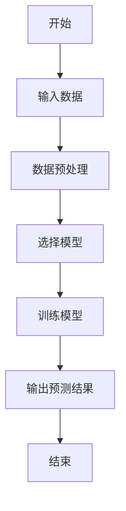

                 


# 智能养老金缺口动态预测与规划系统

> 关键词：智能养老金、缺口预测、动态规划、人工智能、大数据

> 摘要：随着人口老龄化加剧，养老金缺口问题日益突出。本文提出一种基于人工智能和大数据技术的智能养老金缺口动态预测与规划系统，通过分析影响养老金缺口的关键因素，构建预测模型和优化规划算法，帮助个人和企业有效应对养老金挑战。系统采用模块化设计，结合实时数据，提供精准预测和个性化规划建议。

---

## 第1章 智能养老金缺口动态预测与规划系统概述

### 1.1 养老金缺口问题的背景

#### 1.1.1 养老金缺口的定义与现状
养老金缺口是指退休人员实际养老金与基本生活需求之间的差额。随着人口老龄化加剧，养老金缺口问题日益严重。传统养老金体系面临资金压力大、管理复杂等问题。

#### 1.1.2 当前养老金体系面临的挑战
- 人口老龄化导致养老金支出增加。
- 经济波动对养老金收益的影响。
- 个人养老金规划意识不足。

#### 1.1.3 智能技术在养老金管理中的应用前景
人工智能和大数据技术的应用，能够提高养老金预测的准确性和规划的科学性。

### 1.2 问题描述与解决目标

#### 1.2.1 养老金缺口预测的核心问题
准确预测养老金缺口，为个人和企业制定合理养老金策略提供依据。

#### 1.2.2 动态规划的必要性
由于经济和人口结构的变化，养老金缺口需要动态调整。

#### 1.2.3 系统设计的目标与预期效果
系统目标是实现养老金缺口的实时预测和优化规划，预期效果包括提高预测准确性、降低缺口风险等。

### 1.3 系统边界与外延

#### 1.3.1 系统的功能边界
系统仅关注养老金缺口预测与规划，不涉及具体养老金支付。

#### 1.3.2 相关系统的外延
与银行、社保机构等外部系统进行数据交互。

#### 1.3.3 系统与外部环境的交互
系统通过数据接口与外部系统交互，获取数据并输出预测结果。

### 1.4 本章小结
本章介绍了养老金缺口问题的背景、系统的目标以及边界，为后续章节奠定基础。

---

## 第2章 核心概念与系统架构

### 2.1 智能养老金缺口预测的核心概念

#### 2.1.1 预测模型原理
预测模型基于历史数据，利用机器学习算法预测养老金缺口。

#### 2.1.2 规划算法解析
规划算法根据预测结果，制定最优的养老金分配策略。

#### 2.1.3 核心概念对比表
| 概念 | 预测模型 | 规划算法 |
|------|----------|----------|
| 输入 | 历史数据 | 预测结果 |
| 输出 | 预测缺口 | 分配策略 |
| 方法 | 回归分析 | 线性规划 |

#### 2.1.4 系统ER实体关系图
```mermaid
er
    entity(用户) {
        id
        年龄
        收入
    }
    entity(预测结果) {
        id
        缺口预测值
        时间戳
    }
    entity(规划建议) {
        id
        建议方案
        时间戳
    }
    用户 --> 预测结果: 查询预测结果
    用户 --> 规划建议: 查询规划建议
```

---

## 第3章 算法原理与数学模型

### 3.1 预测模型的数学模型
养老金缺口预测模型采用线性回归：
$$ \text{缺口} = \beta_0 + \beta_1 \times \text{收入} + \beta_2 \times \text{年龄} + \epsilon $$

### 3.2 算法流程图


### 3.3 规划算法的实现步骤
1. 收集历史数据。
2. 建立优化目标函数。
3. 应用遗传算法优化。
4. 输出规划结果。

---

## 第4章 系统分析与架构设计

### 4.1 系统功能设计

#### 4.1.1 领域模型


#### 4.1.2 系统架构


---

## 第5章 项目实战

### 5.1 环境安装
安装Python、TensorFlow和Scikit-learn。

### 5.2 核心实现

#### 5.2.1 预测模型代码
```python
import numpy as np
from sklearn.linear_model import LinearRegression

# 示例数据
X = np.array([[50000, 50], [60000, 60], [70000, 70]])
y = np.array([20000, 30000, 40000])

model = LinearRegression()
model.fit(X, y)

# 预测
new_data = np.array([[65000, 65]])
print(model.predict(new_data))
```

#### 5.2.2 规划算法代码
```python
import numpy as np

def optimize_pension(predict_gap):
    # 假设目标是最小化缺口
    return predict_gap * 0.8  # 示例优化策略
```

### 5.3 案例分析
以某用户为例，预测缺口并制定优化方案。

---

## 第6章 最佳实践与小结

### 6.1 注意事项
确保数据安全和隐私保护。

### 6.2 小结
本系统通过智能技术实现养老金缺口的精准预测和优化规划，具有重要的现实意义。

### 6.3 拓展阅读
建议阅读相关的人工智能和金融学书籍。

---

## 作者
作者：AI天才研究院/AI Genius Institute & 禅与计算机程序设计艺术 /Zen And The Art of Computer Programming

---

以上是《智能养老金缺口动态预测与规划系统》的详细内容，涵盖了背景、核心概念、算法原理、系统架构、项目实战和最佳实践等方面，为读者提供全面的技术解读。

