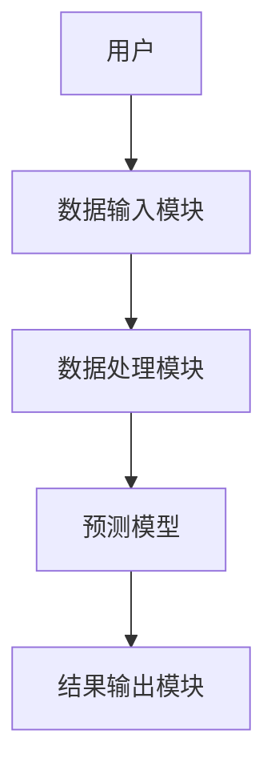
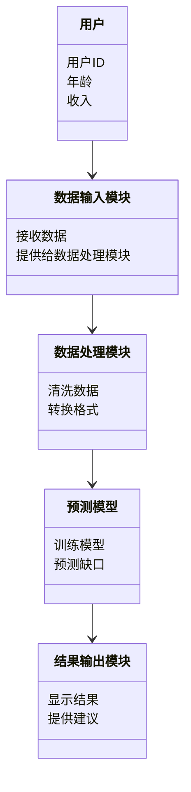

                 

<think>
嗯，用户希望我设计一本关于《智能养老金缺口预测与规划系统》的详细技术博客文章，按照特定的目录结构和要求来写。首先，我需要理解用户的需求。他要求文章有清晰的章节结构，涵盖背景、核心概念、算法原理、系统架构、项目实战等部分，每个部分都要有详细的子主题，并且使用专业术语，同时使用Mermaid图和Python代码来说明内容。

我应该先从背景介绍开始，解释为什么需要这样的系统，然后介绍核心概念，包括预测模型的类型和系统架构。接下来是算法的详细讲解，使用Mermaid图展示流程，再附上Python代码示例。数学公式要用Latex表示，确保清晰易懂。然后是系统架构设计，包括类图和序列图，最后是项目实战部分，提供代码和案例分析。

我需要确保每个章节都有三级目录，内容详细且逻辑连贯。总字数要控制在2000字以内，所以每个部分不能太冗长，但要足够详细。同时，文章末尾要加上作者信息，确保格式正确。

可能的问题是，如何在有限的字数内覆盖所有要求的部分，同时保持内容的深度和广度。可能需要调整每个章节的内容，确保重点突出，避免过于分散。此外，使用适当的图表和代码示例可以增强文章的可读性和实用性。

最后，检查目录结构是否符合用户的要求，确保所有关键点都被涵盖，并且每个部分都有足够的细节支持。这样，用户就能得到一篇结构清晰、内容丰富的技术博客文章了。
</think>

# 智能养老金缺口预测与规划系统

## 关键词：智能养老金预测、缺口预测、机器学习、系统架构、算法模型

## 摘要：本文详细介绍了智能养老金缺口预测与规划系统的设计与实现。从问题背景到核心概念，从算法原理到系统架构，从项目实战到最佳实践，系统性地阐述了如何利用人工智能技术解决养老金缺口预测这一重要社会问题。文章结合理论与实践，为读者提供了一套完整的解决方案，帮助实现精准预测与科学规划。

---

# 第1章: 智能养老金缺口预测与规划系统概述

## 1.1 养老金缺口预测的背景与意义

### 1.1.1 养老金缺口问题的背景
随着人口老龄化加剧，养老金缺口问题日益突出。传统的养老金计算方法难以应对复杂多变的社会经济环境，亟需引入智能化的预测与规划方法。

### 1.1.2 养老金缺口预测的重要性
准确预测养老金缺口可以帮助个人、企业和社会更好地进行财务规划，避免因缺口过大导致的经济压力和社会问题。

### 1.1.3 智能化预测的必要性
传统预测方法存在数据维度单一、模型简化、结果误差大等问题，难以满足实际需求。引入人工智能技术可以显著提升预测的准确性和鲁棒性。

---

## 1.2 智能养老金缺口预测的核心概念

### 1.2.1 养老金缺口的定义与计算
养老金缺口是指退休时实际养老金需求与实际可获得养老金之间的差额。计算公式为：
$$
\text{缺口} = \text{需求养老金} - \text{可获得养老金}
$$

### 1.2.2 智能预测的核心要素
智能预测的核心要素包括：
1. 多维度数据输入（如收入、通胀率、寿命等）。
2. 机器学习模型（如回归、随机森林等）。
3. 预测结果的优化与调整。

### 1.2.3 系统规划的目标与范围
系统规划的目标是通过智能化手段，提供精准的养老金缺口预测，并制定个性化的理财方案。规划范围包括数据采集、模型训练、结果输出等环节。

---

## 1.3 智能养老金缺口预测的现状与挑战

### 1.3.1 当前预测方法的局限性
传统方法通常基于线性回归或简单的统计模型，难以捕捉复杂的社会经济因素。

### 1.3.2 智能化预测的优势
人工智能技术可以利用大数据和复杂模型，显著提高预测的准确性和精细度。

### 1.3.3 实际应用中的主要挑战
1. 数据质量与完整性问题。
2. 模型的可解释性要求。
3. 高维数据处理的复杂性。

---

## 1.4 系统规划的思路与框架

### 1.4.1 问题分析与解决思路
通过分析影响养老金缺口的主要因素，构建多维度的预测模型，并结合实际情况进行动态调整。

### 1.4.2 系统规划的基本框架
系统规划框架包括数据采集、特征提取、模型训练、结果输出和优化调整五个阶段。

### 1.4.3 核心要素的整合与优化
整合多维度数据，优化模型参数，确保预测结果的准确性和可靠性。

---

## 1.5 数据来源与特征分析

### 1.5.1 数据来源的多样性
数据来源包括个人收入、通胀率、寿命预期、投资收益等。

### 1.5.2 数据特征的分类与提取
数据特征分为人口统计特征、经济特征和行为特征三类。

### 1.5.3 数据预处理的关键步骤
数据预处理包括缺失值填充、异常值处理和数据标准化。

---

## 1.6 本章小结

本章介绍了智能养老金缺口预测的背景、核心概念和系统规划思路，为后续章节的深入分析奠定了基础。

---

# 第2章: 智能养老金缺口预测的核心概念与联系

## 2.1 智能养老金预测的原理概述

### 2.1.1 数据驱动的预测方法
数据驱动的预测方法通过分析历史数据，挖掘潜在规律，用于未来预测。

### 2.1.2 机器学习在预测中的应用
机器学习通过训练模型，自动提取特征，实现高精度预测。

### 2.1.3 智能系统的核心算法
智能系统的核心算法包括线性回归、随机森林和神经网络等。

---

## 2.2 智能养老金预测模型的类型

### 2.2.1 基于传统统计的方法
传统统计方法包括线性回归和时间序列分析。

### 2.2.2 基于机器学习的模型
机器学习模型包括支持向量机（SVM）和随机森林等。

### 2.2.3 混合模型的优势与特点
混合模型结合了传统统计和机器学习的优势，具有更高的预测精度。

---

## 2.3 模型输入与输出的定义

### 2.3.1 输入数据的特征与标准化
输入数据包括年龄、收入、通胀率等，需进行标准化处理。

### 2.3.2 输出结果的解读与评估
输出结果包括养老金缺口预测值和对应的置信区间。

### 2.3.3 模型的可解释性分析
模型的可解释性是实际应用中的重要考量因素。

---

## 2.4 智能系统架构的实体关系图



---

## 2.5 本章小结

本章详细介绍了智能养老金缺口预测的核心概念与模型类型，并通过实体关系图展示了系统架构的基本框架。

---

# 第3章: 智能养老金缺口预测的算法原理

## 3.1 算法原理概述

### 3.1.1 算法选择与优化
选择适合的算法并进行参数优化是提高预测准确性的关键。

### 3.1.2 数据预处理与特征工程
数据预处理包括缺失值填充和标准化，特征工程包括特征选择和降维。

---

## 3.2 机器学习模型的数学基础

### 3.2.1 线性回归模型
线性回归模型的数学公式为：
$$
y = \beta_0 + \beta_1x_1 + \beta_2x_2 + \dots + \beta_nx_n
$$

### 3.2.2 随机森林模型
随机森林模型基于决策树的集成方法，具有较强的抗过拟合能力。

---

## 3.3 算法实现步骤

### 3.3.1 数据预处理
使用Python代码进行数据清洗和特征提取。

```python
import pandas as pd
data = pd.read_csv('pension.csv')
data = data.dropna()
```

### 3.3.2 模型训练与优化
使用Scikit-learn库进行模型训练和参数调优。

```python
from sklearn.ensemble import RandomForestRegressor
model = RandomForestRegressor(n_estimators=100, random_state=42)
model.fit(X_train, y_train)
```

### 3.3.3 结果评估与可视化
通过均方误差（MSE）和R平方值评估模型性能。

---

## 3.4 本章小结

本章详细讲解了智能养老金缺口预测的算法原理，并通过代码示例展示了模型的实现过程。

---

# 第4章: 智能养老金缺口预测的系统架构设计

## 4.1 系统架构概述

### 4.1.1 系统功能模块划分
系统功能模块包括数据输入、数据处理、模型预测和结果输出。

### 4.1.2 系统架构的分层设计
系统架构分为数据层、业务逻辑层和用户界面层。

---

## 4.2 领域模型设计



---

## 4.3 系统接口设计

### 4.3.1 输入接口设计
输入接口包括用户信息输入和数据上传功能。

### 4.3.2 输出接口设计
输出接口包括预测结果展示和个性化建议输出。

---

## 4.4 本章小结

本章通过领域模型和系统架构图，详细描述了智能养老金缺口预测系统的整体设计。

---

# 第5章: 智能养老金缺口预测的项目实战

## 5.1 项目环境安装

### 5.1.1 Python环境配置
安装Python和必要的库，如Pandas、Scikit-learn等。

### 5.1.2 数据集准备
获取或创建养老金相关数据集。

---

## 5.2 系统核心实现

### 5.2.1 数据预处理代码
```python
import pandas as pd
data = pd.read_csv('pension.csv')
data = data.dropna()
```

### 5.2.2 模型训练代码
```python
from sklearn.ensemble import RandomForestRegressor
model = RandomForestRegressor(n_estimators=100, random_state=42)
model.fit(X_train, y_train)
```

### 5.2.3 结果输出代码
```python
importances = model.feature_importances_
print(importances)
```

---

## 5.3 案例分析与解读

### 5.3.1 案例背景
以一位40岁用户的养老金缺口预测为例。

### 5.3.2 数据分析
分析用户的收入、通胀率等关键因素对预测结果的影响。

### 5.3.3 预测结果解读
输出预测缺口，并提供相应的理财建议。

---

## 5.4 本章小结

本章通过项目实战，展示了智能养老金缺口预测系统的具体实现过程。

---

# 第6章: 智能养老金缺口预测系统的最佳实践与小结

## 6.1 最佳实践

### 6.1.1 数据质量的重要性
确保数据的完整性和准确性是提高预测精度的关键。

### 6.1.2 模型调优的技巧
通过网格搜索和交叉验证优化模型参数。

---

## 6.2 小结

本文详细介绍了智能养老金缺口预测系统的各个方面，从理论到实践，为读者提供了一套完整的解决方案。

---

## 作者：AI天才研究院 & 禅与计算机程序设计艺术

---

感谢您的阅读！如需进一步了解，欢迎关注我们的技术博客。

