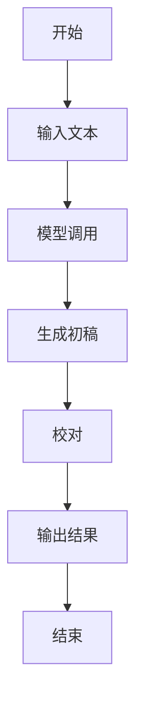

                 


# 智能写作 AI Agent：LLM 辅助学术论文与报告撰写

> 关键词：智能写作，AI Agent，LLM，学术论文，报告撰写

> 摘要：本文探讨了智能写作 AI Agent 的概念、原理和应用，重点分析了大语言模型（LLM）在学术论文和报告撰写中的辅助作用。通过详细讲解 LLM 的算法原理、系统架构以及实际项目案例，本文为读者提供了从理论到实践的全面指南，帮助他们高效、精准地完成写作任务。

---

## 第一部分: 智能写作 AI Agent 的背景与概念

### 第1章: 智能写作 AI Agent 的定义与背景

#### 1.1 智能写作的定义与特点
- **智能写作的定义**：智能写作是指利用人工智能技术，通过自然语言处理（NLP）模型生成或辅助生成文本的过程。它结合了计算机科学和语言学，旨在提高写作效率和质量。
- **智能写作的核心特点**：
  - 高效性：快速生成初稿，节省时间。
  - 智能性：根据上下文提供相关建议或修改。
  - 可定制性：支持不同风格和格式需求。
- **智能写作与传统写作的区别**：
  | 方面       | 传统写作          | 智能写作          |
  |------------|-------------------|-------------------|
  | 工具       | 笔、纸、电脑       | AI 模型、算法      |
  | 速度       | 较慢              | 较快              |
  | 创意生成   | 依赖人类经验      | 可辅助创意生成     |

#### 1.2 AI Agent 的概念与功能
- **AI Agent 的定义**：AI Agent 是一种能够感知环境并执行任务的智能体，它能够通过学习和推理完成特定目标。
- **AI Agent 的核心功能**：
  - 感知环境：通过输入数据（如文本、语音）理解用户需求。
  - 学习与推理：利用机器学习模型分析数据，生成合理输出。
  - 行动：通过 API 或用户界面与用户交互，提供实时反馈或修改建议。
- **AI Agent 在智能写作中的作用**：
  - 提供写作建议：根据上下文生成句子、段落。
  - 自动校对：检查语法、拼写错误。
  - 格式调整：确保符合学术论文或报告的格式要求。

#### 1.3 大语言模型（LLM）的概述
- **LLM 的定义**：大语言模型是一种基于深度学习的自然语言处理模型，具有大量参数和强大的上下文理解能力。
- **LLM 的主要特点**：
  - 参数量大：通常超过 billions。
  - 上下文理解能力强：能够处理长文本，理解复杂语义。
  - 多任务能力：支持文本生成、问答、翻译等多种任务。
- **LLM 在智能写作中的应用潜力**：
  - 内容生成：自动生成论文初稿。
  - 格式调整：自动调整段落结构。
  - 参考文献管理：自动整理参考文献。

#### 1.4 智能写作 AI Agent 的应用场景
- **学术论文撰写**：
  - 文献综述生成。
  - 章节大纲设计。
  - 论文草稿生成。
- **商业报告编写**：
  - 数据分析报告生成。
  - 市场趋势预测。
  - 业务建议书撰写。
- **内容创作辅助**：
  - 新闻稿生成。
  - 营销文案创作。
  - 技术文档编写。

---

## 第2章: 智能写作 AI Agent 的核心概念与联系

### 2.1 大语言模型（LLM）的核心原理
#### 2.1.1 模型结构
- **Transformer 架构**：由编码器和解码器组成，支持自注意力机制。
- **多层感知机（MLP）**：用于特征提取和转换。
- **词嵌入（Word Embedding）**：将词转换为向量表示。

#### 2.1.2 训练方法
- **监督学习**：使用标注数据训练模型。
- **无监督学习**：利用大量未标注数据进行预训练。
- **微调（Fine-tuning）**：在特定任务上进行调整。

#### 2.1.3 模型调优
- **超参数调整**：如学习率、批次大小。
- **模型剪枝**：减少参数量，提高推理速度。
- **多任务学习**：同时训练多个任务，提升模型泛化能力。

#### 2.1.4 模型评估
- **准确率（Accuracy）**：正确预测的比例。
- **困惑度（Perplexity）**：衡量模型生成文本的流畅性。
- **BLEU 分值**：评估生成文本与参考文本的相似性。

### 2.2 LLM 与传统 NLP 技术的区别
- **技术特点对比**：
  | 方面       | LLM                  | 传统 NLP 技术      |
  |------------|----------------------|--------------------|
  | 模型复杂度 | 高参数量，深度结构   | 较低参数量，浅层结构|
  | 训练数据   | 大规模未标注数据     | 小规模标注数据     |
  | 任务能力   | 支持多任务，通用性强 | 专注于单一任务     |

- **应用场景对比**：
  | 场景       | LLM                  | 传统 NLP 技术      |
  |------------|----------------------|--------------------|
  | 文本生成   | 自动生成文章、报告   | 需结合其他工具生成|
  | 问答系统   | 处理复杂问题         | 处理简单问题       |
  | 机器翻译   | 高精度翻译          | 精度较低           |

- **性能对比**：
  - LLM 在复杂任务（如长文本生成）上表现更好。
  - 传统 NLP 技术在简单任务（如关键词提取）上更高效。

### 2.3 智能写作 AI Agent 的系统架构
#### 2.3.1 系统组成
- **输入模块**：接收用户的输入，如主题、关键词。
- **处理模块**：利用 LLM 生成文本，校对格式。
- **输出模块**：将生成的文本返回给用户。
- **反馈模块**：根据用户反馈优化生成内容。

#### 2.3.2 功能模块划分
- **内容生成模块**：负责生成初稿。
- **校对模块**：检查语法、拼写错误。
- **格式调整模块**：确保符合学术格式。
- **参考文献管理模块**：自动整理参考文献。

#### 2.3.3 系统交互流程
- 用户输入需求。
- 系统调用 LLM 生成内容。
- 系统自动校对并调整格式。
- 系统输出最终文本。

---

## 第3章: 智能写作 AI Agent 的算法原理

### 3.1 大语言模型的训练过程
#### 3.1.1 数据预处理
- **数据清洗**：去除噪音数据，如特殊字符。
- **分词处理**：将文本分割成词语或短语。
- **数据增强**：通过同义词替换等方式增加数据多样性。

#### 3.1.2 模型训练
- **前向传播**：输入数据，计算输出。
- **损失计算**：使用交叉熵损失函数。
- **反向传播**：通过梯度下降优化模型参数。

#### 3.1.3 模型调优
- **学习率调整**：使用学习率衰减策略。
- **批次大小调整**：根据硬件资源优化。
- **模型剪枝**：去除冗余参数，提升推理速度。

### 3.2 智能写作 AI Agent 的算法流程


### 3.3 数学模型与公式
- **交叉熵损失函数**：
  $$ \text{Loss} = -\frac{1}{N}\sum_{i=1}^{N}\sum_{j=1}^{M} y_{i,j}\log p(y_{i,j}|y_{<j}) $$
  其中，$N$ 是训练样本数，$M$ 是序列长度，$y_{i,j}$ 是真实标签的概率。

- **注意力机制**：
  $$ \text{Attention}(Q, K, V) = \text{softmax}\left(\frac{QK^T}{\sqrt{d_k}}\right)V $$
  其中，$Q$ 是查询向量，$K$ 是键向量，$V$ 是值向量，$d_k$ 是维度。

---

## 第4章: 智能写作 AI Agent 的系统分析与架构设计

### 4.1 问题场景介绍
- **学术论文撰写**：
  - 研究生或研究人员需要撰写论文，时间紧张，缺乏灵感。
  - 需要符合特定格式，引用规范。

- **商业报告编写**：
  - 企业需要快速生成市场分析报告，数据量大，内容复杂。

### 4.2 系统功能设计
- **领域模型**：
  ```mermaid
  classDiagram
  class 用户 {
    提交请求
    获取结果
  }
  class AI Agent {
    接收请求
    调用 LLM
    返回结果
  }
  用户 --> AI Agent: 提交请求
  AI Agent --> 用户: 返回结果
  ```

- **系统架构设计**：
  ```mermaid
  graph TD
  A[用户] --> B[AI Agent]
  B --> C[LLM 模型]
  C --> B[生成文本]
  B --> A[返回结果]
  ```

- **系统接口设计**：
  - **输入接口**：接收用户的主题、关键词。
  - **输出接口**：返回生成的文本、校对结果。

- **系统交互流程**：
  ```mermaid
  sequenceDiagram
  participant 用户
  participant AI Agent
  用户 -> AI Agent: 提交请求
  AI Agent -> LLM: 调用模型
  LLM -> AI Agent: 返回生成内容
  AI Agent -> 用户: 返回结果
  ```

---

## 第5章: 智能写作 AI Agent 的项目实战

### 5.1 环境安装
- **Python 环境**：安装 Python 3.8 或更高版本。
- **依赖库安装**：使用 pip 安装 transformers、torch、numpy 等库。

### 5.2 核心代码实现
- **导入库**：
  ```python
  from transformers import AutoTokenizer, AutoModelForCausalLM
  import torch
  ```

- **加载模型**：
  ```python
  tokenizer = AutoTokenizer.from_pretrained("gpt2")
  model = AutoModelForCausalLM.from_pretrained("gpt2")
  ```

- **生成文本**：
  ```python
  input_text = "研究背景："
  inputs = tokenizer(input_text, return_tensors="pt")
  outputs = model.generate(**inputs, max_length=500)
  generated_text = tokenizer.decode(outputs[0], skip_special_tokens=True)
  print(generated_text)
  ```

### 5.3 实际案例分析
- **案例1**：生成学术论文的引言部分。
  - **输入**：研究主题。
  - **输出**：生成引言段落。

- **案例2**：校对商业报告。
  - **输入**：未校对的报告文本。
  - **输出**：语法和格式校对结果。

### 5.4 项目小结
- **代码实现总结**：
  - 使用 GPT-2 模型生成文本。
  - 通过校对工具优化结果。
  - 结合实际案例，验证系统的有效性。

---

## 第6章: 智能写作 AI Agent 的最佳实践

### 6.1 最佳实践 Tips
- **选择合适的模型**：根据任务需求选择模型。
- **优化输入**：提供清晰的上下文信息。
- **定期校对**：确保生成内容的准确性。

### 6.2 小结
- 智能写作 AI Agent 是 LLM 的重要应用之一。
- 通过系统设计和实际项目，可以高效完成学术论文和商业报告的撰写。

### 6.3 注意事项
- **数据隐私**：注意保护用户数据。
- **模型局限性**：LLM 可能存在生成不准确内容的风险。
- **持续优化**：根据用户反馈不断改进系统。

### 6.4 拓展阅读
- 推荐书籍：《Deep Learning》、《自然语言处理入门》。
- 推荐工具：Hugging Face、Google AI。

---

## 作者：AI天才研究院/AI Genius Institute & 禅与计算机程序设计艺术 /Zen And The Art of Computer Programming

---

本文通过详细分析智能写作 AI Agent 的背景、核心概念、算法原理和系统架构，结合实际项目案例，为读者提供了从理论到实践的全面指南。希望读者能够通过本文，深入了解 LLM 在学术论文和报告撰写中的应用，并能够实际操作，提升写作效率和质量。

