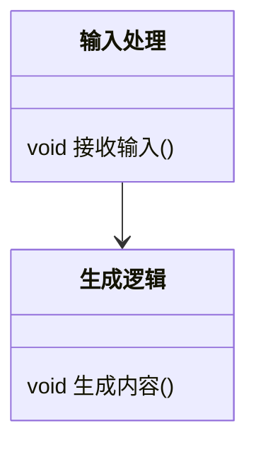

                 


# 智能写作AI Agent：LLM辅助的创意内容生成

> 关键词：智能写作，AI Agent，LLM，创意内容生成，自然语言处理

> 摘要：本文探讨了智能写作AI Agent在LLM辅助下的创意内容生成技术。通过分析背景、核心概念、算法原理、系统架构、项目实战及最佳实践，详细阐述了如何利用大语言模型提升创意写作效率和质量。

---

## 第一部分：背景介绍

### 第1章：智能写作AI Agent的起源与发展

#### 1.1 AI写作的起源
自然语言处理（NLP）的发展为AI写作奠定了基础。从早期的基于规则的系统到现代的大语言模型，AI写作经历了技术革新。

#### 1.2 当前AI写作的应用现状
AI写作工具广泛应用于创意写作、商业文案等领域，但仍然面临内容质量不稳定的问题。

#### 1.3 智能写作的核心问题
内容创意生成的挑战、文本质量评估标准以及用户需求多样性是智能写作的核心问题。

#### 1.4 LLM技术的背景与技术背景
大语言模型的兴起和Transformer架构的引入，推动了智能写作的发展。

---

## 第二部分：核心概念与原理

### 第2章：LLM的工作机制

#### 2.1 基本概念与术语
- **输入空间**：输入文本或提示。
- **输出空间**：生成的文本内容。

#### 2.2 LLM与传统NLP的对比
| 特性 | 传统NLP | LLM |
|------|----------|------|
| 数据需求 | 小规模 | 大规模 |
| 模型大小 | 小型 | 大型 |

---

## 第三部分：算法原理

### 第3章：LLM的训练与推理

#### 3.1 训练过程
Mermaid流程图展示训练过程：


#### 3.2 损失函数
交叉熵损失公式：

$$
\text{loss} = -\frac{1}{n}\sum_{i=1}^{n}\sum_{j=1}^{m} y_{ij}\log p(y_{ij}|x_i)
$$

---

## 第四部分：系统分析与架构设计

### 第4章：系统架构

#### 4.1 项目背景
系统旨在辅助创意内容生成，提供高质量文本输出。

#### 4.2 系统功能设计
- **输入处理**：接收用户输入。
- **生成逻辑**：基于LLM生成内容。

#### 4.3 领域模型
Mermaid类图：



---

## 第五部分：项目实战

### 第5章：项目实现

#### 5.1 环境安装
安装Python和相关库：

```bash
pip install transformers torch
```

#### 5.2 核心代码
生成逻辑代码示例：

```python
from transformers import AutoModelForCausalLM, AutoTokenizer

model = AutoModelForCausalLM.from_pretrained('gpt2')
tokenizer = AutoTokenizer.from_pretrained('gpt2')

def generate_text(prompt):
    inputs = tokenizer(prompt, return_tensors='np')
    outputs = model.generate(inputs.input_ids, max_length=50)
    return tokenizer.decode(outputs[0], skip_special_tokens=True)
```

---

## 第六部分：最佳实践

### 第6章：总结与展望

#### 6.1 小结
智能写作AI Agent利用LLM提升创意内容生成效率。

#### 6.2 注意事项
确保数据安全，避免生成不当内容。

#### 6.3 拓展阅读
推荐学习高级生成策略和模型优化技术。

---

## 作者

**作者：AI天才研究院 & 禅与计算机程序设计艺术**

---

通过以上结构，文章详细讲解了智能写作AI Agent的各个方面，从理论到实践，帮助读者全面理解并应用这一技术。

