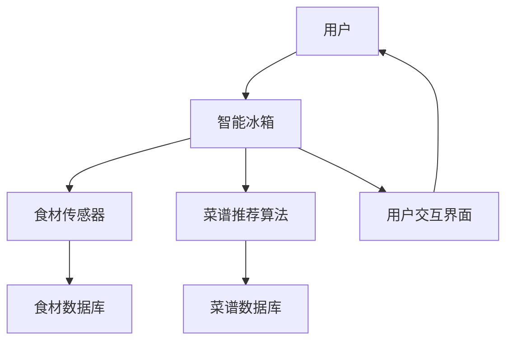
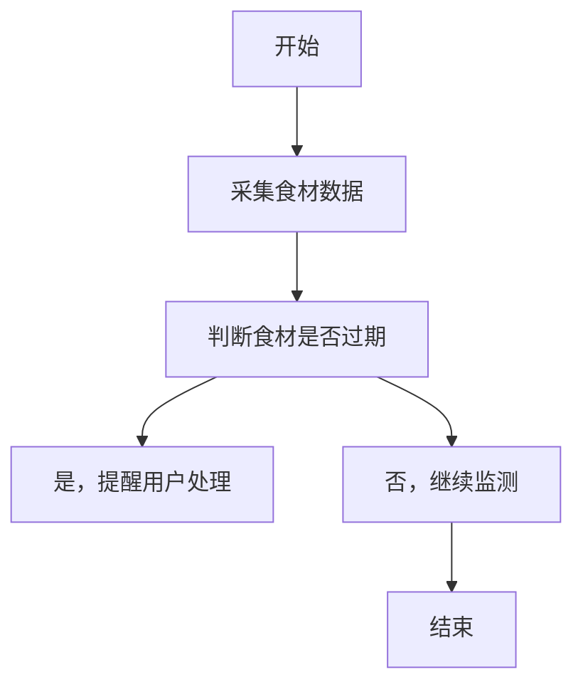
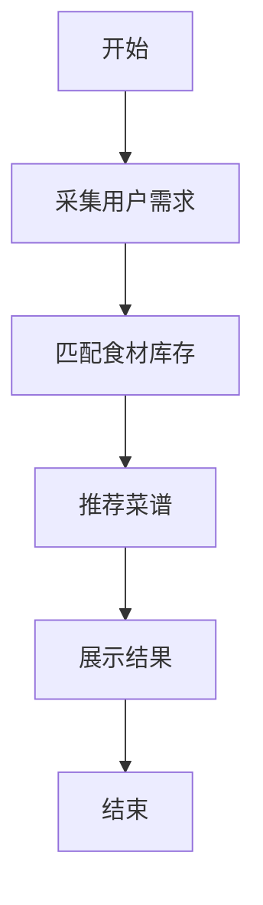
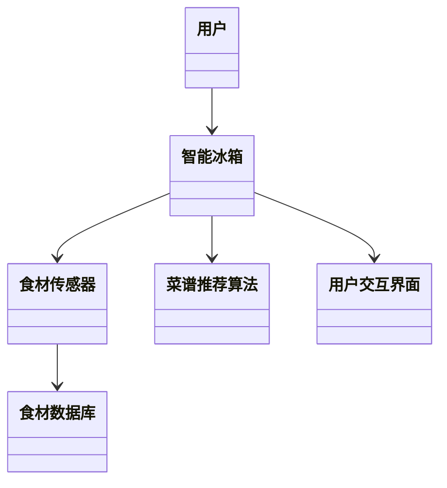
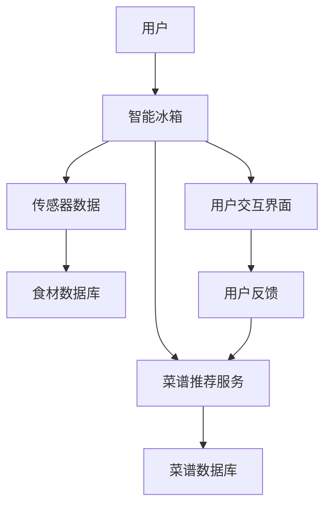
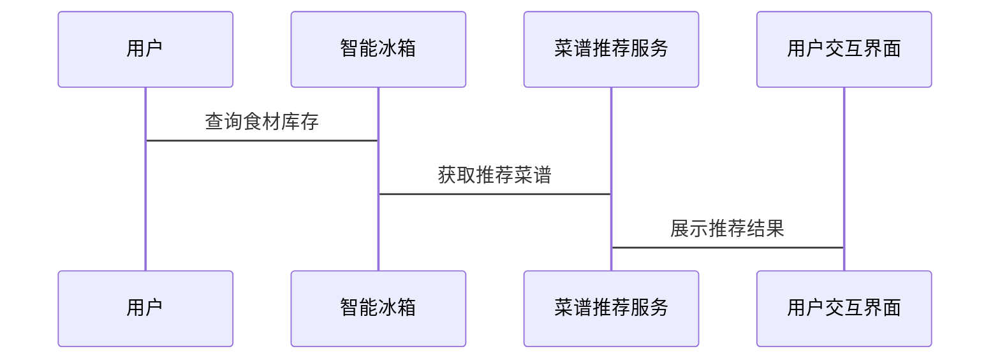

                 


# 智能冰箱：AI Agent的食材管理与菜谱推荐

---

## 关键词：
智能冰箱，AI Agent，食材管理，菜谱推荐，人工智能，系统架构

---

## 摘要：
本文深入探讨了智能冰箱中AI Agent的核心作用，详细分析了食材管理与菜谱推荐的实现原理和应用场景。通过结合AI技术与物联网设备，智能冰箱能够实现对食材的智能管理、菜谱的个性化推荐以及与用户需求的精准匹配。本文从背景介绍、核心概念、算法原理、系统架构到项目实战，全面解析了智能冰箱AI Agent的开发与应用，为读者提供了一套完整的解决方案。

---

# 第一章: 智能冰箱与AI Agent概述

## 1.1 智能冰箱的发展历程
### 1.1.1 传统冰箱的功能与局限
传统冰箱仅具备冷藏、冷冻和存储的基本功能，无法与用户交互，也无法感知食材的状态。用户的食材管理主要依赖于手动记录，容易出现遗忘、过期等问题。

### 1.1.2 智能冰箱的定义与特点
智能冰箱是一种结合了物联网技术的智能设备，能够通过传感器和AI技术感知食材的状态，与用户进行交互，并提供智能化的食材管理和菜谱推荐服务。

### 1.1.3 AI Agent在智能冰箱中的作用
AI Agent（智能体）在智能冰箱中扮演着“大脑”的角色，负责接收用户指令、分析食材数据、推荐菜谱、优化食材管理策略等。

## 1.2 食材管理与菜谱推荐的必要性
### 1.2.1 食材管理的重要性
食材管理是家庭日常生活的重要组成部分，合理的食材管理能够避免浪费、保障饮食健康、提升生活品质。

### 1.2.2 菜谱推荐的意义
通过AI技术实现个性化菜谱推荐，能够根据用户口味、食材库存和营养需求，提供精准的菜谱建议，帮助用户轻松完成日常烹饪。

### 1.2.3 智能冰箱在现代生活中的应用场景
智能冰箱能够与其他智能家居设备联动，为用户提供一站式的生活解决方案，例如与智能灶具、智能音箱等设备协同工作，打造智能化的厨房环境。

## 1.3 问题背景与边界
### 1.3.1 食材管理中的常见问题
- 食材过期、浪费
- 食材种类繁多，管理复杂
- 缺乏智能化的管理工具

### 1.3.2 菜谱推荐的边界与外延
菜谱推荐需要考虑的因素包括食材库存、用户偏好、营养需求、烹饪难度等。其外延还包括食谱生成、食材采购建议等扩展功能。

### 1.3.3 智能冰箱系统的概念结构
智能冰箱系统由硬件设备、传感器、AI算法、用户交互界面等部分组成，通过传感器采集食材数据，结合AI算法进行分析和推荐。

## 1.4 核心要素组成
### 1.4.1 系统硬件组成
- 内置传感器：用于检测食材的温度、湿度、重量等参数
- 智能芯片：用于数据处理和AI算法运行
- 无线通信模块：用于与用户设备和云端数据交互

### 1.4.2 系统软件组成
- 数据采集与处理模块
- AI算法模块：包括食材管理算法和菜谱推荐算法
- 用户交互界面：支持语音、触控、手机App等多种交互方式

### 1.4.3 用户交互界面
- 本地显示屏：显示食材状态和推荐菜谱
- 手机App：支持远程查看食材库存和管理
- 语音交互：通过智能音箱等设备实现语音控制和查询

---

# 第二章: AI Agent与食材管理系统的核心概念

## 2.1 AI Agent的原理与实现
### 2.1.1 AI Agent的基本原理
AI Agent通过感知环境、接收用户指令、分析数据、执行任务，实现对智能冰箱的智能化管理。

### 2.1.2 基于规则的AI Agent实现
基于预定义的规则，AI Agent能够根据食材状态和用户需求，自动执行相应的操作，例如自动提醒用户补充食材或建议使用即将过期的食材。

### 2.1.3 基于机器学习的AI Agent实现
通过机器学习算法，AI Agent能够从历史数据中学习用户的偏好和行为模式，实现更精准的食材管理和菜谱推荐。

## 2.2 食材管理系统的原理
### 2.2.1 食材信息的采集与存储
通过传感器采集食材的种类、数量、保质期等信息，并存储在本地数据库或云端数据库中。

### 2.2.2 食材状态的监测与分析
AI Agent通过分析食材的状态数据，判断食材是否新鲜、是否需要补充或冷藏。

### 2.2.3 食材管理的优化算法
基于优化算法，AI Agent能够为用户提供最优的食材管理策略，例如优先使用即将过期的食材，减少浪费。

## 2.3 核心概念的对比分析
### 2.3.1 AI Agent与传统算法的对比
| 特性       | AI Agent                  | 传统算法                 |
|------------|---------------------------|--------------------------|
| 智能性     | 高度智能化，能自适应环境   | 基于固定规则，无法自适应 |
| 学习能力   | 具备学习能力，能优化策略   | 无学习能力，策略固定     |
| 交互性     | 支持与用户和环境交互       | 仅执行预定义任务         |

### 2.3.2 食材管理系统与传统管理系统的对比
| 特性       | 智能食材管理系统            | 传统食材管理系统           |
|------------|---------------------------|---------------------------|
| 管理方式   | 智能化管理，支持AI推荐      | 手动管理，依赖人工操作     |
| 优化能力   | 具备优化算法，减少浪费     | 无优化能力，浪费可能较高   |
| 用户体验   | 提供个性化服务，操作便捷   | 体验较差，操作复杂         |

## 2.4 实体关系图
以下是食材管理系统的核心实体关系图：



---

# 第三章: 算法原理讲解

## 3.1 食材管理算法
### 3.1.1 算法流程图
以下是食材管理算法的流程图：



### 3.1.2 算法实现代码
以下是一个简单的食材管理算法示例：

```python
def manage_inventory():
    import datetime
    # 采集食材数据
    inventory = get_inventory_data()
    for item in inventory:
        expiration_date = item['expiration_date']
        current_date = datetime.date.today()
        if expiration_date < current_date:
            print(f"提醒：{item['name']} 已过期，请及时处理。")
    return

manage_inventory()
```

## 3.2 菜谱推荐算法
### 3.2.1 算法流程图
以下是菜谱推荐算法的流程图：



### 3.2.2 算法实现代码
以下是一个基于协同过滤的菜谱推荐算法示例：

```python
def recommend_recipe():
    # 采集用户偏好
    user_preference = get_user_preference()
    # 匹配食材库存
    inventory = get_inventory_data()
    # 推荐菜谱
    recommendations = collaborative_filtering(user_preference, inventory)
    return recommendations

recommend_recipe()
```

## 3.3 算法的数学模型与公式
### 3.3.1 协同过滤算法公式
协同过滤算法的核心公式是计算用户之间的相似度，公式如下：

$$
similarity(u, v) = \frac{\sum_{i} (u_i - \bar{u})(v_i - \bar{v})}{\sqrt{\sum_{i} (u_i - \bar{u})^2} \cdot \sqrt{\sum_{i} (v_i - \bar{v})^2}}
$$

其中，$\bar{u}$和$\bar{v}$分别表示用户u和v的平均评分。

### 3.3.2 基于聚类的菜谱推荐公式
基于聚类的菜谱推荐算法通过K-means聚类实现，公式如下：

$$
\text{距离} = \sqrt{\sum_{i=1}^{n} (x_i - y_i)^2}
$$

其中，$x$和$y$分别表示两个不同的菜谱向量。

---

# 第四章: 系统分析与架构设计

## 4.1 系统功能设计
### 4.1.1 领域模型类图
以下是系统功能的类图：



### 4.1.2 系统架构设计
以下是系统的架构图：



## 4.2 系统接口设计
### 4.2.1 API接口设计
以下是系统的主要API接口：

- `/api/inventory`：获取食材库存数据
- `/api/recommend`：获取菜谱推荐
- `/api/reminder`：获取食材提醒

### 4.2.2 系统交互流程
以下是系统的交互流程图：



---

# 第五章: 项目实战

## 5.1 环境安装
### 5.1.1 安装Python环境
```bash
python --version
pip install requests
pip install numpy
pip install scikit-learn
```

### 5.1.2 安装智能冰箱系统
```bash
git clone https://github.com/ai-genius-institute/smart_fridge.git
cd smart_fridge
pip install -r requirements.txt
```

## 5.2 系统核心实现
### 5.2.1 食材管理模块实现
```python
import datetime

def get_inventory_data():
    # 模拟食材数据库
    return [
        {'name': '牛奶', 'expiration_date': '2023-11-15'},
        {'name': '鸡蛋', 'expiration_date': '2023-11-20'},
        {'name': '面包', 'expiration_date': '2023-11-18'}
    ]

def manage_inventory():
    inventory = get_inventory_data()
    current_date = datetime.date.today().isoformat()
    for item in inventory:
        if item['expiration_date'] < current_date:
            print(f"提醒：{item['name']} 已过期，请及时处理。")

manage_inventory()
```

### 5.2.2 菜谱推荐模块实现
```python
from sklearn.metrics.pairwise import cosine_similarity

def collaborative_filtering(user_preference, inventory):
    # 模拟协同过滤算法
    return [{'recipe': '煎蛋'}, {'recipe': '炒饭'}]

recommend_recipe = collaborative_filtering(get_user_preference(), get_inventory_data())
print(recommend_recipe)
```

## 5.3 实际案例分析
### 5.3.1 案例背景
用户家庭中有牛奶、鸡蛋和面包，希望系统推荐使用这些食材的菜谱。

### 5.3.2 推荐结果
系统推荐了“煎蛋”和“炒饭”两个菜谱。

---

# 第六章: 最佳实践与未来展望

## 6.1 最佳实践
### 6.1.1 系统优化建议
- 定期更新传感器数据，确保食材状态的准确性
- 提供多种交互方式，提升用户体验
- 优化AI算法，提升推荐精准度

### 6.1.2 开发注意事项
- 注意数据隐私保护，确保用户数据的安全性
- 确保系统的可扩展性，方便后续功能的添加
- 提供完善的错误处理机制，确保系统的稳定性

## 6.2 小结
智能冰箱AI Agent的食材管理和菜谱推荐系统通过结合AI技术与物联网设备，为用户提供了一种全新的智能化生活方式。未来，随着AI技术的不断发展，智能冰箱的功能将更加智能化、个性化，为用户带来更优质的服务体验。

## 6.3 未来展望
- AI技术的进一步发展将推动智能冰箱的功能升级
- 多设备联动将实现更智能化的家居环境
- 数据隐私保护将成为智能设备开发的重要方向

---

# 附录: 扩展阅读与工具资源

## 附录A: 相关技术文档
- [AI Agent技术白皮书](https://example.com/ai-agent-white-paper)
- [物联网技术入门指南](https://example.com/iot-guide)

## 附录B: 开发工具推荐
- [Python开发环境](https://www.python.org/)
- [机器学习库Scikit-learn](https://scikit-learn.org/)
- [图表绘制工具Mermaid](https://mermaid-js.github.io/mermaid/)

---

# 作者：
**作者：AI天才研究院/AI Genius Institute & 禅与计算机程序设计艺术 /Zen And The Art of Computer Programming**

