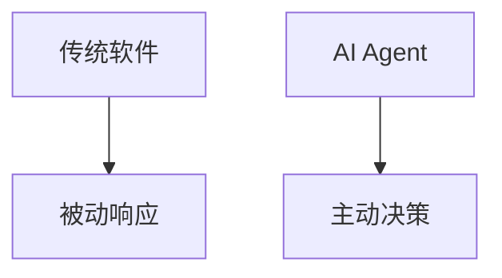
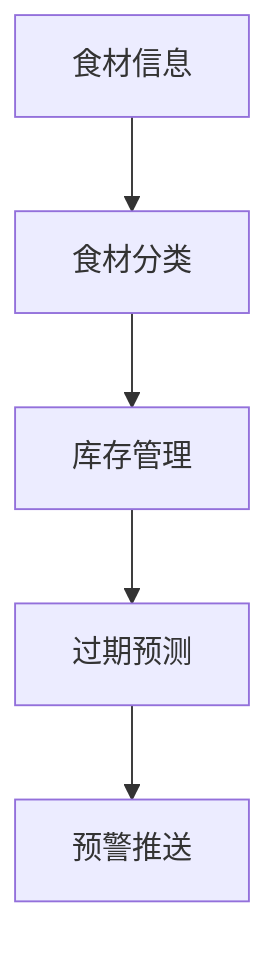

                 


# 智能冰箱：AI Agent的食材管理与过期预警系统

> **关键词**：智能冰箱、AI Agent、食材管理、过期预警、智能家电

> **摘要**：本文探讨了智能冰箱如何利用AI Agent实现食材管理与过期预警系统。通过背景介绍、核心概念、算法原理、系统架构、项目实战等多维度分析，深入解析了AI Agent在智能冰箱中的应用原理及其对现代家庭食材管理的革新作用。本文结合理论与实践，详细阐述了系统设计与实现过程，为智能家电领域的技术研究提供了新的视角。

---

# 第1章 智能冰箱的背景与应用

## 1.1 智能冰箱的背景与概念

### 1.1.1 智能冰箱的定义
智能冰箱是一种集成人工智能技术的家用电器，能够通过传感器、摄像头等设备采集食材信息，并利用AI算法实现食材管理、过期预警、能耗优化等功能。

### 1.1.2 智能冰箱的发展历程
1. **传统冰箱**：仅具备冷藏、冷冻功能，无法与外部系统交互。
2. **智能冰箱1.0**：具备基础的物联网功能，能够通过Wi-Fi或蓝牙连接手机APP，实现远程控制。
3. **智能冰箱2.0**：引入AI技术，能够识别食材种类、监测食材状态，并提供智能化的管理建议。
4. **智能冰箱3.0**：AI Agent深度集成，能够主动决策、优化食材存储方案，并与智能家居系统无缝连接。

### 1.1.3 AI Agent在智能冰箱中的作用
AI Agent（智能体）是一种能够感知环境、自主决策、执行任务的软件实体。在智能冰箱中，AI Agent负责采集食材信息、分析数据、制定管理策略，并与用户进行交互。

---

## 1.2 智能冰箱的应用场景

### 1.2.1 家庭食材管理
AI Agent能够实时监测食材的状态（如温度、湿度、新鲜度等），并通过图像识别技术识别食材种类和数量，帮助用户更好地管理食材库存。

### 1.2.2 食材过期预警
通过AI算法预测食材的保质期，当食材即将过期时，系统会向用户发出预警，并提供多种解决方案（如提前使用、转移存储等）。

### 1.2.3 节能与环保优化
AI Agent可以根据食材的存储状态和用户的使用习惯，优化冰箱的能耗管理，减少浪费，提升环保性能。

---

## 1.3 智能冰箱的市场与未来趋势

### 1.3.1 智能冰箱的市场现状
随着智能家居市场的快速发展，智能冰箱的市场需求持续增长。据统计，2023年全球智能冰箱市场规模已超过500亿美元。

### 1.3.2 技术发展趋势
未来的智能冰箱将更加注重AI Agent的自主决策能力，支持多设备协同工作，并与智能家居系统深度融合。

### 1.3.3 用户需求与痛点分析
用户对智能冰箱的核心需求包括：
1. 实时食材管理
2. 过期预警与提醒
3. 节能优化
4. 用户友好的交互界面

---

## 1.4 本章小结
本章从智能冰箱的背景、概念、应用场景等方面进行了全面介绍，并分析了市场发展趋势和用户需求，为后续的技术实现奠定了基础。

---

# 第2章 AI Agent的基本原理与技术

## 2.1 AI Agent的核心概念

### 2.1.1 AI Agent的定义
AI Agent是一种能够感知环境、自主决策、执行任务的智能实体。它可以分为两类：
1. **反应式Agent**：基于当前感知做出反应，适用于简单的环境。
2. **认知式Agent**：具备推理、规划能力，适用于复杂环境。

### 2.1.2 AI Agent的主要特征
| 特征 | 描述 |
|------|------|
| 感知能力 | 能够通过传感器或接口获取环境信息 |
| 决策能力 | 能够根据信息做出决策 |
| 执行能力 | 能够通过动作改变环境状态 |
| 学习能力 | 能够通过经验优化自身行为 |

### 2.1.3 AI Agent与传统软件的区别


---

## 2.2 AI Agent的关键技术

### 2.2.1 机器学习与深度学习
AI Agent的核心算法基于机器学习和深度学习技术。例如，使用卷积神经网络（CNN）进行食材图像识别，使用随机森林进行过期预测。

### 2.2.2 自然语言处理
通过自然语言处理技术，AI Agent能够理解用户的语音指令，并生成自然的回复。

### 2.2.3 实时数据处理与反馈
AI Agent需要实时处理食材信息，并根据数据变化动态调整策略。

---

## 2.3 AI Agent的实现框架

### 2.3.1 感知层
感知层负责采集环境信息，包括：
1. 温度传感器
2. 湿度传感器
3. 图像识别模块

### 2.3.2 决策层
决策层负责处理感知层获取的数据，并制定决策策略。例如，判断食材是否需要冷藏或冷冻。

### 2.3.3 执行层
执行层负责根据决策层的指令执行动作，例如调整冰箱温度、发出预警信息。

---

## 2.4 本章小结
本章从AI Agent的基本原理出发，分析了其核心概念、关键技术及实现框架，为后续智能冰箱的设计提供了理论基础。

---

# 第3章 智能冰箱的食材管理与过期预警系统

## 3.1 系统整体架构

### 3.1.1 系统组成模块
智能冰箱的食材管理与过期预警系统主要由以下几个模块组成：
1. 食材信息采集模块
2. 食材分类与存储模块
3. 食材库存管理模块
4. 过期预警模块

### 3.1.2 系统功能概述
- 食材信息采集：通过摄像头和传感器获取食材信息。
- 食材分类：基于图像识别技术对食材进行分类。
- 食材库存管理：记录食材的种类、数量和存储位置。
- 过期预警：根据食材的保质期预测结果，向用户发出预警。

### 3.1.3 系统的技术选型
- **图像识别技术**：使用深度学习模型（如YOLO、FRCN）进行食材识别。
- **机器学习模型**：使用XGBoost或随机森林进行过期预测。

---

## 3.2 食材管理模块

### 3.2.1 食材信息采集
通过摄像头和传感器获取食材的图像、重量、温度等信息。

### 3.2.2 食材分类与存储
基于图像识别技术，将食材分为蔬菜、水果、肉类等类别，并根据类别推荐存储位置。

### 3.2.3 食材库存管理
记录食材的种类、数量和存储位置，并支持用户查询和更新。

---

## 3.3 过期预警模块

### 3.3.1 过期预测算法
通过机器学习模型预测食材的保质期，公式如下：
$$ \text{预测结果} = f(\text{当前时间}, \text{保质期}, \text{食材状态}) $$

### 3.3.2 预警规则设置
根据食材的种类和存储条件，设置预警阈值。例如，对于牛奶，预警时间为保质期前1天。

### 3.3.3 预警信息推送
当食材即将过期时，系统会通过手机APP或语音助手向用户发出预警。

---

## 3.4 本章小结
本章详细介绍了智能冰箱的食材管理与过期预警系统的整体架构和功能模块，重点分析了食材信息采集、分类与存储、库存管理及过期预警实现过程。

---

# 第4章 AI Agent在智能冰箱中的具体实现

## 4.1 系统功能实现

### 4.1.1 食材信息采集与处理
通过摄像头和传感器获取食材信息，并通过图像识别技术进行分类。

### 4.1.2 过期预测算法实现
基于机器学习模型，预测食材的保质期。

### 4.1.3 用户交互界面设计
设计友好的用户界面，支持用户查询食材信息、设置预警规则等操作。

---

## 4.2 系统架构设计

### 4.2.1 模块划分与功能分配
1. **感知层**：食材信息采集模块
2. **决策层**：过期预测模块
3. **执行层**：预警推送模块

### 4.2.2 系统数据流设计


### 4.2.3 系统接口设计
系统通过API与智能家居平台（如智能家居中枢）进行交互，支持第三方应用的接入。

---

## 4.3 本章小结
本章通过具体的实现过程，展示了AI Agent在智能冰箱中的实际应用，重点分析了系统功能实现和架构设计。

---

# 第5章 项目实战与代码实现

## 5.1 环境搭建与工具安装

### 5.1.1 开发环境配置
- 操作系统：Linux/Windows/MacOS
- 开发工具：PyCharm/VS Code
- 依赖管理工具：pip

### 5.1.2 第三方库安装
- 图像处理库：OpenCV、TensorFlow
- 数据分析库：Pandas、NumPy
- 可视化库：Matplotlib

### 5.1.3 数据集准备
准备食材图像数据集，包括蔬菜、水果、肉类等类别。

---

## 5.2 核心代码实现

### 5.2.1 食材信息采集模块
```python
import cv2

def capture_image():
    cap = cv2.VideoCapture(0)
    ret, frame = cap.read()
    if ret:
        cv2.imwrite("食材.jpg", frame)
    cap.release()
```

### 5.2.2 过期预测算法实现
```python
import pandas as pd
from sklearn.ensemble import RandomForestClassifier

def predict_expire(date, shelf_life):
    # 数据处理与特征提取
    # 使用随机森林模型进行预测
    model = RandomForestClassifier()
    model.fit(X_train, y_train)
    prediction = model.predict([[date, shelf_life]])
    return prediction
```

---

## 5.3 代码解读与功能分析

### 5.3.1 代码结构分析
1. **食材信息采集模块**：通过摄像头捕获食材图像。
2. **过期预测算法实现**：使用随机森林模型预测食材的保质期。

### 5.3.2 重点函数与方法解析
- `capture_image()`：捕获食材图像并保存。
- `predict_expire()`：基于机器学习模型预测食材的保质期。

### 5.3.3 系统功能测试
通过实际测试验证系统的食材管理与过期预警功能。

---

## 5.4 本章小结
本章通过具体的项目实战，展示了智能冰箱食材管理与过期预警系统的实现过程，重点分析了核心代码的功能与实现细节。

---

# 第6章 系统优化与扩展

## 6.1 系统性能优化

### 6.1.1 数据处理效率提升
通过优化算法和减少数据冗余，提升系统的处理速度。

### 6.1.2 算法优化与加速
使用更高效的算法（如轻量级模型）减少计算资源消耗。

### 6.1.3 系统稳定性增强
通过冗余设计和异常处理机制，提升系统的稳定性。

---

## 6.2 系统功能扩展

### 6.2.1 新功能模块设计
- **食材推荐系统**：根据用户的饮食习惯推荐食材。
- **健康饮食建议**：结合食材种类和用户的健康数据，提供饮食建议。

### 6.2.2 多设备协同
与智能家居系统（如智能灶具、智能厨具）协同工作，提供更智能的厨房解决方案。

---

## 6.3 本章小结
本章从系统优化与功能扩展的角度，提出了进一步提升智能冰箱性能与功能的方法，为后续研究提供了新的方向。

---

# 作者信息

作者：AI天才研究院/AI Genius Institute & 禅与计算机程序设计艺术 /Zen And The Art of Computer Programming

---

感谢您的阅读！如需进一步探讨或技术支持，请随时联系。

