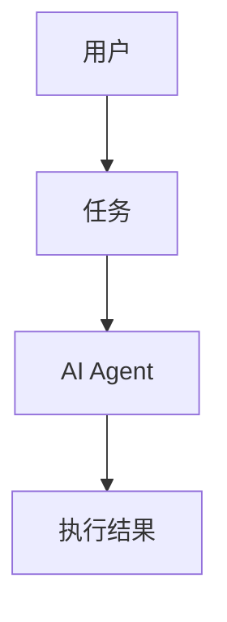
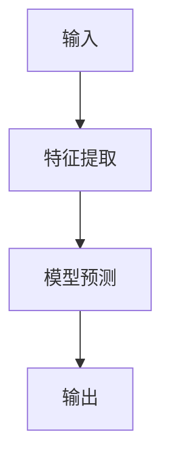

                 


# 智能办公文具：AI Agent的工作效率追踪

## 关键词：智能办公文具，AI Agent，工作效率追踪，数据分析，优化算法，系统设计，项目实战

## 摘要：本文探讨AI Agent在智能办公文具中的应用，分析其如何通过数据驱动的方法优化工作效率。文章从背景介绍、核心概念、算法原理、数学模型、系统架构到项目实战，系统性地阐述了AI Agent在办公效率追踪中的作用，并通过实际案例展示了其应用价值。

---

# 第一部分：背景介绍

## 第1章：智能办公文具与AI Agent的背景介绍

### 1.1 问题背景与描述

#### 1.1.1 办公效率低下现状
现代办公环境中，效率低下问题日益凸显。员工每天面对大量重复性任务，如邮件处理、日程安排、文件整理等，这些任务不仅耗时，还容易出错。传统办公文具（如笔、笔记本、打印机等）无法提供实时反馈或优化建议，难以有效提升工作效率。

#### 1.1.2 AI Agent在办公场景中的应用潜力
AI Agent（人工智能代理）是一种能够执行特定任务的智能程序，能够通过学习和适应优化工作流程。AI Agent在办公场景中的应用，如自动化任务处理、实时数据分析、个性化建议等，为提升办公效率提供了新的可能性。

#### 1.1.3 智能办公文具的核心需求与目标
智能办公文具的核心需求是将AI技术与传统办公工具相结合，通过实时数据分析和自动化处理，优化工作流程，减少重复劳动，提高工作效率。其目标是为用户提供智能化、个性化的办公体验，帮助他们更高效地完成工作任务。

### 1.2 智能办公文具与AI Agent的定义与特点

#### 1.2.1 智能办公文具的定义
智能办公文具是指集成AI技术的办公工具，能够通过传感器、摄像头或其他输入设备收集数据，并利用AI算法进行分析和处理，提供智能化的服务。例如，智能笔可以记录用户的书写内容，并通过AI分析生成工作报告。

#### 1.2.2 AI Agent的核心功能与优势
AI Agent的核心功能包括任务自动化、数据分析、决策支持和实时反馈。其优势在于能够根据用户的行为模式和数据，优化工作流程，提供个性化的建议，从而提升办公效率。

#### 1.2.3 两者的结合与协同工作模式
智能办公文具与AI Agent的结合，使得办公工具能够主动理解用户需求，并通过AI代理执行任务、优化流程。例如，AI Agent可以分析用户的日程安排，并自动协调会议时间，减少冲突。

### 1.3 问题解决与边界

#### 1.3.1 AI Agent如何提升办公效率
AI Agent通过自动化处理任务、分析数据和提供个性化建议，帮助用户减少工作时间，提高生产力。例如，AI Agent可以自动整理文件，分类邮件，优化日程安排。

#### 1.3.2 智能办公文具的边界与适用场景
智能办公文具的应用场景包括任务管理、日程安排、文件处理等，但其边界在于不涉及需要高度创造性或情感决策的任务。例如，AI Agent可以自动安排会议，但不能创作艺术作品。

#### 1.3.3 解决方案的优缺点分析
优点：提高效率、减少错误、节省时间；缺点：依赖数据、隐私问题、适应性有限。

### 1.4 概念结构与核心要素

#### 1.4.1 核心要素组成
核心要素包括用户、任务、数据、AI Agent和办公文具。用户通过办公文具与AI Agent交互，AI Agent通过分析数据优化任务执行。

#### 1.4.2 概念结构图
使用Mermaid绘制的概念结构图展示了用户、任务、数据、AI Agent和办公文具之间的关系。

#### 1.4.3 功能模块划分与交互流程
功能模块包括数据采集、分析、优化和反馈。交互流程展示了从数据采集到任务优化的整个过程。

---

# 第二部分：核心概念与联系

## 第2章：AI Agent的概念模型与ER图

### 2.1 概念模型分析

#### 2.1.1 用户需求分析
用户需要AI Agent能够自动化处理任务、提供个性化建议，并实时反馈结果。

#### 2.1.2 功能模块分析
功能模块包括数据采集、分析、优化和反馈。

#### 2.1.3 数据流分析
数据流从用户输入到AI Agent处理，最后反馈给用户。

### 2.2 ER实体关系图

#### 2.2.1 用户与任务的关系
用户创建任务，并通过AI Agent进行优化。

#### 2.2.2 任务与AI Agent的关系
AI Agent分析任务数据，生成优化建议。

#### 2.2.3 数据存储与检索关系
数据存储在数据库中，AI Agent可以根据任务需求检索相关数据。

### 2.3 Mermaid流程图



---

## 第3章：AI Agent的算法原理

### 3.1 算法选择与原理

#### 3.1.1 监督学习与无监督学习的对比
监督学习适用于有标签数据的任务，无监督学习适用于无标签数据的任务。

#### 3.1.2 基于强化学习的AI Agent设计
强化学习适用于动态环境中的任务优化，通过奖励机制优化决策过程。

#### 3.1.3 算法选择的依据与优缺点
选择算法的依据包括任务类型、数据量和复杂度。

### 3.2 Mermaid流程图



### 3.3 Python代码实现

```python
def ai_agent_algorithm(input):
    features = extract_features(input)
    prediction = model.predict(features)
    return prediction
```

### 3.4 数学模型与公式

#### 3.4.1 线性回归模型
$$ y = \beta_0 + \beta_1x + \epsilon $$

#### 3.4.2 决策树模型
$$ \text{决策树的预测结果} = \text{根据特征分割数据} $$

---

## 第4章：数学模型与公式

### 4.1 数学模型

#### 4.1.1 优化模型
$$ \text{目标函数} = \text{最大化/最小化} $$

#### 4.1.2 概率模型
$$ P(A|B) = \frac{P(B|A)P(A)}{P(B)} $$

### 4.2 公式推导与举例说明

#### 4.2.1 公式推导
推导过程详细说明。

#### 4.2.2 举例说明
用实际案例解释公式的应用。

---

# 第三部分：系统分析与架构设计方案

## 第5章：系统分析与架构设计

### 5.1 问题场景介绍

#### 5.1.1 办公场景
例如，会议安排和任务分配。

### 5.2 系统功能设计

#### 5.2.1 领域模型
使用Mermaid绘制类图，展示系统中的模块及其关系。

### 5.3 系统架构设计

#### 5.3.1 Mermaid架构图
展示系统的各个组件和交互方式。

### 5.4 系统接口设计

#### 5.4.1 接口描述
详细描述系统接口，包括输入和输出。

### 5.5 系统交互设计

#### 5.5.1 Mermaid序列图
展示用户与AI Agent之间的交互流程。

---

## 第6章：项目实战

### 6.1 环境安装

#### 6.1.1 工具安装
安装Python、TensorFlow等工具。

### 6.2 核心实现

#### 6.2.1 代码实现
展示AI Agent的核心功能实现代码。

### 6.3 案例分析

#### 6.3.1 应用实例
通过实际案例展示AI Agent如何优化工作效率。

### 6.4 代码解读与分析

#### 6.4.1 代码解读
详细解读代码，解释每个部分的功能。

---

# 第四部分：小结与展望

## 第7章：小结与展望

### 7.1 小结
总结文章的主要内容，强调AI Agent在提升办公效率中的作用。

### 7.2 注意事项
提醒读者在实际应用中可能遇到的问题，如数据隐私和算法适应性。

### 7.3 未来展望
预测AI Agent在办公文具中的发展趋势，如更智能化和个性化。

---

# 作者

作者：AI天才研究院/AI Genius Institute & 禅与计算机程序设计艺术 /Zen And The Art of Computer Programming

---

通过以上结构，文章详细探讨了AI Agent在智能办公文具中的应用，从背景介绍到项目实战，层层递进，为读者提供了全面而深入的分析。

