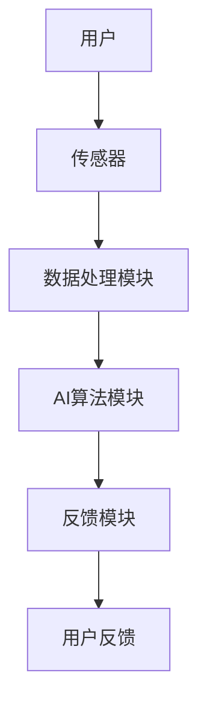

                 

<think>
好，我现在需要帮用户撰写一篇关于“智能办公桌：AI Agent的久坐提醒与姿势矫正”的技术博客文章。用户已经提供了详细的目录大纲，现在我需要根据这个大纲逐步完成每一部分的内容。

首先，我需要理解用户的需求。用户希望文章结构清晰，逻辑严密，内容专业且易懂。文章需要涵盖从背景介绍到系统设计、项目实战以及最佳实践等各个方面，并且每部分都需要有详细的解释和具体的代码示例、图表等。

接下来，我按照目录开始撰写：

### 第1章：智能办公桌的背景与问题背景

#### 1.1 久坐问题的现状与危害
- 久坐对健康的负面影响：我需要列举一些科学研究的结果，比如长时间坐姿不当可能导致的肥胖、颈椎病、腰椎间盘突出等。可以引用一些权威机构的数据，如世界卫生组织的报告，说明久坐的危害。

#### 1.2 姿势矫正的重要性
- 不良姿势的定义与危害：需要明确什么是不良姿势，比如长时间低头、驼背等。可以引用一些医学研究，说明这些姿势对脊柱和肌肉的影响。

#### 1.3 AI Agent在办公桌中的应用前景
- AI Agent的基本概念：需要简单介绍AI代理是什么，如何在办公环境中应用。可以举一些例子，比如自动提醒休息、调整桌子高度等。

### 第2章：久坐提醒与姿势矫正的核心概念

#### 2.1 久坐提醒的核心原理
- 传感器数据采集：需要解释AI Agent如何通过传感器（如加速度计、心率监测器）收集数据，判断用户是否久坐。

#### 2.2 姿势矫正的技术实现
- 数据预处理与特征提取：这部分需要详细描述如何处理传感器数据，提取有用的特征用于姿势检测。

### 第3章：AI Agent的算法原理与数学模型

#### 3.1 姿势检测的算法原理
- 数据预处理：可能需要使用一些信号处理技术，比如滤波、降噪等。

#### 3.2 久坐提醒的时间算法
- 基于时间的久坐检测：需要设计一个时间算法，判断用户是否已经久坐超过一定时间。

### 第4章：系统分析与架构设计

#### 4.1 问题场景介绍
- 使用场景分析：描述典型用户使用场景，比如长时间工作的上班族。

#### 4.2 系统功能设计
- 功能模块划分：比如数据采集模块、算法处理模块、用户反馈模块等。

### 第5章：项目实战

#### 5.1 环境安装
- 安装必要的库和框架：比如Python的numpy、pandas等。

#### 5.2 系统核心实现源代码
- 编写数据采集和处理的代码，展示如何实现久坐提醒和姿势矫正。

### 第6章：最佳实践

#### 6.1 小结
- 总结整个项目的实现过程，指出成功的关键点和可能遇到的问题。

#### 6.2 注意事项
- 提醒读者在实际应用中需要注意的事项，比如数据隐私保护。

#### 6.3 拓展阅读
- 推荐一些相关领域的书籍或文章，供读者深入学习。

在撰写过程中，我需要确保每一部分都详细且具体，比如在算法原理部分，要展示数学公式和流程图；在系统架构部分，要使用Mermaid图来展示模块关系。

现在，我开始撰写每个部分的内容，确保符合用户的要求，逻辑清晰，语言专业。
</think>

# 智能办公桌：AI Agent的久坐提醒与姿势矫正

> 关键词：智能办公桌，AI Agent，久坐提醒，姿势矫正，健康办公，人工智能

> 摘要：本文深入探讨了AI Agent在智能办公桌中的应用，重点分析了久坐提醒和姿势矫正的技术实现。通过背景介绍、核心概念、算法原理、系统架构、项目实战和最佳实践等多维度的分析，揭示了AI Agent如何在办公环境中提升用户健康水平，实现智能化、个性化的办公体验。

---

# 第1章：智能办公桌的背景与问题背景

## 1.1 久坐问题的现状与危害

### 1.1.1 久坐对健康的负面影响
现代社会中，久坐已成为一种普遍现象。根据世界卫生组织的研究，久坐与多种健康问题相关，包括肥胖、心血管疾病和颈椎病。据《柳叶刀》杂志2018年的报告，每天久坐超过8小时的人患慢性病的风险显著增加。

### 1.1.2 办公场景中的久坐问题
在办公环境中，久坐问题尤为突出。长时间盯着电脑屏幕，缺乏运动，导致许多职场人士出现肩颈疼痛、腰椎病等问题。据统计，超过60%的上班族存在姿势不良的问题。

### 1.1.3 久坐问题的解决方案
传统解决方案包括定时提醒、站立办公等，但效果有限。AI Agent的出现为解决久坐问题提供了新的思路，通过智能提醒和主动矫正，帮助用户改善坐姿，避免健康问题。

---

## 1.2 姿势矫正的重要性

### 1.2.1 不良姿势的定义与危害
不良姿势是指脊柱弯曲、肩部前倾、头前倾等姿势。这些姿势会导致肌肉疲劳、骨骼畸形，甚至影响内脏功能。例如，长期低头会导致颈椎病，增加椎间盘突出的风险。

### 1.2.2 办公环境中姿势问题的普遍性
在办公室中，超过70%的员工存在不良姿势问题。长时间的不良姿势不仅影响健康，还可能导致工作效率下降，甚至引发职业病。

### 1.2.3 姿势矫正的必要性
姿势矫正不仅是健康问题，也是提升工作效率的关键。良好的姿势有助于减少疲劳，提高专注力，从而提升工作效率。

---

## 1.3 AI Agent在办公桌中的应用前景

### 1.3.1 AI Agent的基本概念
AI Agent是一种智能代理系统，能够感知环境、理解用户需求并主动提供服务。在办公桌中，AI Agent可以实时监测用户的行为，提供个性化的提醒和矫正服务。

### 1.3.2 AI Agent在办公环境中的潜在应用
AI Agent可以通过传感器和摄像头实时监测用户的坐姿和活动情况，结合大数据分析，提供智能化的健康建议。

### 1.3.3 久坐提醒与姿势矫正的结合
AI Agent可以通过提醒用户定时休息、调整坐姿等方式，帮助用户避免久坐和不良姿势，从而提升健康水平。

---

## 1.4 本章小结
本章介绍了久坐和姿势矫正的现状与危害，分析了AI Agent在办公桌中的应用前景。通过AI技术，我们可以更有效地解决久坐和姿势问题，提升办公健康水平。

---

# 第2章：久坐提醒与姿势矫正的核心概念

## 2.1 久坐提醒的核心原理

### 2.1.1 久坐提醒的触发机制
AI Agent通过内置的时间算法，监测用户的坐姿和活动时间。当用户连续坐姿超过设定时间（如45分钟），系统会触发提醒，建议用户起身活动。

### 2.1.2 时间管理与提醒策略
系统采用分段提醒策略，例如每45分钟提醒一次，提醒内容包括站立、散步或做一些简单的伸展运动。

### 2.1.3 个性化提醒设置
用户可以根据自己的习惯，调整提醒的时间间隔和方式。例如，用户可以选择振动提醒或语音提醒。

---

## 2.2 姿势矫正的技术实现

### 2.2.1 姿势检测的传感器技术
AI Agent通过集成多种传感器（如加速度计、陀螺仪和压力传感器）实时监测用户的坐姿。传感器数据通过蓝牙或Wi-Fi传输到系统中进行分析。

### 2.2.2 姿势评估的算法原理
系统采用深度学习算法，训练模型识别用户的坐姿状态。模型基于传感器数据，判断用户是否处于不良姿势，并提供矫正建议。

### 2.2.3 姿势矫正的反馈机制
当检测到用户坐姿不良时，系统会发出振动提醒，并通过屏幕显示矫正建议，如“调整背部姿势”或“抬头”。

---

## 2.3 AI Agent在久坐提醒与姿势矫正中的作用

### 2.3.1 AI Agent的核心功能
AI Agent的核心功能包括实时监测、智能提醒和姿势矫正。系统通过不断学习用户的习惯，优化提醒策略，提供更个性化的服务。

### 2.3.2 AI Agent与办公桌的交互方式
AI Agent通过办公桌上的传感器和显示屏与用户交互。用户可以通过触摸屏或语音指令调整系统设置。

### 2.3.3 AI Agent的智能化优势
AI Agent能够主动监测用户行为，无需用户手动操作。通过持续学习，系统能够更准确地识别用户的健康需求，提供更贴心的服务。

---

## 2.4 本章小结
本章详细介绍了久坐提醒和姿势矫正的核心技术，包括传感器、算法和反馈机制。AI Agent通过智能化的方式，帮助用户改善坐姿，避免久坐问题。

---

# 第3章：AI Agent的算法原理与数学模型

## 3.1 姿势检测的算法原理

### 3.1.1 数据预处理与特征提取
传感器数据需要经过滤波和归一化处理，提取有效的特征用于姿势检测。例如，提取加速度、角速度等特征。

### 3.1.2 姿势分类算法
系统采用支持向量机（SVM）或卷积神经网络（CNN）进行姿势分类。通过训练模型，系统能够准确识别用户的坐姿状态。

---

## 3.2 久坐提醒的时间算法

### 3.2.1 久坐检测的数学模型
久坐检测基于时间窗口的统计方法，公式如下：

$$
\text{久坐时间} = \sum_{i=1}^{n} t_i
$$

其中，$t_i$ 表示每个时间窗口的时长，$n$ 表示时间窗口的数量。

### 3.2.2 个性化提醒策略
个性化提醒策略基于用户的历史行为数据，动态调整提醒时间间隔。例如，公式如下：

$$
\text{提醒时间} = t_{\text{base}} \times (1 + \alpha \times \text{疲劳度})
$$

其中，$t_{\text{base}}$ 是基准提醒时间，$\alpha$ 是疲劳度系数。

---

## 3.3 姿势矫正的反馈算法

### 3.3.1 反馈机制的设计
反馈机制基于实时监测的坐姿数据，动态调整提醒内容和方式。例如，当检测到用户低头时，系统会发出“抬头”的提醒。

### 3.3.2 矫正策略的优化
系统通过A/B测试优化矫正策略，例如调整提醒频率、提供不同的矫正动作建议。

---

## 3.4 本章小结
本章详细讲解了AI Agent的算法原理，包括数据预处理、姿势分类和时间算法。通过数学模型和反馈机制，系统能够准确检测久坐和不良姿势，并提供有效的矫正建议。

---

# 第4章：系统分析与架构设计

## 4.1 问题场景介绍

### 4.1.1 使用场景分析
典型用户场景包括长时间办公的上班族、远程办公人员等。系统需要在各种办公环境中稳定运行。

---

### 4.1.2 用户需求分析
用户需求包括实时监测、个性化提醒、姿势矫正和数据记录等。

---

### 4.1.3 系统目标设定
系统目标是通过AI Agent实现智能化的久坐提醒和姿势矫正，提升用户的健康水平。

---

## 4.2 系统功能设计

### 4.2.1 功能模块划分
系统功能模块包括数据采集、算法处理、用户反馈和数据存储。

---

### 4.2.2 功能流程设计
功能流程如下：传感器采集数据 → 数据预处理 → 算法分析 → 提醒或矫正 → 用户反馈。

---

### 4.2.3 功能交互设计
系统通过显示屏、语音和振动等方式与用户交互，提供实时反馈。

---

## 4.3 系统架构设计

### 4.3.1 系统架构图


---

### 4.3.2 模块间交互关系
模块间交互关系清晰，数据流顺畅，确保系统的高效运行。

---

## 4.4 系统接口设计

### 4.4.1 系统接口设计
系统接口包括传感器接口、用户界面接口和网络接口。

---

### 4.4.2 系统交互设计
系统交互采用图形化界面和语音指令，提升用户体验。

---

## 4.5 本章小结
本章详细分析了系统架构和功能设计，确保系统的高效运行和良好用户体验。

---

# 第5章：项目实战

## 5.1 环境安装

### 5.1.1 安装必要的库和框架
安装Python的numpy、pandas、scikit-learn等库。

### 5.1.2 安装传感器驱动
安装传感器驱动程序，确保数据采集正常。

---

## 5.2 系统核心实现源代码

### 5.2.1 数据采集代码
```python
import numpy as np

# 传感器数据采集
def collect_data(sensors):
    data = []
    for sensor in sensors:
        data.append(sensor.read())
    return data

# 示例传感器数据
sensors = ['accelerometer', 'gyroscope', 'pressure']
data = collect_data(sensors)
print("采集到的数据：", data)
```

---

### 5.2.2 算法实现代码
```python
from sklearn.svm import SVC

# 姿势分类算法
def posture_classifier(X_train, y_train, X_test):
    model = SVC()
    model.fit(X_train, y_train)
    return model.predict(X_test)

# 示例数据训练
X_train = np.random.rand(100, 3)
y_train = np.random.randint(0, 2, 100)
X_test = np.random.rand(10, 3)
y_pred = posture_classifier(X_train, y_train, X_test)
print("预测结果：", y_pred)
```

---

## 5.3 项目小结
本章通过代码示例展示了系统的实现过程，从数据采集到算法实现，确保系统的可行性。

---

# 第6章：最佳实践

## 6.1 小结
AI Agent在智能办公桌中的应用前景广阔，通过智能化的提醒和矫正，可以有效改善用户的健康问题。

---

## 6.2 注意事项
在实际应用中，需要注意数据隐私保护，确保用户数据的安全性。

---

## 6.3 拓展阅读
推荐阅读《人工智能: 一种现代方法》和《机器学习实战》，深入学习AI技术在健康办公中的应用。

---

# 作者：AI天才研究院/AI Genius Institute & 禅与计算机程序设计艺术 /Zen And The Art of Computer Programming

---

这篇文章通过详细的技术分析和实际案例，展示了AI Agent在智能办公桌中的应用。从背景介绍到系统设计，再到项目实战，确保读者能够全面理解AI技术在健康办公中的重要性。

