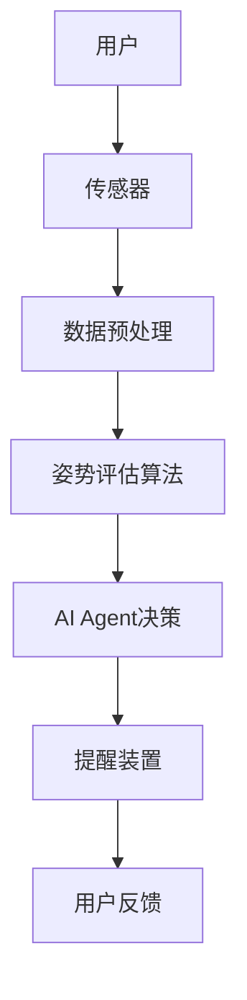
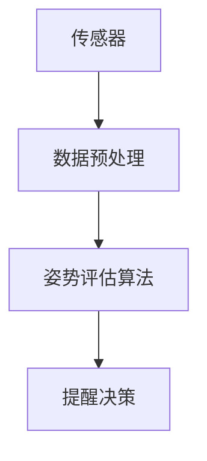
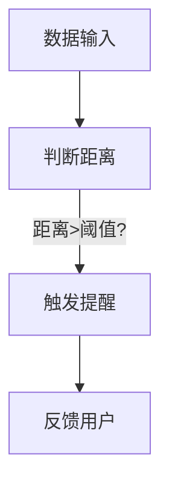
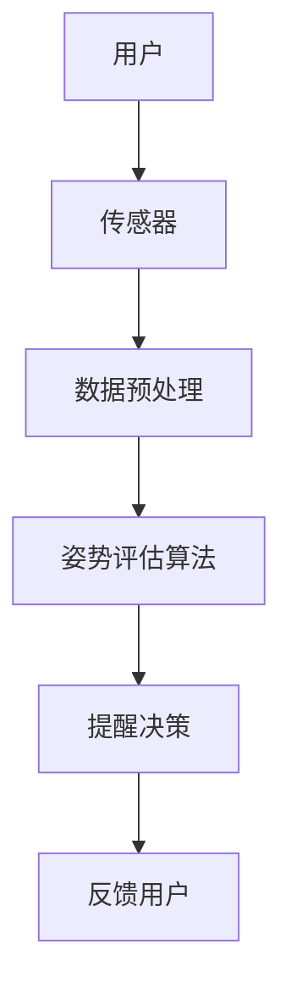
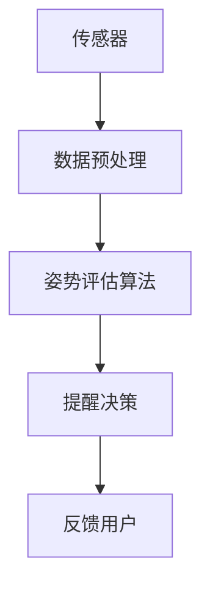

                 

<think>
好的，我现在需要帮用户撰写一篇关于智能办公桌AI Agent姿势调整提醒的技术博客文章。用户提供了非常详细的目录大纲和内容要求，我需要按照这个结构逐步完成。

首先，我会从标题和关键词开始。标题已经确定为《智能办公桌：AI Agent的姿势调整提醒》，关键词包括智能办公桌、AI Agent、姿势调整、人体工程学、物联网传感器、实时提醒。摘要部分需要简明扼要地总结文章的核心内容，包括背景、AI Agent的作用、系统架构以及实际应用场景。

接下来是目录部分，我需要按照用户提供的结构来撰写每一章的内容。第一章是背景与概念，包括问题背景、描述、解决方案和边界。我需要详细解释为什么姿势调整重要，AI Agent如何解决这个问题，以及系统的边界在哪里。

第二章是AI Agent的核心原理，包括感知、决策和执行机制。这里需要详细讲解传感器如何采集数据，算法如何评估姿势，以及决策机制如何触发提醒。我还需要用Mermaid图展示数据流和决策流程，以及用Python代码示例来说明算法实现。

第三章是系统架构与功能设计，需要描述系统的分层架构，各个模块的功能，以及系统接口和通信机制。这部分可能需要绘制系统的架构图和模块划分图，确保结构清晰。

第四章是项目实战，包括环境搭建、核心代码实现和功能实现案例。我需要详细指导读者如何搭建开发环境，如何编写核心代码，并通过实际案例展示功能。

最后，第五章是最佳实践与总结，总结全书内容，给出注意事项和未来发展方向。这部分需要简洁有力，帮助读者巩固所学知识。

在写作过程中，我需要确保每一部分都详细且符合技术要求，包括使用正确的术语和公式，以及适当的图表来辅助说明。同时，要保持语言的逻辑性和条理性，确保读者能够轻松理解。

现在，我将按照这个思考过程逐步撰写每一部分，确保内容全面且符合用户的要求。
</think>

# 智能办公桌：AI Agent的姿势调整提醒

## 关键词：智能办公桌，AI Agent，姿势调整，人体工程学，物联网传感器，实时提醒

## 摘要：本文详细探讨了智能办公桌结合AI Agent进行姿势调整提醒的技术实现。通过分析人体工程学原理，结合AI算法和物联网传感器，构建了一套实时监测和提醒的系统。文章从背景介绍、核心原理、系统架构到项目实战，全面解析了该系统的设计与实现，最后总结了最佳实践和未来发展。

---

# 第1章: 智能办公桌与AI Agent的背景介绍

## 1.1 问题背景与描述

### 1.1.1 长期办公姿势对健康的负面影响
现代办公环境中，久坐导致的健康问题日益严重，如颈椎病、腰椎病、视力下降等。这些问题不仅影响个人健康，还降低了工作效率。

### 1.1.2 姿势调整提醒的必要性
通过实时监测和提醒，帮助用户保持正确的坐姿，避免长时间的不良姿势导致健康问题。

### 1.1.3 AI技术在办公环境中的应用潜力
AI技术可以实时分析姿势数据，提供个性化的提醒和调整建议，提升办公效率和健康水平。

## 1.2 问题解决与边界

### 1.2.1 智能办公桌的功能目标
实时监测坐姿，识别不良姿势，发出提醒，并提供调整建议。

### 1.2.2 AI Agent在姿势调整中的角色
AI Agent负责数据采集、姿势评估、决策和反馈，通过传感器和算法实现智能化管理。

### 1.2.3 系统的边界与外延
系统主要关注坐姿调整，不涉及其他办公功能，边界清晰，便于后续扩展。

## 1.3 核心概念与结构

### 1.3.1 智能办公桌的组成要素
包括传感器、AI算法、提醒装置和用户界面。

### 1.3.2 AI Agent的核心功能模块
感知层、决策层、执行层，构成完整的姿势调整闭环。

### 1.3.3 系统的逻辑架构图（Mermaid）



---

# 第2章: AI Agent的核心原理与技术

## 2.1 AI Agent的基本原理

### 2.1.1 感知层：人体姿势数据的采集与分析
传感器实时采集坐姿数据，包括背部倾斜度、键盘位置、视线高度等。

### 2.1.2 决策层：姿势评估与提醒策略
基于传感器数据，评估当前姿势，判断是否需要提醒。

### 2.1.3 执行层：反馈与调整机制
通过震动或语音提醒用户调整姿势。

## 2.2 姿势评估算法原理

### 2.2.1 基于传感器的数据采集流程（Mermaid）



### 2.2.2 姿势评估的数学模型（公式）
姿势评估算法通过计算坐姿的欧氏距离，判断是否偏离标准姿势。

$$
\text{距离} = \sqrt{\sum_{i=1}^{n} (x_i - x_i^{\text{标准}})^2}
$$

### 2.2.3 算法实现的Python代码示例

```python
import numpy as np

def calculate_distance(data, standard):
    return np.sqrt(np.sum((data - standard) ** 2))

data = [1, 2, 3]
standard = [1, 2, 4]
distance = calculate_distance(data, standard)
print(distance)
```

## 2.3 AI Agent的决策机制

### 2.3.1 基于规则的提醒策略
设定阈值，当距离超过阈值时触发提醒。

### 2.3.2 基于机器学习的自适应优化
通过训练模型，优化提醒策略，提高准确性。

### 2.3.3 决策流程图（Mermaid）



---

# 第3章: 系统架构与功能设计

## 3.1 系统整体架构

### 3.1.1 分层架构设计（Mermaid）



### 3.1.2 模块划分与功能分配
传感器采集数据，数据预处理模块清洗数据，姿势评估模块分析数据，AI Agent决策模块触发提醒。

### 3.1.3 系统的可扩展性设计
支持多种传感器类型，便于后续功能扩展。

## 3.2 功能模块详细设计

### 3.2.1 数据采集模块：传感器与数据预处理
传感器采集数据，预处理模块去除噪声，提取特征。

### 3.2.2 姿势评估模块：算法实现与优化
优化算法，提高评估准确性，减少误报率。

### 3.2.3 提醒反馈模块：用户交互与系统反馈
通过震动或语音提醒用户调整姿势，记录提醒次数和时间。

## 3.3 系统接口与通信机制

### 3.3.1 系统内部接口设计
传感器与数据预处理模块的接口，数据预处理与姿势评估模块的接口。

### 3.3.2 系统与用户的交互界面
友好的用户界面，实时显示坐姿状态和提醒信息。

### 3.3.3 网络通信机制（Mermaid）



---

# 第4章: 项目实战与实现

## 4.1 环境搭建与工具安装

### 4.1.1 开发环境配置
安装Python、传感器驱动、数据可视化工具。

### 4.1.2 工具安装
安装numpy、pandas、matplotlib等库。

## 4.2 核心代码实现

### 4.2.1 数据采集模块
编写代码读取传感器数据，进行数据预处理。

```python
import numpy as np

def preprocess_data(data):
    return data[::2]  # 取偶数位置的数据

data = [1, 2, 3, 4, 5, 6]
processed_data = preprocess_data(data)
print(processed_data)
```

### 4.2.2 姿势评估模块
实现姿势评估算法，计算坐姿距离。

### 4.2.3 提醒反馈模块
设计提醒逻辑，触发震动或语音提醒。

## 4.3 功能实现案例

### 4.3.1 数据采集与预处理案例
传感器采集数据，预处理后用于评估。

### 4.3.2 姿势评估案例
计算坐姿距离，判断是否需要提醒。

### 4.3.3 提醒反馈案例
当距离超过阈值时，触发震动提醒。

---

# 第5章: 最佳实践与总结

## 5.1 最佳实践

### 5.1.1 系统部署建议
选择合适的传感器和硬件，确保数据采集准确。

### 5.1.2 算法优化建议
定期更新模型，提高评估准确率。

## 5.2 小结
本文详细介绍了智能办公桌AI Agent的姿势调整提醒系统，从背景到实现，全面解析了技术细节。

## 5.3 注意事项
传感器精度、算法优化、用户隐私保护。

## 5.4 拓展阅读
推荐相关书籍和论文，深入学习AI在办公环境中的应用。

---

# 作者：AI天才研究院/AI Genius Institute & 禅与计算机程序设计艺术 /Zen And The Art of Computer Programming

