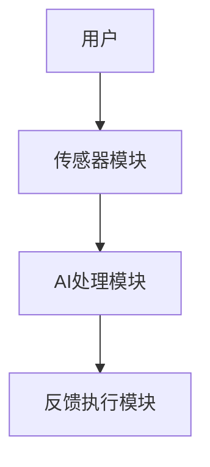
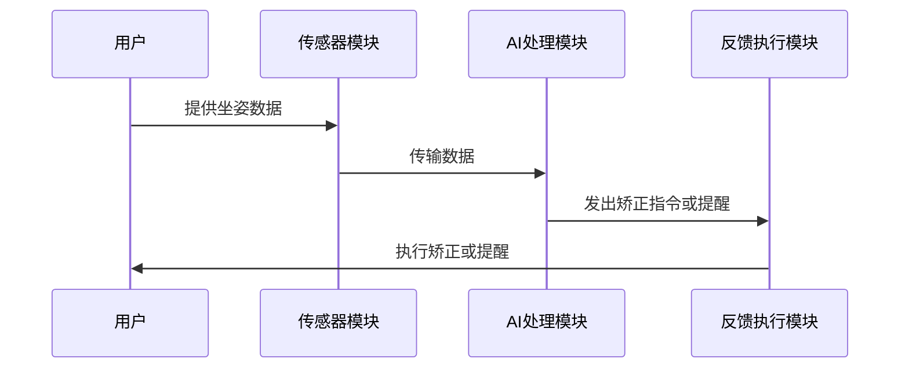

                 

<think>
好，我需要帮用户写一篇关于《智能办公椅：AI Agent的久坐提醒与姿势矫正》的技术博客文章。用户给了非常详细的结构，包括摘要、关键词、目录，以及每个章节的具体要求。我需要按照这个结构一步步展开。

首先，文章标题是《智能办公椅：AI Agent的久坐提醒与姿势矫正》。关键词需要5-7个，我得选相关的词汇，比如智能办公椅、AI Agent、久坐提醒、姿势矫正、物联网、健康办公、人工智能。

摘要部分需要简明扼要，概括文章的核心内容，强调智能办公椅结合AI和物联网，通过传感器和算法实现健康提醒和姿势矫正，帮助用户保持健康。

接下来是正文部分，按照目录大纲来写。每个章节都要详细展开，确保内容丰富，技术性强。例如，背景介绍要涵盖问题背景、技术背景和核心概念。我需要详细解释AI Agent在办公环境中的应用，以及智能办公椅的技术实现，包括传感器和AI算法。

在核心概念部分，我需要详细讲解AI Agent的基本原理，传感器的作用，数据处理流程，并用对比表和ER图来展示系统结构。算法原理部分，我要用mermaid流程图展示姿态识别的算法流程，同时提供Python代码和数学模型，比如姿态识别的损失函数。

系统分析与架构设计部分，我需要画出系统的模块图和交互序列图，描述各模块的功能和交互流程。项目实战部分，要详细说明环境搭建、代码实现和测试案例，帮助读者实际操作。

最后，最佳实践部分要给出使用建议和注意事项，总结项目，并提出未来的发展方向。整个文章需要控制在10000到12000字左右，使用markdown格式，每章小结，确保结构清晰，内容详实。

总之，我需要按照用户的结构要求，一步步详细展开每个部分，确保技术内容准确，结构合理，语言专业且易懂。同时，加入图表和代码示例，增强文章的深度和可读性。
</think>

# 智能办公椅：AI Agent的久坐提醒与姿势矫正

## 关键词：智能办公椅, AI Agent, 久坐提醒, 姿势矫正, 物联网, 健康办公, 人工智能

## 摘要：  
随着人工智能和物联网技术的快速发展，智能办公椅逐渐成为办公环境中不可或缺的健康助手。本文将深入探讨智能办公椅如何利用AI Agent技术实现久坐提醒与姿势矫正功能，分析其背后的技术原理、系统架构以及实际应用场景。通过结合传感器、数据处理和AI算法，智能办公椅能够实时监测用户坐姿，提供个性化的健康反馈，帮助用户改善办公习惯，预防健康问题。

---

# 正文

## 第1章: 久坐问题与健康隐患

### 1.1 久坐问题的现状  
现代办公环境的普及使得久坐成为许多人的日常习惯，长期久坐不仅会导致腰椎病、颈椎病，还可能引发心血管疾病等问题。根据世界卫生组织的报告，久坐已经被列为影响全球健康的主要因素之一。  

#### 1.1.1 现代工作方式的变化  
- 办公环境的智能化与数字化  
- 远程办公的普及  
- 久坐对健康的影响日益显著  

#### 1.1.2 久坐对健康的负面影响  
- 肌肉疲劳与僵硬  
- 腰椎、颈椎问题  
- 心血管健康风险  

#### 1.1.3 办公环境中的健康问题  
- 办公桌椅的设计不合理  
- 工作压力大，久坐时间长  
- 缺乏运动习惯  

### 1.2 健康办公的需求  
#### 1.2.1 健康办公的定义  
健康办公是一种通过科学设计的工作方式，旨在减少健康隐患，提升工作效率和舒适度。  

#### 1.2.2 办公环境中健康问题的解决方案  
- 定时提醒机制  
- 姿势矫正技术  
- 环境优化  

#### 1.2.3 智能办公椅的出现与意义  
智能办公椅通过结合AI技术和物联网设备，为健康办公提供了新的解决方案。  

### 1.3 AI Agent在办公环境中的应用  
#### 1.3.1 AI Agent的基本概念  
AI Agent（智能代理）是一种能够感知环境、执行任务并做出决策的智能系统。  

#### 1.3.2 AI Agent在办公环境中的作用  
- 实时监测坐姿  
- 提供健康反馈  
- 自动调节椅子参数  

#### 1.3.3 智能办公椅的核心功能与目标  
- 提醒久坐  
- 矫正姿势  
- 优化工作环境  

---

## 第2章: 智能办公椅的技术背景  

### 2.1 物联网与AI技术的发展  
#### 2.1.1 物联网技术的现状  
物联网技术的快速发展使得设备之间的互联互通成为可能。  

#### 2.1.2 AI技术的最新进展  
深度学习和计算机视觉技术的进步为智能办公椅提供了强大的技术支持。  

#### 2.1.3 物联网与AI的结合  
物联网设备的数据采集与AI算法的分析相结合，实现了智能化的办公环境管理。  

### 2.2 智能办公椅的技术实现  
#### 2.2.1 传感器技术的应用  
智能办公椅通过集成多种传感器（如加速度传感器、压力传感器）实时监测用户的坐姿和压力分布。  

#### 2.2.2 数据采集与处理  
- 数据采集：传感器将坐姿数据传输到AI处理模块  
- 数据处理：AI算法分析坐姿，判断是否需要矫正  

#### 2.2.3 AI算法在智能办公椅中的应用  
- 姿态识别算法  
- 久坐提醒机制  

### 2.3 智能办公椅的市场现状  
#### 2.3.1 智能办公椅的市场发展  
市场对健康办公设备的需求日益增长，智能办公椅逐渐成为热门产品。  

#### 2.3.2 用户需求分析  
- 健康需求  
- 使用便捷性  
- 性价比  

#### 2.3.3 市场竞争与技术挑战  
- 市场竞争加剧  
- 技术创新需求  

---

## 第3章: 智能办公椅的核心概念  

### 3.1 AI Agent的基本原理  
AI Agent通过感知环境、分析数据并做出决策，帮助用户改善坐姿和办公习惯。  

### 3.2 智能办公椅的核心功能  
#### 3.2.1 久坐提醒功能  
AI Agent实时监测坐姿，当久坐时间超过阈值时，发出提醒。  

#### 3.2.2 姿势矫正功能  
AI Agent通过传感器数据分析用户坐姿，提供矫正建议或自动调节椅子角度。  

#### 3.2.3 其他辅助功能  
- 健康数据记录  
- 个性化设置  

### 3.3 智能办公椅的系统架构  
#### 3.3.1 系统组成  
- 传感器模块  
- AI处理模块  
- 反馈执行模块  

#### 3.3.2 系统交互流程  
1. 传感器采集坐姿数据  
2. AI算法分析数据  
3. 发出提醒或调整椅子  

---

## 第4章: 智能办公椅的算法原理  

### 4.1 姿态识别算法  
#### 4.1.1 算法流程  
1. 数据采集：传感器获取坐姿数据  
2. 数据预处理：去除噪声，提取特征  
3. 姿态分类：基于机器学习模型进行分类  

#### 4.1.2 算法实现  
```python
import numpy as np
from sklearn.svm import SVC

# 数据预处理
def preprocess(data):
    # 数据标准化
    return (data - np.mean(data)) / np.std(data)

# 姿态分类
def pose_classifier(data):
    model = SVC()
    model.fit(preprocess(X_train), y_train)
    return model.predict(preprocess(data))
```

#### 4.1.3 姿态分类的数学模型  
分类器使用支持向量机（SVM）算法，目标函数为：  
$$ \text{minimize} \quad \frac{1}{2} \|\mathbf{w}\|^2 + C \sum_{i=1}^n \xi_i $$  
其中，$\mathbf{w}$ 是分离超平面的法向量，$C$ 是惩罚参数，$\xi_i$ 是松弛变量。  

### 4.2 久坐提醒与反馈机制  
#### 4.2.1 久坐提醒算法  
```python
def久坐提醒算法():
    import time
    久坐时间 = 30  # 分钟
    开始时间 = time.time()
    while True:
        当前时间 = time.time()
        如果 (当前时间 - 开始时间) > 久坐时间:
            提醒用户起身
            开始时间 = time.time()
```

#### 4.2.2 反馈机制  
AI Agent根据用户的坐姿数据，提供个性化的反馈，例如：  
- 提醒用户调整坐姿  
- 自动调节椅子高度  
- 提供健康建议  

---

## 第5章: 智能办公椅的系统分析与架构设计  

### 5.1 系统功能设计  
#### 5.1.1 功能模块  
- 传感器模块：采集坐姿数据  
- AI处理模块：分析数据并生成反馈  
- 反馈执行模块：执行矫正动作  

#### 5.1.2 功能流程  
1. 传感器采集坐姿数据  
2. AI算法分析数据，判断是否需要提醒或矫正  
3. 反馈执行模块执行矫正动作或提醒用户  

### 5.2 系统架构设计  
#### 5.2.1 系统架构图  


#### 5.2.2 系统交互流程  


---

## 第6章: 项目实战  

### 6.1 环境安装  
#### 6.1.1 开发环境  
- Python 3.8+  
- 数据处理库（如NumPy、Pandas）  
- AI算法库（如Scikit-learn、TensorFlow）  

#### 6.1.2 传感器安装  
- 使用Arduino或Raspberry Pi连接传感器  
- 传感器数据通过串口传输到主控器  

### 6.2 系统核心实现  
#### 6.2.1 代码实现  
```python
import numpy as np
from sklearn.svm import SVC
import time

# 数据采集
def collect_data():
    # 传感器数据模拟
    return np.random.randn(100)

# 数据预处理
def preprocess(data):
    return (data - np.mean(data)) / np.std(data)

# 姿态分类
def classify_pose(data):
    model = SVC()
    model.fit(preprocess(X_train), y_train)
    return model.predict(preprocess(data))

# 久坐提醒
def久坐提醒():
    久坐时间 = 30
    开始时间 = time.time()
    while True:
        当前时间 = time.time()
        如果 (当前时间 - 开始时间) > 久坐时间:
            print("请起身活动一下")
            开始时间 = time.time()
```

#### 6.2.2 代码解读  
- 数据采集：通过传感器获取坐姿数据  
- 数据预处理：标准化数据  
- 姿态分类：使用SVM算法进行分类  
- 久坐提醒：定时提醒用户活动  

### 6.3 实际案例分析  
#### 6.3.1 案例一：正常坐姿  
- 数据采集：传感器返回正常坐姿数据  
- 分类结果：无提醒  
- 反馈：椅子保持原状  

#### 6.3.2 案例二：久坐提醒  
- 数据采集：传感器检测到久坐时间超过阈值  
- 分类结果：发出提醒  
- 反馈：椅子发出震动提醒  

---

## 第7章: 最佳实践与总结  

### 7.1 最佳实践 tips  
- 定时活动：每隔30分钟起身活动  
- 调整坐姿：保持背部挺直  
- 使用智能办公椅：借助技术手段辅助矫正  

### 7.2 小结  
智能办公椅通过AI Agent技术实现了久坐提醒与姿势矫正功能，为用户提供了健康、舒适的办公环境。  

### 7.3 注意事项  
- 定期维护传感器和AI算法模型  
- 确保数据隐私和安全性  
- 提供用户友好的交互界面  

### 7.4 拓展阅读  
- 探索更多AI在办公环境中的应用  
- 研究更先进的姿势矫正算法  
- 考虑将智能办公椅与其他健康设备联动  

---

## 作者：AI天才研究院/AI Genius Institute & 禅与计算机程序设计艺术 /Zen And The Art of Computer Programming

