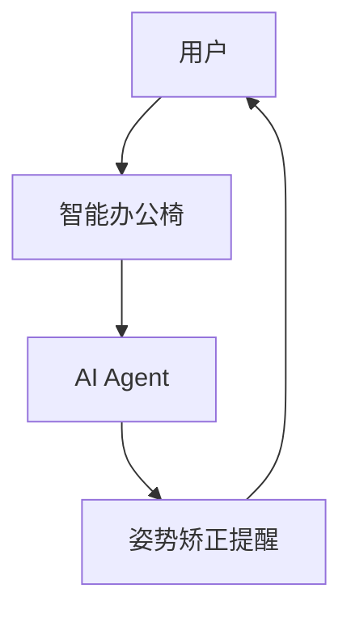
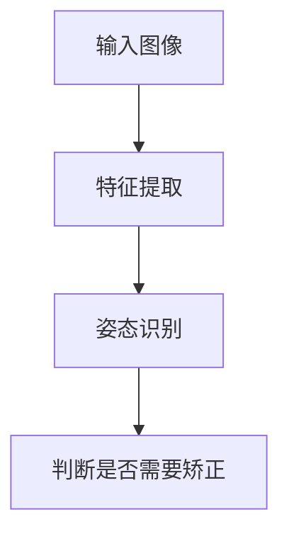

                 


# 智能办公椅：AI Agent的姿势矫正提醒

> 关键词：智能办公椅，AI Agent，姿势矫正，算法原理，系统架构，项目实战

> 摘要：本文深入探讨了智能办公椅结合AI Agent的姿势矫正提醒系统，从背景、核心概念、算法实现、系统架构到项目实战，全面解析该系统的技术细节与应用场景。通过分析姿势检测算法、AI Agent的决策机制、系统架构设计以及实际案例，本文为读者提供了一个全面的技术视角，展示了如何利用AI技术提升办公环境的健康水平。

---

# 第一部分: 背景与概念

# 第1章: 智能办公椅与AI Agent的背景介绍

## 1.1 问题背景与描述

### 1.1.1 办公环境中姿势问题的普遍性
现代社会中，办公人员长时间坐在办公椅上已成为常态。根据世界卫生组织的报告，超过80%的上班族存在姿势不良的问题，包括久坐、驼背、颈部前倾等。这些问题可能导致腰椎病、颈椎病等职业病，影响办公效率和生活质量。

### 1.1.2 长期不良姿势对健康的危害
不良姿势会导致肌肉疲劳、骨骼变形，甚至引发严重的健康问题。例如：
- 长期驼背可能导致脊柱侧弯，影响呼吸功能。
- 颈部前倾会导致颈椎压力过大，引发椎间盘突出。
- 久坐导致血液循环不畅，增加静脉曲张的风险。

### 1.1.3 现有解决方案的局限性
目前市场上的办公椅主要依赖手动调节功能，例如腰靠、头枕等，这些功能无法主动监测用户的姿势状态，也无法提供实时反馈。用户需要依赖自身意识去调整坐姿，这种方式效率低下且难以长期坚持。

## 1.2 问题解决与边界

### 1.2.1 AI Agent在姿势矫正中的作用
AI Agent（智能体）能够通过传感器和算法，实时监测用户的坐姿状态，并在检测到不良姿势时，触发矫正提醒。这种智能化的解决方案可以有效帮助用户保持正确的坐姿。

### 1.2.2 智能办公椅的功能边界
智能办公椅的功能边界包括：
- **姿势检测**：通过传感器实时监测用户坐姿。
- **矫正提醒**：通过震动或声音提醒用户调整坐姿。
- **数据记录**：记录用户的坐姿数据，供后续分析。

### 1.2.3 适用场景与用户群体
适用场景包括办公室、家庭办公、学校等需要长时间坐姿调整的场景。目标用户群体为需要长时间办公的上班族、学生以及有健康需求的用户。

## 1.3 核心概念与组成

### 1.3.1 智能办公椅的定义
智能办公椅是一种结合了传感器、AI算法和反馈机制的办公椅，能够实时监测用户的坐姿状态，并通过AI Agent提供矫正提醒。

### 1.3.2 AI Agent的定义与功能
AI Agent是一种具备自主决策能力的智能体，能够通过传感器数据，分析用户的坐姿状态，并根据预设的规则触发矫正提醒。

### 1.3.3 系统的核心要素组成
系统的核心要素包括：
- **传感器**：用于采集坐姿数据，例如压力传感器、角度传感器等。
- **AI算法**：用于分析坐姿数据，判断是否需要矫正提醒。
- **反馈机制**：通过震动、声音等方式向用户传递矫正信息。

# 第2章: 核心概念与联系

## 2.1 AI Agent的核心原理

### 2.1.1 感知层：姿势检测
姿势检测是AI Agent的第一步，通过传感器采集用户的坐姿数据，例如：
- 压力传感器：检测用户坐姿的受力分布。
- 角度传感器：检测用户的坐姿角度。

### 2.1.2 决策层：矫正策略
AI Agent根据感知层的数据，判断用户的坐姿是否需要矫正。例如：
- 如果用户的背部弯曲角度超过阈值，则触发矫正提醒。

### 2.1.3 执行层：反馈机制
当AI Agent判断用户需要矫正坐姿时，会通过反馈机制向用户传递矫正信息。例如：
- 振动提醒：通过内置的震动器提醒用户调整坐姿。
- 声音提醒：通过内置扬声器播放提醒音。

## 2.2 核心概念对比表

| 概念       | 描述                                                                 |
|------------|----------------------------------------------------------------------|
| 姿势检测    | 通过传感器或摄像头检测用户坐姿状态                                   |
| AI Agent    | 具备自主决策能力的智能体，负责分析数据并触发矫正提醒               |
| 反馈机制    | 通过震动、声音等方式向用户传递矫正信息                             |

## 2.3 系统实体关系图



# 第3章: 算法原理与实现

## 3.1 姿势检测算法

### 3.1.1 基于深度学习的姿势检测流程



### 3.1.2 姿势检测的数学模型

姿势检测可以通过分类算法实现。例如，使用支持向量机（SVM）对坐姿状态进行分类。假设我们有两类数据：正常坐姿和不良坐姿，对应的标签为0和1。

分类模型的损失函数可以表示为：
$$ L = \sum_{i=1}^{n} (y_i - y_i')^2 $$
其中，$y_i$是真实标签，$y_i'$是预测标签。

## 3.2 AI Agent的决策算法

### 3.2.1 基于条件判断的决策流程

```mermaid
graph TD
    A[检测到不良姿势] --> B[触发矫正提醒]
    B -

