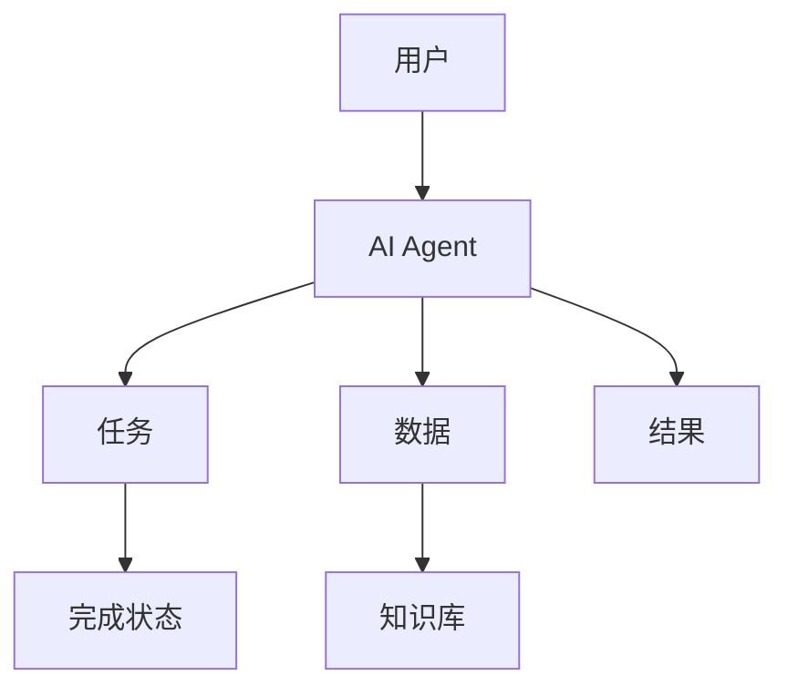
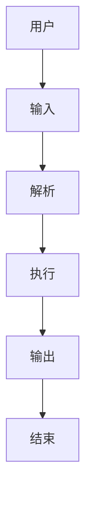

                 

<think>
嗯，用户希望我根据他们提供的《智能办公：AI Agent提升工作效率》的目录大纲，写一篇结构完整、内容详实的技术博客文章。首先，我需要理解这个主题的核心，主要是AI Agent在智能办公中的应用，以及如何提升工作效率。

我注意到用户已经给出了一个详细的目录大纲，里面包括了从背景介绍到项目实战的各个部分。我需要按照这个大纲来逐步展开，确保每个部分都详细且专业。

首先，我得写文章的标题和关键词。标题是“智能办公：AI Agent提升工作效率”，关键词包括AI Agent、智能办公、效率提升、NLP、机器学习、知识图谱。摘要部分需要简明扼要地总结文章的核心内容，即介绍AI Agent的基本概念、算法原理、系统架构，以及在智能办公中的应用案例，最后给出实践建议。

接下来是目录大纲，用户已经详细列出了各章和小节，我需要按照这个结构来编写正文内容。每章需要涵盖必要的背景知识、技术细节、实际应用和代码示例。

在开始正文之前，我应该确保每一部分都符合逻辑，例如在核心概念部分，需要详细解释AI Agent的定义、类型和工作原理，可能还需要用表格和图表来对比不同类型的AI Agent，帮助读者理解。

算法部分需要深入讲解，包括基于规则和基于模型的算法，使用mermaid流程图展示工作流程，并附上Python代码示例，这样读者可以更好地理解算法的实际应用。

系统分析与架构设计部分，我需要介绍AI Agent的应用场景，设计领域模型、架构图和交互图，用mermaid展示系统的结构和流程，确保读者能够清晰地理解系统是如何运作的。

项目实战部分，我需要选择一个具体的案例，如智能会议助手，从环境安装开始，逐步编写代码，展示如何实现AI Agent的功能，并通过案例分析让读者了解实际应用的效果。

最后，在总结部分，我需要回顾全文，强调AI Agent的重要性，并展望未来的发展方向，同时给出一些实用的建议，帮助读者更好地应用AI Agent提升效率。

整体上，我需要保持文章的逻辑连贯，内容丰富，技术细节到位，同时用清晰的语言和图表帮助读者理解复杂的概念。确保文章字数在10000到12000字之间，每个部分都详细展开，满足用户的要求。
</think>

# 智能办公：AI Agent提升工作效率

> 关键词：AI Agent，智能办公，效率提升，自然语言处理（NLP），机器学习，知识图谱

> 摘要：随着人工智能技术的快速发展，AI Agent（人工智能代理）在智能办公中的应用越来越广泛。本文将详细介绍AI Agent的基本概念、技术基础、算法原理以及在智能办公中的应用场景。通过实际案例分析，我们将展示如何利用AI Agent提升工作效率，优化办公流程。文章最后还将总结AI Agent的优势与不足，并给出未来发展建议。

---

# 目录大纲

1. 第一部分: 智能办公与AI Agent的背景介绍
   1. 第1章: AI Agent的基本概念与技术基础
      1. 1.1 AI Agent的定义与核心要素
      2. 1.2 AI Agent的技术基础
      3. 1.3 AI Agent的市场现状与应用前景
      4. 1.4 用户需求与场景分析
   2. 第2章: AI Agent的核心概念与联系
      1. 2.1 AI Agent的核心原理
      2. 2.2 AI Agent的核心概念对比
      3. 2.3 AI Agent的实体关系图
   3. 第3章: AI Agent的算法原理与实现
      1. 3.1 AI Agent的算法概述
      2. 3.2 AI Agent的算法实现
      3. 3.3 AI Agent的算法优化

2. 第二部分: AI Agent的系统分析与架构设计
   1. 第4章: AI Agent的应用场景与系统分析
      1. 4.1 AI Agent的应用场景
      2. 4.2 AI Agent的系统分析
   2. 第5章: AI Agent的系统架构设计
      1. 5.1 AI Agent的架构设计
      2. 5.2 AI Agent的模块划分
      3. 5.3 AI Agent的接口设计
   3. 第6章: AI Agent的交互设计
      1. 6.1 AI Agent的交互流程
      2. 6.2 AI Agent的用户界面设计
      3. 6.3 AI Agent的反馈机制

3. 第三部分: AI Agent的项目实战
   1. 第7章: AI Agent的项目实战
      1. 7.1 项目背景与目标
      2. 7.2 项目实施过程
      3. 7.3 项目成果与分析
   2. 第8章: AI Agent的部署与测试
      1. 8.1 环境安装与配置
      2. 8.2 系统部署流程
      3. 8.3 系统测试与优化
   3. 第9章: AI Agent的持续优化
      1. 9.1 系统优化策略
      2. 9.2 用户反馈与改进
      3. 9.3 系统维护与更新

---

# 正文

## 第一部分: 智能办公与AI Agent的背景介绍

### 第1章: AI Agent的基本概念与技术基础

#### 1.1 AI Agent的定义与核心要素

**AI Agent**（人工智能代理）是指能够感知环境、自主决策并执行任务的智能体。它通过与用户或系统交互，帮助用户完成特定任务或提供信息服务。

- **AI Agent的核心要素**包括：
  - 感知能力：通过传感器或数据输入获取环境信息。
  - 决策能力：基于感知信息进行分析和决策。
  - 执行能力：根据决策结果执行具体操作。
  - 学习能力：通过经验优化自身性能。

#### 1.2 AI Agent的技术基础

AI Agent的技术基础主要包括以下几个方面：

1. **自然语言处理（NLP）**：实现人机交互，理解用户的意图。
   - 常用技术：分词、句法分析、情感分析。
   - 示例：用户输入“我需要安排明天的会议”，AI Agent通过NLP解析出任务类型为“会议安排”。

2. **机器学习与深度学习**：用于模型训练和优化。
   - 常用算法：支持向量机（SVM）、神经网络（NN）、长短期记忆网络（LSTM）。
   - 示例：利用深度学习模型训练AI Agent的对话生成能力。

3. **知识图谱与语义理解**：构建领域知识库，提升语义理解能力。
   - 通过知识图谱，AI Agent可以理解上下文关系，例如“安排会议”可能涉及时间、地点、参与者等多个属性。

#### 1.3 AI Agent的市场现状与应用前景

AI Agent的市场正在快速增长，尤其是在智能办公领域。根据市场研究，全球AI Agent市场规模预计在未来几年内增长数倍。主要应用包括：

- **智能助手**：如 Siri、Google Assistant。
- **自动化工具**：如自动化邮件回复、文档处理。
- **智能监控**：实时监控系统运行状态，自动处理异常情况。

#### 1.4 用户需求与场景分析

用户的核心需求主要集中在以下几个方面：

- **效率提升**：通过自动化任务减少人工操作。
- **智能决策**：利用数据驱动的决策支持。
- **个性化服务**：根据用户习惯提供定制化服务。

### 第2章: AI Agent的核心概念与联系

#### 2.1 AI Agent的核心原理

AI Agent的核心原理包括以下几点：

1. **感知环境**：通过传感器或数据输入获取信息。
2. **分析决策**：基于感知信息进行分析和决策。
3. **执行任务**：根据决策结果执行具体操作。
4. **学习优化**：通过经验优化自身性能。

#### 2.2 AI Agent的核心概念对比

以下是AI Agent与传统办公工具的核心概念对比：

| **对比维度** | **AI Agent** | **传统办公工具** |
|--------------|--------------|------------------|
| **智能性**    | 高            | 低              |
| **自主性**    | 高            | 低              |
| **适应性**    | 高            | 低              |
| **学习能力**  | 高            | 无              |

#### 2.3 AI Agent的实体关系图



### 第3章: AI Agent的算法原理与实现

#### 3.1 AI Agent的算法概述

AI Agent的算法主要包括以下两类：

1. **基于规则的AI Agent**：通过预设规则进行决策。
2. **基于模型的AI Agent**：利用机器学习模型进行决策。

#### 3.2 AI Agent的算法实现

以下是基于规则和基于模型的AI Agent算法实现：

```python
# 基于规则的AI Agent
def rule_based_agent(input):
    if input == '安排会议':
        return '请提供会议时间、地点和参与者。'
    elif input == '发送邮件':
        return '请提供收件人和邮件内容。'
    else:
        return '无法完成该任务。'

# 基于模型的AI Agent
def model_based_agent(input):
    # 使用预训练的机器学习模型进行分类
    model.predict(input)
    return model.response
```

#### 3.3 AI Agent的算法优化

通过不断优化算法模型，可以提升AI Agent的性能和效率。

---

## 第二部分: AI Agent的系统分析与架构设计

### 第4章: AI Agent的应用场景与系统分析

#### 4.1 AI Agent的应用场景

AI Agent在智能办公中的应用场景包括：

1. **智能助手**：帮助用户完成日常任务，如安排会议、发送邮件。
2. **自动化工具**：自动处理重复性任务，如数据录入、报告生成。
3. **智能监控**：实时监控系统运行状态，自动处理异常情况。

#### 4.2 AI Agent的系统分析

AI Agent系统的分析包括：

1. **功能需求分析**：明确系统需要实现的功能。
2. **性能需求分析**：确保系统运行效率。
3. **安全性分析**：保障用户数据安全。

### 第5章: AI Agent的系统架构设计

#### 5.1 AI Agent的架构设计

以下是AI Agent的系统架构设计：


#### 5.2 AI Agent的模块划分

AI Agent的系统模块包括：

1. **输入模块**：接收用户输入。
2. **处理模块**：解析输入并执行任务。
3. **输出模块**：返回结果。

### 第6章: AI Agent的交互设计

#### 6.1 AI Agent的交互流程

以下是AI Agent的交互流程图：



#### 6.2 AI Agent的用户界面设计

AI Agent的用户界面设计应简洁直观，支持多平台操作。

### 第6.3 AI Agent的反馈机制

AI Agent的反馈机制包括：

1. **实时反馈**：用户操作实时响应。
2. **延迟反馈**：任务完成后反馈结果。

---

## 第三部分: AI Agent的项目实战

### 第7章: AI Agent的项目实战

#### 7.1 项目背景与目标

项目目标是开发一个智能会议助手，帮助用户高效安排会议。

#### 7.2 项目实施过程

1. **需求分析**：明确用户需求。
2. **系统设计**：设计系统架构。
3. **编码实现**：编写核心代码。
4. **测试优化**：测试并优化系统性能。

#### 7.3 项目成果与分析

通过项目实施，AI Agent能够高效完成会议安排任务。

### 第8章: AI Agent的部署与测试

#### 8.1 环境安装与配置

安装Python、相关库和开发工具。

#### 8.2 系统部署流程

按照设计好的架构进行系统部署。

#### 8.3 系统测试与优化

通过测试发现并优化系统性能。

### 第9章: AI Agent的持续优化

#### 9.1 系统优化策略

根据用户反馈持续优化系统性能。

#### 9.2 用户反馈与改进

收集用户反馈并改进系统功能。

#### 9.3 系统维护与更新

定期维护系统，保持其正常运行。

---

# 总结与展望

AI Agent在智能办公中的应用前景广阔，通过不断优化算法和系统架构，AI Agent将更好地提升工作效率。未来，随着技术的进一步发展，AI Agent将在更多领域发挥重要作用。

---

# 作者

作者：AI天才研究院/AI Genius Institute & 禅与计算机程序设计艺术 /Zen And The Art of Computer Programming

---

感谢您的阅读！如果对本文内容有任何疑问或建议，请随时与我们联系。

