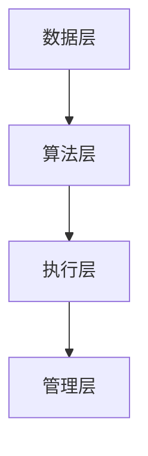

                 


---

# 智能加密货币交易策略

> **关键词**：智能加密货币交易，机器学习，区块链，智能合约，算法交易，风险管理

> **摘要**：本文深入探讨了智能加密货币交易策略的核心概念、算法原理、系统架构设计及实战案例。通过分析加密货币市场的特点，结合机器学习与区块链技术，提出了一套高效可靠的智能交易解决方案。文章内容涵盖从基础理论到实际应用的完整流程，为读者提供了全面的技术指导。

---

# 第1章: 加密货币与智能交易的背景介绍

## 1.1 加密货币的定义与特点

### 1.1.1 加密货币的基本概念
加密货币是一种基于密码学的虚拟货币，通过区块链技术实现去中心化、匿名性和不可篡改性。其核心特征包括：

- **去中心化**：不依赖于任何中央机构或银行，交易通过区块链网络进行。
- **匿名性**：交易双方通过地址进行识别，不涉及真实身份。
- **不可篡改性**：区块链上的交易记录无法被修改或删除。
- **全球流通**：加密货币可以在全球范围内自由交易和流通。

### 1.1.2 加密货币的核心技术：区块链
区块链是一种分布式账本技术，由多个区块组成，每个区块包含一定数量的交易记录。区块链的核心特征包括：

- **区块结构**：每个区块包含交易数据、时间戳和哈希值。
- **链式结构**：区块之间通过哈希值连接，形成一条不可篡改的链式结构。
- **共识机制**：通过共识算法（如比特币的PoW、以太坊的PoS）确保网络的安全性和一致性。

### 1.1.3 加密货币的分类与应用场景
加密货币可以分为以下几类：

- **比特币（Bitcoin）**：最早的加密货币，主要用于投资和交易。
- **以太坊（Ethereum）**：支持智能合约的平台，广泛应用于DeFi（去中心化金融）。
- **稳定币（Stablecoin）**：与美元等法定货币挂钩，用于降低波动风险。

应用场景包括：

- **投资交易**：投资者通过交易所进行买卖操作。
- **支付结算**：部分商家接受加密货币作为支付方式。
- **DeFi借贷**：用户可以通过智能合约进行借贷和资金池操作。

## 1.2 智能交易的定义与优势

### 1.2.1 智能交易的基本概念
智能交易是指通过算法和自动化系统，根据市场数据和预设策略，自动执行交易指令的过程。其核心在于利用技术手段提高交易效率和准确性。

### 1.2.2 智能交易的核心优势
智能交易相较于传统交易具有以下优势：

- **高效性**：算法可以在毫秒级别完成决策和执行。
- **准确性**：通过数学模型和数据分析，减少人为情绪干扰。
- **自动化**：系统可以7x24小时不间断运行，覆盖更多交易机会。

### 1.2.3 智能交易与传统交易的区别
以下是智能交易与传统交易的对比：

| 特性             | 智能交易                       | 传统交易                       |
|------------------|-------------------------------|-------------------------------|
| 执行方式         | 算法自动执行                   | 人工手动操作                   |
| 交易频率         | 高频交易                      | 低频交易                      |
| 风险控制         | 系统内置风险控制机制           | 依赖人工判断和控制             |
| 数据处理能力     | 强大的数据分析能力             | 依赖人工分析                   |

## 1.3 智能加密货币交易的背景与现状

### 1.3.1 加密货币市场的现状
近年来，加密货币市场经历了快速增长，市场规模不断扩大。根据CoinMarketCap的数据，截至2023年，全球加密货币市值已超过3万亿美元，交易量也屡创新高。

### 1.3.2 智能交易在加密货币中的应用
智能交易在加密货币市场中的应用日益广泛，主要体现在以下几个方面：

- **高频交易**：通过算法快速捕捉市场波动，获取微小利润。
- **套利交易**：利用不同交易所的价格差异进行无风险套利。
- **自动化投资**：通过预设策略自动买卖，实现长期收益最大化。

### 1.3.3 当前智能交易的主要挑战
尽管智能交易在加密货币市场中表现出巨大潜力，但仍面临以下挑战：

- **市场波动性**：加密货币价格波动剧烈，算法需要不断适应市场变化。
- **交易成本**：高频交易可能导致高额手续费。
- **监管风险**：不同国家对加密货币的监管政策存在差异，可能影响交易的合法性。

## 1.4 本章小结
本章介绍了加密货币的基本概念、核心技术及应用场景，并对比了智能交易与传统交易的差异。通过分析当前加密货币市场的现状，揭示了智能交易在其中的重要性与潜力。下一章将深入探讨智能加密货币交易策略的核心原理。

---

# 第2章: 智能加密货币交易策略的原理

## 2.1 智能加密货币交易策略的核心要素

### 2.1.1 数据源与数据处理
智能交易系统需要依赖高质量的市场数据，包括：

- **K线数据**：包括开盘价、收盘价、最高价、最低价和成交量。
- **市场深度数据**：买卖订单的具体挂单情况。
- **市场情绪数据**：投资者对市场的看法和预期。

数据处理的关键步骤包括：

1. **数据清洗**：去除异常数据，确保数据的完整性和准确性。
2. **特征提取**：从原始数据中提取有用的特征，如成交量变化率、价格波动率等。
3. **数据标准化**：将数据转换为统一格式，便于模型训练。

### 2.1.2 策略模型与算法
策略模型是智能交易的核心，常见的策略类型包括：

- **技术分析策略**：基于K线图、均线、MACD等技术指标进行买卖决策。
- **统计套利策略**：通过统计学方法寻找市场中的套利机会。
- **机器学习策略**：利用深度学习模型预测价格走势。

### 2.1.3 执行引擎与风险管理
执行引擎负责根据策略生成的信号，执行具体的交易指令。其主要功能包括：

- **信号生成**：根据市场数据和策略模型生成买卖信号。
- **订单提交**：向交易所提交订单，确保以最优价格成交。
- **风险管理**：设定止损和止盈点，控制交易风险。

## 2.2 智能交易策略的分类与对比

### 2.2.1 基于技术分析的策略
技术分析策略通过分析K线图和各种技术指标，预测价格走势。常见的技术指标包括：

- **移动平均线（MA）**：通过计算一定时间内的平均价格，判断价格趋势。
- **相对强弱指数（RSI）**：衡量资产在一定时间内的超买或超卖状态。
- **MACD指标**：通过移动平均收敛散度判断价格趋势。

### 2.2.2 基于机器学习的策略
机器学习策略利用历史数据训练模型，预测未来的价格走势。常用的算法包括：

- **线性回归**：用于预测价格走势。
- **支持向量机（SVM）**：用于分类和回归任务。
- **随机森林**：通过集成学习提高模型的准确性和稳定性。

### 2.2.3 基于市场情绪的策略
市场情绪策略通过分析投资者的情绪变化，预测市场价格走势。常用的情绪分析方法包括：

- **社交媒体分析**：通过分析Twitter、Reddit等平台的帖子，判断市场情绪。
- **新闻情感分析**：通过自然语言处理技术，分析新闻标题和内容的情感倾向。

## 2.3 智能交易策略的优缺点分析

### 2.3.1 策略的优点
智能交易策略具有以下优点：

- **高效性**：算法可以在短时间内完成大量的交易操作。
- **准确性**：通过数学模型和数据分析，减少人为情绪干扰。
- **自动化**：系统可以7x24小时不间断运行，覆盖更多交易机会。

### 2.3.2 策略的缺点
智能交易策略也存在一些缺点：

- **市场适应性**：算法需要不断适应市场变化，否则可能失效。
- **交易成本**：高频交易可能导致高额手续费。
- **模型风险**：模型的准确性直接影响交易结果，需要持续优化。

### 2.3.3 策略的优化方向
为了克服上述缺点，可以采取以下优化措施：

- **动态调整模型**：根据市场变化动态调整模型参数，提高适应性。
- **降低交易成本**：通过优化订单提交策略，降低交易手续费。
- **模型组合**：结合多种策略，降低单一模型的风险。

## 2.4 本章小结
本章详细介绍了智能加密货币交易策略的核心要素，包括数据源、策略模型和执行引擎，并对比了不同策略的优缺点。下一章将深入探讨基于机器学习的智能交易算法，包括算法实现的数学模型和代码示例。

---

# 第3章: 基于机器学习的智能交易算法

## 3.1 机器学习在智能交易中的应用

### 3.1.1 机器学习的基本概念
机器学习是一种人工智能技术，通过数据训练模型，使其能够从经验中学习并做出预测或决策。其核心步骤包括：

1. **数据收集**：获取训练数据。
2. **特征工程**：提取有用的特征。
3. **模型训练**：通过算法训练模型。
4. **模型评估**：验证模型的准确性和稳定性。

### 3.1.2 机器学习在加密货币交易中的应用场景
机器学习在加密货币交易中的应用场景包括：

- **价格预测**：通过历史价格数据预测未来走势。
- **套利机会识别**：通过算法发现不同市场中的价格差异。
- **风险管理**：通过模型预测市场风险，制定相应的风险管理策略。

## 3.2 常见智能交易算法的实现

### 3.2.1 基于K线图的特征提取
K线图是加密货币交易中最常用的图表形式，通过分析K线图可以提取以下特征：

- **开盘价**：当天的第一个成交价格。
- **收盘价**：当天的最后一个成交价格。
- **最高价**：当天的最高成交价格。
- **最低价**：当天的最低成交价格。
- **成交量**：当天的交易总量。

### 3.2.2 基于时间序列的预测模型
时间序列预测模型是机器学习中常用的算法之一，可以通过历史价格数据预测未来的价格走势。常用的模型包括：

- **ARIMA模型**：通过自回归和滑动平均的方式预测未来价格。
- **LSTM模型**：通过长短期记忆网络捕捉时间序列中的长期依赖关系。

### 3.2.3 基于强化学习的交易策略
强化学习是一种通过试错机制优化决策的算法，可以应用于智能交易策略的优化。其核心步骤包括：

1. **状态定义**：定义交易环境的状态，如当前价格、持仓情况等。
2. **动作选择**：根据当前状态选择交易动作，如买入、卖出或持有。
3. **奖励机制**：根据交易结果给予奖励或惩罚，优化决策模型。

## 3.3 算法实现的数学模型与公式

### 3.3.1 时间序列预测模型的数学公式
ARIMA模型的数学公式如下：
$$ y_t = \alpha y_{t-1} + \beta x_t + \epsilon_t $$
其中，$y_t$表示当前价格，$y_{t-1}$表示前一个时间点的价格，$x_t$表示外部影响因素，$\epsilon_t$表示随机误差。

### 3.3.2 强化学习策略的数学公式
强化学习策略的数学公式如下：
$$ Q(s, a) = r + \gamma \max Q(s', a') $$
其中，$s$表示当前状态，$a$表示动作，$r$表示奖励，$\gamma$表示折扣因子，$s'$表示下一个状态。

## 3.4 算法实现的代码示例

### 3.4.1 数据预处理代码
```python
import pandas as pd
data = pd.read_csv('coin_data.csv')
print(data.head())
```

### 3.4.2 特征工程代码
```python
from sklearn.preprocessing import MinMaxScaler
scaler = MinMaxScaler()
scaled_data = scaler.fit_transform(data['price'])
```

### 3.4.3 模型训练代码
```python
from tensorflow.keras.models import Sequential
from tensorflow.keras.layers import LSTM, Dense
model = Sequential()
model.add(LSTM(64, input_shape=(1, 1)))
model.add(Dense(1))
model.compile(loss='mean_squared_error', optimizer='adam')
model.fit(scaled_data, epochs=100, batch_size=32)
```

### 3.4.4 模型预测代码
```python
import numpy as np
test_data = np.array(data['price'][-100:].values).reshape((1, 1, 100))
prediction = model.predict(test_data)
print(prediction)
```

## 3.5 本章小结
本章详细介绍了机器学习在智能加密货币交易中的应用，包括基于时间序列的预测模型和强化学习策略。通过具体的代码示例，展示了如何利用机器学习算法实现智能交易。下一章将探讨智能加密货币交易系统的系统分析与架构设计。

---

# 第4章: 智能加密货币交易系统的系统分析与架构设计

## 4.1 系统功能设计

### 4.1.1 功能模块划分
智能加密货币交易系统的主要功能模块包括：

- **数据采集模块**：从交易所获取实时市场数据。
- **策略执行模块**：根据策略模型生成交易信号并执行交易。
- **风险管理模块**：实时监控交易风险，动态调整策略参数。

### 4.1.2 功能模块的交互流程
数据采集模块首先获取市场数据，传递给策略执行模块进行分析和决策。策略执行模块根据分析结果向交易所提交订单，并将交易结果反馈给风险管理模块，动态调整风险控制参数。

### 4.1.3 功能模块的实现细节
- **数据采集模块**：支持多个交易所的数据接口，确保数据的实时性和准确性。
- **策略执行模块**：支持多种交易策略，可以同时运行多个策略。
- **风险管理模块**：包括止损、止盈和仓位管理等功能，确保系统运行的安全性。

## 4.2 系统架构设计

### 4.2.1 系统架构的总体设计
智能加密货币交易系统的总体架构包括以下几个层次：

- **数据层**：存储市场数据和交易记录。
- **算法层**：实现各种交易策略和算法。
- **执行层**：负责订单提交和交易执行。
- **管理层**：实现风险管理和系统监控。

### 4.2.2 系统架构的详细设计
系统架构设计如下：



## 4.3 系统接口设计

### 4.3.1 数据接口设计
数据接口主要负责与交易所的数据交互，常用的接口包括：

- **API接口**：通过REST API或WebSocket API获取实时数据。
- **数据格式**：支持JSON、CSV等格式的数据传输。

### 4.3.2 系统接口的实现细节
- **API接口**：通过调用交易所的API获取市场数据。
- **数据格式转换**：将获取的数据转换为系统内部使用的格式。

## 4.4 系统交互流程设计

### 4.4.1 系统交互流程的详细步骤
1. 数据采集模块通过API接口获取市场数据。
2. 策略执行模块根据市场数据生成交易信号。
3. 执行引擎根据交易信号向交易所提交订单。
4. 交易结果反馈给风险管理模块，动态调整策略参数。

### 4.4.2 系统交互流程的实现细节
- **数据采集**：通过定时任务获取市场数据，确保数据的实时性。
- **策略执行**：根据预设策略生成交易信号，支持多种策略同时运行。
- **风险管理**：根据交易结果调整风险控制参数，确保系统运行的安全性。

## 4.5 本章小结
本章详细介绍了智能加密货币交易系统的功能设计和架构设计，包括数据层、算法层、执行层和管理层的交互关系。通过系统的接口设计和交互流程，展示了如何实现高效的智能交易系统。

---

# 第5章: 智能加密货币交易策略的实战案例

## 5.1 项目背景与目标

### 5.1.1 项目背景
本文将以一个基于以太坊的智能交易系统为例，展示如何利用机器学习算法实现智能交易。

### 5.1.2 项目目标
通过本项目，实现以下目标：

- **数据采集**：从以太坊网络获取实时市场数据。
- **策略设计**：设计并实现一个基于机器学习的交易策略。
- **系统实现**：完成交易系统的开发和部署。
- **效果评估**：评估交易策略的收益和风险。

## 5.2 项目环境与工具

### 5.2.1 开发环境
- **操作系统**：Linux/Windows/MacOS
- **编程语言**：Python
- **开发工具**：PyCharm
- **版本控制**：Git

### 5.2.2 第三方库
- **数据采集**：ccxt库（支持多个交易所的API接口）
- **数据处理**：pandas库
- **模型训练**：TensorFlow/PyTorch库
- **数据可视化**：Matplotlib/Seaborn库

## 5.3 项目核心实现

### 5.3.1 数据采集与处理
```python
import ccxt
from pandas import DataFrame

# 获取以太坊的价格数据
data = []
for i in range(100):
    price = ccxt.binance().fetch_ticker('ethusdt')['last']
    data.append(price)

# 转换为DataFrame格式
df = DataFrame(data, columns=['price'])
print(df)
```

### 5.3.2 策略设计与实现
```python
from tensorflow.keras.models import Sequential
from tensorflow.keras.layers import LSTM, Dense

# 定义LSTM模型
model = Sequential()
model.add(LSTM(64, input_shape=(1, 1)))
model.add(Dense(1))
model.compile(loss='mean_squared_error', optimizer='adam')

# 训练模型
model.fit(X_train, y_train, epochs=100, batch_size=32)
```

### 5.3.3 交易执行与风险管理
```python
from ccxt import binance

# 初始化交易所接口
exchange = binance()

# 提交订单
order = exchange.create_order(
    symbol='ethusdt',
    side='buy',
    type='market',
    quantity=0.01
)

# 查询订单状态
status = exchange.fetch_order(order['id'])
print(status)
```

## 5.4 项目实战案例分析

### 5.4.1 案例分析
通过实际交易数据，评估交易策略的收益和风险。例如，假设我们的策略在一个月内实现了10%的收益，而市场平均收益为5%，则策略表现优于市场。

### 5.4.2 交易策略的优化
根据实际交易结果，动态调整策略参数，优化交易模型，提高收益和降低风险。

## 5.5 项目小结
本章通过一个实际的项目案例，展示了如何利用机器学习算法实现智能加密货币交易策略。通过详细的代码实现和案例分析，帮助读者掌握智能交易系统的核心实现方法。

---

# 第6章: 风险管理与优化

## 6.1 风险管理策略

### 6.1.1 风险控制的必要性
智能交易系统需要实时监控市场风险，避免因市场波动导致的巨额亏损。

### 6.1.2 风险控制的实现方法
常用的风

