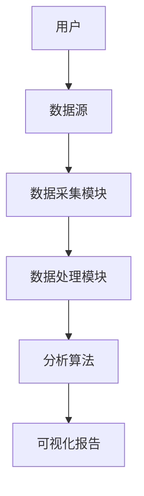
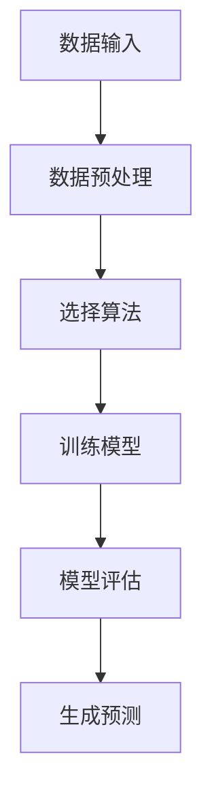
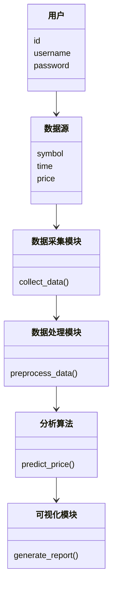
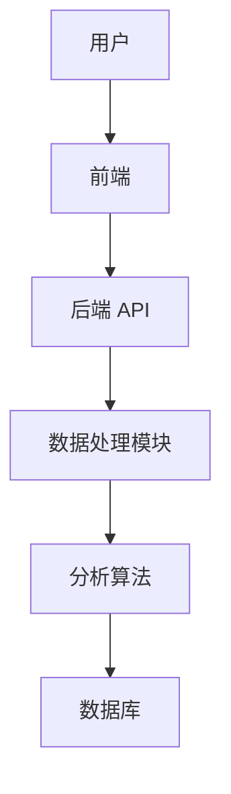
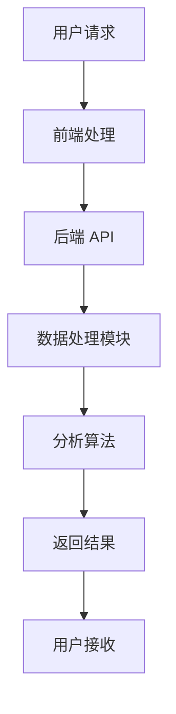

                 


# 智能加密货币市场分析平台

## 关键词：智能加密货币、市场分析、人工智能、数据处理、算法优化、系统架构

## 摘要：本文详细探讨智能加密货币市场分析平台的构建与实现，从背景到算法，再到系统设计和项目实战，结合专业技术和实际案例，为读者提供深入的技术分析和实践指导。

---

## 第1章：智能加密货币市场分析平台背景与概述

### 1.1 加密货币市场的背景与现状

#### 1.1.1 加密货币的起源与发展
- **起源**：比特币（2009年）的诞生标志着加密货币的开端。
- **发展**：以太坊、Solana等项目的兴起推动了加密货币的多样化和技术创新。
- **现状**：市场波动剧烈，交易量巨大，应用场景不断扩展。

#### 1.1.2 当前加密货币市场的特点与挑战
- **特点**：去中心化、匿名性、高波动性。
- **挑战**：价格波动剧烈、监管不确定性、技术安全性。

#### 1.1.3 智能加密货币市场分析平台的重要性
- 提供实时数据分析。
- 优化投资决策。
- 提高市场透明度。

### 1.2 智能加密货币市场分析平台的核心概念

#### 1.2.1 智能分析的定义与特点
- **定义**：利用人工智能技术对市场数据进行实时分析和预测。
- **特点**：智能化、实时性、高准确性。

#### 1.2.2 平台的功能与目标
- 数据采集：实时抓取加密货币市场数据。
- 数据分析：使用机器学习算法进行预测。
- 可视化：生成易于理解的报告和图表。
- 目标：帮助用户做出明智的投资决策。

#### 1.2.3 平台的边界与外延
- **边界**：专注于市场数据分析，不涉及交易执行。
- **外延**：可扩展至其他金融市场分析。

### 1.3 平台的核心要素与组成结构

#### 1.3.1 数据采集模块
- 从多个交易所获取实时数据。
- 数据清洗和预处理。

#### 1.3.2 数据处理与分析模块
- 使用时间序列分析和机器学习算法进行预测。

#### 1.3.3 可视化与报告生成模块
- 生成图表和报告，帮助用户理解市场趋势。

---

## 第2章：智能加密货币市场分析平台的核心概念与联系

### 2.1 核心概念原理

#### 2.1.1 加密货币价格预测的原理
- 基于历史数据和市场情绪进行预测。

#### 2.1.2 智能分析算法的实现机制
- 机器学习模型的训练和部署。

#### 2.1.3 平台数据流的处理流程
- 数据采集 → 数据清洗 → 数据分析 → 数据可视化。

### 2.2 核心概念属性对比表

| 概念       | 属性1   | 属性2   | 属性3   |
|------------|---------|---------|---------|
| 数据采集   | 实时性   | 准确性   | 多样性   |
| 数据分析   | 智能性   | 可视化   | 可扩展性 |
| 平台架构   | 分布式   | 高可用性 | 易维护性 |

### 2.3 ER实体关系图



---

## 第3章：智能加密货币市场分析的算法原理

### 3.1 时间序列分析算法

#### 3.1.1 ARIMA算法原理

- **ARIMA模型**：用于预测未来价格。
- **数学公式**：$$ARIMA(p, d, q)$$，其中p为自回归阶数，d为差分阶数，q为移动平均阶数。

#### 3.1.2 LSTM网络的应用

- **LSTM**：长短期记忆网络，适合处理时间序列数据。
- **流程图**：
  ```mermaid
  graph TD
      A[输入数据] --> B[ LSTM 网络 ]
      B --> C[ 输出预测结果 ]
  ```

#### 3.1.3 算法流程图



### 3.2 机器学习模型实现

#### 3.2.1 数据预处理

- **代码示例**：
  ```python
  import pandas as pd
  data = pd.read_csv('crypto_data.csv')
  data = data.dropna()
  ```

#### 3.2.2 模型训练

- **代码示例**：
  ```python
  from sklearn.model_selection import train_test_split
  X_train, X_test, y_train, y_test = train_test_split(X, y, test_size=0.2)
  model.fit(X_train, y_train)
  ```

#### 3.2.3 模型评估

- **评估指标**：均方误差（MSE）、R²分数。

#### 3.2.4 模型优化

- **超参数调优**：使用网格搜索或随机搜索优化模型性能。

---

## 第4章：智能加密货币市场分析平台系统分析与架构设计

### 4.1 问题场景介绍

- **目标**：实时监控和分析加密货币市场数据。
- **用户角色**：投资者、交易员、数据分析师。

### 4.2 系统功能设计

#### 4.2.1 领域模型设计



### 4.3 系统架构设计



### 4.4 系统接口设计

- **API接口**：
  - `GET /api/crypto_price?symbol=BTC`
  - `POST /api/predict`

### 4.5 系统交互流程图



---

## 第5章：智能加密货币市场分析平台项目实战

### 5.1 环境安装

- **Python**：安装3.8及以上版本。
- **依赖库**：numpy、pandas、scikit-learn、keras、tensorflow、flask。

### 5.2 核心代码实现

#### 5.2.1 数据采集模块

```python
import requests
import pandas as pd

def get_crypto_data(symbol):
    url = f"https://api.example.com/price/{symbol}"
    response = requests.get(url)
    data = response.json()
    return pd.DataFrame(data)
```

#### 5.2.2 数据处理模块

```python
from sklearn.preprocessing import MinMaxScaler

def preprocess_data(data):
    scaler = MinMaxScaler()
    scaled_data = scaler.fit_transform(data)
    return scaled_data
```

#### 5.2.3 分析算法实现

```python
from keras.models import Sequential
from keras.layers import LSTM, Dense

def build_model(input_shape):
    model = Sequential()
    model.add(LSTM(units=50, input_shape=input_shape))
    model.add(Dense(1))
    model.compile(optimizer='adam', loss='mean_squared_error')
    return model
```

#### 5.2.4 可视化模块

```python
import matplotlib.pyplot as plt

def plot_predictions(actual, predicted):
    plt.figure(figsize=(12, 6))
    plt.plot(actual, label='实际价格')
    plt.plot(predicted, label='预测价格')
    plt.legend()
    plt.show()
```

### 5.3 案例分析与实现解读

- **案例**：预测比特币价格。
- **代码实现**：
  ```python
  data = get_crypto_data('BTC')
  processed_data = preprocess_data(data)
  model = build_model((processed_data.shape[1], 1))
  model.fit(processed_data[:-100], processed_data[100:])
  predictions = model.predict(processed_data[-100:])
  plot_predictions(processed_data[100:], predictions)
  ```

### 5.4 项目小结

- **优势**：实时分析、高准确性。
- **挑战**：数据质量和模型优化。

---

## 第6章：智能加密货币市场分析平台的最佳实践与注意事项

### 6.1 最佳实践 tips

- **数据来源**：选择可靠的交易所API。
- **模型优化**：定期更新模型参数。
- **安全性**：确保数据传输加密。

### 6.2 小结

- 本文详细介绍了智能加密货币市场分析平台的构建与实现，从背景到算法，再到系统设计和项目实战，为读者提供了全面的技术指导。

### 6.3 注意事项

- **数据隐私**：遵守相关法律法规。
- **模型维护**：定期检查和更新模型。
- **系统监控**：实时监控系统性能。

### 6.4 拓展阅读

- 《机器学习实战》
- 《加密货币交易策略》
- 《分布式系统设计》

---

## 作者：AI天才研究院 & 禅与计算机程序设计艺术

---

这篇文章详细讲解了智能加密货币市场分析平台的构建过程，从理论到实践，帮助读者掌握相关技术和实现方法。希望对您有所帮助！

