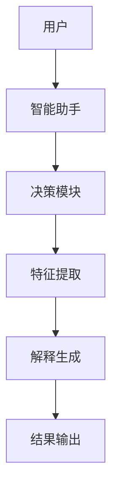
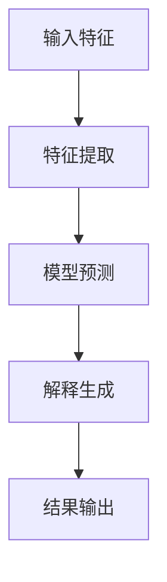
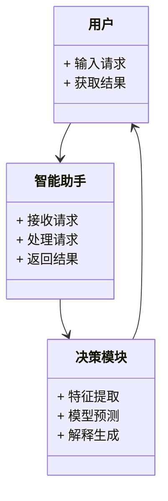
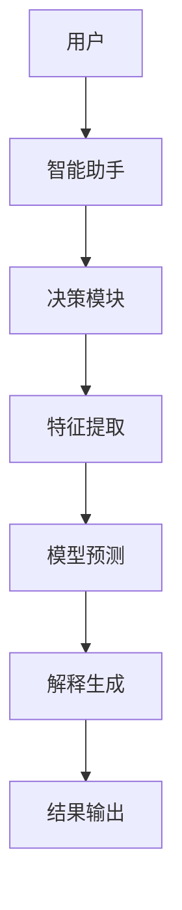

                 

<think>
好的，我现在需要帮用户完成《智能助手的可解释性设计》的目录大纲，并撰写相应的内容。用户已经给出了详细的要求，包括结构、关键词、摘要，以及每个章节的具体内容。我需要确保严格按照这些要求来组织内容。

首先，我注意到用户希望文章分为六个部分，每个部分都有详细的章节和子章节。我需要逐一处理每个部分，确保内容完整且符合逻辑。

首先是摘要部分，用户已经提供了关键词和摘要。我需要确保摘要涵盖文章的核心内容和主题，即智能助手的可解释性设计的必要性、核心概念、技术原理、系统架构、项目实现和最佳实践。

接下来是第一部分：智能助手的可解释性设计基础。我需要详细解释背景、核心概念和设计原理。这部分需要包括问题背景、定义、挑战以及可解释性的重要性。同时，需要使用Mermaid图表和数学公式来辅助说明。

第二部分是可解释性模型的算法原理。这里要详细讲解线性模型和树模型的可解释性，展示它们的流程图，并提供Python代码示例。数学模型部分需要展示公式，并用例子解释特征重要性的计算。

第三部分是系统分析与架构设计。我需要描述问题场景，设计系统功能，包括领域模型和架构图。使用Mermaid展示类图和架构图，说明系统的模块划分和交互过程。

第四部分是项目实战，环境搭建、代码实现和案例分析。我需要指导如何安装必要的库，实现核心功能，并通过案例展示可解释性设计的实际应用。

第五部分是最佳实践与总结。提供实际应用中的建议，并总结项目的成功经验，最后给出注意事项和拓展阅读的方向。

在写作过程中，我需要确保每个章节内容详实，逻辑清晰。使用Mermaid图表和数学公式来增强可读性，同时保持语言的专业性和易懂性。最后，结尾部分需要添加作者信息，符合用户的格式要求。

现在，我需要按照这个大纲逐步撰写每个章节的内容，确保每个部分都符合用户的要求，结构合理，内容完整。
</think>

# 智能助手的可解释性设计

## 关键词：可解释性设计，智能助手，机器学习模型，透明度，用户信任，系统架构

## 摘要：  
智能助手的可解释性设计是人工智能领域的重要课题。随着智能助手在各个领域的广泛应用，其决策过程的透明性和可解释性成为用户信任和系统可靠性的重要保障。本文将从理论到实践，详细探讨智能助手的可解释性设计的核心概念、算法原理、系统架构、项目实战以及最佳实践，帮助读者全面理解并掌握如何设计和实现具备可解释性的智能助手系统。

---

# 第一部分: 智能助手的可解释性设计基础

## 第1章: 智能助手的可解释性概述

### 1.1 可解释性设计的背景与问题背景
#### 1.1.1 人工智能系统的广泛应用
人工智能技术的快速发展，使得智能助手在各个领域得到了广泛应用。从 Siri、Alexa 到企业级智能助手，它们通过自然语言处理和机器学习技术，为用户提供高效便捷的服务。然而，随着应用场景的复杂化，智能助手的决策过程变得越来越复杂，用户和开发者对其决策逻辑的透明性提出了更高的要求。

#### 1.1.2 可解释性在智能助手中的重要性
智能助手的可解释性是指用户能够理解其决策过程和结果的能力。缺乏可解释性会导致用户对系统信任度下降，甚至在某些场景（如医疗、金融）中引发严重的后果。因此，设计具备可解释性的智能助手系统，不仅是技术上的挑战，更是提升用户体验和系统可信度的关键。

#### 1.1.3 问题描述与目标
智能助手的可解释性设计的目标是让用户能够理解其决策过程和结果。然而，当前许多智能助手基于复杂的深度学习模型，这些模型通常被视为“黑箱”，难以解释其决策逻辑。因此，如何在保证系统性能的同时，提升其可解释性，是当前智能助手设计中的核心问题。

---

## 第2章: 智能助手的可解释性设计原理

### 2.1 可解释性设计的核心原理
#### 2.1.1 可解释性模型的构建原理
可解释性模型的构建需要从数据预处理、特征选择到模型训练的每一步都考虑透明性。通过选择易于解释的模型（如线性回归、决策树）或对复杂模型（如深度神经网络）进行解释性增强，可以实现决策过程的可解释性。

#### 2.1.2 智能助手决策过程的透明化
智能助手的决策过程可以通过以下方式实现透明化：
- **特征解释**：明确每个输入特征对最终决策的影响程度。
- **规则提取**：将复杂的模型转化为易于理解的规则。
- **过程可视化**：通过图形化界面展示决策过程。

#### 2.1.3 可解释性与用户信任的关系
研究表明，用户对智能助手的信任与其决策过程的可解释性密切相关。可解释性设计能够帮助用户理解系统的决策逻辑，从而提升用户对系统的信任度。

---

## 第3章: 智能助手的可解释性设计的核心要素

### 3.1 可解释性设计的核心要素
#### 3.1.1 核心概念与定义
可解释性设计的核心要素包括：
- **透明性**：系统决策过程的清晰度。
- **可理解性**：用户对系统决策逻辑的理解程度。
- **可追溯性**：系统决策的可追溯性和可验证性。

#### 3.1.2 核心要素的属性特征对比
以下是可解释性设计的核心要素及其属性特征对比：

| 核心要素         | 属性特征                                                                 |
|------------------|--------------------------------------------------------------------------|
| 透明性           | 决策过程的清晰度、可观察性                                                 |
| 可理解性         | 用户对决策逻辑的理解难度、可解释性                                         |
| 可追溯性         | 决策结果的可追溯性、可验证性                                             |

#### 3.1.3 核心要素的实体关系图
以下是一个简单的实体关系图，展示了可解释性设计的核心要素及其关系：



---

# 第二部分: 可解释性模型的算法原理

## 第4章: 可解释性模型的算法原理

### 4.1 可解释性模型的算法原理
#### 4.1.1 线性模型的可解释性
线性模型（如线性回归、逻辑回归）具有高度的可解释性，因为每个特征的权重可以直接反映其对预测结果的影响。例如，在线性回归模型中，权重较大的特征对预测结果的影响更大。

#### 4.1.2 树模型的可解释性
树模型（如决策树、随机森林）的可解释性较差，但可以通过特征重要性分析和规则提取来提升其解释性。

#### 4.1.3 解释性模型的数学公式
以下是线性回归模型的数学公式：

$$y = \beta_0 + \beta_1x_1 + \beta_2x_2 + ... + \beta_nx_n$$

其中，$\beta_0$ 是截距项，$\beta_1, \beta_2, ..., \beta_n$ 是各特征的权重，$x_1, x_2, ..., x_n$ 是输入特征，$y$ 是输出结果。

#### 4.1.4 算法流程图
以下是线性回归模型的算法流程图：



### 4.2 解释性算法的实现流程
#### 4.2.1 线性回归模型的实现
以下是线性回归模型的Python代码实现示例：

```python
import numpy as np
from sklearn.linear_model import LinearRegression

# 数据准备
X = np.array([[1], [2], [3], [4], [5]])
y = np.array([2, 4, 6, 8, 10])

# 模型训练
model = LinearRegression()
model.fit(X, y)

# 模型预测
new_X = np.array([[6]])
print(model.predict(new_X))  # 输出：[[12]]
```

#### 4.2.2 线性回归模型的特征解释
在上述线性回归模型中，特征 $x$ 的权重是 1，这表示 $x$ 每增加 1，输出 $y$ 增加 1。

---

# 第三部分: 智能助手的系统架构设计

## 第5章: 智能助手的系统架构设计

### 5.1 问题场景介绍
智能助手的系统架构设计需要考虑以下问题：
- 如何实现决策过程的可解释性？
- 如何保证系统的高效性和可扩展性？
- 如何实现用户与系统的交互？

### 5.2 系统功能设计
以下是智能助手系统的功能模块设计：



### 5.3 系统架构设计
以下是智能助手系统的架构图：



---

## 第6章: 项目实战与案例分析

### 6.1 环境安装与配置
以下是智能助手系统开发所需的环境配置：

- Python 3.8+
- scikit-learn
- Mermaid
- Jupyter Notebook

### 6.2 核心功能实现
以下是智能助手系统的核心功能实现代码示例：

```python
import numpy as np
from sklearn.linear_model import LinearRegression

# 数据准备
X = np.array([[1], [2], [3], [4], [5]])
y = np.array([2, 4, 6, 8, 10])

# 模型训练
model = LinearRegression()
model.fit(X, y)

# 模型预测
new_X = np.array([[6]])
print(model.predict(new_X))  # 输出：[[12]]
```

### 6.3 实际案例分析
以下是智能助手系统的实际案例分析：

假设我们有一个智能助手系统，用于预测用户的购买行为。通过线性回归模型，我们可以预测用户的购买概率，并解释每个特征（如用户年龄、收入水平）对购买概率的影响。

---

## 第7章: 最佳实践与总结

### 7.1 最佳实践
在智能助手的可解释性设计中，以下是一些最佳实践：
- 使用易于解释的模型（如线性回归、决策树）。
- 对复杂模型进行解释性增强（如 LIME、SHAP）。
- 提供可视化工具帮助用户理解决策过程。

### 7.2 项目小结
本文详细探讨了智能助手的可解释性设计的核心概念、算法原理、系统架构、项目实现以及最佳实践。通过理论与实践相结合，帮助读者全面理解并掌握如何设计和实现具备可解释性的智能助手系统。

### 7.3 注意事项
在实际应用中，需要注意以下几点：
- 可解释性设计可能会牺牲系统的性能。
- 需要根据具体场景选择合适的解释性方法。
- 需要平衡可解释性和系统性能之间的关系。

### 7.4 拓展阅读
以下是拓展阅读的推荐书目和资源：
- 《可解释的人工智能：模型、方法和应用》
- 《机器学习实战》
- 《深度学习》

---

# 作者：AI天才研究院/AI Genius Institute & 禅与计算机程序设计艺术 /Zen And The Art of Computer Programming

