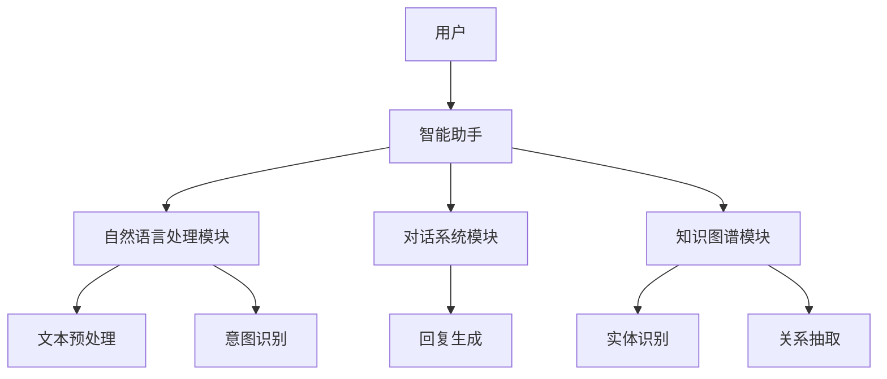
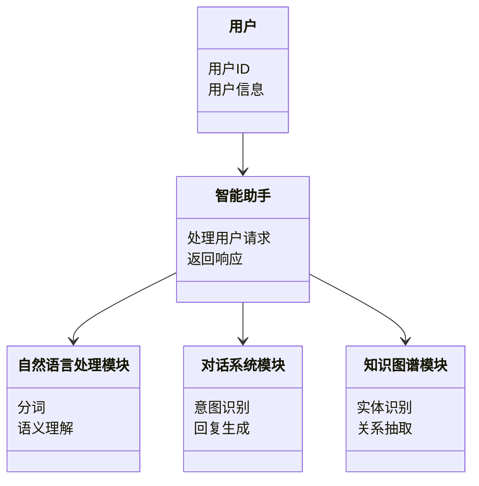
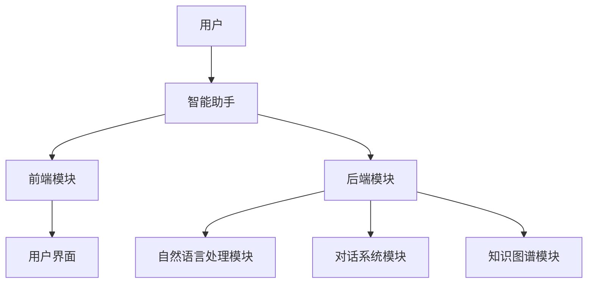

                 


# 智能助手的架构设计

> 关键词：智能助手，架构设计，自然语言处理，深度学习，对话系统，知识图谱

> 摘要：本文将详细探讨智能助手的架构设计，从背景介绍、核心概念到算法原理、系统架构，再到项目实战和最佳实践，全面解析智能助手的设计与实现。通过本文，读者可以掌握智能助手的关键技术、系统架构设计方法以及实际应用案例，为智能助手的开发和优化提供有价值的参考。

---

## 第1章: 智能助手概述

### 1.1 智能助手的背景与定义

#### 1.1.1 智能助手的起源与发展
智能助手的概念起源于人机交互领域，早期的智能助手主要是基于规则的简单对话系统。随着自然语言处理（NLP）、机器学习和深度学习技术的发展，智能助手的能力得到了显著提升。如今，智能助手已经广泛应用于智能手机、智能家居、智能音箱等领域，成为人机交互的重要接口。

#### 1.1.2 智能助手的定义与核心功能
智能助手是一种能够理解用户意图并通过自然语言进行交互的计算机系统。其核心功能包括：
- **自然语言理解（NLU）**：理解用户的输入文本或语音。
- **对话管理**：根据用户的需求生成合适的回复或执行相应的操作。
- **知识表示**：基于知识图谱或数据库提供准确的信息。
- **执行操作**：根据用户指令执行任务，如搜索信息、控制设备等。

#### 1.1.3 智能助手的分类与应用场景
智能助手可以根据功能和应用场景分为以下几类：
1. **垂直领域智能助手**：专注于特定领域，如医疗、金融、教育等。
2. **通用智能助手**：支持广泛的应用场景，如Siri、Alexa等。
3. **企业级智能助手**：用于企业内部的管理和业务流程优化。

应用场景包括：
- 个人助手：日程管理、天气查询、信息检索。
- 企业助手：员工管理、会议安排、客户支持。
- 物联网助手：智能家居控制、设备管理。

---

### 1.2 智能助手的关键技术

#### 1.2.1 自然语言处理（NLP）
自然语言处理是智能助手的核心技术之一。NLP的目标是让计算机能够理解、生成和处理人类语言。关键技术包括：
- **分词**：将连续的文本分割成词语或短语。
- **句法分析**：分析句子的语法结构。
- **语义理解**：理解文本的语义含义。

#### 1.2.2 机器学习与深度学习
机器学习和深度学习为智能助手提供了强大的学习和推理能力。常用的技术包括：
- **支持向量机（SVM）**：用于分类任务。
- **循环神经网络（RNN）**：用于序列数据的处理。
- **Transformer模型**：如BERT，用于上下文理解。

#### 1.2.3 对话系统与知识图谱
对话系统是智能助手的另一个核心技术，负责生成自然的回复。知识图谱则为智能助手提供了丰富的知识库，使其能够回答复杂的问题。

---

### 1.3 智能助手的用户需求与挑战

#### 1.3.1 用户需求分析
用户对智能助手的需求主要集中在以下几个方面：
- **准确性**：回复或操作必须准确无误。
- **响应速度**：必须快速响应用户的指令。
- **易用性**：界面简洁，操作方便。
- **隐私与安全**：保护用户的隐私数据。

#### 1.3.2 智能助手设计的常见挑战
- **语义理解的准确性**：如何准确理解用户的意图。
- **多轮对话的连贯性**：如何保持对话的上下文连贯。
- **知识库的构建与更新**：如何高效构建和更新知识图谱。

#### 1.3.3 智能助手的未来发展趋势
随着技术的进步，智能助手将更加智能化、个性化和场景化。未来的发展趋势包括：
- **多模态交互**：结合视觉、听觉等多种交互方式。
- **实时推理**：基于实时数据进行动态推理。
- **跨平台集成**：支持多种平台和设备的无缝集成。

---

### 1.4 本章小结
本章介绍了智能助手的背景、定义、关键技术、用户需求以及未来发展趋势。智能助手作为人机交互的重要形式，其核心在于理解用户意图并提供高效的交互体验。

---

## 第2章: 智能助手的核心概念与联系

### 2.1 核心概念原理

#### 2.1.1 自然语言处理的原理
自然语言处理（NLP）的目标是让计算机能够理解和生成人类语言。其核心步骤包括：
1. **文本预处理**：分词、去除停用词等。
2. **特征提取**：提取文本的特征向量。
3. **模型训练**：基于特征向量进行分类或生成。

#### 2.1.2 对话系统的实现机制
对话系统的实现机制包括：
1. **意图识别**：识别用户的意图。
2. **槽位填充**：提取与意图相关的实体信息。
3. **回复生成**：根据意图生成回复。

#### 2.1.3 知识图谱的作用与构建
知识图谱是一种结构化的知识表示方式，用于存储实体及其关系。构建知识图谱的关键步骤包括：
1. **实体识别**：识别文本中的实体。
2. **关系抽取**：提取实体之间的关系。
3. **知识融合**：将多个来源的知识整合到一起。

---

### 2.2 核心概念属性特征对比表

| 概念       | 属性         | 特征描述                       |
|------------|--------------|--------------------------------|
| NLP        | 输入方式     | 文本数据                       |
|            | 输出方式     | 结构化或非结构化数据           |
|            | 核心技术     | 分词、句法分析、语义理解         |
| 对话系统    | 输入方式     | 用户查询或指令                 |
|            | 输出方式     | 自然语言回复                   |
|            | 核心技术     | 生成模型、检索模型             |
| 知识图谱    | 输入方式     | 结构化数据                     |
|            | 输出方式     | 实体关系、属性信息             |
|            | 核心技术     | 实体识别、关系抽取             |

---

### 2.3 ER实体关系图



---

### 2.4 本章小结
本章详细讲解了智能助手的核心概念及其之间的联系，包括自然语言处理、对话系统和知识图谱的原理和实现机制。

---

## 第3章: 智能助手的算法原理

### 3.1 文本处理算法

#### 3.1.1 分词算法
分词是自然语言处理的基础步骤之一。常用的分词算法包括：
- **基于规则的分词**：利用词典和规则进行分词。
- **基于统计的分词**：利用概率模型进行分词。

#### 3.1.2 词向量表示

词向量表示是将词语转换为向量表示的技术。常用的词向量表示方法包括：
- **词袋模型**：将文本表示为词的集合。
- **TF-IDF**：基于词频和逆文档频率的向量化方法。
- **Word2Vec**：通过神经网络训练词向量。

---

### 3.2 意图识别算法

#### 3.2.1 基于规则的意图识别
基于规则的意图识别方法通过预定义的规则来匹配用户的输入，从而识别意图。例如：
- 用户输入“明天北京天气怎么样？”匹配规则“天气查询”，识别意图“查询天气”。

#### 3.2.2 基于机器学习的意图识别
基于机器学习的意图识别方法利用训练好的模型进行分类。常用的模型包括：
- **SVM**：支持向量机。
- **随机森林**：基于决策树的集成方法。
- **深度学习模型**：如LSTM、Transformer等。

---

### 3.3 对话生成算法

#### 3.3.1 基于规则的对话生成
基于规则的对话生成方法通过预定义的规则生成回复。例如：
- 用户：“今天天气怎么样？”
- 系统：“今天天气晴朗，温度在20℃左右。”

#### 3.3.2 基于深度学习的对话生成
基于深度学习的对话生成方法利用生成模型（如GPT）生成回复。生成过程包括：
1. **输入处理**：将用户输入转换为模型可理解的向量。
2. **解码器生成**：解码器根据输入生成回复。
3. **输出处理**：对生成的回复进行后处理，如去除无关词汇。

---

### 3.4 本章小结
本章详细讲解了智能助手的核心算法，包括文本处理、意图识别和对话生成的算法原理和实现方法。

---

## 第4章: 智能助手的系统架构设计

### 4.1 系统功能设计

#### 4.1.1 领域模型设计



---

### 4.2 系统架构设计

#### 4.2.1 整体架构设计



---

### 4.3 系统接口设计

#### 4.3.1 API接口设计
智能助手通常通过API接口与前端交互。常见的API接口包括：
- `/api/v1/nlu`：自然语言理解接口。
- `/api/v1/dialog`：对话管理接口。
- `/api/v1/knowledge`：知识查询接口。

---

### 4.4 系统交互流程

#### 4.4.1 用户发起请求
用户通过智能助手发送请求，例如“明天北京天气怎么样？”

#### 4.4.2 系统处理请求
智能助手接收到请求后，通过自然语言处理模块进行语义理解，识别用户的意图。

#### 4.4.3 系统生成回复
根据用户的意图，对话系统模块生成回复，并通过知识图谱模块获取相关数据。

#### 4.4.4 系统返回响应
智能助手将生成的回复返回给用户。

---

### 4.5 本章小结
本章详细讲解了智能助手的系统架构设计，包括功能模块、整体架构、接口设计和交互流程。

---

## 第5章: 项目实战

### 5.1 环境安装

#### 5.1.1 Python环境安装
安装Python和虚拟环境工具，例如`venv`。

```bash
python -m venv venv
source venv/bin/activate
```

#### 5.1.2 依赖库安装
安装常用的依赖库，例如：
- `numpy`
- `pandas`
- `scikit-learn`
- `transformers`

```bash
pip install numpy pandas scikit-learn transformers
```

---

### 5.2 系统核心实现源代码

#### 5.2.1 自然语言处理模块

```python
from transformers import pipeline

nlp = pipeline("text-classification", model="bert-base-cased")
```

#### 5.2.2 对话系统模块

```python
def generate_response(input_text):
    model = pipeline("text-generation", model="gpt2")
    response = model(input_text, max_length=50, num_return_sequences=1)
    return response[0]['generated_text']
```

---

### 5.3 代码应用解读与分析

#### 5.3.1 自然语言处理模块解读
自然语言处理模块负责对用户输入进行语义理解。使用预训练的BERT模型进行文本分类，识别用户的意图。

#### 5.3.2 对话系统模块解读
对话系统模块基于GPT模型生成回复。通过设置最大长度和回复数量，生成自然流畅的回复。

---

### 5.4 实际案例分析与详细讲解剖析

#### 5.4.1 案例分析
用户输入：“今天北京天气怎么样？”

1. 自然语言处理模块识别意图：“查询天气”。
2. 对话系统模块生成回复：“今天北京天气晴朗，温度在20℃左右。”

---

### 5.5 项目小结
本章通过实际案例展示了智能助手的实现过程，包括环境安装、核心代码实现和案例分析。

---

## 第6章: 最佳实践与注意事项

### 6.1 最佳实践 tips

#### 6.1.1 数据预处理
确保数据的干净和一致性，避免噪声数据对模型的影响。

#### 6.1.2 模型调优
通过交叉验证和超参数调优，提高模型的性能。

#### 6.1.3 安全与隐私
保护用户的隐私数据，避免数据泄露。

---

### 6.2 小结
智能助手的开发和优化需要综合考虑技术、用户需求和系统架构。通过最佳实践和注意事项，可以提高系统的性能和用户体验。

---

## 结语

智能助手作为人工智能领域的重要应用，其架构设计涉及多个关键技术。通过本文的详细讲解，读者可以全面掌握智能助手的设计与实现方法。未来，随着技术的不断进步，智能助手将更加智能化和个性化，为人类带来更加便捷的交互体验。

---

**作者：AI天才研究院/AI Genius Institute & 禅与计算机程序设计艺术 /Zen And The Art of Computer Programming**

---

