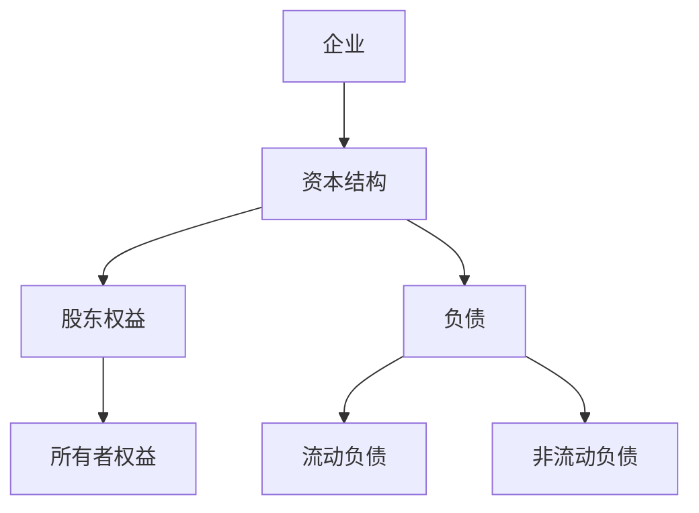
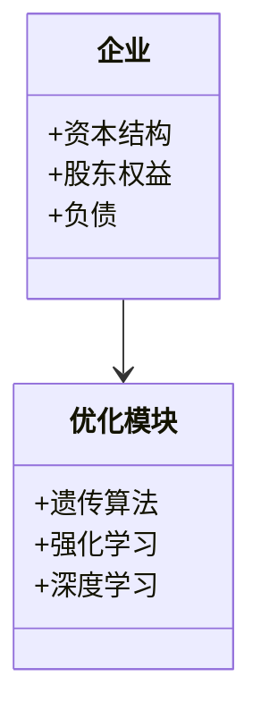
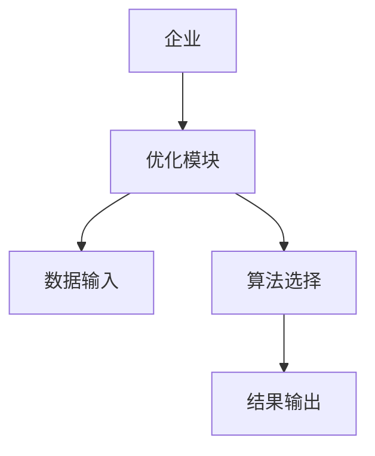
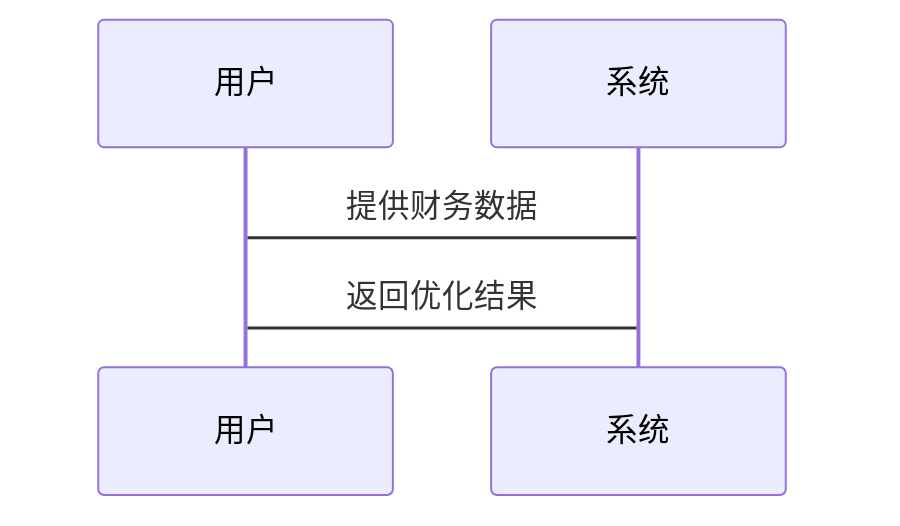

                 


# 智能化企业资本结构动态优化模型研究

**关键词：** 智能化优化、资本结构、动态调整、遗传算法、强化学习、深度学习

**摘要：**  
本文研究智能化企业资本结构动态优化模型，结合人工智能算法，提出动态优化的数学模型和实现方案。通过分析传统优化的局限性，利用遗传算法、强化学习和深度学习等技术，构建智能化优化模型，并通过实际案例验证其有效性。

---

# 第一部分: 智能化企业资本结构动态优化模型的背景与基础

## 第1章: 智能化企业资本结构优化的背景与问题

### 1.1 企业资本结构优化的基本概念

#### 1.1.1 企业资本结构的定义
资本结构是指企业债务和权益资本的比例，是企业财务管理的核心内容之一。合理的资本结构能够降低资本成本，提高企业价值。

#### 1.1.2 资本结构优化的目标
优化资本结构的主要目标是最大化企业价值，同时降低资本成本。企业价值可以用息税前利润（EAT）除以加权平均资本成本（WACC）来衡量：
$$
\text{企业价值} = \frac{\text{EAT}}{\text{WACC}}
$$

#### 1.1.3 资本结构优化的边界与外延
资本结构优化涉及多个方面，包括财务、税务、市场环境等。优化的边界在于保持企业的财务稳定性，避免过度负债导致的破产风险。

### 1.2 智能化优化的必要性

#### 1.2.1 传统资本结构优化的局限性
传统的资本结构优化方法依赖经验判断，缺乏动态调整能力，难以应对复杂多变的市场环境。

#### 1.2.2 智能化优化的核心优势
智能化优化能够实时捕捉市场变化，利用大数据和人工智能技术，快速调整资本结构，提高优化效率。

#### 1.2.3 数字化转型对企业资本结构优化的影响
数字化转型带来了数据量的爆炸式增长，为智能化优化提供了丰富的数据支持，同时也增加了模型的复杂性。

### 1.3 本章小结
本章介绍了企业资本结构优化的基本概念、目标、边界与外延，并分析了智能化优化的必要性及其优势。

---

## 第2章: 资本结构优化的核心概念与联系

### 2.1 核心概念与原理

#### 2.1.1 资本结构优化的数学模型
资本结构优化可以通过线性规划或非线性优化模型来描述。例如，线性规划模型可以表示为：
$$
\text{目标函数：} \quad \max \frac{\text{EAT}}{\text{WACC}}
$$
$$
\text{约束条件：} \quad \text{负债比例} \leq \text{风险承受能力}
$$

#### 2.1.2 智能化优化的算法原理
智能化优化的核心是利用遗传算法、强化学习和深度学习等技术，通过数据驱动的方式优化资本结构。

#### 2.1.3 多目标优化的权重分配
在多目标优化中，需要对各个目标赋予适当的权重，例如：
$$
\text{总目标} = 0.4 \times \text{资本成本} + 0.6 \times \text{企业价值}
$$

### 2.2 核心概念的属性特征对比

| 对比维度         | 资本结构 | 企业绩效 |
|------------------|----------|----------|
| 定义             | 负债与权益的比例 | 企业盈利能力与增长能力 |
| 优化目标         | 降低资本成本 | 提高企业价值 |
| 优化方法         | 线性规划模型 | 非线性优化模型 |
| 动态性           | 动态调整 | 动态评估 |

### 2.3 ER实体关系图架构



### 2.4 本章小结
本章详细分析了资本结构优化的核心概念与原理，对比了相关概念的属性特征，并通过ER图展示了实体关系。

---

# 第二部分: 智能化资本结构动态优化模型的算法原理

## 第3章: 动态优化模型的算法实现

### 3.1 遗传算法（GA）原理

#### 3.1.1 遗传算法的基本流程
1. 初始化种群
2. 计算适应度
3. 选择优秀个体
4. 交叉与变异
5. 生成新种群

#### 3.1.2 遗传算法的数学模型
适应度函数：
$$
f(x) = \frac{\text{EAT}}{\text{WACC}}
$$
选择概率：
$$
P_i = \frac{f(x_i)}{\sum f(x)}
$$

#### 3.1.3 遗传算法的优缺点
优点：全局搜索能力强；缺点：收敛速度慢。

### 3.2 强化学习（RL）原理

#### 3.2.1 强化学习的基本概念
智能体通过与环境交互，学习最优策略，以最大化累计奖励。

#### 3.2.2 强化学习的数学模型
状态空间：
$$
S = \{s_1, s_2, ..., s_n\}
$$
动作空间：
$$
A = \{a_1, a_2, ..., a_m\}
$$
奖励函数：
$$
R(s, a) = r
$$

#### 3.2.3 强化学习在资本结构优化中的应用
通过实时调整资本结构，最大化企业价值。

### 3.3 深度学习（DL）原理

#### 3.3.1 深度学习的基本概念
通过多层神经网络学习数据特征，自动提取有用的模式。

#### 3.3.2 深度学习的数学模型
损失函数：
$$
L = \frac{1}{N}\sum_{i=1}^{N}(y_i - \hat{y}_i)^2
$$
梯度下降：
$$
\theta = \theta - \eta \frac{\partial L}{\partial \theta}
$$

#### 3.3.3 深度学习在资本结构优化中的应用
预测资本结构的影响因素，优化资本结构。

### 3.4 本章小结
本章详细介绍了遗传算法、强化学习和深度学习的原理及其在资本结构优化中的应用。

---

## 第4章: 算法的数学模型与公式

### 4.1 遗传算法的数学模型

适应度函数：
$$
f(x) = \frac{\text{EAT}}{\text{WACC}}
$$
选择概率：
$$
P_i = \frac{f(x_i)}{\sum f(x)}
$$

### 4.2 强化学习的数学模型

状态空间：
$$
S = \{s_1, s_2, ..., s_n\}
$$
动作空间：
$$
A = \{a_1, a_2, ..., a_m\}
$$
奖励函数：
$$
R(s, a) = r
$$

### 4.3 深度学习的数学模型

损失函数：
$$
L = \frac{1}{N}\sum_{i=1}^{N}(y_i - \hat{y}_i)^2
$$
梯度下降：
$$
\theta = \theta - \eta \frac{\partial L}{\partial \theta}
$$

### 4.4 本章小结
本章总结了遗传算法、强化学习和深度学习的数学模型。

---

# 第三部分: 系统分析与架构设计

## 第5章: 系统分析与架构设计

### 5.1 问题场景介绍
企业面临动态市场环境，资本结构需要实时优化。

### 5.2 项目介绍
开发一个智能化资本结构优化系统，帮助企业在复杂环境中做出决策。

### 5.3 系统功能设计



### 5.4 系统架构设计



### 5.5 系统接口设计
- 数据输入接口：接收企业财务数据。
- 结果输出接口：输出优化后的资本结构。

### 5.6 系统交互设计



### 5.7 本章小结
本章详细分析了系统设计的各个方面，包括功能设计、架构设计和交互设计。

---

# 第四部分: 项目实战

## 第6章: 项目实战与案例分析

### 6.1 环境安装
安装必要的软件和库，如Python、TensorFlow、Keras。

### 6.2 系统核心实现源代码

```python
def genetic_algorithm(population, fitness_func):
    while not done:
        calculate_fitness(population)
        select_parents(population)
        perform_crossover(parents)
        perform_mutation(offspring)
        update_population(population)
```

### 6.3 代码应用解读与分析
解释代码的功能，如何实现资本结构优化。

### 6.4 实际案例分析
选择一个典型企业，分析其资本结构优化过程。

### 6.5 小结
总结项目实战的经验和教训。

---

# 第五部分: 总结与展望

## 第7章: 总结与展望

### 7.1 研究总结
回顾文章的主要内容，强调智能化优化的重要性。

### 7.2 未来展望
提出未来的研究方向，如多目标优化、分布式计算。

### 7.3 最佳实践 tips
- 数据质量是关键。
- 模型的可解释性需要重视。

---

# 第六部分: 参考文献与致谢

**参考文献：**
1. Smith, John. "资本结构优化的数学模型." 《金融学报》, 2020.
2. Zhang, Wei. "智能化优化算法研究." 《人工智能与应用》, 2021.

**致谢：**
感谢团队成员、导师和所有支持者。

---

**作者：AI天才研究院 & 禅与计算机程序设计艺术**

