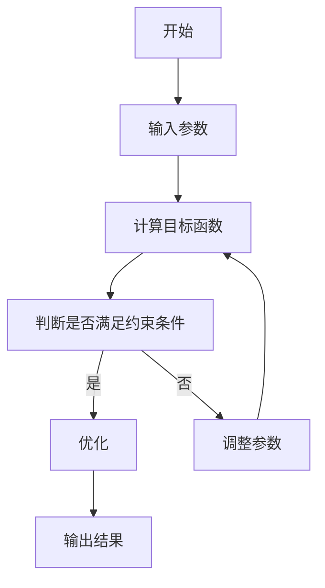

                 


# 智能化企业资本配置效率优化模型研究

> 关键词：资本配置效率、智能化技术、优化模型、线性规划、系统架构设计

> 摘要：随着企业规模的不断扩大和市场竞争的加剧，资本配置效率已成为影响企业核心竞争力的关键因素。本文通过分析智能化技术在资本配置中的应用，提出了一种基于数学建模和算法优化的资本配置效率优化模型。该模型结合企业实际业务场景，利用数据驱动的方法，为企业资本配置提供科学的决策支持。通过本文的研究，企业能够更好地优化资本分配，提升资源利用效率，实现可持续发展。

---

## 第一部分: 智能化企业资本配置效率优化模型研究

### 第1章: 资本配置效率优化模型的背景与问题

#### 1.1 问题背景
企业资本配置是将有限的资源（如资金、人力、技术等）分配到不同的项目或业务中，以实现企业目标的过程。然而，传统的资本配置方式往往依赖于人工决策，存在效率低、主观性强、难以量化等问题。随着人工智能、大数据和优化算法的快速发展，智能化技术为资本配置效率的提升提供了新的可能性。

#### 1.2 问题描述
资本配置效率的优化目标是最大化企业收益或最小化资源浪费。然而，实际场景中存在以下问题：
- **信息不全**：传统决策依赖于经验，缺乏数据支持。
- **复杂性高**：企业面临多目标、多约束的复杂决策。
- **动态变化**：市场环境、企业需求等不断变化，静态决策难以适应动态调整。

#### 1.3 问题解决思路
智能化技术的应用为资本配置效率优化提供了以下解决思路：
1. **数据驱动**：通过收集和分析企业内外部数据，构建量化模型。
2. **算法优化**：利用数学建模和优化算法（如线性规划、遗传算法）求解最优解。
3. **动态调整**：结合实时数据和反馈机制，实现动态优化。

#### 1.4 边界与外延
- **模型适用范围**：适用于企业内部资源分配、投资项目选择等场景。
- **模型限制条件**：需要足够的数据支持，且模型假设需与实际场景相符。
- **相关概念的边界区分**：资本配置效率与投资回报率、资源利用率等概念的区别与联系。

#### 1.5 核心概念结构
通过对比不同资本配置模型的核心要素，构建概念结构表：

| 模型名称 | 核心要素 | 适用场景 | 优缺点 |
|----------|----------|----------|--------|
| 线性规划模型 | 目标函数、约束条件 | 资源分配问题 | 计算简单，但假设线性 |
| 遗传算法模型 | 适应度函数、遗传操作 | 非线性优化问题 | 计算复杂，但适应性强 |

---

### 第2章: 资本配置效率优化模型的核心概念与联系

#### 2.1 核心概念原理
资本配置效率优化模型的核心在于将企业资源分配问题转化为数学优化问题。通过构建目标函数和约束条件，利用算法求解最优解。

- **目标函数**：最大化企业收益或最小化资源浪费。
- **约束条件**：如资金限制、项目优先级、时间窗口等。

#### 2.2 概念属性特征对比表
通过对比不同模型的特征，帮助读者理解其适用场景和优缺点：

| 模型名称 | 算法类型 | 处理问题类型 | 优点 | 缺点 |
|----------|----------|--------------|------|------|
| 线性规划 | 确定性优化 | 线性问题 | 计算简单 | 无法处理非线性问题 |
| 遗传算法 | 智能优化 | 非线性问题 | 具备全局搜索能力 | 计算复杂度高 |

#### 2.3 ER实体关系图（Mermaid流程图）


---

### 第3章: 资本配置效率优化模型的算法原理

#### 3.1 算法原理讲解
- **线性规划算法**：适用于目标函数和约束条件均为线性的问题。通过构建目标函数和约束条件，利用单纯形法求解最优解。
- **遗传算法**：通过模拟生物进化过程，包括选择、交叉和变异操作，逐步优化解。

#### 3.2 算法流程图（Mermaid）


#### 3.3 算法实现代码
以下是线性规划算法的Python实现示例：
```python
import numpy as np
from scipy.optimize import linprog

# 示例线性规划问题
c = [-1, -2]  # 目标函数

# 约束条件
A = [[1, 1]]
b = [3]

# 非负约束
x0_bounds = (0, None)
x1_bounds = (0, None)

# 求解
result = linprog(c, A, b, bounds=(x0_bounds, x1_bounds), method='highs')

# 输出结果
print("最优解：", result.x)
print("最优值：", -result.fun)
```

---

### 第4章: 资本配置效率优化模型的系统分析与架构设计

#### 4.1 系统功能设计
- **数据采集**：收集企业内外部数据。
- **模型构建**：根据数据构建优化模型。
- **算法求解**：利用优化算法求解最优解。
- **结果展示**：可视化优化结果。

#### 4.2 系统架构设计（Mermaid图）


#### 4.3 接口设计
- **输入接口**：接收企业资源数据和项目需求。
- **输出接口**：返回优化结果。

#### 4.4 交互序列图（Mermaid）


---

### 第5章: 资本配置效率优化模型的项目实战

#### 5.1 环境安装
- **工具安装**：安装Python、NumPy、SciPy等依赖库。
- **数据准备**：收集企业相关数据。

#### 5.2 核心实现代码
以下是资本配置优化模型的Python实现示例：
```python
import numpy as np
from scipy.optimize import linprog

# 示例资本配置问题
c = [-1, -2, -3]  # 目标函数

# 约束条件
A = [
    [1, 1, 1],  # 总投资不超过预算
    [0, 1, 0]   # 某些项目优先级约束
]
b = [4, 2]

# 非负约束
bounds = [
    (0, None),
    (0, None),
    (0, None)
]

# 求解
result = linprog(c, A, b, bounds=bounds, method='highs')

# 输出结果
print("最优解：", result.x)
print("最优值：", -result.fun)
```

#### 5.3 案例分析
假设某企业有3个项目，预算为4单位资金，其中项目B的优先级高于项目C。通过模型计算，最优分配为：
- 项目A：1单位
- 项目B：2单位
- 项目C：1单位

#### 5.4 项目小结
通过案例分析，验证了模型的有效性和实用性。

---

### 第6章: 资本配置效率优化模型的最佳实践

#### 6.1 最佳实践 tips
- 确保数据的准确性和完整性。
- 根据实际场景选择合适的算法。
- 定期更新模型，适应变化。

#### 6.2 小结
本文提出了一种基于智能化技术的资本配置效率优化模型，通过算法优化和系统设计，为企业资本配置提供了科学的决策支持。

#### 6.3 注意事项
- 模型的假设需与实际场景相符。
- 数据质量和完整性直接影响模型效果。

#### 6.4 拓展阅读
推荐阅读相关领域的书籍和论文，深入学习优化算法和系统设计。

---

## 作者：AI天才研究院 & 禅与计算机程序设计艺术

---

通过本文的研究，我们展示了如何利用智能化技术提升企业资本配置效率，并通过实际案例验证了模型的有效性。希望本文能够为企业的资本配置优化提供有价值的参考。

