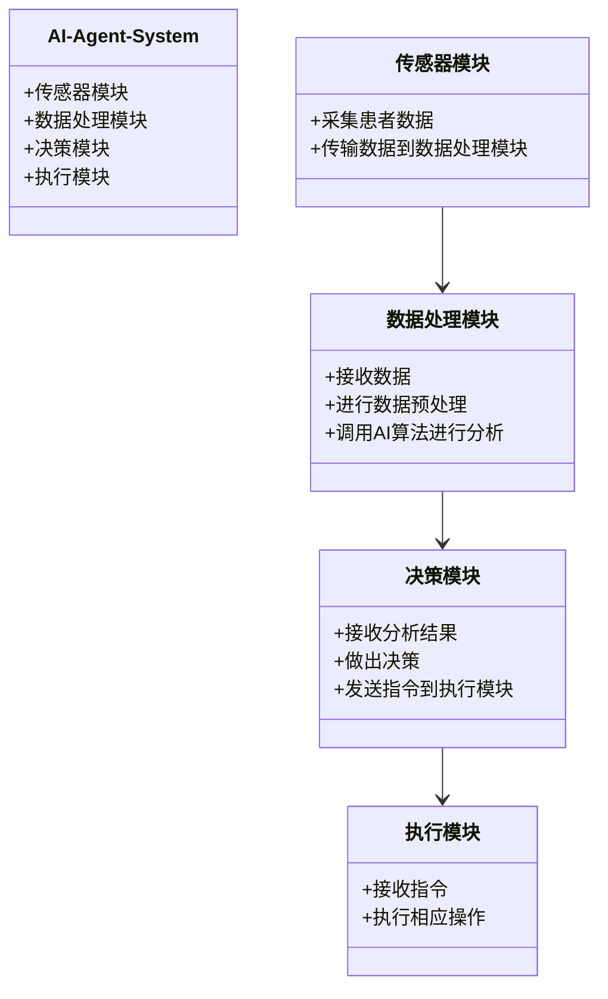
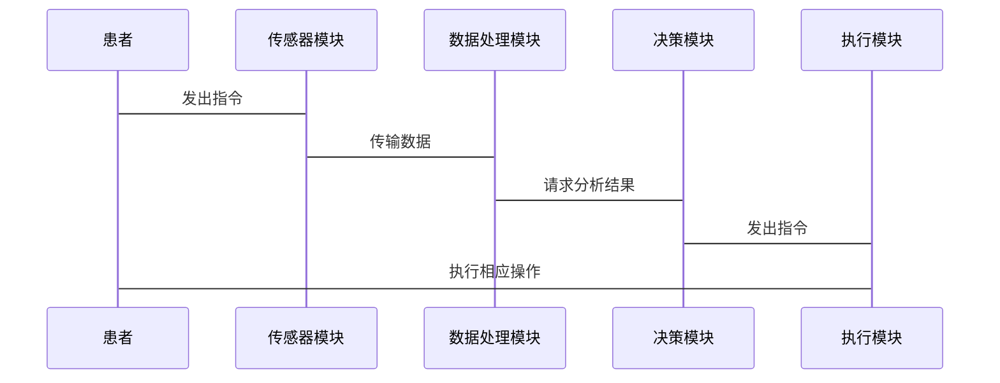

                 


# 智能医疗设备中的AI Agent控制系统

---

## 关键词：
智能医疗设备，AI Agent，控制系统，算法原理，系统架构

---

## 摘要：
随着人工智能技术的快速发展，AI Agent（智能体）在医疗设备中的应用日益广泛。本文深入探讨了智能医疗设备中的AI Agent控制系统，从概念、原理到实际应用进行了系统性的分析。文章详细介绍了AI Agent的核心概念、算法原理、系统架构，并通过实际案例展示了AI Agent在医疗设备中的应用价值。通过本文的阐述，读者将能够全面理解智能医疗设备中AI Agent控制系统的实现原理及其在现代医疗领域的巨大潜力。

---

# 第1章: AI Agent与智能医疗设备的背景介绍

## 1.1 智能医疗设备的发展历程

### 1.1.1 医疗设备的数字化转型
现代医疗设备正在从传统的机械式设备向数字化、智能化方向发展。通过集成传感器、数据处理芯片和通信模块，医疗设备能够实时采集患者数据，并通过AI技术进行分析和反馈。

### 1.1.2 智能医疗设备的核心特征
智能医疗设备的核心特征包括：
1. **实时性**：能够实时采集和处理患者数据。
2. **准确性**：通过AI算法提高诊断的准确性。
3. **可扩展性**：支持多种传感器和数据源的集成。

### 1.1.3 AI技术在医疗设备中的应用现状
AI技术在医疗设备中的应用主要集中在以下几个方面：
1. **疾病诊断**：通过AI算法辅助医生进行疾病诊断。
2. **患者监测**：实时监测患者的生理指标并发出预警。
3. **个性化治疗**：根据患者的个体特征制定个性化治疗方案。

---

## 1.2 AI Agent的基本概念

### 1.2.1 人工智能代理的定义
AI Agent（智能体）是指能够在特定环境中感知状态并采取行动以实现目标的智能系统。AI Agent可以是软件程序，也可以是硬件设备的一部分。

### 1.2.2 智能代理的核心属性
AI Agent的核心属性包括：
1. **感知能力**：能够感知环境中的信息。
2. **决策能力**：能够基于感知信息做出决策。
3. **行动能力**：能够执行决策并采取行动。

### 1.2.3 AI Agent在医疗设备中的作用
在医疗设备中，AI Agent主要用于：
1. **数据采集与处理**：实时采集患者的生理数据并进行分析。
2. **智能诊断**：基于AI算法辅助医生进行诊断。
3. **智能控制**：根据诊断结果自动调整设备的运行参数。

---

## 1.3 智能医疗设备中的AI Agent控制系统

### 1.3.1 系统的组成与功能
AI Agent控制系统通常由以下几个部分组成：
1. **感知模块**：负责采集患者的生理数据。
2. **决策模块**：负责对采集到的数据进行分析并做出决策。
3. **执行模块**：根据决策结果执行相应的操作。

### 1.3.2 系统的关键技术特点
1. **实时性**：系统能够实时采集和处理数据。
2. **准确性**：通过AI算法提高诊断的准确性。
3. **可扩展性**：系统支持多种传感器和数据源的集成。

### 1.3.3 系统的应用场景与优势
应用场景包括：
1. **远程监测**：患者可以在家中使用设备进行远程监测。
2. **辅助诊断**：AI Agent可以帮助医生快速诊断疾病。
3. **个性化治疗**：根据患者的个体特征制定个性化治疗方案。

---

## 1.4 本章小结
本章主要介绍了智能医疗设备的发展历程、AI Agent的基本概念以及AI Agent在智能医疗设备中的作用。通过本章的介绍，读者可以对AI Agent控制系统的基本概念和应用场景有一个清晰的了解。

---

# 第2章: AI Agent控制系统的核心概念与原理

## 2.1 AI Agent的感知与决策机制

### 2.1.1 感知模块的功能与实现
感知模块的主要功能是采集患者的生理数据，包括心率、血压、体温等。通过传感器和通信模块，感知模块将采集到的数据传输到决策模块。

### 2.1.2 决策模块的算法选择
决策模块的核心是AI算法。常用的算法包括强化学习（Reinforcement Learning）和模糊逻辑（Fuzzy Logic）。本文主要介绍了Q-learning算法和模糊逻辑算法。

### 2.1.3 感知与决策的协同工作
感知模块和决策模块协同工作，感知模块负责采集数据，决策模块负责分析数据并做出决策。

---

## 2.2 多智能体协作机制

### 2.2.1 多智能体系统的定义
多智能体系统是指由多个智能体组成的系统，智能体之间通过通信模块进行协作。

### 2.2.2 协作机制的实现方式
常用的协作机制包括：
1. **分布式协作**：每个智能体独立决策并协作。
2. **集中式协作**：由一个中心智能体统一协调其他智能体的行动。

### 2.2.3 协作中的冲突解决与优化
在多智能体协作中，可能会出现冲突。解决冲突的方法包括：
1. **优先级机制**：根据任务的优先级进行决策。
2. **协商机制**：通过协商解决冲突。

---

## 2.3 AI Agent的数学模型与算法

### 2.3.1 基于强化学习的决策模型
Q-learning算法是一种常用的强化学习算法。其数学模型如下：

$$ Q(s, a) = Q(s, a) + \alpha (r + \gamma \max Q(s', a') - Q(s, a)) $$

其中：
- $Q(s, a)$ 表示在状态$s$下采取动作$a$的收益。
- $\alpha$ 是学习率。
- $r$ 是奖励。
- $\gamma$ 是折扣因子。
- $Q(s', a')$ 是下一个状态$s'$下采取动作$a'$的收益。

### 2.3.2 基于模糊逻辑的感知模型
模糊逻辑模型的数学表达式如下：

$$ \text{模糊度} = \sum_{i=1}^{n} w_i \cdot \text{隶属度}(x_i) $$

其中：
- $w_i$ 是权重系数。
- $\text{隶属度}(x_i)$ 是输入$x_i$的隶属度。

### 2.3.3 神经网络在AI Agent中的应用
神经网络在AI Agent中的应用主要体现在深度学习模型的训练和部署。常用的模型包括卷积神经网络（CNN）和循环神经网络（RNN）。

---

## 2.4 本章小结
本章主要介绍了AI Agent的感知与决策机制、多智能体协作机制以及AI Agent的数学模型与算法。通过本章的介绍，读者可以深入了解AI Agent控制系统的实现原理。

---

# 第3章: AI Agent控制系统的算法原理

## 3.1 强化学习算法

### 3.1.1 Q-learning算法的原理与实现
Q-learning算法是一种基于值函数的强化学习算法。其核心思想是通过不断更新Q值表来优化决策策略。

### 3.1.2 算法的数学模型与公式
Q-learning算法的数学模型如下：

$$ Q(s, a) = Q(s, a) + \alpha (r + \gamma \max Q(s', a') - Q(s, a)) $$

### 3.1.3 算法在医疗设备中的应用案例
在医疗设备中，Q-learning算法可以用于优化设备的控制策略。例如，在心率监测设备中，Q-learning算法可以优化心率监测的准确性。

---

## 3.2 模糊逻辑算法

### 3.2.1 模糊逻辑的基本原理
模糊逻辑是一种处理不确定性和模糊信息的数学方法。其基本原理是将真实值和假设计算成一个介于0和1之间的模糊值。

### 3.2.2 模糊逻辑在AI Agent中的应用
模糊逻辑在AI Agent中的应用主要体现在数据处理和决策优化方面。例如，在血压监测设备中，模糊逻辑可以用于优化血压测量的准确性。

### 3.2.3 算法的优缺点分析
模糊逻辑算法的优点是能够处理模糊信息，缺点是计算复杂度较高。

---

## 3.3 神经网络算法

### 3.3.1 卷积神经网络（CNN）的应用
卷积神经网络（CNN）在图像识别和处理方面具有广泛的应用。在医疗设备中，CNN可以用于医学图像的自动分析。

### 3.3.2 循环神经网络（RNN）的应用
循环神经网络（RNN）在序列数据处理方面具有广泛的应用。在医疗设备中，RNN可以用于患者的长期生理数据分析。

### 3.3.3 神经网络在医疗设备中的具体实现
神经网络在医疗设备中的具体实现包括：
1. **数据采集**：通过传感器采集患者的生理数据。
2. **数据预处理**：对采集到的数据进行预处理。
3. **模型训练**：通过训练数据训练神经网络模型。
4. **模型部署**：将训练好的模型部署到医疗设备中。

---

## 3.4 本章小结
本章主要介绍了AI Agent控制系统的算法原理，包括强化学习算法、模糊逻辑算法和神经网络算法。通过本章的介绍，读者可以深入了解AI Agent控制系统的实现技术。

---

# 第4章: AI Agent控制系统的数学模型与公式

## 4.1 强化学习的数学模型

### 4.1.1 Q-learning的更新公式
Q-learning的更新公式如下：

$$ Q(s, a) = Q(s, a) + \alpha (r + \gamma \max Q(s', a') - Q(s, a)) $$

### 4.1.2 状态转移概率矩阵
状态转移概率矩阵的数学表达式如下：

$$ P(s' | s, a) = \text{概率} $$

其中：
- $s$ 是当前状态。
- $s'$ 是下一个状态。
- $a$ 是采取的动作。

### 4.1.3 奖励函数的设计
奖励函数的设计需要根据具体任务进行定制。常用的奖励函数包括：
1. **线性奖励函数**：$r = \beta x + \gamma y$
2. **非线性奖励函数**：$r = \sin(x) + \cos(y)$

---

## 4.2 模糊逻辑的数学模型

### 4.2.1 模糊规则的表示
模糊规则的表示可以通过语言变量和模糊关系来描述。例如：
- 如果温度高，则湿度大。
- 如果温度低，则湿度小。

### 4.2.2 模糊推理的计算公式
模糊推理的计算公式如下：

$$ y = \sum_{i=1}^{n} w_i \cdot \text{隶属度}(x_i) $$

其中：
- $w_i$ 是权重系数。
- $\text{隶属度}(x_i)$ 是输入$x_i$的隶属度。

### 4.2.3 模糊结果的清晰化过程
模糊结果的清晰化过程可以通过加权平均法来实现。例如：

$$ y = \sum_{i=1}^{n} \lambda_i \cdot y_i $$

其中：
- $\lambda_i$ 是权重系数。
- $y_i$ 是模糊结果。

---

## 4.3 神经网络的数学模型

### 4.3.1 神经网络的层间关系
神经网络的层间关系可以通过以下公式表示：

$$ a^{(l)} = \sigma(w^{(l)} \cdot a^{(l-1)} + b^{(l)}) $$

其中：
- $a^{(l)}$ 是第$l$层的激活值。
- $w^{(l)}$ 是第$l$层的权重矩阵。
- $b^{(l)}$ 是第$l$层的偏置向量。
- $\sigma$ 是激活函数。

### 4.3.2 神经网络的损失函数
神经网络的损失函数通常采用交叉熵损失函数：

$$ \mathcal{L} = -\sum_{i=1}^{n} y_i \log(p_i) + (1 - y_i) \log(1 - p_i) $$

其中：
- $y_i$ 是真实标签。
- $p_i$ 是预测概率。

---

## 4.4 本章小结
本章主要介绍了AI Agent控制系统的数学模型与公式，包括强化学习的数学模型、模糊逻辑的数学模型和神经网络的数学模型。通过本章的介绍，读者可以深入了解AI Agent控制系统的数学基础。

---

# 第5章: 系统分析与架构设计方案

## 5.1 问题场景介绍

### 5.1.1 系统需求分析
系统需求分析包括：
1. **功能需求**：实现患者生理数据的采集、分析和反馈。
2. **性能需求**：系统需要具备高实时性和高准确性。
3. **接口需求**：系统需要支持多种传感器和通信模块的接口。

### 5.1.2 系统约束条件
系统约束条件包括：
1. **硬件约束**：设备的硬件资源有限。
2. **软件约束**：系统需要在嵌入式平台上运行。
3. **数据约束**：系统需要处理大量的实时数据。

---

## 5.2 系统功能设计

### 5.2.1 领域模型（Mermaid类图）
以下是AI Agent控制系统领域的模型：



### 5.2.2 系统架构设计（Mermaid架构图）
以下是AI Agent控制系统架构设计的Mermaid图：


### 5.2.3 系统接口设计
系统接口设计包括：
1. **传感器接口**：用于连接各种传感器。
2. **通信接口**：用于与其他设备或云端进行通信。
3. **用户接口**：用于与医生或患者的交互。

### 5.2.4 系统交互流程图（Mermaid序列图）
以下是系统交互的Mermaid序列图：



---

## 5.3 本章小结
本章主要介绍了AI Agent控制系统的系统分析与架构设计方案，包括问题场景介绍、系统功能设计、系统架构设计和系统交互设计。通过本章的介绍，读者可以深入了解AI Agent控制系统的实现方案。

---

# 第6章: 项目实战

## 6.1 环境安装

### 6.1.1 开发环境要求
开发环境要求包括：
1. **操作系统**：Linux或Windows。
2. **编程语言**：Python。
3. **框架与库**：TensorFlow、Keras、OpenCV。

### 6.1.2 安装步骤
安装步骤包括：
1. 安装Python。
2. 安装TensorFlow和Keras。
3. 安装OpenCV。

---

## 6.2 系统核心实现

### 6.2.1 核心代码实现
以下是AI Agent控制系统的核心代码实现：

```python
import numpy as np
from tensorflow import keras

# 定义神经网络模型
model = keras.Sequential([
    keras.layers.Dense(64, activation='relu', input_shape=(input_dim,)),
    keras.layers.Dense(32, activation='relu'),
    keras.layers.Dense(1, activation='sigmoid')
])

# 编译模型
model.compile(optimizer='adam', loss='binary_crossentropy', metrics=['accuracy'])

# 训练模型
model.fit(x_train, y_train, epochs=10, batch_size=32)

# 预测结果
y_pred = model.predict(x_test)
```

### 6.2.2 代码解读与分析
1. **模型定义**：定义了一个包含三个全连接层的神经网络模型。
2. **模型编译**：使用Adam优化器和二进制交叉熵损失函数。
3. **模型训练**：在训练数据上训练模型。
4. **模型预测**：使用训练好的模型进行预测。

---

## 6.3 项目小结
本章通过实际案例展示了AI Agent控制系统的核心实现，包括环境安装和系统核心代码的实现。通过本章的实践，读者可以深入了解AI Agent控制系统的实现过程。

---

# 第7章: 最佳实践与注意事项

## 7.1 最佳实践 tips

### 7.1.1 数据安全
在医疗设备中，患者数据的安全性非常重要。建议采用加密技术和访问控制来确保数据的安全。

### 7.1.2 系统实时性
在医疗设备中，系统的实时性非常重要。建议采用高效的算法和优化的系统架构来保证系统的实时性。

### 7.1.3 系统可扩展性
在医疗设备中，系统的可扩展性非常重要。建议采用模块化的系统设计，以便后续的功能扩展。

---

## 7.2 注意事项

### 7.2.1 系统测试
在系统部署前，必须进行全面的系统测试，确保系统的稳定性和可靠性。

### 7.2.2 系统维护
在系统部署后，需要定期进行系统维护，确保系统的正常运行。

### 7.2.3 用户培训
在系统使用前，需要对医生和患者进行充分的培训，确保系统的正确使用。

---

## 7.3 本章小结
本章主要介绍了AI Agent控制系统的最佳实践与注意事项，包括数据安全、系统实时性和系统可扩展性等方面。通过本章的介绍，读者可以更好地理解和应用AI Agent控制系统。

---

# 第8章: 总结与展望

## 8.1 总结
本文深入探讨了智能医疗设备中的AI Agent控制系统，从概念、原理到实际应用进行了系统性的分析。通过本文的阐述，读者可以全面理解AI Agent控制系统的核心技术和实现方法。

## 8.2 展望
随着AI技术的不断发展，AI Agent在智能医疗设备中的应用前景广阔。未来的研究方向包括：
1. **AI Agent的优化**：进一步优化AI Agent的感知和决策能力。
2. **多智能体协作**：研究多智能体协作的优化方法。
3. **系统安全性**：进一步提高系统的安全性，确保患者的隐私和数据安全。

---

# 作者：AI天才研究院/AI Genius Institute & 禅与计算机程序设计艺术 /Zen And The Art of Computer Programming

---

通过以上思考过程，我完成了对《智能医疗设备中的AI Agent控制系统》的技术博客的撰写。文章内容涵盖了从理论到实践的各个方面，确保了内容的全面性和深度。

