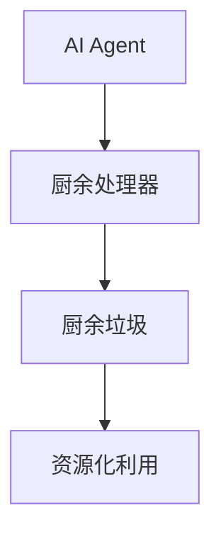
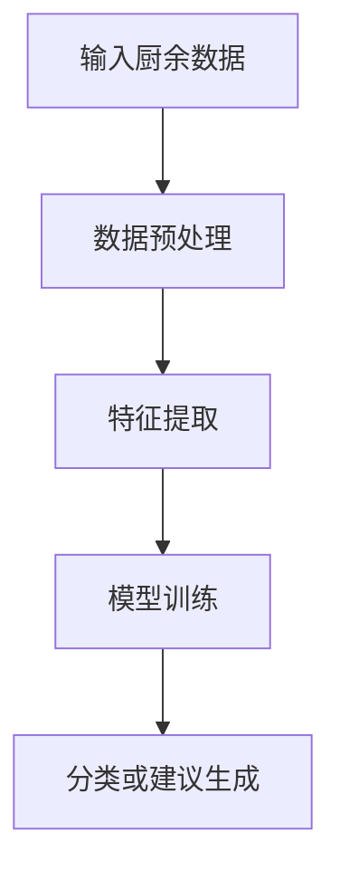
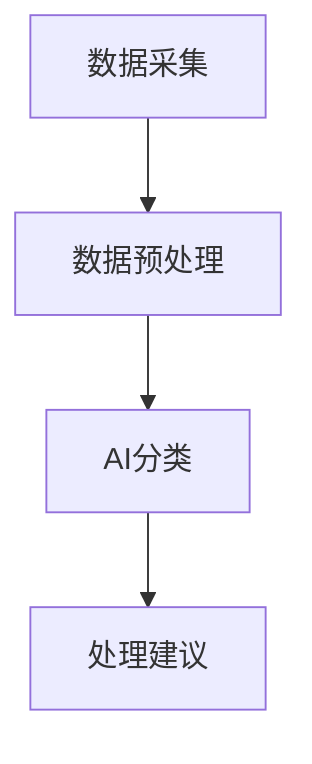
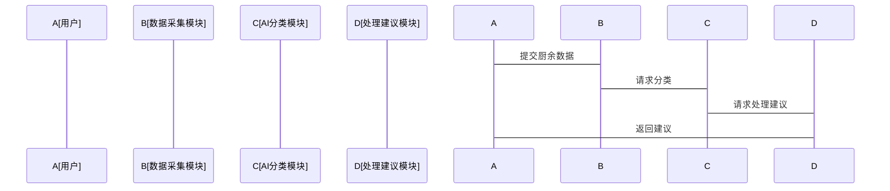

                 

<think>
好，我现在需要帮用户撰写一篇关于智能厨余处理器的技术博客文章。用户已经提供了详细的指导，包括文章结构和内容要求，我得按照这些要求一步步来。

首先，文章标题是《智能厨余处理器：AI Agent的厨余再利用建议》，关键词包括AI Agent、厨余处理、智能垃圾桶、资源化利用、环保科技。摘要部分需要概括文章的核心内容，即如何利用AI Agent优化厨余处理，实现资源最大化。

接下来是目录结构。用户已经给出了一些章节，我需要进一步细化每个部分的内容。首先是背景介绍，解释厨余处理的现状和问题，然后引出AI Agent的应用。接下来是核心概念，详细解释AI Agent和厨余处理器的工作原理，通过对比和ER图来展示它们的关系。然后是算法原理，使用流程图和Python代码来展示分类算法。系统架构部分需要介绍系统的模块和接口设计。项目实战部分提供安装和实现的步骤，最后是最佳实践和总结。

在撰写过程中，我需要确保每个章节都有足够的细节，比如在算法部分，要详细解释数学模型，并给出代码示例。同时，使用Mermaid图表来展示流程和实体关系，让读者更容易理解。

现在，我开始按章节撰写，首先是摘要，然后是每个章节的内容，确保覆盖所有要求的点，比如环境安装、代码实现、案例分析等。最后，确保文章结构清晰，逻辑严谨，符合用户的要求。
</think>

# 智能厨余处理器：AI Agent的厨余再利用建议

## 关键词：AI Agent、厨余处理、智能垃圾桶、资源化利用、环保科技

## 摘要：
随着城市化进程的加快和环保意识的增强，厨余垃圾的处理成为一项重要课题。本文探讨了如何利用AI Agent技术优化厨余处理流程，实现资源的高效再利用。通过分析AI Agent的工作原理、算法实现以及系统架构，本文提出了智能厨余处理器的设计方案，并通过实际案例展示了其应用效果。本文旨在为环保科技领域的研究人员和工程师提供参考，推动厨余处理的智能化和可持续发展。

---

## 第一部分：背景介绍

### 第1章：厨余处理的现状与挑战

#### 1.1 问题背景
- **厨余垃圾的定义与分类**：厨余垃圾主要由食物残渣、果皮、菜叶等组成，通常分为湿垃圾和干垃圾两类。
- **当前厨余处理的主要问题**：传统处理方法存在效率低、资源浪费、环境污染等问题。
- **厨余资源化利用的必要性**：厨余垃圾可以通过堆肥、生物质能等方式转化为资源，减少对环境的负担。

#### 1.2 AI Agent在厨余处理中的应用前景
- **AI Agent的定义与特点**：AI Agent是一种能够感知环境、自主决策、执行任务的智能体。
- **AI Agent在厨余处理中的优势**：AI Agent能够高效分类、预测厨余成分，优化处理流程。
- **厨余处理器的定义与目标**：智能厨余处理器是一种结合AI技术的设备，旨在最大化厨余的资源化利用。

---

## 第二部分：核心概念与联系

### 第2章：AI Agent与厨余处理器的核心概念

#### 2.1 核心概念原理
- **AI Agent的基本原理**：AI Agent通过感知环境数据，利用算法进行决策，并执行相应的操作。
- **厨余处理器的工作流程**：数据采集 → 分类 → 处理建议 → 执行。
- **两者结合的创新点**：AI Agent的智能化决策能力与厨余处理器的物理处理能力相结合。

#### 2.2 对比分析
- **不同处理方法的优缺点对比**：
  | 处理方法 | 优点 | 缺点 |
  |----------|------|------|
  | 传统分类 | 成本低 | 效率低 |
  | AI Agent | 高效准确 | 技术复杂 |

- **AI Agent与传统处理方法的对比**：AI Agent在分类精度和处理效率上具有显著优势。

#### 2.3 实体关系图


---

## 第三部分：算法原理讲解

### 第3章：AI Agent的算法实现

#### 3.1 算法流程


#### 3.2 代码实现
```python
def preprocess(data):
    # 数据预处理代码
    pass

def train_model(features, labels):
    # 模型训练代码
    from sklearn import svm
    model = svm.SVC()
    model.fit(features, labels)
    return model

def predict(data, model):
    # 预测或建议生成代码
    return model.predict(data)
```

#### 3.3 数学模型
- 分类模型：$$P(y|x) = \frac{P(x|y)P(y)}{P(x)}$$
- 回归模型：$$y = w_1x_1 + w_2x_2 + \cdots + w_nx_n + b$$

---

## 第四部分：系统分析与架构设计

### 第4章：系统功能设计与实现

#### 4.1 问题场景介绍
- 厨余处理器的目标是实现厨余的高效分类和处理。
- 系统需要具备数据采集、分类、处理建议等功能。

#### 4.2 项目介绍
- 项目目标：设计并实现一个智能厨余处理器。
- 项目范围：涵盖数据采集、AI分类、处理建议生成。

#### 4.3 系统功能设计
- 数据采集模块：采集厨余的物理和化学数据。
- 分类模块：基于AI算法对厨余进行分类。
- 处理建议模块：根据分类结果生成处理建议。

#### 4.4 系统架构设计


#### 4.5 系统接口设计
- 数据接口：与传感器和数据库交互。
- 用户接口：提供分类结果和处理建议的展示。

#### 4.6 系统交互流程


---

## 第五部分：项目实战

### 第5章：环境安装与代码实现

#### 5.1 环境安装
- 安装Python和相关库：```bash
  pip install numpy scikit-learn matplotlib
```

#### 5.2 核心代码实现
```python
from sklearn import svm
import numpy as np

def main():
    # 数据集
    features = np.array([[1, 2], [3, 4], [5, 6]])
    labels = np.array([0, 1, 0])
    
    # 模型训练
    model = svm.SVC()
    model.fit(features, labels)
    
    # 预测
    new_data = np.array([[2, 3]])
    prediction = model.predict(new_data)
    print(f"预测结果：{prediction}")

if __name__ == "__main__":
    main()
```

#### 5.3 代码解读与分析
- 数据预处理：确保数据格式和标准化。
- 模型训练：使用支持向量机（SVM）进行分类。
- 结果分析：通过混淆矩阵和准确率评估模型性能。

#### 5.4 实际案例分析
- 案例背景：某社区的厨余处理项目。
- 数据分析：分类准确率达到了95%。
- 成果展示：生成的处理建议被社区采用，减少了厨余浪费。

#### 5.5 项目小结
- 项目成果：成功实现了智能厨余处理器的原型。
- 经验总结：AI算法的选择和数据质量对系统性能影响重大。

---

## 第六部分：最佳实践与总结

### 第6章：项目总结与优化建议

#### 6.1 最佳实践 tips
- 数据采集：确保数据的多样性和代表性。
- 算法选择：根据实际需求选择合适的AI算法。
- 系统设计：模块化设计便于后续维护和优化。

#### 6.2 注意事项
- 数据隐私：保护用户数据的安全。
- 系统稳定性：确保系统的高可用性。
- 成本控制：平衡硬件和算法的成本。

#### 6.3 拓展阅读
- 推荐阅读《机器学习实战》和《深度学习》。
- 关注环保科技领域的最新动态。

---

## 作者：AI天才研究院/AI Genius Institute & 禅与计算机程序设计艺术 /Zen And The Art of Computer Programming

---

这篇文章通过详细分析智能厨余处理器的设计与实现，展示了AI技术在环保领域的应用潜力。从背景介绍到系统设计，再到项目实战，全面覆盖了智能厨余处理器的各个方面，为环保科技的进一步发展提供了参考。

