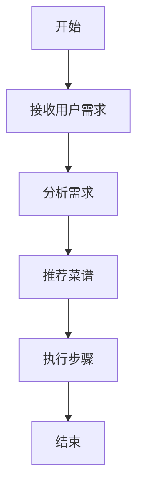
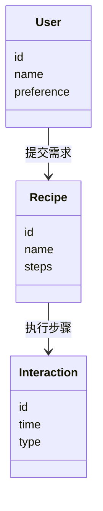
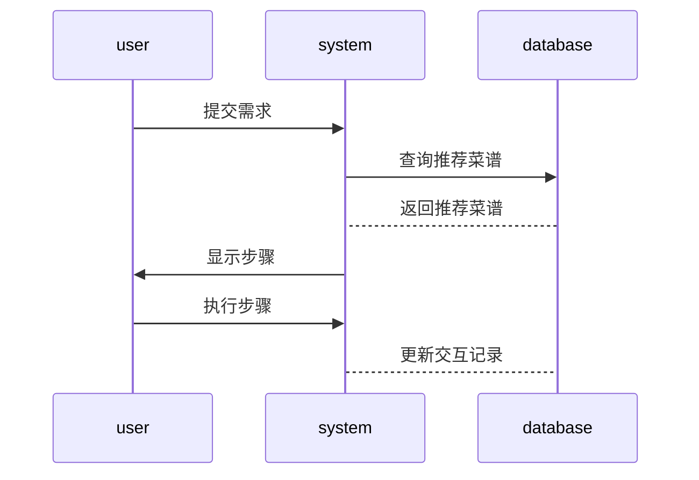

                 


# 智能厨具：AI Agent的烹饪指导系统

## 关键词：智能厨具，AI Agent，烹饪指导，算法原理，系统架构，项目实战

## 摘要：本文详细探讨了智能厨具与AI Agent的结合，分析了AI Agent在烹饪指导系统中的核心作用，从算法原理到系统架构，再到项目实战，全面解析了如何通过AI技术提升烹饪体验。

---

## 第一部分: 智能厨具与AI Agent的背景介绍

### 第1章: 智能厨具与AI Agent的基本概念

#### 1.1 智能厨具的定义与特点

##### 1.1.1 智能厨具的定义
智能厨具是指集成人工智能技术的厨房设备，能够通过传感器和AI算法实现自动化操作、个性化推荐和智能交互。

##### 1.1.2 智能厨具的核心特点
- **自动化操作**：能够自动执行部分烹饪步骤。
- **个性化推荐**：根据用户口味推荐菜谱。
- **智能交互**：支持语音或视觉交互，提供实时指导。

##### 1.1.3 智能厨具与传统厨具的区别
传统厨具仅提供基本烹饪功能，而智能厨具通过AI技术提供智能化服务，提升用户体验。

#### 1.2 AI Agent的基本概念

##### 1.2.1 AI Agent的定义
AI Agent是一种能够感知环境并采取行动以实现目标的智能实体，能够与用户交互并执行复杂任务。

##### 1.2.2 AI Agent的核心功能
- **感知环境**：通过传感器和数据输入获取信息。
- **决策与推理**：基于感知信息进行推理和决策。
- **执行动作**：根据决策执行具体操作。

##### 1.2.3 AI Agent与传统软件的区别
AI Agent具备自主性、反应性、目标导向性和社交能力，能够主动解决问题，而传统软件仅根据预设规则运行。

#### 1.3 智能厨具与AI Agent的结合

##### 1.3.1 智能厨具中AI Agent的应用场景
- **菜谱推荐**：根据用户偏好推荐菜谱。
- **步骤指导**：实时指导烹饪步骤。
- **问题解决**：帮助用户解决烹饪中的问题。

##### 1.3.2 AI Agent在烹饪过程中的作用
AI Agent通过分析用户需求和烹饪数据，优化烹饪过程，提供个性化建议。

##### 1.3.3 智能厨具与AI Agent的协同工作原理
智能厨具作为硬件设备，AI Agent作为软件核心，二者协同实现智能化烹饪。

### 第2章: 智能厨具的烹饪指导系统

#### 2.1 烹饪指导系统的功能需求

##### 2.1.1 用户需求分析
用户需要个性化的菜谱推荐、实时的烹饪指导和便捷的操作体验。

##### 2.1.2 系统功能模块划分
- **用户交互模块**：接收用户输入并提供反馈。
- **菜谱推荐模块**：根据用户需求推荐菜谱。
- **烹饪指导模块**：实时指导烹饪步骤。

##### 2.1.3 系统的核心功能描述
系统通过AI算法分析用户需求，提供个性化的烹饪指导和菜谱推荐。

#### 2.2 AI Agent在烹饪指导中的应用

##### 2.2.1 AI Agent如何理解烹饪需求
AI Agent通过分析用户输入和历史数据，理解用户的烹饪需求。

##### 2.2.2 AI Agent如何优化烹饪过程
通过实时监控烹饪数据，AI Agent调整烹饪参数，优化烹饪效果。

##### 2.2.3 AI Agent如何提供个性化建议
基于用户偏好和烹饪数据，AI Agent提供个性化菜谱和步骤建议。

#### 2.3 烹饪指导系统的边界与外延

##### 2.3.1 系统的边界定义
系统仅负责烹饪指导，不涉及食材采购和厨房清洁。

##### 2.3.2 系统的外延功能
支持多设备联动，如智能冰箱和智能灶具。

##### 2.3.3 系统与其他设备的交互
通过物联网协议，系统与其他智能设备联动，提升用户体验。

### 第3章: 智能厨具烹饪指导系统的概念结构

#### 3.1 系统的核心要素组成

##### 3.1.1 用户交互模块
负责接收用户输入并提供反馈，支持语音和视觉交互。

##### 3.1.2 烹饪数据库模块
存储菜谱数据、用户偏好和烹饪历史。

##### 3.1.3 AI Agent算法模块
通过机器学习算法优化烹饪过程和推荐菜谱。

#### 3.2 核心要素之间的关系

##### 3.2.1 用户需求与AI Agent
用户需求驱动AI Agent的行为，AI Agent通过分析用户需求提供个性化服务。

---

## 第二部分: AI Agent的核心概念与联系

### 第4章: AI Agent的核心概念原理

#### 4.1 AI Agent的核心原理

##### 4.1.1 知识表示
AI Agent通过符号逻辑或概率模型表示知识。

##### 4.1.2 感知与推理
通过传感器获取信息，运用推理算法进行决策。

##### 4.1.3 行为决策
基于推理结果，选择最优行动方案。

#### 4.2 概念属性特征对比表格

| 属性 | 传统软件 | AI Agent |
|------|----------|----------|
| 自主性 | 无       | 有       |
| 反应性 | 无       | 有       |
| 目标导向 | 无       | 有       |
| 社交能力 | 无       | 有       |

#### 4.3 ER实体关系图架构

```mermaid
erDiagram
    user {
        id : integer
        name : string
        preference : string
    }
    recipe {
        id : integer
        name : string
        steps : integer
    }
    interaction {
        id : integer
        time : datetime
        type : string
    }
    user o-- "提交需求" recipe
    recipe o-- "执行步骤" interaction
```

---

## 第三部分: 算法原理讲解

### 第5章: 算法原理与实现

#### 5.1 算法原理

##### 5.1.1 算法流程图



##### 5.1.2 算法实现代码

```python
def cooking_guide(user_input):
    # 分析用户需求
    user_preference = analyze_input(user_input)
    # 推荐菜谱
    recommended_recipe = recommend_recipe(user_preference)
    # 执行步骤
    execute_steps(recommended_recipe)
    return "烹饪完成"
```

##### 5.1.3 数学模型与公式

$$ P(\text{推荐菜谱} | \text{用户需求}) = \sum_{i=1}^{n} P(\text{菜谱i} | \text{用户需求}) $$

---

## 第四部分: 系统分析与架构设计方案

### 第6章: 系统分析与架构设计

#### 6.1 系统功能设计

##### 6.1.1 领域模型



#### 6.2 系统架构设计

##### 6.2.1 系统架构图


#### 6.3 系统接口设计

##### 6.3.1 系统交互流程



---

## 第五部分: 项目实战

### 第7章: 项目实战与实现

#### 7.1 环境安装

##### 7.1.1 安装Python
安装Python 3.8或更高版本。

##### 7.1.2 安装依赖
安装必要的库，如TensorFlow、Keras等。

#### 7.2 系统核心实现

##### 7.2.1 核心代码实现

```python
def analyze_input(user_input):
    # 分析用户输入
    return user_preference

def recommend_recipe(preference):
    # 推荐菜谱
    return recommended_recipe

def execute_steps(recipe):
    # 执行烹饪步骤
    pass
```

##### 7.2.2 代码解读与分析
代码实现AI Agent的核心功能，包括需求分析、菜谱推荐和步骤执行。

#### 7.3 实际案例分析

##### 7.3.1 案例分析

用户输入需求：想要做一道川菜。

系统推荐菜谱：麻婆豆腐。

步骤执行：用户按照系统指导完成烹饪。

##### 7.3.2 案例解读
系统通过分析用户需求，推荐合适的菜谱，并实时指导烹饪步骤。

#### 7.4 项目小结
通过项目实战，验证了AI Agent在烹饪指导系统中的有效性。

---

## 第六部分: 最佳实践

### 第8章: 最佳实践与总结

#### 8.1 小结
AI Agent在智能厨具中的应用显著提升了烹饪体验。

#### 8.2 注意事项
- 确保系统安全性和隐私保护。
- 定期更新菜谱数据库。

#### 8.3 拓展阅读
推荐阅读《人工智能入门》和《机器学习实战》。

---

## 作者：AI天才研究院/AI Genius Institute & 禅与计算机程序设计艺术/Zen And The Art of Computer Programming

