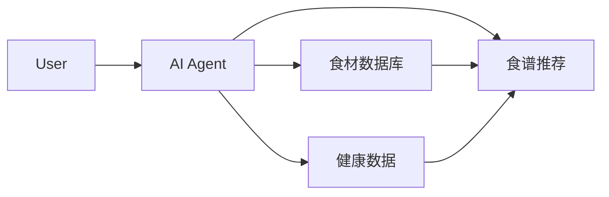
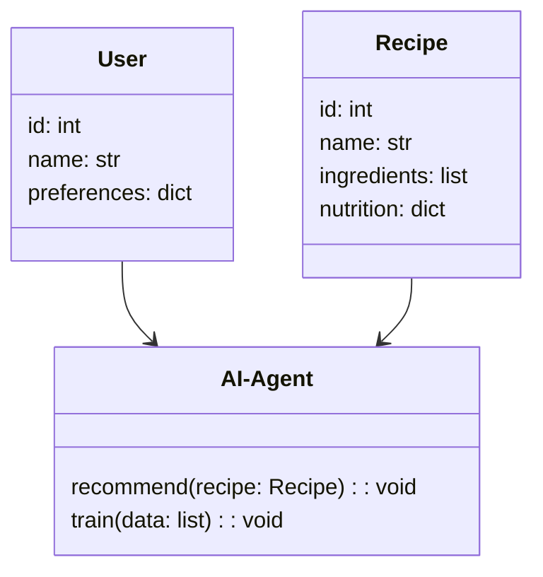
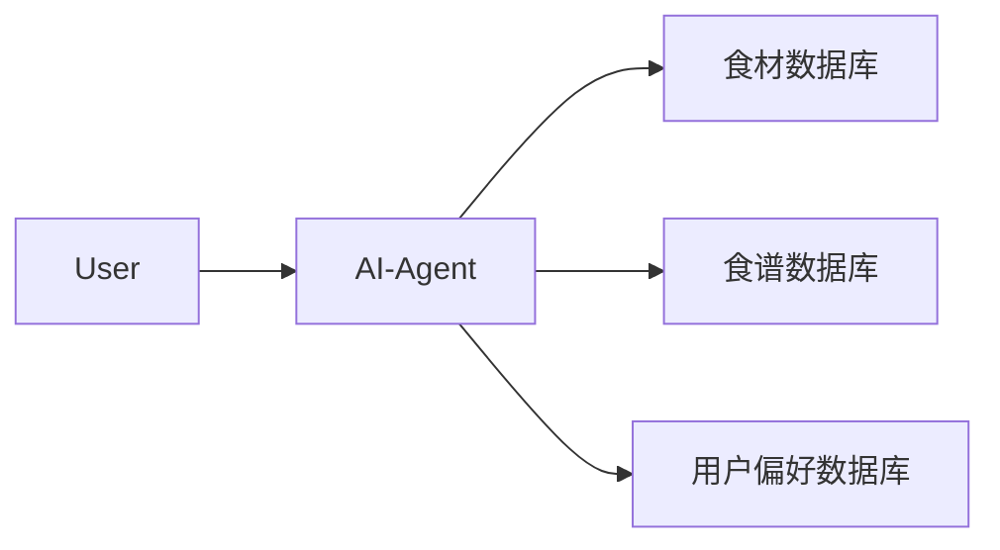
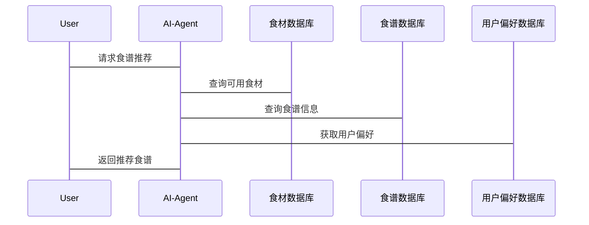

                 

<think>
好，我现在需要根据用户的要求，设计一个关于“智能厨房助手：AI Agent的营养均衡膳食规划”的技术博客文章。用户已经提供了一个详细的目录结构，并要求文章内容要逻辑清晰、结构紧凑、语言专业，同时要包含背景介绍、核心概念、算法原理、数学模型、系统分析、项目实战和最佳实践等部分。

首先，我需要明确文章的核心主题：AI代理如何帮助规划营养均衡的膳食。这意味着我要涵盖AI在厨房中的应用，如何通过AI推荐食谱、管理食材，以及如何确保膳食的营养均衡。

接下来，我会按照用户提供的目录结构来逐步展开每个部分的内容：

1. **背景介绍**：这部分需要解释为什么智能厨房助手是必要的，现代人的饮食问题，以及AI如何解决这些问题。我需要说明问题背景、问题描述、解决方案，以及系统的边界和外延。

2. **核心概念与联系**：这里要详细讲解AI代理和营养均衡膳食规划的原理，并展示它们之间的关系。我会使用表格和Mermaid图来说明实体关系和数据流。

3. **算法原理讲解**：我需要介绍推荐算法，如协同过滤和基于内容的推荐，以及混合推荐模型。使用Mermaid流程图和Python代码示例来说明实现过程。

4. **数学模型和公式**：解释协同过滤的公式，如余弦相似度和基于用户的推荐公式，使用Latex来展示这些公式。

5. **系统分析与架构设计**：描述问题场景，设计系统功能，包括用户需求分析、食材管理、膳食计划生成等。用Mermaid图展示系统架构和交互流程。

6. **项目实战**：提供环境安装步骤和核心代码实现，包括数据预处理、模型训练和接口调用。

7. **最佳实践**：总结章节内容，提供注意事项和拓展阅读建议。

在写作过程中，我需要确保每部分内容详尽且逻辑清晰，同时使用专业术语，但也要通俗易懂。我会在每个章节中加入具体的例子和详细的解释，以帮助读者更好地理解智能厨房助手的工作原理和实际应用。

最后，我会检查文章是否符合字数要求，确保每个部分都涵盖到位，并且格式正确，如使用合适的标题、子标题，以及正确嵌入表格、流程图和代码示例。同时，确保文章末尾有正确的作者信息。

通过这样的思考和规划，我能够系统地完成这篇技术博客文章，满足用户的需求，同时提供有价值的内容。
</think>

# 智能厨房助手：AI Agent的营养均衡膳食规划

---

## 关键词
智能厨房助手, AI Agent, 营养均衡, 膳食规划, 推荐算法, 系统架构, 项目实战

---

## 摘要
随着人工智能技术的快速发展，智能厨房助手正在改变我们日常的饮食方式。通过AI Agent，用户可以轻松实现营养均衡的膳食规划，从推荐食谱到食材管理，再到健康监测，AI技术为厨房带来了智能化和个性化的解决方案。本文将深入探讨智能厨房助手的核心概念、算法原理、系统架构以及实际应用场景，帮助读者全面理解AI在厨房中的应用。

---

# 第1章: 背景介绍

## 1.1 问题背景
### 1.1.1 现代人饮食问题的现状
现代社会节奏快，人们往往忽视饮食的营养均衡，导致健康问题频发。根据世界卫生组织的数据，超过60%的疾病与饮食不均衡有关。  
### 1.1.2 营养失衡与健康问题的关联
营养失衡是导致肥胖、糖尿病、心血管疾病等慢性病的主要原因之一。  
### 1.1.3 智能厨房助手的出现与需求
智能厨房助手通过AI技术，帮助用户制定个性化的饮食计划，解决营养失衡问题。

## 1.2 问题描述
### 1.2.1 营养均衡膳食规划的核心目标
通过分析用户的饮食习惯、健康状况和营养需求，推荐科学合理的膳食计划。  
### 1.2.2 智能厨房助手的功能定位
作为用户的智能助手，帮助用户选择食材、规划食谱、监控饮食健康。  
### 1.2.3 用户需求与场景分析
- **家庭用户**：希望快速获取健康食谱，减少烹饪时间。  
- **健身人群**：需要高蛋白、低脂的饮食计划。  
- **慢性病患者**：需要定制化的饮食方案。

## 1.3 问题解决
### 1.3.1 AI Agent在厨房中的角色
AI Agent通过数据分析和机器学习，为用户提供个性化建议。  
### 1.3.2 营养均衡膳食规划的实现路径
- 数据采集：收集用户的饮食习惯、健康数据。  
- 数据分析：利用机器学习算法推荐食谱。  
- 用户反馈：根据用户反馈优化推荐结果。  
### 1.3.3 智能厨房助手的核心功能
- 食材管理：智能识别食材并推荐食谱。  
- 膳食规划：根据用户需求生成饮食计划。  
- 健康监测：实时监控饮食健康状况。

## 1.4 边界与外延
### 1.4.1 智能厨房助手的功能边界
- 不涉及食材的采购和配送。  
- 仅提供食谱推荐，不直接参与烹饪过程。  
### 1.4.2 与其它智能设备的协同关系
- 与智能冰箱、智能秤等设备协同工作。  
### 1.4.3 服务场景的扩展与延伸
- 支持家庭和个人用户。  
- 未来可能扩展到餐厅和食品行业。

## 1.5 概念结构与核心要素
### 1.5.1 营养均衡膳食的核心要素
- 营养学理论基础。  
- 用户健康数据。  
- 食材数据库。  
### 1.5.2 AI Agent的构成要素
- 数据采集模块。  
- 推荐算法模块。  
- 用户交互界面。  
### 1.5.3 系统整体架构的构成
- 用户端：手机APP或智能设备。  
- 云端：数据存储和处理。  
- AI引擎：算法实现和优化。

---

# 第2章: 核心概念与联系

## 2.1 AI Agent的核心原理
### 2.1.1 AI Agent的基本定义
AI Agent是一种智能代理系统，能够感知环境、处理信息并做出决策。  
### 2.1.2 AI Agent的核心算法
- 机器学习算法：如协同过滤、深度学习。  
- 自然语言处理：解析用户需求。  
### 2.1.3 AI Agent的决策机制
基于用户数据和算法模型，生成最优推荐。

## 2.2 营养均衡膳食规划的原理
### 2.2.1 营养学的基本原理
根据人体所需六大营养素（碳水化合物、蛋白质、脂肪、维生素、矿物质、水）进行配比。  
### 2.2.2 膳食规划的数学模型
通过线性规划模型，确保各类营养素的摄入比例合理。  
### 2.2.3 营养均衡的实现方法
结合用户需求和食材库存，动态调整膳食计划。

## 2.3 核心概念的联系
### 2.3.1 AI Agent与营养均衡的关系
AI Agent通过数据处理和算法优化，确保膳食计划的科学性和个性化。  
### 2.3.2 数据流与信息处理的关系
从用户输入到推荐结果，数据流贯穿整个系统。  
### 2.3.3 用户需求与系统响应的关系
用户需求驱动系统的数据处理和反馈。

## 2.4 核心概念对比表
| 概念 | 描述 | 属性 |
|------|------|------|
| AI Agent | 智能代理系统 | 数据采集、算法处理、决策输出 |
| 营养均衡膳食 | 营养学理论 | 六大营养素配比、个性化需求 |

## 2.5 实体关系图


---

# 第3章: 算法原理讲解

## 3.1 推荐算法原理
### 3.1.1 协同过滤推荐算法
- **基于用户的协同过滤**：通过相似用户的偏好推荐。  
- **基于物品的协同过滤**：通过相似物品的属性推荐。  
### 3.1.2 基于内容的推荐算法
分析食材的营养成分和食谱的属性，推荐相关性高的食谱。  
### 3.1.3 混合推荐模型
结合协同过滤和内容推荐，提升推荐的准确性和多样性。

## 3.2 算法实现流程


## 3.3 核心代码实现
```python
import numpy as np
from sklearn.metrics.pairwise import cosine_similarity

# 示例数据：用户对食谱的评分
users = ['User1', 'User2', 'User3']
recipes = ['Recipe1', 'Recipe2', 'Recipe3']
ratings = {
    'User1': {'Recipe1': 5, 'Recipe2': 4, 'Recipe3': 3},
    'User2': {'Recipe1': 4, 'Recipe2': 5, 'Recipe3': 2},
    'User3': {'Recipe1': 3, 'Recipe2': 3, 'Recipe3': 4}
}

# 计算余弦相似度
def cosine_similarity_matrix(ratings):
    # 将评分数据转换为矩阵
    user_ids = list(ratings.keys())
    recipe_ids = list(ratings[user_ids[0]].keys())
    matrix = np.zeros((len(user_ids), len(recipe_ids)))
    for i, user in enumerate(user_ids):
        for j, recipe in enumerate(recipe_ids):
            matrix[i][j] = ratings[user][recipe]
    return matrix

matrix = cosine_similarity_matrix(ratings)
similarity_matrix = cosine_similarity(matrix)

print(similarity_matrix)
```

---

## 3.4 数学模型与公式
### 3.4.1 协同过滤公式
$$ \text{相似度} = \frac{\sum (x_i - \bar{x})(y_i - \bar{y})}{\sqrt{\sum (x_i - \bar{x})^2} \cdot \sqrt{\sum (y_i - \bar{y})^2}} $$

### 3.4.2 基于用户的推荐公式
$$ \hat{r}_{u,i} = \bar{r}_u + \sum_{j \in N(u)} w_{u,j}(r_{j,i} - \bar{r}_j) $$

---

# 第4章: 系统分析与架构设计

## 4.1 问题场景介绍
用户希望根据健康状况和口味偏好，获得个性化的食谱推荐。

## 4.2 系统功能设计
### 4.2.1 领域模型类图


### 4.2.2 系统架构图


### 4.2.3 系统交互序列图


---

# 第5章: 项目实战

## 5.1 环境安装
- **Python**：3.8以上版本  
- **TensorFlow**：2.0以上版本  
- **Keras**：2.0以上版本  

## 5.2 核心代码实现
### 5.2.1 数据预处理
```python
import pandas as pd
from sklearn.model_selection import train_test_split

# 示例数据：用户对食材的偏好
data = pd.DataFrame({
    'User': ['User1', 'User2', 'User3'],
    'Ingredient': ['rice', 'chicken', 'vegetables'],
    'Preference': [5, 4, 3]
})

X_train, X_test, y_train, y_test = train_test_split(data[['User']], data['Preference'])
```

### 5.2.2 模型训练
```python
from sklearn.linear_model import LinearRegression

model = LinearRegression()
model.fit(X_train, y_train)
```

### 5.2.3 接口调用
```python
def get_recommendation(user):
    prediction = model.predict([[user]])
    return prediction[0]
```

## 5.3 实际案例分析
用户输入偏好，系统返回推荐食谱，例如：
- 用户偏好“低脂”，系统推荐“鸡胸肉沙拉”。  

---

# 第6章: 最佳实践

## 6.1 小结
智能厨房助手通过AI技术，为用户提供了便捷、科学的膳食规划服务。  

## 6.2 注意事项
- 数据隐私保护：确保用户数据的安全性。  
- 系统优化：定期更新算法模型，提升推荐准确率。  

## 6.3 拓展阅读
- 推荐阅读《机器学习实战》和《营养学入门》。  

---

# 作者
作者：AI天才研究院 & 禅与计算机程序设计艺术

