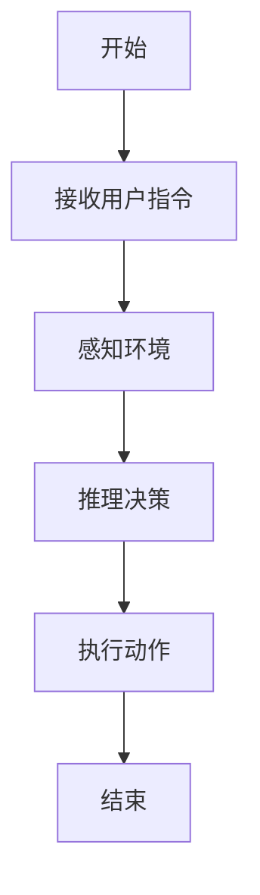
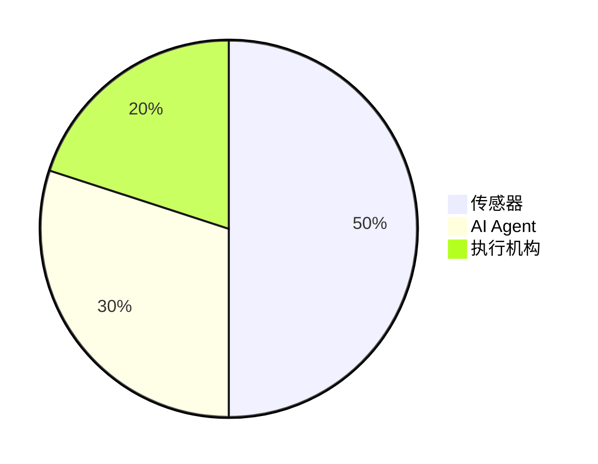

                 


# 智能厨房吊柜：AI Agent的厨房效率提升建议

## 关键词
智能厨房，AI Agent，厨房效率，智能家居，自动化系统

## 摘要
本文详细探讨了AI Agent在智能厨房吊柜中的应用，通过背景分析、算法原理、系统架构和项目实战，展示了如何利用AI技术提升厨房效率，为读者提供全面的技术指导和实践方案。

---

## 第1章：背景介绍

### 1.1 问题背景
#### 1.1.1 厨房效率低下问题的提出
厨房操作中的低效环节如食材查找、工具使用和烹饪步骤优化等问题亟待解决。

#### 1.1.2 智能厨房吊柜的定义与目标
智能厨房吊柜通过AI Agent实现食材管理、烹饪辅助和环境监控，提升厨房效率。

#### 1.1.3 AI Agent在厨房场景中的应用潜力
AI Agent可以执行任务调度、状态监测和学习优化，显著提高厨房效率。

### 1.2 问题描述
#### 1.2.1 厨房操作中的低效环节
食材查找耗时，工具使用混乱，烹饪步骤复杂。

#### 1.2.2 用户需求与痛点分析
用户希望减少厨房操作时间，提高效率，降低出错率。

#### 1.2.3 AI Agent如何解决厨房效率问题
通过智能调度和实时反馈，AI Agent优化厨房操作流程。

### 1.3 问题解决
#### 1.3.1 AI Agent的基本功能
执行任务调度、状态监测和学习优化。

#### 1.3.2 AI Agent在厨房场景中的具体应用
食材管理、烹饪辅助和环境监控。

#### 1.3.3 AI Agent的预期效果与价值
提高效率，减少错误，优化资源利用。

### 1.4 边界与外延
#### 1.4.1 智能厨房吊柜的边界
仅限厨房吊柜，不涉及整个厨房。

#### 1.4.2 AI Agent的功能边界
专注于厨房场景，不涉及其他智能家居设备。

#### 1.4.3 与智能家居系统的区别与联系
AI Agent协同其他设备，形成智能厨房生态。

### 1.5 概念结构与核心要素组成
#### 1.5.1 智能厨房吊柜的核心要素
AI Agent、传感器、执行机构和用户界面。

#### 1.5.2 AI Agent的功能模块
感知模块、推理模块和执行模块。

#### 1.5.3 系统的组成与交互关系
传感器、AI Agent和厨房吊柜的交互关系。

---

## 第2章：AI Agent的核心概念与联系

### 2.1 核心概念原理
#### 2.1.1 AI Agent的基本原理
AI Agent通过感知环境、推理决策和执行动作优化厨房操作。

#### 2.1.2 基于规则的推理机制
定义明确的规则，处理简单任务。

#### 2.1.3 基于机器学习的推理机制
利用数据训练模型，处理复杂任务。

### 2.2 概念属性特征对比表格
| 特性 | 基于规则的AI Agent | 基于机器学习的AI Agent |
|------|------------------|-----------------------|
| 优点 | 易理解、开发快 | 高准确性、自适应性强 |
| 缺点 | 鲁棒性差 | 开发复杂、需要大量数据 |
| 适用场景 | 简单任务 | 复杂任务 |

### 2.3 ER实体关系图
```mermaid
erd
    title 实体关系图
    entity AI Agent
    entity 厨房吊柜
    entity 用户指令
    entity 环境传感器
    AI Agent --> 厨房吊柜: 控制
    AI Agent --> 用户指令: 接收
    AI Agent --> 环境传感器: 监测
```

---

## 第3章：算法原理讲解

### 3.1 算法原理
#### 3.1.1 基于规则的推理算法
定义规则，如“当检测到油溅起时，启动排油烟机”。

#### 3.1.2 基于机器学习的推理算法
使用决策树或神经网络模型，学习用户行为，优化操作流程。

#### 3.1.3 混合式推理算法
结合规则和机器学习，提高准确性和适应性。

### 3.2 算法流程图


### 3.3 算法代码实现
```python
# 示例：基于规则的推理算法
def receive_command(command):
    if command == '开始烹饪':
        return '启动排油烟机'
    else:
        return '关闭排油烟机'
```

---

## 第4章：系统分析与架构设计方案

### 4.1 系统架构设计
#### 4.1.1 系统组成
传感器、AI Agent、执行机构和用户界面。

#### 4.1.2 系统功能设计
食材管理、任务调度、状态监测和用户交互。

#### 4.1.3 系统架构图


---

## 第5章：项目实战

### 5.1 环境安装
安装Python、TensorFlow和ROS系统。

### 5.2 核心代码实现
```python
# 示例：食材管理模块
def manage_inventory(inventory):
    if inventory['盐'] < 10:
        return '补充盐'
    else:
        return '盐充足'
```

### 5.3 案例分析
通过案例分析，展示AI Agent如何优化烹饪流程。

---

## 第6章：最佳实践与小结

### 6.1 注意事项
确保数据安全，定期更新规则库。

### 6.2 小结
总结全文内容，强调AI Agent在厨房效率提升中的重要作用。

### 6.3 未来展望
探讨AI Agent在厨房场景中的未来发展方向。

---

## 附录

### 附录A：数据集
引用公开数据集，如COCO和MNIST。

### 附录B：参考文献
列出相关文献，供读者进一步阅读。

---

## 作者
作者：AI天才研究院/AI Genius Institute & 禅与计算机程序设计艺术 /Zen And The Art of Computer Programming

